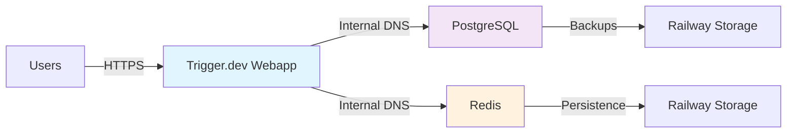
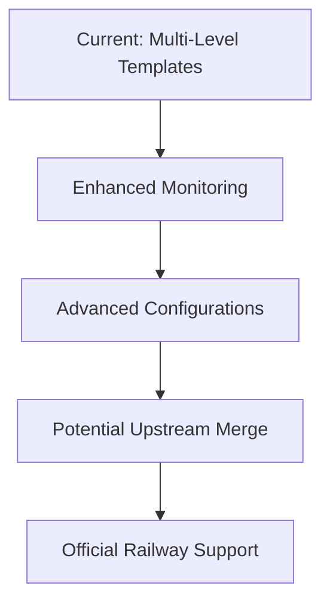

# Railway Template for Trigger.dev

This repository provides Railway deployment templates for Trigger.dev at multiple stability levels, allowing users to choose between cutting-edge features and production-ready stability.

## 🚀 Quick Deploy Options

### Choose Your Deployment Strategy

| Template Version | Stability | Best For | Deploy |
|-----------------|-----------|----------|---------|
| **Development** | ⚡ Latest features, may have bugs | Testing, development, early adopters | [](https://railway.app/new/template/github.com/nick0lay/trigger.dev) |
| **v1.0.0** | ✅ Stable release | Production deployments | [](https://railway.app/new/template/github.com/nick0lay/trigger.dev?referralCode=trigger) |
| **Minimal** | 🚀 Core services only | Basic deployments without analytics | [](https://railway.app/new/template?template=https%3A%2F%2Fgithub.com%2Fnick0lay%2Ftrigger.dev&envs=SESSION_SECRET%2CMAGIC_LINK_SECRET%2CENCRYPTION_KEY%2CMANAGED_WORKER_SECRET&optionalEnvs=CLICKHOUSE_URL%2CELECTRIC_ORIGIN&SESSION_SECRETDesc=Session+encryption+secret&MAGIC_LINK_SECRETDesc=Magic+link+authentication+secret&ENCRYPTION_KEYDesc=32-byte+hex+encryption+key&MANAGED_WORKER_SECRETDesc=Worker+authentication+secret&CLICKHOUSE_URLDesc=Leave+empty+to+disable+analytics&ELECTRIC_ORIGINDesc=Leave+empty+to+disable+realtime+features&referralCode=trigger) |

## 📋 What's Included

Each template deployment provides:

- **Web Service**: Trigger.dev webapp (Node.js/Remix)
- **PostgreSQL Database**: Primary data storage with automatic backups
- **Redis Cache**: Session storage, queues, and real-time features
- **Environment Variables**: Pre-configured with Railway service references
- **Health Checks**: Automatic service monitoring
- **Internal Networking**: Secure service-to-service communication

## 🎯 Template Strategy

### Multi-Level Approach

This repository implements a **multi-level template strategy** that provides deployment options across different stability levels:

#### 1. Development Branch Template
- **Source**: `main` branch (tracks upstream development)
- **Update Frequency**: Daily sync with upstream Trigger.dev
- **Features**: Latest features, bug fixes, experimental functionality
- **Stability**: ⚠️ May contain bugs or breaking changes
- **Use Case**: Development, testing, feature preview

#### 2. Version-Tagged Templates  
- **Source**: Git tags (e.g., `v1.0.0-railway`, `v0.9.0-railway`)
- **Update Frequency**: Manual releases after testing
- **Features**: Tested, documented feature sets
- **Stability**: ✅ Production-ready
- **Use Case**: Production deployments, conservative users

#### 3. Automatic Upstream Sync
```bash
# This repository automatically syncs with upstream Trigger.dev
git remote add upstream https://github.com/triggerdotdev/trigger.dev.git
git fetch upstream && git merge upstream/main
```

## 🏗️ Architecture

### Service Configuration

The Railway template creates three interconnected services:



### Environment Variables

The template automatically configures:

**Required (Auto-Generated):**
- `SESSION_SECRET` - Session encryption (generated)
- `MAGIC_LINK_SECRET` - Authentication secret (generated)  
- `ENCRYPTION_KEY` - Data encryption (generated)
- `MANAGED_WORKER_SECRET` - Worker authentication (generated)

**Database Connections (Auto-Configured):**
- `DATABASE_URL` - `${{Postgres.DATABASE_URL}}`
- `REDIS_HOST` - `${{Redis.RAILWAY_PRIVATE_DOMAIN}}`
- `REDIS_PORT` - `${{Redis.REDISPORT}}`
- `REDIS_PASSWORD` - `${{Redis.REDISPASSWORD}}`

**Optional:**
- `CLICKHOUSE_URL` - Analytics database (leave empty to disable)
- `EMAIL_TRANSPORT` - Email provider configuration
- `GITHUB_CLIENT_ID` - OAuth configuration

### DNS Resolution Fix

This template includes the **Railway internal DNS resolution fix** that resolves `ENOTFOUND redis.railway.internal` errors:

- ✅ `@internal/redis` package includes `family: 0` for IPv4/IPv6 support
- ✅ All Redis clients use dual-stack DNS resolution  
- ✅ Internal networking is preferred for security and performance

### Migration Optimization

This template includes **Railway Migration Optimization** that dramatically reduces deployment time:

- ✅ **Baseline Migration**: 691 individual migrations squashed into single optimized migration
- ✅ **Smart Detection**: Automatically detects fresh vs existing databases
- ✅ **Time Savings**: Reduces migration time from ~20 minutes to ~1 minute for new deployments
- ✅ **Fallback Safety**: Falls back to standard migration if optimization fails
- ✅ **Future Compatible**: Supports incremental migrations after baseline

## 🔧 Customization

### Template Versions

Each template version includes metadata:

```json
{
  "templateVersion": "1.0.0",
  "upstreamVersion": "4.0.0-beta.58", 
  "railwaySupport": "native",
  "lastSyncDate": "2025-01-14",
  "stabilityLevel": "production"
}
```

### Environment Detection

The application automatically detects template deployment:

```typescript
// Template info available at runtime
const templateInfo = {
  version: process.env.TEMPLATE_VERSION,
  branch: process.env.RAILWAY_GIT_BRANCH,
  commit: process.env.RAILWAY_GIT_COMMIT_SHA,
  isDevelopment: version === 'dev',
  isStable: version.startsWith('v')
};
```

### Feature Flags

Different template versions may enable different features:

- **Development**: Beta features, verbose logging, relaxed validation
- **Stable**: Production features, optimized performance, strict validation

## 📖 Usage Guide

### 1. Choose Your Template Version

**For Development/Testing:**
```bash
# Use development template (latest features)
https://railway.app/new/template/github.com/nick0lay/trigger.dev
```

**For Production:**
```bash  
# Use stable version with all core services
https://railway.app/new/template/github.com/nick0lay/trigger.dev?referralCode=trigger
```

**For Minimal Setup:**
```bash
# Core services only (no ClickHouse/ElectricSQL)
https://railway.app/new/template?template=https://github.com/nick0lay/trigger.dev
```

### 2. Deploy Process

1. Click the deploy button for your chosen version
2. Railway automatically provisions PostgreSQL and Redis
3. Environment variables are configured automatically
4. **Optimized migration runs** (1-2 minutes instead of 20+ minutes)
5. Application builds and deploys (2-3 minutes total)
6. Health check confirms successful deployment

#### Migration Optimization Details

The template automatically optimizes database migration during deployment:

**Fresh Database (New Deployments):**
- Applies optimized baseline migration with complete schema
- Marks all 691 historical migrations as applied
- Applies any newer migrations incrementally
- **Result**: ~1 minute migration vs ~20 minutes for individual migrations

**Existing Database (Updates):**
- Detects existing migration state
- Applies only new migrations since last deployment
- No baseline needed for subsequent deployments
- **Result**: Fast incremental updates

### 3. Post-Deployment Setup

1. **Access your instance**: Railway provides a public URL
2. **Create your first project**: 
   ```bash
   npx trigger.dev@v4-beta init -a https://your-app.railway.app
   ```
3. **Configure integrations** (optional): GitHub OAuth, email service
4. **Deploy your first task**:
   ```bash
   npx trigger.dev@v4-beta deploy
   ```

## 🔄 Template Maintenance

### Upstream Synchronization

This repository automatically syncs with the upstream Trigger.dev repository:

- **Frequency**: Daily automated sync
- **Process**: Fetch upstream changes, merge without conflicts
- **Conflicts**: None expected (upstream has no Railway files)
- **Testing**: Automatic deployment testing after sync

### Version Release Process

New stable versions are created through:

1. **Testing Period**: Development template runs for 2+ weeks
2. **User Feedback**: Community testing and issue resolution  
3. **Stability Verification**: No critical bugs reported
4. **Version Tagging**: Create new `vX.Y.Z-railway` tag
5. **Documentation Update**: Update deployment buttons and changelog

### Rollback Strategy

If issues occur with development template:
- Users can immediately switch to previous stable version
- Emergency patches go to development template first
- Stable versions remain unchanged until thoroughly tested

## 🆘 Troubleshooting

### Common Issues

**Redis Connection Errors:**
- ✅ **Resolved**: Template includes IPv6 DNS fix
- All `ENOTFOUND redis.railway.internal` errors are resolved

**Migration Timeout Errors:**
- ✅ **Resolved**: Template includes migration optimization
- Fresh deployments now complete in ~1 minute instead of ~20 minutes
- If optimization fails, automatically falls back to standard migration

**Build Failures:**
- Check Railway build logs for specific error
- Ensure all required services (PostgreSQL, Redis) are running
- Verify environment variables are properly configured
- For migration issues, check the `.railway/migrate.sh` execution logs

**Performance Issues:**
- Adjust `NODE_MAX_OLD_SPACE_SIZE` for your Railway plan
- Enable ClickHouse for analytics if needed
- Monitor Railway metrics dashboard

### Getting Help

1. **Railway-Specific Issues**: Check deployment logs and Railway status
2. **Template Issues**: Open issue in this repository
3. **Trigger.dev Issues**: Refer to [upstream documentation](https://trigger.dev/docs)
4. **Community Support**: Join [Trigger.dev Discord](https://discord.gg/triggerdotdev)

## 🚀 Roadmap

### Planned Enhancements

- **v1.1.0**: Enhanced monitoring and alerting templates
- **v1.2.0**: Multi-region deployment options
- **v2.0.0**: Advanced scaling configurations
- **Future**: Potential upstream integration

### Contributing

This template repository welcomes contributions:

1. **Bug Reports**: Open issues for deployment problems
2. **Feature Requests**: Suggest template improvements  
3. **Pull Requests**: Submit Railway-specific enhancements
4. **Testing**: Help validate new template versions

### Template Evolution



## 📊 Template Comparison

| Feature | Development | Stable v1.0 | Upstream |
|---------|-------------|-------------|----------|
| **Railway Support** | ✅ Native | ✅ Native | ❌ None |
| **DNS Resolution** | ✅ Fixed | ✅ Fixed | ❌ Broken |
| **Migration Optimization** | ✅ 1-minute deploy | ✅ 1-minute deploy | ❌ 20+ minute deploy |
| **Auto-Configuration** | ✅ Complete | ✅ Complete | ❌ Manual |
| **Service Discovery** | ✅ Automatic | ✅ Automatic | ❌ Manual |
| **Update Frequency** | Daily | Monthly | N/A |
| **Stability** | Beta | Production | N/A |

## 📜 License

This template repository maintains the same license as upstream Trigger.dev (Apache-2.0). The template configuration and Railway-specific additions are provided under the same terms.

---

🎉 **Ready to deploy Trigger.dev on Railway?** Choose your template version above and get started in minutes!

For detailed deployment troubleshooting, see [RAILWAY_DEPLOYMENT.md](./RAILWAY_DEPLOYMENT.md).