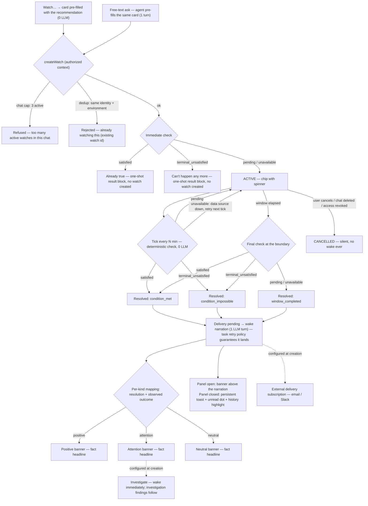

# Dashboard Agent — Watch: UI & interaction design

dashboard agent · design chapter · v3.3 · 2026-08-01

> **Authority:** companion to the [Feature Design](dashboard-agent-feature-design.md) (§2 Flow B — behavior/trust canon) and the [Development Plan](dashboard-agent-development-plan.md) (M6/M6.5 — implementation canon). This chapter is canonical for the **visual and interaction design** of Watch: surfaces, states, component anatomy, wording, and the technical shape they rest on. Where behavior is restated here, §2/M6 win on any disagreement.

---

## §0 Decision summary

**What Watch is.** A temporary, one-shot promise made in a conversation: it deterministically checks a concrete condition for a bounded period and returns **once** with an answer.

**What we are deciding now.** The creation UI. Which scenarios are directly available from the dashboard. Which outcomes and states the UI shows. What ships in this iteration, and what stays agent-authored.

**Scope.** This document is about the dashboard: contextual entry points, the card, the chat surfaces. Other surfaces are separate documents.

**This iteration.**

- One universal **Watch…** action on run · queue · error · health, each opening with its recommended condition.
- Compact, chat-native configuration.
- Clear waiting and wake states.
- Correct outcome semantics (§4).
- Optional Watch → Investigate.

**Explicitly not this iteration.** Composite watches · query watches · guardrails · multi-report · auto-renew · wake charts · waitpoint watches · cost monitoring · cron dead-man's-switch · runs-longer-than-X.

## §1 Product boundaries

Four neighbors, hard-separated. This section is the filter for roadmap fantasy: if a proposal does not fit the Watch column, it is not a Watch.

| | **Watch** | **Alert** | **Investigation** | **Guardrail** |
|---|---|---|---|---|
| Lifetime | temporary, bounded window | persistent | one bounded workflow | persistent |
| Reporting | once | repeatedly | n/a | n/a |
| Ownership | belongs to a conversation | independently manageable, not tied to a conversation | belongs to a conversation | a saved org-level rule |
| Purpose | a concrete condition, known at creation | ongoing notification | explains *why* | a declared threshold others aim at |
| Cost | deterministic between creation and result | deterministic | consumes one bounded agent workflow | deterministic |

- **Watch → Alert** is an opt-in add-on, not a promotion: a watch may carry an **external delivery subscription** (§6) — it uses the existing Alerts infrastructure, but does not turn the watch into a repeating alert. The subscription is managed on the Alerts page.
- **Watch → Investigation** may only follow a watch with **prior consent** given at creation (§6).
- **Guardrail** is a future product on the same condition machinery (§9). It is not a Watch UI scenario.

## §2 Core user journeys

User scenarios only; the machinery is §7.

### 2.1 Create

**Path A — contextual action.** Every supported object exposes the same action: **Watch…**. Opening it shows the compact card already filled with the condition recommended for that object:

| Object | Pre-filled recommendation |
|---|---|
| Run | when it finishes |
| Queue | when it drains |
| Error | if it happens again |
| Health (degraded) | when it recovers |

**The entry is universal; the recommendation is contextual.** There is no per-object CTA label and no secondary "other options" entry — every variant lives one tap deeper, under **Customize**.

**Path B — free-text request.** "Tell me if this queue grows past 500." The agent interprets the ask and shows the **filled configuration for review** — the same card, pre-filled, one tap to confirm.

### 2.2 Configure

**One compact system/form card** — not three pseudo-agent messages, not a full-page form:

> **Watch email-sends**
> Until the queue drains
> For 1 hour · checking every 5 min
> When there's an answer: tell me in chat
> `[Start watching]` `[Customize]`

**In-chat delivery is fixed and always on.** The follow-up section offers two optional additions: **Investigate attention outcomes** and **Also notify me externally**. The compact card shows the fixed line ("tell me in chat") plus the two opt-ins; **Customize** renders them as two **independent** checkboxes/toggles. They must never be a radio group — a user must not be able to "choose email instead of chat delivery".

**Start watching** accepts the whole recommendation in one tap. **Customize** expands the card in place: duration (window + cadence), threshold / condition variant, and the follow-up action (§6).

**Who is speaking (binding).** Deterministic UI must not wear the agent's voice. The card and the confirmation render as a visually distinct **form/system block** — canned, but honestly canned: block styling, not fake prose. The agent's voice appears only where the LLM actually ran (the free-text path, and the wake narration).

**Transcript hygiene (binding).** **Only a submitted outcome reaches the transcript.** Drafts and intermediate configuration states leave no trace. After submission, the card becomes either a persisted **watch confirmation** (a watch was created) or a persisted **one-shot result block** (the immediate check already answered the request). The sequence is literal:

1. **Watch…** opens an ephemeral card in the panel. The transcript does not change.
2. **Start watching** runs validation and the immediate check.
3. `pending` / `unavailable` → the card **becomes** the persisted confirmation block, and the header **chip** appears as the live representation. The confirmation *is* the transcript record — there is no separate request line, it would only duplicate it. On the free-text path the request is the user's own message.
4. `satisfied` / `terminal_unsatisfied` → the card becomes a persisted deterministic **result block**. No watch, **no chip**.
5. Validation, cap and network errors stay inside the ephemeral card and persist nothing.

The confirmation always states the four lifetime facts: **what · how often it checks · that it reports once · when it gives up.**

### 2.3 Waiting

Deliberately quiet. No countdowns, no pulsing.

- A **chip** per watch in the panel header: state icon + the thing watched + cancel.
- Tooltip: the user's note · cadence · "expires in ~N h" · status.
- After repeated unavailable checks the chip turns **amber** ("last check failed, retrying") — honesty wins over quietness.
- An environment micro-badge appears **only when** the chat's watches span more than one environment.
- Cancel is on the chip, active only.

### 2.4 Result

- A **specific result headline** stating the fact (§5.3), followed by the agent's narration.
- Panel closed: **unread dot**, the chat floats to the top of history with the headline as its preview, and a **persistent toast** as an additional out-of-panel signal (§6).
- The chip flips to its terminal icon and stays until the chat is read — **read ≠ dismissed**; swatting the toast does not mark the chat read.

### 2.5 Cancel

Silent in the transcript, always. A local confirmation ("Watch cancelled") that never touches the transcript; no wake, no narration. **The chip is removed immediately on cancel** — there is no lingering cancelled chip. Deleting the chat cancels its watches the same way.

## §3 Supported dashboard scenarios

Capabilities are wider than the UI (§9). The UI shows only the head scenarios.

| Scenario | Contextual UI | Typed chat |
|---|---|---|
| Run finishes | ✅ Run page **Watch…** (recommended) | ✅ |
| Run fails | ✅ via **Customize** (condition variant) | ✅ |
| Queue drains | ✅ Queue page **Watch…** (recommended) | ✅ |
| Queue rises above N | ✅ via **Customize** (threshold) | ✅ |
| Error recurs | ✅ Error page **Watch…** (recommended) | ✅ |
| Health recovers | ✅ Health report card **Watch…** (recommended) | ✅ |

Anything not in this table is reachable by typed ask **once the kind is supported end to end; a reader alone is not a capability.** It is not advertised in the UI.

## §4 Watch model and outcomes

The canonical model. UI and backend both obey it.

### 4.1 Creation-time check

Every watch runs an **immediate check** before it exists as a watch:

- `satisfied` → no watch created; the card becomes a **one-shot result block**: "That already happened, so there's nothing left to watch."
- `terminal_unsatisfied` → no watch created; one-shot result block: "That can't happen any more, so there's nothing to watch."
- `unavailable` → watch created; confirmation says "We couldn't check that just now. Watching anyway."
- `pending` → watch created, active.

The first two are persisted as the one-shot result block (§2.2) — they answer the request — but produce no chip and no wake.

### 4.2 Resolution — three values, not two

A watch does not end "fired" or "expired". It **resolves**, and reports once, with one of three values:

| Resolution | Meaning |
|---|---|
| `condition_met` | the checked condition became true inside the window |
| `window_completed` | the window ran out with the condition still not true |
| `condition_impossible` | the condition can no longer become true (terminal state, object gone) |

The resolution alone does not decide what the user sees. The check also captures the **observed outcome** — the run's final status, the observed depth, and so on. **Each kind maps its resolved result — resolution plus observed outcome — to a headline, icon and presentation tone.**

Presentation tone is **positive · attention · neutral**, declared per kind — never inferred from a good-news kind list. **Icons follow the presentation outcome, not the lifecycle resolution:** a failed run must never wear a success check, however cleanly it resolved.

**Queue drains**

| Resolution | Headline fact | Tone |
|---|---|---|
| `condition_met` | Queue drained | positive |
| `window_completed` | Still not drained | attention |
| `condition_impossible` | Queue no longer exists | neutral |

The system cannot prove "permanently unavailable", and `unavailable` never resolves anything (§4.3). If the window completes while the source is unavailable, the result says the condition couldn't be confirmed, citing the last frozen facts.

**Run finishes** — *why resolution alone is insufficient:*

| Resolution + observed outcome | Headline fact | Tone |
|---|---|---|
| `condition_met` — completed successfully | Run finished | positive |
| `condition_met` — completed with failure | Run failed | attention |

One resolution, two opposite presentations: the tone comes from the observed outcome, not from `condition_met`. This dissolves two v2 oddities in one move: a successful soak is no longer reported as "expired / no answer", and a run that fails in five minutes no longer reads as good news because it "finished".

`window_completed` is **an answer, not silence** — "it didn't drain in an hour" is exactly the thing the user asked to be told.

### 4.3 Ticks and invariants

- A tick returns `satisfied` · `pending` · `terminal_unsatisfied` · `unavailable`. `unavailable` keeps the watch alive and retries next tick; it never resolves anything.
- **One-shot invariant:** a watch has exactly one resolution and delivers exactly one wake. Cancellation is the only exit with no resolution and no wake.
- **Every resolution is recorded** — see §5.1.

### 4.4 The loop

Three properties the diagram encodes: LLM turns exist only at the edges (free-text creation, wake narration, consented investigation) — every tick is a deterministic read; every path out of ACTIVE ends in exactly one terminal state, and only cancellation is silent; delivery is a state of its own, so a wake survives crashes and retries until it reaches the user.

## §5 Interaction and visual design

### 5.1 Principles (binding)

1. **An unprompted message must be unmistakable.** A wake answers a question asked hours ago; the transcript never lets it read like ordinary chat. The banner states the fact *before* the prose does.
2. **State lives in the icon; text keeps its color.** The same rule run-status cells follow — chips, banners and toasts color only the glyph/accent, never the label.
3. **Every watch resolution is recorded. Every cancellation is silent, including cancellation caused by access revocation.** (§7.2)
4. **The lifetime is always stated.** What is watched · the cadence · that it reports once · when it gives up. The user never has to ask "is it still watching?"
5. **Read ≠ dismissed.** Dismissing a toast does not mark the chat read; reading happens in the panel.
6. **No ambient spend.** The watch loop and every passive UI surface are deterministic. LLM work happens only for free-text interpretation, wake narration, and an explicitly consented investigation.
7. **Waiting is quiet.** §2.3.

### 5.2 Components

| Component | File | Anatomy & rules |
|---|---|---|
| Configuration card | Watch card block | Compact by default: object · condition · window + cadence · follow-up action · `[Start watching]` `[Customize]`. Customize expands **in place** into duration, threshold/variant, follow-up action. System/form styling, never agent prose (§2.2). Client-side; nothing persists until submit. |
| Watch chip row | `WatchChips.tsx` + `watch-chips.ts` | "WATCHES" micro-label + pill chips, wrap on overflow. Chip: state icon (spinner / resolved glyph) + truncated label (max-w 12rem) + × on active. Label comes from `watchIdentity` — a chip can never disagree with the store. Tooltip: note · cadence · expiry · status. Amber spinner after K consecutive `unavailable` ticks. Terminal chips disappear once the chat is read; the banner stays as the record. |
| Wake banner | `WakeBanner.tsx` | `border-l-2` accent + `bg-{tone}/10`, icon + fact headline + truncated dimmed subline (note → identity → kind). **The banner renders the output of `watch-presentation.ts`; it contains no kind-specific wording of its own.** Presentation category, tone, icon and headline key come from the exhaustive resolved-result mapping in contracts (resolution + observed outcome, §4.2); the icon follows the outcome, never the bare resolution. Keyed by the wake message id so a wake can never render twice. Fallback when the watch is gone: "The watch woke this chat up on its own." |
| Wake toast | `WatchWakeToast.tsx` | 356px sonner custom toast, `Callout variant="agent"`, dismiss + **Open chat** (opens *that* chat). Keyed per watch so re-renders can't stack. More than 3 simultaneous wakes collapse into one summary toast. |
| Launcher unread | launcher | Unread dot; cleared by opening the chat, not by dismissing a toast. |
| History row | `DashboardAgentHistory` | Unread-first ordering, woken chat highlighted; preview text = the wake headline; per-chat status icons (agent working / investigation open / watch active). |

**Two layers, one meaning.** The **exhaustive resolved-result mapping lives in contracts** — resolution/outcome types, presentation category, tone, semantic icon, headline *key* — a shared pure module any future surface (including non-dashboard ones) consumes without reinventing meaning. **User-facing wording is centralized in `watch-presentation.ts`** (a webapp pure presenter: the final English strings — headlines, immediate-check outcomes — plus identity, duration and value formatting). Banner, toast and email all render its output; components contain no kind-specific wording. `watch-chips.ts` keeps chip labels and tooltips. No scattered strings anywhere else.

### 5.3 Headlines — fact first

Not "Watch update — all clear". The headline is the **fact**, with a small `WATCH UPDATE` micro-label carrying the "this is a wake" signal:

- **email-sends queue drained**
- **Run abc123 finished**
- **Run abc123 failed**
- **Error abc123 happened again**
- **Health recovered**
- **Queue is still above 500**

The banner must be complete without the narration under it. The narration adds context; it is never load-bearing for understanding what happened.

### 5.4 State gallery (screenshot pack)

Every cell is a gallery fixture; light + dark.

**Configuration:** compact card · expanded (Customize) · validation error · pending create · create failure · Watch → Investigate selected · pre-filled from free text · dedup rejection ("already watching this") · watch-limit rejection · one-shot result block (satisfied / terminal_unsatisfied).
**Chip:** active · resolved (each of the three) · active-with-cancel-hover · degraded/amber · label truncated (long queue name) · fingerprint label · `health` label · row wrapping at 3 chips · env micro-badge (multi-env chat).
**Banner:** positive · attention · neutral · long-note subline truncation · watch-not-found fallback.
**Toast:** single wake · summary (N > 3) · stacked with other app toasts · dismiss vs open-chat.
**History / launcher:** unread dot · unread-first highlight · headline preview · status icon combinations.
**Entry points:** the same **Watch…** action on run · queue · error · health report card, each with its pre-filled recommendation.

### 5.5 Open questions

1. **Toast → chat landing.** Should opening from the toast scroll to and flash the wake banner? (The wake may be several messages up after follow-ups.)
2. **A11y of arrival.** `aria-live=polite` for the headline when the panel is open? Focus target after "Open chat" — composer or banner?
3. **Narrow panel (320px min).** Chip row and label truncation at minimum width; toast width (356px) vs mobile viewport — verify whether the summary toast should become the mobile default sooner (e.g. at >1 wake).

## §6 Notifications and follow-up actions

**In-dashboard delivery (always).** The wake lands in the transcript, the chat surfaces in history with its headline, and the launcher carries an unread dot. This is the durable record.

**Persistent toast (binding).** When the panel is closed, the wake produces a toast with `duration: Infinity`. It remains until the user dismisses it or opens the corresponding chat. Dismissing it does not mark the chat read; the durable unread state remains in history and on the launcher. The toast is an additional persistent out-of-panel signal, not the durable record.

**External delivery subscription (opt-in).** Email / Slack / webhook, attached to a watch. It uses the existing Alerts infrastructure, but does not turn the watch into a repeating alert. Offered at configuration time, created **only on explicit confirmation**, and thereafter **visible and manageable on the Alerts page** with one-click unsubscribe in every email. The email opens with the same fact headline as the banner (visual continuity chat ↔ inbox). When the plan denies delivery channels the UI says so plainly — the in-dashboard signal always works. **The subscription follows the watch lifetime:** it becomes inactive on resolution and is cancelled with the watch. The Alerts page may retain it as historical, but never presents it as an active repeating alert.

**Investigate after an attention outcome (opt-in).** Configured at creation, in the card's follow-up section: it applies **only to selected outcomes** (the attention ones), runs as a **separate agent workflow**, and is never the default. A consented investigation starts after an attention outcome, but **never blocks or delays the watch wake**: the wake states that the investigation has started, and findings arrive as a separate agent message. This is the one relaxation of "never a new investigation unprompted" — and only because consent was given at creation.

**Investigation scheduling and delivery are independent (binding).** Failure to start or complete the investigation never delays, retries or invalidates the watch wake. The sequence: resolution + frozen facts stored → wake delivery starts immediately → investigation triggered independently → an investigation failure never changes the watch's delivery status → findings arrive as a separate agent message.

## §7 Technical design

The engineering spec of the watcher — how each box of the §4.4 diagram is built.

### 7.1 Contracts and storage

| Layer | Home | Owns |
|---|---|---|
| Contracts | `@internal/dashboard-agent-contracts` `watch.ts` | `WatchSpec` (zod discriminated union), cadence schemas, `watchIdentity`, check results, statuses, **the resolution values, the observed-outcome shape, and the exhaustive per-kind mapping of (resolution + observed outcome) → presentation category, tone, semantic icon and headline key** — a shared pure module, consumed by every surface; final English wording is the webapp presenter's job (§5.2). Delivery statuses. Cadence limits are enforced **in the schema**, not in prose: run-state kinds may poll at 1\|5\|15\|60 min (a run row is cheap to read); aggregate kinds (queue depth, error recurrence, health) are floored at 5 min so a watch can never become a hot loop over analytics. `WATCH_MAX_HOURS = 24` is the hard ceiling. |
| Datastore | `@internal/dashboard-agent-db` (`watches` table, schema `trigger_dashboard_agent`) | The watch row: immutable org/project/environment/user snapshot, spec, identity, status, `resolution`, `observedOutcome` and the **frozen facts** captured by the resolving check, deliveryStatus, `expiresAt`, the resolution action flags (`investigate_on_attention`, external delivery). `MAX_ACTIVE_WATCHES_PER_CHAT = 3`. Query layer provides `createWatch`, atomic `transitionWatchCondition`, `markWatchDelivered`, and the chat-delete cascade. |
| Webapp | `dashboardAgentWatches.server.ts` · `dashboardAgentWatchChecks.ts` + `.server.ts` · `dashboardAgentWatchToken.server.ts` · sweep service · private check endpoint | Creation with its guardrails, per-tick re-authorization, the deterministic checks, token mint/verify, alert fan-out. The checks module is pure and IO-independent — readers are injected, tests inject fakes, never mocks; `…server.ts` is the **only** place the feature touches a datastore. |
| Agent project | `dashboard-agent-watch` task (eval-turn pattern: second task, own lazy DB pool) | The tick loop, scheduled via `tasks.trigger` with `delay` in the agent's own Trigger project. |

### 7.2 Authorization invariant

**A watch runs with exactly the access its creator had, and no more.**

- The org/project/environment/user snapshot on the row is immutable. Nothing in the watch path takes a project/environment from client input — callers hand in an already-authorized context.
- Watchers never persist a UAT or env JWT. Creation mints a **signed internal watch token**: `SESSION_SECRET`, a distinct token type/audience (`dashboard-agent-watch`, disjoint from user-actor tokens — UAT verification paths reject it and vice versa), a `watchId` claim, `exp = expiresAt + a bounded grace` so a delayed tick can still perform the *final* check. The token proves "I am this watch's loop"; the **row, not token expiry, is the authority** on whether environment reads are allowed — ordinary checks after `expiresAt` are refused, only the final evaluation passes during grace.
- Every tick **re-authorizes the initiating user against the immutable snapshot** through the same checks an interactive dashboard request makes: org membership (the membership-scoped query is the tenant floor — on OSS the RBAC fallback ability is permissive, so `ability.can` alone proves nothing), live project, non-archived environment, the per-member rule for dev environments, the feature gate. Deliberately one query plus the flag — it runs every tick.
- Anything short of a full pass is `access_revoked`: the watch transitions atomically to `cancelled(access_revoked)`, no environment data is read on that tick, no wake is delivered. A watch can only ever narrow, never widen. Like every cancellation it is silent (5.1.3) — the user may no longer be entitled to the fact.

**Verification status (honest).** The invariant is enforced point-wise and verified in main: the read-only cap ceiling at the JWT exchange, the per-tick re-authorization above, the documented OSS permissive-fallback caveat. What does not exist yet is *systematic* verification — a tenant-floor audit of every route the agent and the watcher touch, and an adversarial pass. That work is tracked outside this document (TRI-11032, with the isolation regression cases of TRI-11166 and the adversarial dataset of TRI-11163) and is a gate before wide rollout — never an assumption this design is allowed to make.

### 7.3 Creation and adapters

Every capability is a core function with adapters. Adapters (the configuration card's submit path, the `schedule_watch` chat tool) **authenticate and authorize**; **the core function receives an authorized context.** `createWatch(context, spec)` never receives raw user/env and never decides permissions.

Ownership binding: the API proves the chat belongs to this user *and* org; a chat is org+user-scoped, **not env-bound**, so project/environment come from the authorized current creation context and are snapshotted immutably — any client-supplied mismatch is rejected.

Guardrails, in order: ≤3 active per chat → dedup on `(chatId, project, environment, watchIdentity(spec))`, a duplicate **rejected with the existing watch's id** ("already watching this", pointing at it); cadence, window and note are not identity, so re-asking with different knobs is the same watch, while the same spec in two environments is two watches → the **immediate check** (§4.1) → mint token → schedule the first tick.

The model is chat-bound: dedup keys on `chatId`, the wake is a chat append, the limit is per chat.

### 7.4 The deterministic tick

Idempotency key `watch:{id}:tick:{n}`. Each tick: verify token → re-authorize (§7.2) → run the check through injected readers → atomically transition or reschedule. Reader principles:

- **Postgres for authoritative point-reads, ClickHouse for aggregates.** Run state is one Postgres row, never an analytics rollup; `run_start` checks the authoritative `startedAt` marker rather than current status — a run that started *and* finished between ticks still resolves `condition_met`.
- **Queue depth:** the live run-queue counter first (the same seam the queue pages use); the ClickHouse depth series as fallback, with a freshness fence — a stale empty bucket must never read as "drained", it reads as `unavailable`.
- **Error recurrence:** `errors_v1` `max(last_seen)` decides *whether* it recurred at millisecond precision; the per-minute rollup supplies counts. `since` is **server-set** at persist time — the model can never backdate a recurrence window.
- **Run-fails scenarios need the status-aware reader** (§4.2): **the run-finished reader preserves the final status.** A completion with failure resolves the watch, but presents as an attention outcome rather than success.
- **Health:** the existing report presenter, unchanged; a report that doesn't state it is trustworthy can never resolve a recovery.
- **Readers throw, never fabricate.** A throw becomes `unavailable` (watch stays alive, retries next tick); a made-up zero would resolve a watch on a broken data source.

**Window boundary (binding).** Window completion performs one final evaluation before resolving. A successful final read may still resolve `condition_met` or `condition_impossible`; only a pending or unavailable final result becomes `window_completed`. When unavailable, the frozen facts distinguish an unverified completion from a confirmed unmet condition. The token grace in §7.2 exists exactly for this check. The final check evaluates the condition **at the window boundary where the source supports timestamped evidence** (runs, errors); otherwise it reports the first observation at or after the boundary honestly (current queue depth is *now*, not *then*).

### 7.5 Durable delivery

`transitionWatchCondition` atomically stores the resolution, observed outcome and frozen facts used by every delivery surface. **Delivery never re-reads the source to reconstruct what happened** — a retry cannot rebuild a different headline, and banner, toast, email and narration all share one set of facts.

Only resolutions enter delivery; every cancellation is `not_required`. Delivery has to survive three failure modes — a crash before the append, a deliverer that dies mid-append, two deliverers racing — and the transcript cannot arbitrate any of them: an append is read-then-write, so "dedup on the receiving side" is not atomic and is **not** the mechanism. The claim lives in the database:

- **Fenced claim.** `pending → delivering` in one guarded UPDATE writing a fresh `deliveryClaimId` + `deliveryClaimedAt`. The guard accepts `pending`, or a `delivering` claim older than the stale window (minutes, vs the seconds a delivery takes) — a deliverer that died is taken over without stranding the wake.
- **Fenced writes.** Release (append failed → back to `pending`) and `markWatchDelivered` (append acknowledged) only touch a row still carrying *their* claimId. A deliverer that hung long enough to be taken over comes back to a row holding a different token; its release and its mark do nothing.
- **Recovery sweep**, two halves: finalize what is overdue (windows elapsed on still-active rows), then re-schedule every owed wake — terminal rows still `pending`, or `delivering` under a stale claim, or terminal with delivery never scheduled. Deliberately unconditional: the sweep cannot prove the user was told (the chat's last-message time moves for many reasons), so it always hands the wake back to the deliverer.
- **Immediate-check results never enter the watch delivery state machine**: no watch row is created, no claim is taken, and the persisted one-shot result block (§2.2, §4.1) is the complete delivery.
- **Accepted residual race** (documented at the tick): the claimId fences the DB writes, not the session append itself — an owner that hung *past* the stale window can still issue its append concurrently with the takeover's. Accepted because every layer must fail at once for a duplicate to surface: the minutes-long stale window, the stable action id across deliverers, and transcript dedup on that id as the last net — a net, not the mechanism.

**Action id stability (binding):** the resolution model does NOT rename the on-the-wire identifiers. The wake action/message id keeps its as-built two-value suffix (`wake:watch:{watchId}:{fired|expired}`, delivery id `watch:{watchId}:{terminalStatus}`) as a stable transport encoding — `condition_met` maps to `fired`, `window_completed` and `condition_impossible` map to `expired` — and the resolution itself travels in the action's facts. Persisted wakes, dedup keys, and banner render keys stay valid; only the model and the wording change.

The task retry policy stays the first-line guarantor: any failure before the ack fails the invocation, and the retried invocation loads `terminal + delivery owed` and performs *delivery only* — no condition tick is ever scheduled after a terminal transition. Chat soft-delete atomically cancels the chat's active watches; a tick that runs afterwards no-ops.

### 7.6 UI and chat adapters

- **Configuration card** — a client-side block (recommendation + in-place Customize) submitting through the UI watch intent (0 LLM). Nothing persists until creation.
- **Chat** — free text goes through `schedule_watch` and pre-fills the same card for review.

Both obey the one rule: **adapters authorize; the core function receives an authorized context** (§7.3). That rule is what keeps further adapters cheap; they are a separate document.

### 7.7 What this iteration adds

- **The resolution model** — replaces the two-outcome (`fired`/`expired`) semantics. The values and the **exhaustive per-kind mapping of (resolution + observed outcome) → presentation category, tone, icon and headline key live in contracts**, not in a host-side kind allowlist; the wording layer is `watch-presentation.ts` (§5.2). Most curated scenarios are existing readers with an inverted comparison and different wording — no new IO. Run-fails is the exception: it needs the status-aware reader (§7.4), because the observed outcome is what separates "finished" from "failed".
- **The configuration card** and its submit path (§7.6).
- **Watch → Investigate** — a consent flag on the row (`investigate_on_attention`), set at creation. It relaxes exactly one rule: the wake turn may open an investigation *when pre-approved*, without delaying the wake itself (§6).
- **The one-shot result block replaces the as-built inline-resolution path.** Today a watch row is created and resolved inline, with narration-proof machinery deciding whether the wake still needs prose; under this model the immediate check produces a result block and no row at all, and that machinery is retired.
- **Room for limits** — the schema and the card are shaped so per-plan limits can attach later (§8); nothing is enforced now beyond the chat-level cap.

## §8 Delivery scope

Theme: **Watch stops being a hidden prompt capability and becomes visible behavior** — not yet the feature announcement.

**Must ship**

1. The universal **Watch…** entry on run · queue · error · health, each pre-filled with its recommendation (§2.1, §3).
2. The compact configurator (§2.2).
3. The six scenarios (§3): run finishes · run fails · queue drains · queue above N (via Customize) · error recurs · health recovers.
4. Correct outcomes — the §4 resolution model with observed outcomes, end to end.
5. Waiting and wake surfaces (§2.3, §2.4, §5.2).
6. Watch → Investigate opt-in (§6).
7. Tests and the §5.4 screenshot matrix.

**Cut first, in this order**

1. **Watch → Investigate**, if the investigation integration runs deeper than expected.
2. **The secondary threshold scenario** (queue above N).

**Explicitly deferred** — wake chart · cron dead-man's-switch · waitpoint watch · query watch · composites · tier enforcement. Their place in the roadmap is §9.

**Cron is not in the core.** It does not prove the core Watch UX and drags new semantics with it — a small calendar product in disguise (timezones and DST, grace periods, schedules edited or disabled after creation, retries, resolving which occurrence was meant). It is **gated on an authoritative seam** such as `expectedNextRunAt` from the schedule engine; without that seam this kind re-implements a calendar.

**Tier gate note.** The schema and card are shaped so per-plan limits can attach later (§7.7), but billing **enforcement** pulls real billing plumbing and is deferred. Until then the card shows the real, **ungated** windows with no plan labels — telling a user "your plan = 10 minutes" while they factually have 24 h would be a lie. Pro marks appear together with the enforcement. Precedent: the V1 free-message cap is fails-open and UI-only — "a nudge, not a security boundary" — and watch limits follow the same philosophy.

## §9 Capability map and roadmap

> *This section describes capabilities enabled by the Watch primitive. It is not committed dashboard UI. Most scenarios are expected to be agent-authored first and graduate into visible product surfaces only after demonstrated demand.*

Demand is head-heavy — run finished/failed, drain, error back or gone silent, deploy watch, cron dead-man — and value is decided by entry points and wake quality, not by kind count. The catalog is the **agent's vocabulary, not the user's menu**. Graduation runs on typed-ask evidence (the `chat_turn_evals` intent feed), not inertia.

### 9.1 Capability catalog

Legend: **core built** = the deterministic Watch kind and reader already exist; it does *not* imply the dashboard entry or configuration UI has shipped · **this iteration** = shipping now (§8) · **cheap extension** = an existing reader with an inverted comparison or different wording · **future** = a new reader or addressing scheme · **speculative** = no mechanics decided.

| Object | Scenario | Mechanism | Likely surface | Status |
|---|---|---|---|---|
| **Run** | started / finished | run point read | Dashboard + chat | core built · surface this iteration |
| | finished *with a specific status* | status-aware run read | Dashboard + chat | this iteration |
| | runs longer than X | run read + window semantics | Chat first | future |
| | went to retry / attempt N | attempts reader | Chat first | future |
| | a batch of N runs fully landed | batch reader | Chat first | future |
| **Queue** | drains to zero | point/aggregate reader | Dashboard + chat | core built · surface this iteration |
| | depth grows above N | same reader, inverted comparison | Dashboard (Customize) + chat | this iteration |
| | back below a threshold N | same reader | Dashboard (Customize) + chat | V1 follow-up · TRI-12890 |
| | stalled — depth not decreasing for K ticks | same reader + previous result in frozen facts | Dashboard (Customize) + chat | V1 follow-up · TRI-12890 |
| | oldest-run age > SLA | age reader over the queue page's oldest-wait seam | Dashboard (Customize) + chat | V1 follow-up · TRI-12890 |
| **Errors** | fingerprint recurred | `last_seen` reader | Dashboard + chat | core built · surface this iteration |
| | fingerprint silent for X hours | same reader, `window_completed` is the good outcome | Dashboard + chat | cheap extension |
| | *any new* fingerprint in the env | fingerprint-set baseline at creation | Chat first | future |
| | task error rate > X% | query predicate | Chat first | future |
| **Health** | recovery from warn/crit | report presenter | Dashboard + chat | core built · surface this iteration |
| | degradation from ok | same reader, inverted threshold | Chat first | cheap extension |
| | soak — stay healthy for N hours | same reader; `window_completed` = positive | Chat first | cheap extension |
| **Deploy** | first N runs of a new version clean (deploy_verdict) | new reader | Chat first | future |
| | "the next deploy happened" | `read:deployments`, already scoped | Chat first | future |
| **Schedule** | cron missed its expected time | schedule reader, addressed by taskIdentifier | Chat first | future |
| | ran, but late by X | same reader, time comparison | Chat first | future |
| | the next run of task X succeeds | taskIdentifier addressing | Chat first | future |
| **Waitpoint** | token not completed within X hours | point PG read; `condition_impossible` when the awaited run can no longer complete | Chat first | future |
| **Anything** | a user-authored query crosses a fixed predicate | query predicate | Chat first | future |
| **Composite** | "watch my fix" and friends | watch group + fold rule | Agent orchestration | speculative |
| **Guardrail** | a persistent declared threshold | persistent rule | Separate product surface | future |

**Queue pack.** Part 1 — back-below-N, stalled, age-SLA — ships right after the current iteration (TRI-12890). Stalled introduces the **stateful-check seam**: the check receives the previous result (stored in the frozen facts, no new column), and an `unavailable` tick never overwrites the previous observation — a data gap must not reset the stall counter; every future "K consecutive ticks" kind reuses this seam. On a queue already past its warning threshold, the card's recommendation switches to the age-SLA variant. Part 2 — pulse/silence, throughput drop, concurrency ceiling, stuck-in-status — is V2 (TRI-12891).

### 9.2 Situations, not objects

A second layer watches the environment as a whole (all cheap via `read:query` unless noted) — agent-authored first:

- **Pulse / silence** — no runs at all in prod for 30 min: the upstream integration died and everything looks green because there are no errors either. Env-level dead-man's-switch.
- **Spike** — run volume > N× the baseline captured at creation.
- **Duration regression** — a task's p95 creeping up against baseline, before health calls "crit".
- **Stuck in status** — runs accumulating in WAITING / QUEUED / FROZEN: not an error, not a backlog, a jam.
- **Concurrency ceiling** — pinned at the limit for K consecutive ticks.
- **Children of a run** — all child runs of a run landed (batch / fan-out completion).
- **Version adoption** — the old version still receiving runs N hours after a deploy.

Fence — baseline-dependent kinds (spike, duration regression, soak): every such kind snapshots its baseline at creation, and **an untrusted baseline (`trustworthy: false`) refuses creation** rather than silently snapshotting a phantom to compare against. No baseline-dependent kind ships in this iteration.

### 9.3 Roadmap

The ranking is a bet, not a promise.

| Rank | Capability | Why next | Evidence required |
|---|---|---|---|
| 1 | Query watch / guardrails | universal predicate mechanism | typed asks for thresholds |
| 2 | Tier enforcement | monetization and resource control | product decision |
| 3 | Cost watch | strong stated demand | cost data seam |
| 4 | Dead-man watches (schedules, waitpoints) | detects silent failure | typed asks + authoritative schedule seam |
| 5 | Composite fix watch | strong feature narrative | repeated multi-watch behavior |

Fences carried by these rows:

- **Query watch** — the predicate is code-evaluated; a stale zero never satisfies.
- **Composite watches** — any child watches require explicit creation-time consent and count against limits.

### 9.4 Parking lot

Unranked, no mechanics decided: multi-report · quiet hours · wake chart · deploy bundle · org visibility · dashboard annotations · auto-renew.
