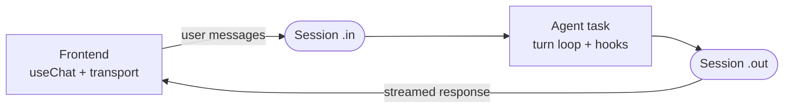

import RcBanner from "/snippets/ai-chat-rc-banner.mdx";

<RcBanner />

**A chat agent is three parts: a long-lived agent task that runs the turn loop, a durable Session carrying messages in and the response stream out, and a frontend transport that plugs the session into `useChat`.** The pages in this section each own one part of that picture. This page is the map — if you'd rather read mechanics end to end, skip to [How it works](/ai-chat/how-it-works).



Everything below maps onto one annotated agent:

```ts trigger/my-agent.ts
import { chat } from "@trigger.dev/sdk/ai";
import { streamText, stepCountIs } from "ai";
import { anthropic } from "@ai-sdk/anthropic";

export const myAgent = chat.agent({
  id: "my-agent",

  // Tools declared on the config survive history re-conversion
  // across turns — see Tools.
  tools: { searchDocs },

  // Hooks fire around each turn: validation, persistence,
  // post-turn work — see Lifecycle hooks.
  onTurnComplete: async ({ responseMessage }) => {
    await db.messages.save(responseMessage);
  },

  // The turn loop. Messages arrive accumulated; you stream back.
  // Options, levels, and alternatives — see Backend.
  run: async ({ messages, tools, signal }) =>
    streamText({
      ...chat.toStreamTextOptions({ tools }),
      model: anthropic("claude-sonnet-4-5"),
      messages,
      abortSignal: signal,
      stopWhen: stepCountIs(15),
    }),
});
```

The frontend side is one hook — `useTriggerChatTransport` connects `useChat` to the agent's session, no API routes ([Frontend](/ai-chat/frontend)). Underneath, the conversation lives on a [Session](/ai-chat/sessions): a pair of durable streams keyed on your `chatId` that survives refreshes, deploys, and run boundaries.

## Where each part is covered

| Part                                                  | Page                                           |
| ----------------------------------------------------- | ---------------------------------------------- |
| `chat.agent()` options, the turn loop, piping         | [Backend](/ai-chat/backend)                    |
| Hooks around each turn (`onTurnComplete`, hydration)  | [Lifecycle hooks](/ai-chat/lifecycle-hooks)    |
| Declaring tools, typed payloads, `toModelOutput`      | [Tools](/ai-chat/tools)                        |
| `useChat` wiring, tokens, starting sessions           | [Frontend](/ai-chat/frontend)                  |
| Driving a chat from your server instead of a browser  | [Server-side chat](/ai-chat/server-chat)       |
| The durable substrate under every agent               | [Sessions](/ai-chat/sessions)                  |
| Per-run typed state inside the loop                   | [chat.local](/ai-chat/chat-local)              |
| Type-safe payloads, client data, and messages         | [Types](/ai-chat/types)                        |
| Building without the managed lifecycle                | [Custom agents](/ai-chat/custom-agents)        |
| End-to-end mechanics: what survives a refresh and why | [How it works](/ai-chat/how-it-works)          |

Beyond this section: [Features](/ai-chat/fast-starts) covers opt-in capabilities (Head Start, compaction, steering, actions), and [Patterns](/ai-chat/patterns/sub-agents) covers production recipes (sub-agents, HITL approvals, persistence, recovery).
