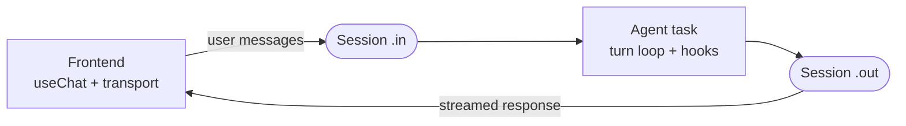

**A chat agent is three parts: an agent task that runs the turn loop, a durable session that carries messages in and streams the response out, and a frontend transport that connects the session to `useChat`.** This page is your map of the Building agents section — what each part does, how a single message flows through them, and which page to open next.


```mermaid
flowchart LR
  FE["Frontend<br/>useChat + transport"] -- "user messages" --> IN([Session .in])
  IN --> AGENT["Agent task<br/>turn loop + hooks"]
  AGENT --> OUT([Session .out])
  OUT -- "streamed response" --> FE
```

## Follow one message

A single turn moves through all three parts in order:

1. The **frontend transport** sends the user's message to the session's inbound stream (`.in`).
2. The **agent task** wakes on the new message, runs your turn loop, and streams the model's response into the session's outbound stream (`.out`).
3. The **frontend transport** reads `.out` and renders tokens into `useChat` as they arrive.

The session sits in the middle so both sides never have to be online at the same moment — the task keeps writing to `.out` even if the browser reloads mid-stream.

## The three parts

### The agent task

`chat.agent()` is the code you write: a long-lived agent whose `run` function is the turn loop. Messages arrive accumulated, you call `streamText`, and the returned stream is piped back to the frontend for you. [Tools](/ai-chat/tools) the model can call and [lifecycle hooks](/ai-chat/lifecycle-hooks) that fire around each turn both hang off the same config. See [Backend](/ai-chat/backend) for the full `chat.agent()` surface.

### The session

The conversation lives in a [session](/ai-chat/sessions), not in the task's memory: a pair of durable streams — `.in` and `.out` — keyed on your `chatId`. Because the session is durable, a conversation survives page refreshes, deploys, and the run boundaries between turns. The task can restart and pick up the same session. [How it works](/ai-chat/how-it-works) covers the mechanics of what survives and why.

### The frontend transport

One hook — `useTriggerChatTransport` — connects the Vercel AI SDK's `useChat` to the agent's session. There are no API routes to write: the transport talks to the session directly using a scoped token. See [Frontend](/ai-chat/frontend) for wiring, tokens, and starting sessions.

## An annotated agent

Everything above maps onto one task:

```ts trigger/my-agent.ts
import { chat } from "@trigger.dev/sdk/ai";
import { stepCountIs } from "ai";
import { anthropic } from "@ai-sdk/anthropic";

export const myAgent = chat.agent({
  id: "my-agent",

  // Tools the model can call, declared on the config so they
  // survive history re-conversion across turns — see Tools.
  tools: { searchDocs },

  // A lifecycle hook: fires after each turn, here to persist
  // the response — see Lifecycle hooks.
  onTurnComplete: async ({ responseMessage }) => {
    await db.messages.save(responseMessage);
  },

  // The turn loop. Messages arrive accumulated; the returned
  // stream is piped back to the frontend — see Backend.
  run: async ({ messages, tools, signal, streamText }) =>
    streamText({
      tools,
      model: anthropic("claude-sonnet-4-5"),
      messages,
      abortSignal: signal,
      stopWhen: stepCountIs(15),
    }),
});
```

## Related pages

Beyond the three core parts:

| Page                                        | What it covers                                          |
| ------------------------------------------- | ------------------------------------------------------- |
| [Server-side chat](/ai-chat/server-chat)    | Driving a chat from your backend instead of a browser   |
| [chat.local](/ai-chat/chat-local)           | Per-run typed state inside the turn loop                |
| [Types](/ai-chat/types)                     | Type-safe payloads, client data, and messages           |
| [Custom agents](/ai-chat/custom-agents)     | Building without the managed lifecycle                  |

[Features](/ai-chat/fast-starts) covers opt-in capabilities (Head Start, compaction, steering, actions), and [Patterns](/ai-chat/patterns/sub-agents) covers production recipes (sub-agents, HITL approvals, persistence, recovery).
