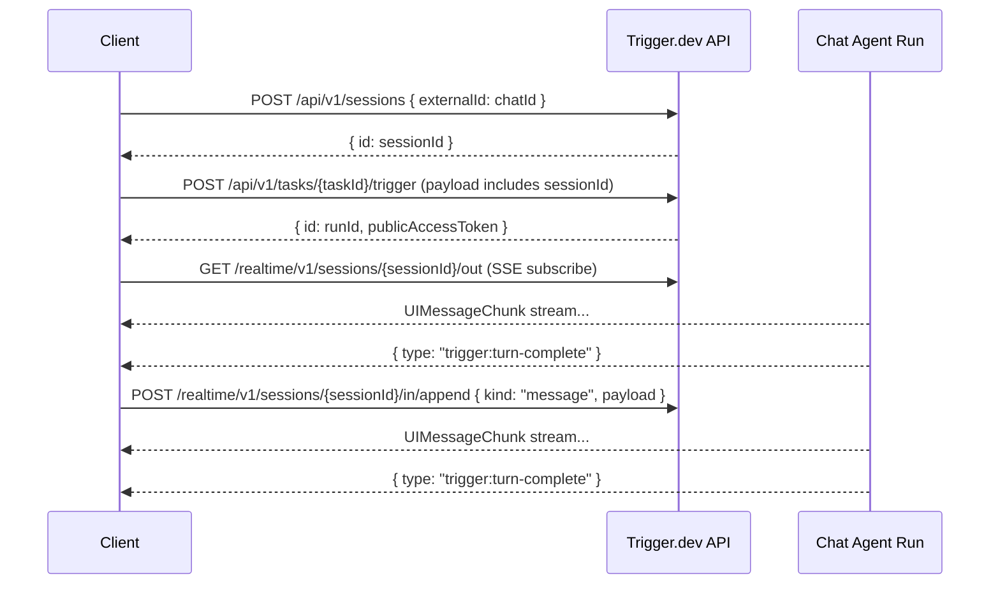

This page documents the protocol that chat clients use to communicate with `chat.agent()` tasks. Use this if you're building a custom transport (e.g., for a Slack bot, CLI tool, or native app) instead of using the built-in `TriggerChatTransport` or `AgentChat`.

<Note>
  Most users don't need this. Use [`TriggerChatTransport`](/ai-chat/frontend) for browser apps or [`AgentChat`](/ai-chat/server-chat) for server-side code. This page is for building your own from scratch.
</Note>

## Overview

`chat.agent` is built on a durable Session row — the unit of state that owns the chat's runs across their full lifecycle. A conversation is one session; a session can host many runs over its lifetime.

The protocol has four parts:

1. **Create the session** — idempotent on your chat ID
2. **Trigger a run** — start an agent run bound to the session
3. **Subscribe to `.out`** — receive `UIMessageChunk` events via SSE
4. **Append to `.in`** — send messages, stops, or actions



## Step 1: Create the session

Before triggering a run, create a Session. Use your stable chat ID as `externalId` — this makes creation idempotent, so two concurrent clients for the same chat converge on the same session.

```bash
POST /api/v1/sessions
Authorization: Bearer <secret-key-or-jwt>
Content-Type: application/json

{
  "type": "chat.agent",
  "externalId": "conversation-123",
  "tags": ["user:user-456"]
}
```

Response:

```json
{
  "id": "session_cm4z2plfh000abcd1efgh",
  "externalId": "conversation-123",
  "type": "chat.agent",
  "tags": ["user:user-456"],
  "metadata": null,
  "closedAt": null,
  "closedReason": null,
  "expiresAt": null,
  "createdAt": "2026-04-24T09:00:00.000Z",
  "updatedAt": "2026-04-24T09:00:00.000Z",
  "isCached": false
}
```

`id` is the `session_*` friendly ID — persist it alongside your chat state. `isCached: true` means the server returned an existing session for this `externalId` (safe to ignore).

`POST /api/v1/sessions` is documented inline in the wire-protocol section below.

## Step 2: Trigger a run

Start an agent run bound to the session. The payload follows the `ChatTaskWirePayload` shape plus a `sessionId` field:

```bash
POST /api/v1/tasks/{taskId}/trigger
Authorization: Bearer <secret-key-or-jwt>
Content-Type: application/json

{
  "payload": {
    "messages": [
      {
        "id": "msg-1",
        "role": "user",
        "parts": [{ "type": "text", "text": "Hello!" }]
      }
    ],
    "chatId": "conversation-123",
    "sessionId": "session_cm4z2plfh000abcd1efgh",
    "trigger": "submit-message",
    "metadata": { "userId": "user-456" }
  },
  "options": {
    "tags": ["chat:conversation-123"]
  }
}
```

Response:

```json
{
  "id": "run_abc123"
}
```

The response headers contain `x-trigger-jwt` — a JWT with the scopes the transport needs to operate against the session:

- `read:runs:{runId}` — read the run
- `read:sessions:{sessionId}` — subscribe to `.out`
- `write:sessions:{sessionId}` — append to `.in`, close the session

Persist `runId` + `publicAccessToken` + `sessionId` + `lastEventId` as your client-side chat state.

<Note>
  The built-in SDK clients (`TriggerChatTransport`, `AgentChat`) mint this token with the right scopes automatically. If you're using the `ApiClient` from `@trigger.dev/core/v3`, `triggerTask()` returns `{ id, publicAccessToken }` with the header already extracted.
</Note>

### Preloading (optional)

To preload an agent before the first message, trigger with `"trigger": "preload"` and an empty `messages` array:

```json
{
  "payload": {
    "messages": [],
    "chatId": "conversation-123",
    "sessionId": "session_cm4z2plfh000abcd1efgh",
    "trigger": "preload",
    "metadata": { "userId": "user-456" }
  }
}
```

The agent starts, runs `onPreload`, opens the session handle, and waits for the first real message on `.in`.

## Step 3: Subscribe to `.out`

Subscribe to the agent's response via SSE on the session's `.out` channel:

```
GET /realtime/v1/sessions/{sessionId}/out
Authorization: Bearer <publicAccessToken>
Accept: text/event-stream
```

The URL uses `sessionId` — not `runId`. A session's `.out` stays the same across runs, so the client doesn't need to re-subscribe when a new run starts on the same chat.

### Stream format (S2)

The output stream uses [S2](https://s2.dev) under the hood. SSE events arrive as batches — each event has `event: batch` and a `data` field containing an array of records:

```
event: batch
data: {
  "records": [
    {
      "body": "{\"data\":{\"type\":\"text-delta\",\"delta\":\"Hello\"},\"id\":\"abc\"}",
      "seq_num": 1,
      "timestamp": 1712150400000
    }
  ]
}
```

Each record's `body` is a JSON string containing `{ data, id }`. `data` is the actual `UIMessageChunk` object (not a stringified payload). `seq_num` is the resume cursor.

**Recommended:** use `SSEStreamSubscription` from `@trigger.dev/core/v3` to handle parsing automatically — it takes care of batch decoding, deduplication, and `Last-Event-ID` tracking:

```ts
import { SSEStreamSubscription } from "@trigger.dev/core/v3";

const subscription = new SSEStreamSubscription(
  `${baseUrl}/realtime/v1/sessions/${sessionId}/out`,
  {
    headers: { Authorization: `Bearer ${publicAccessToken}` },
    timeoutInSeconds: 120,
    lastEventId,
  }
);

const stream = await subscription.subscribe();
const reader = stream.getReader();

while (true) {
  const { done, value } = await reader.read();
  if (done) break;

  // value is { id: string, chunk: UIMessageChunk, timestamp: number }
  const chunk = value.chunk;

  if (chunk.type === "trigger:turn-complete") break;
  if (chunk.type === "text-delta") process.stdout.write(chunk.delta);
}
```

If you prefer to parse the S2 protocol yourself, see the [S2 documentation](https://s2.dev/docs).

### Chunk types

Each chunk's `data` field is a `UIMessageChunk` from the [AI SDK](https://ai-sdk.dev/docs/ai-sdk-ui/ui-message-stream) plus two Trigger.dev-specific control chunks (`trigger:turn-complete`, `trigger:upgrade-required`) covered below.

### `trigger:turn-complete`

Signals that the agent's turn is finished — stop reading and wait for user input.

```json
{
  "type": "trigger:turn-complete",
  "publicAccessToken": "eyJ..."
}
```

| Field | Type | Description |
| --- | --- | --- |
| `type` | `"trigger:turn-complete"` | Always this string |
| `publicAccessToken` | `string` (optional) | A refreshed JWT with the same session + run scopes. If present, replace your stored token. |

When you receive this chunk:
1. Update `publicAccessToken` if one is included.
2. Close the stream reader (unless you want to keep it open across turns — see [Resuming a stream](#resuming-a-stream)).
3. Wait for the next user message before sending on `.in`.

### `trigger:upgrade-required`

Signals that the agent cannot handle this message on its current version and the client should re-trigger on a new run. Emitted when the agent calls [`chat.requestUpgrade()`](/ai-chat/patterns/version-upgrades) before processing the turn.

```json
{ "type": "trigger:upgrade-required" }
```

When you receive this chunk:
1. Close the stream reader.
2. Immediately trigger a **new run** on the **same session** — keep `sessionId`, refresh `runId` + `publicAccessToken`. Include `continuation: true` in the payload.
3. Resubscribe to `/realtime/v1/sessions/{sessionId}/out`.

The user's message is not lost — it gets replayed on the new version. The built-in clients handle this transparently.

### Resuming a stream

If the SSE connection drops, reconnect with the `Last-Event-ID` header set to the last `seq_num` you received:

```
GET /realtime/v1/sessions/{sessionId}/out
Authorization: Bearer <publicAccessToken>
Last-Event-ID: 42
```

`SSEStreamSubscription` tracks this automatically via its `lastEventId` option.

### `X-Peek-Settled` / `X-Session-Settled` — opt-in fast close on idle reconnects

On **reconnect-on-reload** paths (resuming a chat where nothing may be streaming), send `X-Peek-Settled: 1` as a request header when opening the SSE. When present, the server peeks the tail record of `.out`; if it's `trigger:turn-complete` (agent finished a turn and is idle-waiting or exited), the SSE:

- Uses `wait=0` internally — drains any residual records and closes in ~1s instead of long-polling for 60s.
- Sets the `X-Session-Settled: true` response header so the client can tell the close is terminal rather than a mid-stream drop.

**Do not send `X-Peek-Settled` on the active-send response-stream path.** The peek would race the newly-triggered turn's first chunk — if the agent hasn't written the new turn's first record yet, the peek sees the prior turn's `trigger:turn-complete` and closes the SSE before the response lands on S2. The built-in `TriggerChatTransport.reconnectToStream` sets the header; `sendMessages → subscribeToStream` does not.

```ts
// Reconnect path (page reload)
const response = await fetch(sseUrl, {
  headers: {
    Authorization: `Bearer ${publicAccessToken}`,
    "X-Peek-Settled": "1",
    "Last-Event-ID": lastEventId,
  },
});
const settled = response.headers.get("X-Session-Settled") === "true";
// ...subscribe as normal; if settled and nothing arrives, you're done.

// Active send path — no X-Peek-Settled, keep long-poll semantics
const liveResponse = await fetch(sseUrl, {
  headers: {
    Authorization: `Bearer ${publicAccessToken}`,
    "Last-Event-ID": lastEventId,
  },
});
```

## Step 4: Send messages, stops, and actions

All client-to-agent signals are appended to the session's `.in` channel:

```
POST /realtime/v1/sessions/{sessionId}/in/append
Authorization: Bearer <publicAccessToken>
Content-Type: application/json
```

The body is a JSON-serialized [`ChatInputChunk`](#chatinputchunk) — a tagged union covering messages, stops, and actions. Send them as raw JSON strings (not wrapped in a `data` field).

### `ChatInputChunk`

```ts
type ChatInputChunk =
  | { kind: "message"; payload: ChatTaskWirePayload }
  | { kind: "stop"; message?: string };
```

The discriminator `kind` drives the agent's dispatch — `"message"` goes to the turn loop, `"stop"` fires the abort controller.

### Sending a message

```
POST /realtime/v1/sessions/{sessionId}/in/append
Authorization: Bearer <publicAccessToken>
Content-Type: application/json

{
  "kind": "message",
  "payload": {
    "messages": [
      {
        "id": "msg-2",
        "role": "user",
        "parts": [{ "type": "text", "text": "Tell me more" }]
      }
    ],
    "chatId": "conversation-123",
    "trigger": "submit-message",
    "metadata": { "userId": "user-456" }
  }
}
```

After sending, subscribe to `.out` (if you closed the stream after `trigger:turn-complete`) to receive the response.

<Warning>
  On turn 2+ against an existing run, only send the **new** message(s) in `messages` — not the full history. The agent accumulates the conversation internally. On turn 1 (or after a continuation), send the **full** message history.
</Warning>

### Sending a stop

```json
{ "kind": "stop" }
```

Interrupts the agent's current turn. `streamText` aborts, the agent emits `trigger:turn-complete`, and the run returns to idle.

An optional `message` field surfaces in the agent's stop handler:

```json
{ "kind": "stop", "message": "user cancelled" }
```

### Sending an action

Custom actions (undo, rollback, edit) ride on the same `.in` channel using `kind: "message"` with `trigger: "action"` in the payload:

```json
{
  "kind": "message",
  "payload": {
    "messages": [],
    "chatId": "conversation-123",
    "trigger": "action",
    "action": { "type": "undo" },
    "metadata": { "userId": "user-456" }
  }
}
```

Actions wake the agent from suspension (same as messages), fire the `onAction` hook, then trigger a normal `run()` turn. The `action` payload is validated against the agent's `actionSchema`. See [Actions](/ai-chat/backend#actions).

### Tool approval responses

When a tool requires approval (`needsApproval: true`), the agent streams the tool call with an `approval-requested` state and completes the turn. After the user approves or denies, send the **updated assistant message** (with `approval-responded` tool parts) back as a `kind: "message"` chunk:

```json
{
  "kind": "message",
  "payload": {
    "messages": [
      {
        "id": "asst-msg-1",
        "role": "assistant",
        "parts": [
          { "type": "text", "text": "I'll send that email for you." },
          {
            "type": "tool-sendEmail",
            "toolCallId": "call-1",
            "state": "approval-responded",
            "input": { "to": "user@example.com", "subject": "Hello" },
            "approval": { "id": "approval-1", "approved": true }
          }
        ]
      }
    ],
    "chatId": "conversation-123",
    "trigger": "submit-message"
  }
}
```

The agent matches the incoming message by `id` against the accumulated conversation. If a match is found, it **replaces** the existing message instead of appending.

<Note>
  The message `id` must match the one the agent assigned during streaming. `TriggerChatTransport` keeps IDs in sync automatically. Custom transports should use the `messageId` from the stream's `start` chunk.
</Note>

## Pending and steering messages

You can send messages while the agent is still streaming a response. These are **pending messages** — the agent receives them mid-turn and can inject them between tool-call steps.

The wire format is identical to a normal message — the same `kind: "message"` on `.in`. The difference is timing. What happens depends on the agent's `pendingMessages` configuration:

- **With `pendingMessages.shouldInject`**: the message is injected into the model's context at the next `prepareStep` boundary. The agent sees it and can adjust its behavior mid-response.
- **Without `pendingMessages` config**: the message queues for the next turn.

See [Pending Messages](/ai-chat/pending-messages) for how to configure the agent side.

<Note>
  Unlike a normal `sendMessage`, pending messages should **not** cancel the active stream subscription. Keep reading — the agent incorporates the message into the same turn or queues it for the next one.
</Note>

## Continuations

A run can end for several reasons: idle timeout, max turns reached, `chat.requestUpgrade()`, crash, or cancellation. When this happens, the append POST to `.in` will deliver the record to the session — but with no live run consuming `.in`, nothing will happen until the next run starts.

The transport's job is to detect "no live run" and trigger a new one on the **same session**. Trigger with `continuation: true` so the agent's `onChatStart` hook can distinguish from a brand-new conversation:

```json
{
  "payload": {
    "messages": [/* full UIMessage history */],
    "chatId": "conversation-123",
    "sessionId": "session_cm4z2plfh000abcd1efgh",
    "trigger": "submit-message",
    "metadata": { "userId": "user-456" },
    "continuation": true,
    "previousRunId": "run_abc123"
  }
}
```

`sessionId` is reused. Only `runId` and `publicAccessToken` change.

<Tip>
  This is how [version upgrades](/ai-chat/patterns/version-upgrades) work transparently — the agent calls `chat.requestUpgrade()`, the run exits, and the client's next message triggers a continuation on the new version. Same session, new run.
</Tip>

## Closing the conversation

When the user is done with the conversation, close the session:

```bash
POST /api/v1/sessions/{sessionId}/close
Authorization: Bearer <secret-key-or-jwt>
Content-Type: application/json

{ "reason": "user-ended" }
```

Closing is idempotent and optional. A long-running chat that's just between turns is a **live** session, not a closed one — don't close it prematurely.

## Session state

A client needs to track per-conversation:

| Field | Description |
| --- | --- |
| `sessionId` | Durable session ID (`session_*`). Stable for the life of the conversation. |
| `chatId` | Your stable conversation ID (passed as `externalId` on create). |
| `runId` | Current run ID. Changes when a run ends and a continuation starts. |
| `publicAccessToken` | JWT for session + run access. Refreshed via `trigger:turn-complete` chunks. |
| `lastEventId` | Last SSE event ID received on `.out`. Use to resume mid-stream. |

`sessionId` and `chatId` are durable. `runId` and `publicAccessToken` are live-run state that refreshes on each new run. On reload, you only need `sessionId` + `publicAccessToken` + `lastEventId` to resume — `runId` is a live-run hint that can be `null` when no run is active.

## Authentication

| Operation | Auth |
| --- | --- |
| Create session (`POST /api/v1/sessions`) | Secret API key or JWT with `write:sessions` |
| Close session (`POST /api/v1/sessions/{id}/close`) | Secret API key or JWT with `admin:sessions:{id}` |
| Trigger task | Secret API key or JWT with `write:tasks` |
| `.in` append | JWT with `write:sessions:{id}` |
| `.out` subscribe | JWT with `read:sessions:{id}` |

The transport-facing `publicAccessToken` returned from `POST /api/v1/sessions` carries both `read:sessions:{id}` and `write:sessions:{id}` for the session — use it for all session operations. A token minted for either the externalId form or the friendlyId form authorizes both URL forms on every read and write route.

## See also

- [`TriggerChatTransport`](/ai-chat/frontend) — Built-in browser transport (implements this protocol)
- [`AgentChat`](/ai-chat/server-chat) — Built-in server-side client
- [Backend lifecycle](/ai-chat/backend#lifecycle-hooks) — What the agent does on each event
- [Version upgrades](/ai-chat/patterns/version-upgrades) — How `chat.requestUpgrade()` uses continuations
