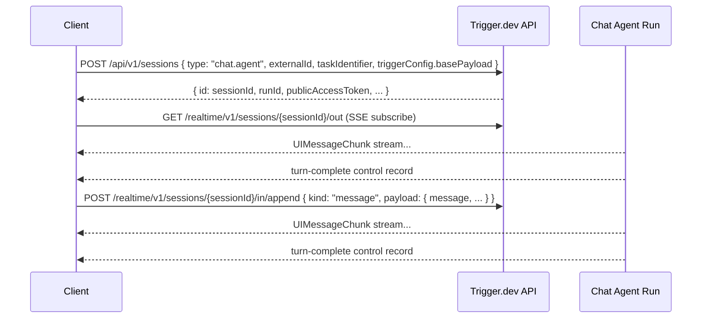

This page documents the protocol that chat clients use to communicate with `chat.agent()` tasks. Use this if you're building a custom transport (e.g., for a Slack bot, CLI tool, or native app) instead of using the built-in `TriggerChatTransport` or `AgentChat`.

<Note>
  Most users don't need this. Use [`TriggerChatTransport`](/ai-chat/frontend) for browser apps or [`AgentChat`](/ai-chat/server-chat) for server-side code. This page is for building your own from scratch.
</Note>

## Overview

`chat.agent` is built on a durable Session row — the unit of state that owns the chat's runs across their full lifecycle. A conversation is one session; a session can host many runs over its lifetime.

The protocol has three parts:

1. **Create the session** — idempotent on your chat ID. Creates the row **and** triggers the first run in one call. Returns the `publicAccessToken` you'll use for everything else.
2. **Subscribe to `.out`** — receive `UIMessageChunk` events via SSE.
3. **Append to `.in`** — send subsequent user messages, stops, or actions.



<Note>
  **Stream lifetime.** `session.out` is bounded. After each turn-complete control record, the agent appends an S2 `trim` command record back to the previous turn-complete's seq_num — the stream stays roughly one turn long forever at steady state. Full conversation history lives in a durable S3 snapshot, not on the stream. The transport's `lastEventId` bookmark plus S2's eventually-consistent trim window (10-60s) keeps single-turn-boundary resume working; multi-turn-away resume falls back to the snapshot. See [Resuming a stream](#resuming-a-stream) and [How history is rebuilt](#how-history-is-rebuilt).
</Note>

<Note>
  **Session create triggers a run.** Unlike `POST /api/v1/tasks/{taskId}/trigger`, `POST /api/v1/sessions` is the **only** entry point for chat-agent runs. The session row is task-bound and the first run is triggered atomically as part of the create call. Don't call `/tasks/{taskId}/trigger` directly for `chat.agent` tasks — the resulting run won't be bound to a session and `.in`/`.out` won't reach it.
</Note>

<Note>
  **One message per record.** Each `.in/append` carries at most one new `UIMessage` — the new user turn or a tool-approval response. The agent rebuilds prior history at run boot from a durable object-store snapshot plus a replay of the `session.out` tail; clients never ship full conversation history on the wire. See [How history is rebuilt](#how-history-is-rebuilt).
</Note>

## End-to-end curl recipe

A single-shell walk-through of the whole protocol — copy, fill in `BASE_URL` / `SECRET_KEY` / `TASK_ID`, and run. Drives a two-turn conversation (`pong` → `echo`) using only `curl` and `jq`.

```bash
BASE_URL="https://api.trigger.dev"   # or your local webapp
SECRET_KEY="tr_dev_..."              # secret API key for the env
TASK_ID="ai-chat"                    # your chat.agent task id
CHAT_ID=$(uuidgen | tr '[:upper:]' '[:lower:]')

# 1. Create session + trigger first run with the user's first message.
RESP=$(curl -sS -X POST "$BASE_URL/api/v1/sessions" \
  -H "Authorization: Bearer $SECRET_KEY" \
  -H "Content-Type: application/json" \
  -d @- <<JSON
{
  "type": "chat.agent",
  "externalId": "$CHAT_ID",
  "taskIdentifier": "$TASK_ID",
  "triggerConfig": {
    "basePayload": {
      "chatId": "$CHAT_ID",
      "trigger": "submit-message",
      "message": {
        "id": "u1",
        "role": "user",
        "parts": [{ "type": "text", "text": "Reply with the single word: pong." }]
      },
      "metadata": { "userId": "demo-user" }
    }
  }
}
JSON
)
SESSION_ID=$(echo "$RESP" | jq -r .id)
PAT=$(echo "$RESP" | jq -r .publicAccessToken)
echo "Session: $SESSION_ID  PAT: ${PAT:0:24}..."

# 2. Subscribe to .out and read until the turn-complete control record.
#    The doc's self-contained parser (Step 2) shows full SSE handling;
#    this recipe just greps for `text-delta` data records and the
#    `trigger-control` header on the `turn-complete` control record,
#    then extracts the last seq_num so step 4 can resume from it.
SSE=$(curl -sS --max-time 30 -N \
  -H "Authorization: Bearer $PAT" \
  -H "Accept: text/event-stream" \
  -H "Timeout-Seconds: 20" \
  "$BASE_URL/realtime/v1/sessions/$SESSION_ID/out")
echo "$SSE" | grep -E 'text-delta|trigger-control' | head -2
LAST_SEQ=$(echo "$SSE" | grep -oE '"seq_num":[0-9]+' | tail -1 | grep -oE '[0-9]+')
echo "lastSeq: $LAST_SEQ"

# 3. Send a follow-up via .in/append.
curl -sS -X POST "$BASE_URL/realtime/v1/sessions/$SESSION_ID/in/append" \
  -H "Authorization: Bearer $PAT" \
  -H "Content-Type: application/json" \
  -d @- <<JSON
{
  "kind": "message",
  "payload": {
    "chatId": "$CHAT_ID",
    "trigger": "submit-message",
    "message": {
      "id": "u2",
      "role": "user",
      "parts": [{ "type": "text", "text": "Now reply with: echo." }]
    },
    "metadata": { "userId": "demo-user" }
  }
}
JSON

# 4. Re-subscribe with Last-Event-ID so we resume past turn 1's records
#    and read turn 2 only.
curl -sS --max-time 30 -N \
  -H "Authorization: Bearer $PAT" \
  -H "Accept: text/event-stream" \
  -H "Timeout-Seconds: 20" \
  -H "Last-Event-ID: $LAST_SEQ" \
  "$BASE_URL/realtime/v1/sessions/$SESSION_ID/out" \
  | grep -m 2 -E 'text-delta|trigger-control'
```

The rest of this page details each step.

## Step 1: Create the session and trigger the first run

`POST /api/v1/sessions` does two things atomically: it creates (or returns) a session row, and triggers the first run for that session. Use your stable chat ID as `externalId` to make creation idempotent — two concurrent clients for the same chat converge on the same row, and a repeat call returns the existing session without triggering a duplicate run.

The `trigger` value inside `basePayload` decides what the first run does:

<CodeGroup>
```bash trigger: "preload" — warm the agent, no message yet
POST /api/v1/sessions
Authorization: Bearer <secret-key-or-jwt>
Content-Type: application/json

{
  "type": "chat.agent",
  "externalId": "conversation-123",
  "taskIdentifier": "ai-chat",
  "triggerConfig": {
    "basePayload": {
      "chatId": "conversation-123",
      "trigger": "preload",
      "metadata": { "userId": "user-456" }
    }
  },
  "tags": ["chat:conversation-123"]
}
```

```bash trigger: "submit-message" — process first user message immediately
POST /api/v1/sessions
Authorization: Bearer <secret-key-or-jwt>
Content-Type: application/json

{
  "type": "chat.agent",
  "externalId": "conversation-123",
  "taskIdentifier": "ai-chat",
  "triggerConfig": {
    "basePayload": {
      "chatId": "conversation-123",
      "trigger": "submit-message",
      "message": {
        "id": "msg-1",
        "role": "user",
        "parts": [{ "type": "text", "text": "Hello!" }]
      },
      "metadata": { "userId": "user-456" }
    }
  },
  "tags": ["chat:conversation-123"]
}
```
</CodeGroup>

Pick `"preload"` when the UI has rendered but the user hasn't typed (warms the agent so the first response is fast); pick `"submit-message"` when you already have the first message and want it processed in the same call.

### Required fields

| Field | Type | Description |
| --- | --- | --- |
| `type` | `string` | Discriminator. Use `"chat.agent"`. |
| `taskIdentifier` | `string` | The `id` you passed to `chat.agent({ id: ... })` — e.g. `"ai-chat"`. |
| `triggerConfig.basePayload` | `object` | The wire payload sent to the **first run** created by this call. Same shape as [`ChatTaskWirePayload`](#chattaskwirepayload) in Step 3. Durable fields (`chatId`, `metadata`, `idleTimeoutInSeconds`, `sessionId`) flow through to continuation runs too; first-turn-only fields (`message`, `trigger`) are stripped on continuations — those are session-create concerns and don't replay. See [What goes in `basePayload`](#what-goes-in-basepayload) below. |

### Optional fields

| Field | Type | Description |
| --- | --- | --- |
| `externalId` | `string` | Your stable chat ID. Strongly recommended — without it, repeat calls create new sessions. Cannot start with `session_`. |
| `tags` | `string[]` | Up to 10 dashboard tags. |
| `metadata` | `object` | Arbitrary JSON metadata stored on the session row (separate from `basePayload.metadata`, which goes to the agent). |
| `expiresAt` | `string` (ISO date) | Retention cap. |
| `triggerConfig.machine` | `string` | Machine preset (`micro`, `small-1x`, …) for every run. |
| `triggerConfig.queue` | `string` | Queue name. |
| `triggerConfig.tags` | `string[]` | Tags applied to every run (in addition to session-level `tags`). |
| `triggerConfig.maxAttempts` | `number` | Per-run retry cap (1–10). |
| `triggerConfig.maxDuration` | `number` | Per-run wall-clock cap, seconds. |
| `triggerConfig.lockToVersion` | `string` | Pin every run to a specific worker version. |
| `triggerConfig.region` | `string` | Region preference. |
| `triggerConfig.idleTimeoutInSeconds` | `number` | Surfaced to the agent through the wire payload (1–3600). |

### What goes in `basePayload`

`basePayload` is the [`ChatTaskWirePayload`](#chattaskwirepayload) sent to the agent at run boot — the same shape used for every subsequent `.in/append` (Step 3). Two fields you must always include:

- `chatId` — should equal your `externalId`. The agent uses this as its conversation identity (e.g. as a DB key in `hydrateMessages`); the `externalId` is what the URL routes resolve. Setting them to the same value is the standard pattern and the only way the built-in clients work.
- `trigger` — see the two examples above. `"preload"` and `"submit-message"` are the only valid choices for the first run; the others (`"regenerate-message"`, `"action"`, `"close"`, `"handover-prepare"`) are for subsequent `.in/append` calls.

The agent's typed `clientData` (declared via `chat.withClientData({ schema: ... })`) is read from `basePayload.metadata`. If your agent declares `clientData: { userId: string }`, then `metadata.userId` is required on every run — including the first one in `basePayload`.

### Response

```http
HTTP/1.1 201 Created
content-type: application/json; charset=utf-8
x-trigger-jwt: eyJhbGciOi...
x-trigger-jwt-claims: {"sub":"...","scopes":["read:runs:run_abc123","write:inputStreams:run_abc123"]}

{
  "id": "session_cm4z2plfh000abcd1efgh",
  "externalId": "conversation-123",
  "type": "chat.agent",
  "taskIdentifier": "ai-chat",
  "triggerConfig": { "basePayload": { /* echoed back */ } },
  "currentRunId": "run_abc123",
  "tags": ["chat:conversation-123"],
  "metadata": null,
  "closedAt": null,
  "closedReason": null,
  "expiresAt": null,
  "createdAt": "2026-04-24T09:00:00.000Z",
  "updatedAt": "2026-04-24T09:00:00.000Z",
  "runId": "run_abc123",
  "publicAccessToken": "eyJhbGciOi...",
  "isCached": false
}
```

| Field | Description |
| --- | --- |
| `id` | The `session_*` friendly ID. Stable for the life of the conversation. |
| `runId` / `currentRunId` | Friendly ID of the first run. Identical on a fresh create; will diverge over the conversation (see [Continuations](#continuations)). |
| `publicAccessToken` | Session-scoped JWT carrying `read:sessions:{externalId}` + `write:sessions:{externalId}`. **This is the token you use for every subsequent `.in`/`.out` call.** Persist it. Lifetime is 60 minutes — see [Refreshing the token](#refreshing-the-token). |
| `isCached` | `true` if the session existed already (idempotent re-create). HTTP status is 200 in that case, 201 on a fresh create. |

<Warning>
  **Use `publicAccessToken` from the body, not the `x-trigger-jwt` response header.** The header is included by the underlying run-trigger machinery and carries **run-scoped** scopes (`read:runs:{runId}` + `write:inputStreams:{runId}`) — it cannot subscribe to `.out` or append to `.in`. The body's `publicAccessToken` is the only token with the correct session-level scopes.
</Warning>

### Idempotency

Re-calling `POST /api/v1/sessions` with the same `(taskIdentifier, externalId)` pair is **idempotent for the lifetime of the session**:

- If the session is still alive: returns the existing row with `isCached: true`, `runId` unchanged, and a **fresh** 60-minute `publicAccessToken`. No duplicate run is triggered. (Idle/exited runs are different — see [Continuations](#continuations).)
- If the session has been closed (`POST /api/v1/sessions/{id}/close`): returns **HTTP 409**. Closed is one-way; reuse a different `externalId` to start a new conversation.
- Any tags / metadata / expiresAt / triggerConfig fields you send on the cached path are written through to the row, so you can update e.g. `triggerConfig.basePayload.metadata` mid-conversation. The new fields apply to **future** runs (continuations); the currently-live run keeps its original config.

<Warning>
  **A cached re-POST does not deliver a new `basePayload.message`.** `basePayload` is run-trigger config, not a message channel — the existing run keeps streaming and your message is silently dropped. To send a follow-up message, use `POST /realtime/v1/sessions/{sessionId}/in/append` (Step 3).
</Warning>

### Refreshing the token

The `publicAccessToken` returned by `POST /api/v1/sessions` is valid for 60 minutes. Two ways to keep going past that:

1. **Take refreshed tokens from the stream.** Every `turn-complete` control record on `.out` carries a `public-access-token` header with a refreshed JWT (see [`turn-complete` control record](#turn-complete-control-record)). For active conversations this just rolls — replace your stored token whenever the header is present.
2. **Re-call `POST /api/v1/sessions`.** Idempotent, returns `isCached: true` and a brand-new 60-minute token. Use this if a chat goes idle long enough that the SSE stream has closed and you need to resume.

<Note>
  The built-in SDK clients (`TriggerChatTransport` from `@trigger.dev/sdk`, `AgentChat` from `@trigger.dev/sdk/chat`) call this endpoint and persist the refreshed `publicAccessToken` automatically, refreshing on every `turn-complete` control record.
</Note>

## Step 2: Subscribe to `.out`

Subscribe to the agent's response via SSE on the session's `.out` channel:

```
GET /realtime/v1/sessions/{sessionId}/out
Authorization: Bearer <publicAccessToken>
Accept: text/event-stream
```

`Accept: text/event-stream` is required — without it the request is rejected as a non-SSE caller.

The URL accepts either form for `{sessionId}`: the friendly `session_*` ID, or your `externalId` (the chat ID you created the session with). The `publicAccessToken` from session-create authorizes both forms. Pick whichever your client already has on hand.

A session's `.out` stays the same across runs, so the client doesn't need to re-subscribe when a new run starts on the same chat. `seq_num` is **monotonically increasing across the entire session**, not just within one run — turn 1 might emit seq 0–9, turn 2 picks up at seq 10+, a continuation run on the same session continues numbering from there. This is why a single `Last-Event-ID` cursor is sufficient to resume across turns and across runs.

### Stream timeout

The SSE long-polls until either a record arrives or the timeout expires. The default is **60 seconds**; cap it explicitly via the `Timeout-Seconds` request header (1–600):

```
GET /realtime/v1/sessions/{sessionId}/out
Authorization: Bearer <publicAccessToken>
Accept: text/event-stream
Timeout-Seconds: 30
```

If nothing arrives by the deadline, the server sends `data: [DONE]` and closes. Reconnect with `Last-Event-ID` to continue (see [Resuming a stream](#resuming-a-stream)).

### Stream format (S2)

The output stream uses [S2](https://s2.dev) under the hood and follows the standard SSE wire format ([WHATWG spec](https://html.spec.whatwg.org/multipage/server-sent-events.html#parsing-an-event-stream)). Three event types arrive on the wire:

| Event | Meaning |
| --- | --- |
| `batch` | One or more records. The records you actually care about. |
| `ping` | Keepalive (~every 5s on idle). Body is `{"timestamp": <ms>}`. Ignore it. |
| _(no `event:`, just `data: [DONE]`)_ | Stream is closing — server sends this once before EOF. |

A `batch` event in raw SSE format looks like this — note the `data` is a single line of JSON, no embedded newlines (per the SSE spec):

```
id: 0,1,106
event: batch
data: {"records":[{"seq_num":0,"timestamp":1712150400000,"body":"{\"data\":{\"type\":\"text-delta\",\"id\":\"msg_1\",\"delta\":\"pong\"},\"id\":\"abc\"}"}],"tail":{"seq_num":10,"timestamp":1712150400500}}

```

The `id:` line on the wire is a comma-separated triple internal to S2 (`startSeq,endSeq,byteOffset`) — **don't try to parse it**. Use `record.seq_num` from inside the `data` body instead (see [Resuming a stream](#resuming-a-stream)).

Decoded `data` payload:

```json
{
  "records": [
    {
      "seq_num": 0,
      "timestamp": 1712150400000,
      "body": "{\"data\":{\"type\":\"text-delta\",\"id\":\"msg_1\",\"delta\":\"pong\"},\"id\":\"abc\"}"
    }
  ],
  "tail": {
    "seq_num": 10,
    "timestamp": 1712150400500
  }
}
```

| Field | Description |
| --- | --- |
| `records[]` | One or more records delivered in this batch, in arrival order. |
| `records[].seq_num` | Monotonic per-record cursor. Use the **last** one you successfully processed as your `Last-Event-ID` on resume. |
| `records[].timestamp` | Unix ms when the record was written to S2. |
| `records[].body` | For data records: a JSON-encoded **string** wrapping `{ data: UIMessageChunk, id: string }`. For control records: an empty string (semantics live in `headers`). For S2 command records: opaque bytes. See [Records on session.out](#records-on-session-out). |
| `records[].headers` | Optional `[name, value]` pairs. Empty for data records; a `trigger-control` entry for control records; a single empty-name `["", "<op>"]` entry for S2 command records. |
| `tail.seq_num` | Latest known tail of the S2 stream — useful for detecting how far behind the live edge you are. Skip if you don't need it. |
| `tail.timestamp` | Timestamp of `tail.seq_num`. |

### Records on `session.out`

Three kinds of records can arrive on the wire. They all share the `batch` envelope above; you tell them apart by `headers`.

| Kind | `headers[0][0]` | `headers` carries | `body` |
| --- | --- | --- | --- |
| **Data record** | _empty array or non-empty name_ | (currently none from the agent) | JSON envelope `{"data": UIMessageChunk, "id": <partId>}` |
| **Trigger control record** | `"trigger-control"` | `["trigger-control", <subtype>]` plus subtype-specific siblings (e.g. `["public-access-token", <jwt>]` on `turn-complete`) | empty string |
| **S2 command record** | `""` (empty name) | `["", "<op>"]` (currently `"trim"`) | opaque bytes — S2-interpreted |

**Uniform filter rule for custom readers:**

```ts
// Always advance the resume cursor — even for records you skip.
lastEventId = String(record.seq_num);

// S2 command record: bump cursor, don't dispatch.
if (record.headers?.[0]?.[0] === "") continue;

// Trigger control record: route by `trigger-control` value, don't
// dispatch as a UIMessageChunk.
const controlValue = record.headers?.find(([name]) => name === "trigger-control")?.[1];
if (controlValue === "turn-complete") {
  const token = record.headers.find(([name]) => name === "public-access-token")?.[1];
  // ...fire your turn-complete handler with the optional refreshed token...
  continue;
}
if (controlValue === "upgrade-required") {
  // ...your upgrade flow, if any. The server has already swapped the run
  // by the time this arrives — subsequent chunks are from the new run...
  continue;
}

// Otherwise: data record. Parse the body, dispatch the UIMessageChunk.
const { data: chunk } = JSON.parse(record.body);
```

Built-in SDK transports (`TriggerChatTransport`, `AgentChat`) handle all of this for you — control records surface via `onTurnComplete({ chatId, lastEventId, publicAccessToken })` and the upgrade flow. Custom transports need the routing above.

<Note>
  **Prior wire shape.** Earlier SDK versions emitted `trigger:turn-complete` and `trigger:upgrade-required` as `UIMessageChunk`-shaped data records with `chunk.type === "trigger:turn-complete"`. Current versions use the header-form control records described above. Built-in SDK transports handle the new shape transparently; custom transports filtering on `chunk.type` need to switch to the `trigger-control` header check.
</Note>

### Built-in parser (recommended for SDK users)

If you're working in TypeScript and depending on `@trigger.dev/core/v3` is acceptable, use `SSEStreamSubscription` — it handles batch decoding, deduplication, command-record filtering, and `Last-Event-ID` tracking for you:

```ts
import { SSEStreamSubscription, controlSubtype } from "@trigger.dev/core/v3";

const subscription = new SSEStreamSubscription(
  `${baseUrl}/realtime/v1/sessions/${sessionId}/out`,
  {
    headers: { Authorization: `Bearer ${publicAccessToken}` },
    timeoutInSeconds: 120,
    lastEventId,
  }
);

const stream = await subscription.subscribe();
const reader = stream.getReader();

while (true) {
  const { done, value } = await reader.read();
  if (done) break;

  // value is { id, chunk, timestamp, headers }. S2 command records are
  // filtered out of this stream entirely (cursor still advances). Trigger
  // control records pass through with `chunk === undefined` and a
  // `trigger-control` header.
  const control = controlSubtype(value.headers);
  if (control === "turn-complete") break;
  if (control === "upgrade-required") continue;

  const chunk = value.chunk as { type?: string; delta?: string } | undefined;
  if (chunk?.type === "text-delta") process.stdout.write(chunk.delta ?? "");
}
```

### Self-contained parser (for custom transports)

If you're building a transport in another language or don't want the dependency, here's a complete reader. It handles the SSE framing, the comma-separated `id:` line, batch unwrapping, the inner `body` string, and `ping` / `[DONE]` events:

```ts
async function* readSessionOut(
  url: string,
  publicAccessToken: string,
  opts: { lastEventId?: string; timeoutSeconds?: number } = {}
) {
  const headers: Record<string, string> = {
    Authorization: `Bearer ${publicAccessToken}`,
    Accept: "text/event-stream",
  };
  if (opts.lastEventId) headers["Last-Event-ID"] = opts.lastEventId;
  if (opts.timeoutSeconds) headers["Timeout-Seconds"] = String(opts.timeoutSeconds);

  const res = await fetch(url, { headers });
  if (!res.ok || !res.body) throw new Error(`SSE failed: ${res.status}`);

  const decoder = new TextDecoder();
  const reader = res.body.getReader();
  let buf = "";

  while (true) {
    const { done, value } = await reader.read();
    if (done) return;
    buf += decoder.decode(value, { stream: true });

    // SSE events are separated by blank lines (CRLF or LF).
    const events = buf.split(/\r?\n\r?\n/);
    buf = events.pop() ?? ""; // last chunk is incomplete

    for (const raw of events) {
      let eventType = "message"; // SSE default
      const dataLines: string[] = [];
      for (const line of raw.split(/\r?\n/)) {
        if (line.startsWith("event:")) eventType = line.slice(6).trim();
        else if (line.startsWith("data:")) dataLines.push(line.slice(5).trimStart());
        // We deliberately ignore `id:` — use record.seq_num for resume cursors.
      }
      const data = dataLines.join("\n");
      if (!data) continue;

      if (eventType === "ping") continue;
      if (data === "[DONE]") return;

      if (eventType === "batch") {
        const batch = JSON.parse(data) as {
          records: Array<{
            seq_num: number;
            timestamp: number;
            body: string;
            headers?: Array<[string, string]>;
          }>;
        };
        for (const record of batch.records) {
          const firstHeaderName = record.headers?.[0]?.[0];

          // S2 command record (trim/fence) — bump cursor, skip dispatch.
          if (firstHeaderName === "") {
            yield { seqNum: record.seq_num, timestamp: record.timestamp, kind: "command" };
            continue;
          }

          // Trigger control record (turn-complete, upgrade-required) —
          // semantics live in headers, body is empty. Route by header.
          const controlValue = record.headers?.find(([n]) => n === "trigger-control")?.[1];
          if (controlValue) {
            const token = record.headers?.find(([n]) => n === "public-access-token")?.[1];
            yield {
              seqNum: record.seq_num,
              timestamp: record.timestamp,
              kind: "control",
              subtype: controlValue,
              publicAccessToken: token,
            };
            continue;
          }

          // Data record — UIMessageChunk wrapped in `{ data, id }`.
          const inner = JSON.parse(record.body) as { data: unknown; id: string };
          yield {
            seqNum: record.seq_num, // use this for Last-Event-ID on resume
            timestamp: record.timestamp,
            kind: "data",
            chunk: inner.data, // the actual UIMessageChunk
          };
        }
      }
    }
  }
}
```

Driving it:

```ts
let lastSeq: string | undefined;
for await (const ev of readSessionOut(sseUrl, publicAccessToken)) {
  lastSeq = String(ev.seqNum);                       // always advance the cursor

  if (ev.kind === "command") continue;               // S2 trim/fence — skip
  if (ev.kind === "control") {
    if (ev.subtype === "turn-complete") break;       // turn done
    if (ev.subtype === "upgrade-required") continue; // run swap handled server-side
    continue;
  }

  // ev.kind === "data" — the UIMessageChunk
  const chunk = ev.chunk as { type: string; delta?: string };
  if (chunk.type === "text-delta") process.stdout.write(chunk.delta ?? "");
}
// On reconnect, pass `lastEventId: lastSeq` to resume from the next record.
```

### Chunk types

Data records on the stream carry a `UIMessageChunk` from the [AI SDK](https://ai-sdk.dev/docs/ai-sdk-ui/ui-message-stream). Two Trigger.dev-specific control events ride alongside as **header-form control records** (see [Records on session.out](#records-on-session-out)).

Within a single assistant turn the AI SDK chunk types you'll typically see, in order:

| Chunk type | Shape | Notes |
| --- | --- | --- |
| `start` | `{ type: "start", messageId: string }` | First chunk of a new assistant message. **Persist `messageId`** — you'll need it to send tool-approval responses (see [Tool approval responses](#tool-approval-responses)). |
| `start-step` | `{ type: "start-step" }` | New `prepareStep` boundary. |
| `text-start` / `text-delta` / `text-end` | `{ type: ..., id: string, delta?: string }` | Streaming text. Concatenate `delta`s for the visible reply. |
| `tool-input-start` / `tool-input-delta` / `tool-input-available` | tool-call argument streaming | The tool the model is calling. |
| `tool-output-available` | tool result | After the agent runs the tool. |
| `data-*` | `{ type: "data-<name>", data: ... }` | Custom data parts written by the agent's hooks. |
| `finish-step` / `finish` | end markers for the assistant message | Followed by the `turn-complete` control record. |

Refer to the AI SDK docs linked above for the full union — only the two control records below are Trigger.dev-specific.

### `turn-complete` control record

Signals that the agent's turn is finished — stop reading and wait for user input.

```
headers:
  ["trigger-control", "turn-complete"]
  ["public-access-token", "eyJ..."]   // optional, refreshed JWT
body: ""
```

| Header | Description |
| --- | --- |
| `trigger-control: turn-complete` | Always present on this record. |
| `public-access-token: <jwt>` (optional) | A refreshed JWT with the same session + run scopes. If present, replace your stored token. |

When you receive this record:
1. Update `publicAccessToken` if one is included on the headers.
2. Close the stream reader (unless you want to keep it open across turns — see [Resuming a stream](#resuming-a-stream)).
3. Wait for the next user message before sending on `.in`.

### `upgrade-required` control record

Signals that the agent cannot handle this message on its current version and a new run has been started. Emitted when the agent calls [`chat.requestUpgrade()`](/ai-chat/patterns/version-upgrades).

```
headers:
  ["trigger-control", "upgrade-required"]
body: ""
```

The server has already swapped the run on the same session by the time this record is delivered. Subsequent records on the same SSE subscription come from the new run.

When you receive this record:
1. Treat it as informational — no client action required. The same SSE keeps streaming the new run's chunks on the same session.
2. Optionally surface a "switched to vN.N+1" indicator in your UI.

The built-in clients handle this transparently.

### Resuming a stream

If the SSE connection drops, reconnect with the `Last-Event-ID` header set to the **last `record.seq_num` you successfully processed** (decoded from the batch body — not the SSE `id:` line, which is a comma-list internal to S2):

```
GET /realtime/v1/sessions/{sessionId}/out
Authorization: Bearer <publicAccessToken>
Accept: text/event-stream
Last-Event-ID: 42
```

The server resumes streaming from `seq_num = 43` onward. `Last-Event-ID` is a single non-negative integer; passing the SSE `id:` line value verbatim (e.g. `0,1,106`) silently falls back to "start from the beginning."

`SSEStreamSubscription` tracks this automatically via its `lastEventId` option.

<Note>
  **What "resumable" means.** `session.out` is trimmed back to the previous `turn-complete` control record after each turn finishes. In practice:

  - **Resume across a single turn boundary always works** — your bookmark is the last turn's `turn-complete` record, which is still on the stream.
  - **The S2 trim is eventually consistent** (10-60s typical), so close-then-reload-quickly cases reliably still see records that are about to be trimmed.
  - **Resume across multiple turns of inactivity** may find your bookmark trimmed. The S2 read silently clamps forward to the first surviving record; the cleanest recovery is to fetch the latest snapshot and treat the SSE as fresh from there (or rehydrate via your own DB if you use `hydrateMessages`). See [How history is rebuilt](#how-history-is-rebuilt).
</Note>

### `X-Peek-Settled` / `X-Session-Settled` — opt-in fast close on idle reconnects

On **reconnect-on-reload** paths (resuming a chat where nothing may be streaming), send `X-Peek-Settled: 1` as a request header when opening the SSE. When present, the server peeks the tail of `.out` and walks past any trailing S2 trim command record to find the most recent data/control record underneath. If that record is a `turn-complete` control record (agent finished a turn and is idle-waiting or exited), the SSE:

- Uses `wait=0` internally — drains any residual records and closes in ~1s instead of long-polling for 60s.
- Sets the `X-Session-Settled: true` response header so the client can tell the close is terminal rather than a mid-stream drop.

**Do not send `X-Peek-Settled` on the active-send response-stream path.** The peek would race the newly-triggered turn's first chunk — if the agent hasn't written the new turn's first record yet, the peek sees the prior turn's `turn-complete` and closes the SSE before the response lands on S2. The built-in `TriggerChatTransport.reconnectToStream` sets the header; `sendMessages → subscribeToStream` does not.

```ts
// Reconnect path (page reload)
const response = await fetch(sseUrl, {
  headers: {
    Authorization: `Bearer ${publicAccessToken}`,
    "X-Peek-Settled": "1",
    "Last-Event-ID": lastEventId,
  },
});
const settled = response.headers.get("X-Session-Settled") === "true";
// ...subscribe as normal; if settled and nothing arrives, you're done.

// Active send path — no X-Peek-Settled, keep long-poll semantics
const liveResponse = await fetch(sseUrl, {
  headers: {
    Authorization: `Bearer ${publicAccessToken}`,
    "Last-Event-ID": lastEventId,
  },
});
```

## Step 3: Send messages, stops, and actions

All client-to-agent signals are appended to the session's `.in` channel:

```
POST /realtime/v1/sessions/{sessionId}/in/append
Authorization: Bearer <publicAccessToken>
Content-Type: application/json
```

`{sessionId}` accepts the same friendly-or-external forms as `.out`. The `publicAccessToken` from session-create authorizes both.

The body is a JSON-serialized [`ChatInputChunk`](#chatinputchunk) — a tagged union covering messages, stops, and actions. Send them as raw JSON strings (not wrapped in a `data` field). On success the response is `200 OK` with body `{ "ok": true }`; on failure it's `4xx`/`5xx` with `{ "ok": false, "error": "<message>" }`. Common failures:

| Status | When |
| --- | --- |
| `401` | Missing or invalid `Authorization` header. |
| `403` | Token doesn't carry `write:sessions:{externalId}`. |
| `409` | The session is closed — `{ "ok": false, "error": "Cannot append to a closed session" }`. |
| `413` | Body exceeds 512 KiB. A normal `kind: "message"` payload is a few KB; if you hit this you're shipping more than one message per record. |
| `500` | Transient backend failure on the durable stream. Safe to retry — appends are idempotent on `(externalId, X-Part-Id)` if you set the optional `X-Part-Id` request header (the built-in clients set it from a UUID). |

<Warning>
  **Schema validation of `metadata` happens inside the agent, not at this endpoint.** A `kind: "message"` with bad or missing metadata returns `200 OK` here, but the agent rejects the turn at run time. From the wire the failure looks like a `turn-complete` control record with no preceding `text-delta` — i.e. an empty assistant response.

  **How to detect from the client:** treat "received `turn-complete` after sending a `submit-message` with no `text-delta`/`tool-input-*` chunks in between" as a schema-validation suspect, and surface a sensible error to your user. **How to confirm from the dashboard / Trigger MCP:** the run trace includes a `chat turn N [ERROR]` span followed by `waiting for next message (after error)`; the `[ERROR]` span carries the validation error message in its events. Use `mcp__trigger__get_run_details` (or open the run in the dashboard) on the run ID surfaced in the `runId` field of session-create.
</Warning>

### `ChatInputChunk`

```ts
type ChatInputChunk =
  | { kind: "message"; payload: ChatTaskWirePayload }
  | { kind: "stop"; message?: string };
```

The discriminator `kind` drives the agent's dispatch — `"message"` goes to the turn loop, `"stop"` fires the abort controller.

### `ChatTaskWirePayload`

```ts
type ChatTaskWirePayload<TMessage extends UIMessage = UIMessage, TMetadata = unknown> = {
  /**
   * The new message for this turn — at most ONE per record.
   *  - "submit-message": the new user message, OR a tool-approval-responded
   *    assistant message (with `state: "approval-responded"` tool parts).
   *  - "regenerate-message": omitted (the server trims its own tail).
   *  - "preload" / "close" / "action": omitted.
   *  - "handover-prepare": omitted (use `headStartMessages` instead — see below).
   */
  message?: TMessage;

  /**
   * Escape hatch for chat.headStart. Ships full UIMessage history on the
   * very first turn — before any snapshot exists. Used ONLY by
   * trigger: "handover-prepare" against the customer's own HTTP route
   * handler. The server ignores this field on any other trigger.
   */
  headStartMessages?: TMessage[];

  chatId: string;
  trigger:
    | "submit-message"
    | "regenerate-message"
    | "preload"
    | "close"
    | "action"
    | "handover-prepare";
  messageId?: string;
  /**
   * Wire envelope for the agent's typed `clientData` (declared via
   * `chat.withClientData({ schema })`). Whatever you put here is parsed
   * against that schema at the agent boundary. If the agent declares
   * `clientData: { userId: string }`, then `metadata.userId` is required.
   */
  metadata?: TMetadata;
  action?: unknown;
  /**
   * Informational — the server sets this automatically on continuation
   * runs (when the prior run is dead). Clients don't need to send it.
   * Read by the agent's boot gate to skip `onChatStart` and trigger
   * snapshot read + replay.
   */
  continuation?: boolean;
  /**
   * Informational — paired with `continuation: true`, set by the server
   * from the prior run's friendly ID. Surfaced to the agent in
   * `ctx.previousRunId`. Clients don't need to send it.
   */
  previousRunId?: string;
  idleTimeoutInSeconds?: number;
  sessionId?: string;
};
```

<Note>
  **`metadata` is the wire envelope for `clientData`.** The agent's `clientData` (typed via `chat.withClientData({ schema })`) is read from this field at run boot. If the agent declares e.g. `{ userId: string, model?: string }`, then every `kind: "message"` payload — and the `triggerConfig.basePayload` you sent at session create — must carry a matching `metadata.userId`. The agent rejects messages whose metadata fails schema validation.
</Note>

### Sending a message

```
POST /realtime/v1/sessions/{sessionId}/in/append
Authorization: Bearer <publicAccessToken>
Content-Type: application/json

{
  "kind": "message",
  "payload": {
    "message": {
      "id": "msg-2",
      "role": "user",
      "parts": [{ "type": "text", "text": "Tell me more" }]
    },
    "chatId": "conversation-123",
    "trigger": "submit-message",
    "metadata": { "userId": "user-456" }
  }
}
```

After sending, subscribe to `.out` (if you closed the stream after the previous turn's `turn-complete`) to receive the response.

<Note>
  Send only the **new** user message — never the full history. The agent rebuilds prior history from a durable S3 snapshot plus a `session.out` replay at run boot. See [How history is rebuilt](#how-history-is-rebuilt).
</Note>

### Sending a stop

```json
{ "kind": "stop" }
```

Interrupts the agent's current turn. `streamText` aborts, the agent emits a `turn-complete` control record, and the run returns to idle.

An optional `message` field surfaces in the agent's stop handler:

```json
{ "kind": "stop", "message": "user cancelled" }
```

### Sending an action

Custom actions (undo, rollback, edit) ride on the same `.in` channel using `kind: "message"` with `trigger: "action"` in the payload. Omit `message` — actions don't carry a UIMessage:

```json
{
  "kind": "message",
  "payload": {
    "chatId": "conversation-123",
    "trigger": "action",
    "action": { "type": "undo" },
    "metadata": { "userId": "user-456" }
  }
}
```

Actions wake the agent from suspension (same as messages), fire the `onAction` hook, then optionally trigger a normal `run()` turn (when `onAction` returns a `StreamTextResult`). The `action` payload is validated against the agent's `actionSchema`. If the agent didn't register an `actionSchema` (or your `action` payload doesn't match it), validation fails the same way `metadata` does — `.in/append` returns `200 OK`, but the run trace shows `chat turn N [ERROR]` and the wire emits a `turn-complete` control record with no other chunks. See [Actions](/ai-chat/actions) for the agent-side schema setup.

### Regenerating the last response

To regenerate the assistant's last response, send `trigger: "regenerate-message"` with no `message`:

```json
{
  "kind": "message",
  "payload": {
    "chatId": "conversation-123",
    "trigger": "regenerate-message",
    "metadata": { "userId": "user-456" }
  }
}
```

The agent trims trailing assistant messages from its accumulator and re-streams from the prior user turn. The frontend's `useChat()` already removed the trailing assistant locally — the wire signal tells the agent to do the same.

### Tool approval responses

When a tool requires approval (`needsApproval: true`), the agent streams the tool call with an `approval-requested` state and completes the turn. After the user approves or denies, send the **updated assistant message** (with `approval-responded` tool parts) back as a `kind: "message"` chunk — singular, not the full chain:

```json
{
  "kind": "message",
  "payload": {
    "message": {
      "id": "asst-msg-1",
      "role": "assistant",
      "parts": [
        { "type": "text", "text": "I'll send that email for you." },
        {
          "type": "tool-sendEmail",
          "toolCallId": "call-1",
          "state": "approval-responded",
          "input": { "to": "user@example.com", "subject": "Hello" },
          "approval": { "id": "approval-1", "approved": true }
        }
      ]
    },
    "chatId": "conversation-123",
    "trigger": "submit-message",
    "metadata": { "userId": "user-456" }
  }
}
```

The agent matches the incoming message by `id` against the rebuilt accumulator. If a match is found, it **replaces** the existing message instead of appending.

<Note>
  The message `id` must match the one the agent assigned during streaming. `TriggerChatTransport` keeps IDs in sync automatically. Custom transports should use the `messageId` from the stream's `start` chunk.
</Note>

## How history is rebuilt

The agent rebuilds the full conversation accumulator on every fresh run boot. There are two reconstruction paths, and the agent picks based on what hooks the customer registered:

### Path A — `hydrateMessages` registered

If the agent declares a [`hydrateMessages`](/ai-chat/lifecycle-hooks#hydratemessages) hook, the runtime trusts the customer to be the source of truth for history. Snapshot read and replay are **skipped entirely** at boot. The hook fires per turn — `incomingMessages` is 0-or-1-length consistently (since each record carries at most one new message) — and returns the canonical chain from the customer's database.

### Path B — Snapshot + replay (default)

When `hydrateMessages` is not registered, the runtime reconstructs history from durable infrastructure on every run boot:

<Steps>
  <Step title="Read the latest snapshot">
    The runtime fetches a per-session JSON snapshot from object storage (S3 or compatible). The snapshot stores `{ messages, lastOutEventId, lastOutTimestamp, savedAt }` — what was true at the moment the previous turn finished. A 404 (no snapshot yet) is fine — treated as empty.
  </Step>
  <Step title="Replay session.out tail">
    The runtime subscribes to `session.out` with `wait=0` starting from the snapshot's `lastOutEventId` (or seq 0 if there is no snapshot). Any chunks since that cursor are fed through the AI SDK's `processUIMessageStream` reducer to materialize fresh `UIMessage[]`. This catches turns whose snapshot write didn't make it before a crash.
  </Step>
  <Step title="Merge by id, replay wins">
    Snapshot messages and replayed messages are merged by `id`. On collision, replay wins — `session.out` is the freshest representation of any assistant message. Partial trailing assistant work from a crashed turn is cleaned up via `cleanupAbortedParts`.
  </Step>
  <Step title="Write a fresh snapshot after every turn">
    When `onTurnComplete` fires, the runtime serializes the accumulator and writes it back to object storage. The write is **awaited** — the run may suspend immediately after, and fire-and-forget would lose the snapshot.
  </Step>
</Steps>

Object-store configuration is the same as the rest of Trigger.dev — set `OBJECT_STORE_*` env vars. With no object store configured and no `hydrateMessages` hook, conversations don't survive run boundaries; the runtime logs a warning at registration time.

For a deeper walkthrough of the snapshot model, including OOM-retry interaction and crash semantics, see [Persistence and replay](/ai-chat/patterns/persistence-and-replay).

## Head-start protocol caveat

The [`chat.headStart`](/ai-chat/fast-starts#head-start) flow runs the first turn's LLM call inside the customer's own HTTP route handler, then hands the durable stream off to the agent for tool execution and step 2+. On that first-ever turn no snapshot exists yet — the agent boots empty.

To bridge that gap, the head-start route handler ships **full UIMessage history** through the dedicated `headStartMessages` field with `trigger: "handover-prepare"`. This is the **only** path where a wire-shipped UIMessage[] still seeds the agent's accumulator:

```json
{
  "kind": "message",
  "payload": {
    "headStartMessages": [
      { "id": "u1", "role": "user", "parts": [/* ... */] },
      { "id": "a1", "role": "assistant", "parts": [/* ... */] }
    ],
    "chatId": "conversation-123",
    "trigger": "handover-prepare",
    "metadata": { "userId": "user-456" }
  }
}
```

Two reasons this exception is safe:

1. **The route handler runs against the customer's own HTTP endpoint**, not `/realtime/v1/sessions/{id}/in/append`. The 512 KiB body cap on the realtime route doesn't apply.
2. **`headStartMessages` is only honored on `trigger: "handover-prepare"`**. The runtime ignores the field on every other trigger — the one-message-per-record rule still holds for normal turns.

After turn 1 completes, the snapshot is written and turn 2+ run as a normal single-message-per-record chat.

## Pending and steering messages

You can send messages while the agent is still streaming a response. These are **pending messages** — the agent receives them mid-turn and can inject them between tool-call steps.

The wire format is identical to a normal `kind: "message"` send — same `.in` channel, single `message` field. The difference is timing. What happens depends on the agent's `pendingMessages` configuration:

- **With `pendingMessages.shouldInject`**: the message is injected into the model's context at the next `prepareStep` boundary. The agent sees it and can adjust its behavior mid-response.
- **Without `pendingMessages` config**: the message queues for the next turn.

See [Pending Messages](/ai-chat/pending-messages) for how to configure the agent side.

<Note>
  Unlike a normal `sendMessage`, pending messages should **not** cancel the active stream subscription. Keep reading — the agent incorporates the message into the same turn or queues it for the next one.
</Note>

## Continuations

A run can end for several reasons: idle timeout, max turns reached, `chat.requestUpgrade()`, crash, or cancellation. When this happens, the session row stays alive — only the run is gone. The next message you append to `.in` automatically triggers a fresh run on the same session.

**Clients send the wire shape exactly as a normal `submit-message`** — the server detects the absent run and handles the continuation itself:

```json
{
  "kind": "message",
  "payload": {
    "message": {
      "id": "u-42",
      "role": "user",
      "parts": [{ "type": "text", "text": "Where were we?" }]
    },
    "chatId": "conversation-123",
    "trigger": "submit-message",
    "metadata": { "userId": "user-456" }
  }
}
```

POST to the same `/realtime/v1/sessions/{sessionId}/in/append` URL with the same `publicAccessToken` you've been using — both stay valid across runs. The server detects the absent run, triggers a new one on the session's `triggerConfig`, and the agent boots, reads the snapshot from the prior run's last turn, replays any tail, and continues. Only `runId` changes — the new run's id is encoded in the next refreshed `publicAccessToken`'s `read:runs:{runId}` scope.

<Note>
  **You don't need to track `runId` or set `continuation: true` / `previousRunId` yourself.** The server detects continuation when the prior run is in a terminal state and sets those fields on the new run's boot payload automatically. The `continuation` and `previousRunId` fields on `ChatTaskWirePayload` are informational — used internally by the agent's boot path, never required from the client.
</Note>

<Note>
  **`onChatStart` does NOT fire on continuation runs.** The hook is once-per-chat — it fires only on the chat's very first user message. Customers who want per-turn setup that also runs on continuation turns should use `onTurnStart` instead.
</Note>

<Tip>
  This is how [version upgrades](/ai-chat/patterns/version-upgrades) work transparently — the agent calls `chat.requestUpgrade()`, the run exits, and the client's next message triggers a continuation on the new version. Same session, new run, same snapshot.
</Tip>

## Closing the conversation

When the user is done with the conversation, close the session:

```bash
POST /api/v1/sessions/{sessionId}/close
Authorization: Bearer <secret-key-or-jwt>
Content-Type: application/json

{ "reason": "user-ended" }
```

The body is optional — `{}` (or no body at all) closes the session with no reason set. If provided, `reason` is a free-form string up to 256 characters used for dashboard / audit display. Closing is **idempotent**: re-calling on an already-closed session returns the existing row without clobbering the original `closedAt` / `closedReason`.

A long-running chat that's just between turns is a **live** session, not a closed one — don't close it prematurely. Once closed, the session cannot be reopened; reuse a different `externalId` if the user wants to start fresh.

## Session state

A client needs to track per-conversation:

| Field | Description |
| --- | --- |
| `sessionId` | Durable session ID (`session_*`). Stable for the life of the conversation. |
| `chatId` | Your stable conversation ID (passed as `externalId` on create). |
| `runId` | Current run ID. Changes when a run ends and a continuation starts. Only needed if you want to display it. |
| `publicAccessToken` | JWT for session access. Stable across runs; refreshed via the `public-access-token` header on every `turn-complete` control record. |
| `lastEventId` | Last `record.seq_num` received on `.out`. Use to resume mid-stream. |

`sessionId`, `chatId`, and `publicAccessToken` are durable. `runId` is live-run state that refreshes on each new run. On reload, you only need `sessionId` + `publicAccessToken` + `lastEventId` to resume — `runId` is a hint that can be `null` when no run is active.

## Authentication

| Operation | Auth |
| --- | --- |
| Create session (`POST /api/v1/sessions`) | Secret API key, or JWT with `write:sessions` super-scope plus a matching `tasks:{taskIdentifier}` scope |
| Close session (`POST /api/v1/sessions/{id}/close`) | Secret API key, or JWT with `admin:sessions:{id}` / `admin:sessions` super-scope |
| `.in` append | The session's `publicAccessToken` (carries `write:sessions:{id}`) |
| `.out` subscribe | The session's `publicAccessToken` (carries `read:sessions:{id}`) |

The `publicAccessToken` returned in the body of `POST /api/v1/sessions` carries both `read:sessions:{externalId}` and `write:sessions:{externalId}` and is **the only token you need** for every `.in`/`.out` operation thereafter. A token minted on the externalId form authorizes both the externalId and the friendlyId URL forms on every read and write route, so use whichever URL form your client already has on hand.

<Warning>
  **Don't use the `x-trigger-jwt` header from `POST /api/v1/tasks/{taskId}/trigger`.** That header carries `read:runs:{runId}` + `write:inputStreams:{runId}` — run-scoped scopes, not session-scoped. It cannot subscribe to `.out` or append to `.in`. Always use the `publicAccessToken` from the session-create response body.
</Warning>

## FAQ

<Expandable title="After sending `kind: \"stop\"`, can I immediately send the next message?">
Yes. `.in` records are processed in arrival order — the agent's stop handler aborts the in-flight `streamText`, emits a `turn-complete` control record, and reads the next record. You don't have to wait for `turn-complete` on the wire before posting the next `.in/append`. In practice you usually do anyway, because your UI is gated on the stream coming back to ready.
</Expandable>

<Expandable title="What's the format of the optional `X-Part-Id` header?">
Any opaque ASCII string up to ~64 characters. The built-in clients pass a `nanoid(7)` (e.g. `"V1StGXR"`) generated per request. The server uses it as a per-record idempotency key — re-POSTing the same body with the same `X-Part-Id` produces a single S2 record. If you don't send the header, the server generates one for you and idempotency is per-request only.
</Expandable>

<Expandable title="What happens on rate-limit (429)?">
The `.in/append` route returns standard rate-limit response headers (`x-ratelimit-limit`, `x-ratelimit-remaining`, `x-ratelimit-reset` — Unix ms epoch when the bucket refills). On `429`, back off until `x-ratelimit-reset` and retry with the same `X-Part-Id` to remain idempotent. Default per-environment limits are generous (millions of requests/window); you'll typically only hit this with runaway client loops.
</Expandable>

<Expandable title="How do I tell from the `.out` stream that a run has ended (vs idled between turns)?">
You don't need to. There's no `trigger:run-ended` chunk. The protocol is designed so the client doesn't track run lifecycle:

- A `turn-complete` control record means **the turn finished**, not that the run is gone. The run may still be alive, idle-waiting for the next `.in` record, or it may have suspended / exited shortly after.
- When you POST the next message to `.in/append`, the server figures out whether the existing run can pick it up or whether to spawn a continuation. Either way you get streamed responses on the same `.out` URL.

If you genuinely need the live `runId` (for displaying the dashboard link, say), read it from the latest `turn-complete` control record's refreshed `public-access-token` header — the JWT's `read:runs:{runId}` scope encodes it. Or call `GET /api/v1/sessions/{sessionId}` (omitted from this page; see the Sessions API reference) to read `currentRunId`.
</Expandable>

<Expandable title="Does the `seq_num` reset across continuations or runs?">
No. `seq_num` is monotonic across the entire session — turn 1 might emit seq 0–9, turn 2 picks up at seq 10+, and a continuation run on the same session continues numbering from where the prior run left off. A single `Last-Event-ID` cursor is sufficient to resume across turns and runs.
</Expandable>

<Expandable title="What's the maximum size of a single `.in/append` body?">
512 KiB. A typical `kind: "message"` is a few KB. If you're brushing the cap you're shipping more than one message per record, which the protocol forbids. The headStart path (`trigger: "handover-prepare"`) sends through the customer's own HTTP route handler, not `.in/append`, so the cap doesn't apply there.
</Expandable>

## See also

- [`TriggerChatTransport`](/ai-chat/frontend) — Built-in browser transport (implements this protocol)
- [`AgentChat`](/ai-chat/server-chat) — Built-in server-side client
- [Persistence and replay](/ai-chat/patterns/persistence-and-replay) — How the snapshot + replay model works end-to-end
- [Lifecycle hooks](/ai-chat/lifecycle-hooks) — What the agent does on each event
- [Version upgrades](/ai-chat/patterns/version-upgrades) — How `chat.requestUpgrade()` uses continuations
