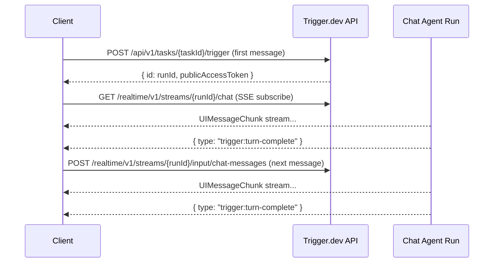

This page documents the protocol that chat clients use to communicate with `chat.agent()` tasks. Use this if you're building a custom transport (e.g., for a Slack bot, CLI tool, or native app) instead of using the built-in `TriggerChatTransport` or `AgentChat`.

<Note>
  Most users don't need this. Use [`TriggerChatTransport`](/ai-chat/frontend) for browser apps or [`AgentChat`](/ai-chat/server-chat) for server-side code. This page is for building your own from scratch.
</Note>

## Overview

The protocol has three parts:

1. **Trigger** — start a new run by calling the task trigger API
2. **Input streams** — send messages and signals to a running agent
3. **Output stream** — subscribe to the agent's response via SSE



## Step 1: Trigger the first run

Start a conversation by triggering the agent task. The payload follows the `ChatTaskWirePayload` shape:

```bash
POST /api/v1/tasks/{taskId}/trigger
Authorization: Bearer <secret-key-or-jwt>
Content-Type: application/json

{
  "payload": {
    "messages": [
      {
        "id": "msg-1",
        "role": "user",
        "parts": [{ "type": "text", "text": "Hello!" }]
      }
    ],
    "chatId": "conversation-123",
    "trigger": "submit-message",
    "metadata": { "userId": "user-456" }
  },
  "options": {
    "tags": ["chat:conversation-123"]
  }
}
```

The response body contains the `runId`:

```json
{
  "id": "run_abc123"
}
```

The **response headers** contain the public access token (a JWT scoped to this run):

The `x-trigger-jwt` header contains a JWT with `read:runs:{runId}` and `write:inputStreams:{runId}` scopes. Use this for all stream operations.

Store the `runId` and the `x-trigger-jwt` value — you need both for input streams and SSE.

<Note>
  The built-in SDK clients (`TriggerChatTransport`, `AgentChat`) extract the JWT from the response header automatically. If you're using the `ApiClient` from `@trigger.dev/core/v3`, `triggerTask()` returns `{ id, publicAccessToken }` with the header already extracted.
</Note>

### Preloading (optional)

To preload an agent before the first message, trigger with `"trigger": "preload"` and an empty `messages` array:

```json
{
  "payload": {
    "messages": [],
    "chatId": "conversation-123",
    "trigger": "preload",
    "metadata": { "userId": "user-456" }
  }
}
```

The agent starts, runs `onPreload`, and waits for the first real message via the input stream.

## Step 2: Subscribe to the output stream

Subscribe to the agent's response via SSE:

```
GET /realtime/v1/streams/{runId}/chat
Authorization: Bearer <publicAccessToken>
Accept: text/event-stream
```

### Stream format (S2)

The output stream uses [S2](https://s2.dev) (a durable streaming service) under the hood. SSE events arrive as **batches** — each event has `event: batch` and a `data` field containing an array of records:

```json
event: batch
data: {
  "records": [
    {
      "body": "{\"data\": {\"type\": \"text-delta\", \"delta\": \"Hello\"}, \"id\": \"abc123\"}",
      "seq_num": 1,
      "timestamp": 1712150400000
    },
    {
      "body": "{\"data\": {\"type\": \"text-delta\", \"delta\": \" world\"}, \"id\": \"def456\"}",
      "seq_num": 2,
      "timestamp": 1712150400001
    }
  ]
}
```

Each record's `body` is a JSON string containing `{ data, id }`. The `data` field is the actual `UIMessageChunk`. The `seq_num` is used for stream resumption.

**Recommended:** Use `SSEStreamSubscription` from `@trigger.dev/core/v3` to handle parsing automatically — it takes care of batch decoding, deduplication, and resume tracking:

```ts
import { SSEStreamSubscription } from "@trigger.dev/core/v3";

const subscription = new SSEStreamSubscription(
  `${baseUrl}/realtime/v1/streams/${runId}/chat`,
  {
    headers: { Authorization: `Bearer ${publicAccessToken}` },
    timeoutInSeconds: 120,
  }
);

const stream = await subscription.subscribe();
const reader = stream.getReader();

while (true) {
  const { done, value } = await reader.read();
  if (done) break;

  // value is { id: string, chunk: UIMessageChunk, timestamp: number }
  const chunk = value.chunk;

  if (chunk.type === "trigger:turn-complete") break;
  if (chunk.type === "text-delta") process.stdout.write(chunk.delta);
}
```

If you prefer to parse the S2 protocol yourself, see the [S2 documentation](https://s2.dev/docs) for the full SSE batch protocol reference.

### Chunk types

Each chunk's `data` field is a `UIMessageChunk` from the [AI SDK](https://ai-sdk.dev/docs/ai-sdk-ui/ui-message-stream). The stream contains standard AI SDK chunk types (`text-delta`, `reasoning-delta`, `tool-input-available`, `tool-output-available`, `error`, etc.) plus two Trigger.dev-specific control chunks.

See the [AI SDK UIMessageStream documentation](https://ai-sdk.dev/docs/ai-sdk-ui/ui-message-stream) for the full list of chunk types and their shapes.

### `trigger:turn-complete`

Signals that the agent's turn is finished — stop reading and wait for user input.

```json
{
  "type": "trigger:turn-complete",
  "publicAccessToken": "eyJ..."
}
```

| Field | Type | Description |
| --- | --- | --- |
| `type` | `"trigger:turn-complete"` | Always this string |
| `publicAccessToken` | `string` (optional) | A refreshed JWT for this run. If present, replace your stored token with this one — the previous token may be close to expiry. |

When you receive this chunk:
1. Update `publicAccessToken` if one is included
2. Close the stream reader
3. Wait for the next user message before subscribing again

### `trigger:upgrade-required`

Signals that the agent cannot handle this message on its current version and the client should retry on a new run. This is emitted when the agent calls [`chat.requestUpgrade()`](/ai-chat/patterns/version-upgrades) before processing the turn.

```json
{
  "type": "trigger:upgrade-required"
}
```

When you receive this chunk:
1. Close the stream reader
2. Clear the current session
3. Immediately trigger a **new run** with the full message history and `continuation: true` (same as [Step 4: Handle continuations](#step-4-handle-continuations))
4. Subscribe to the new run's stream and pipe it through to the consumer

The user's message is **not lost** — it gets replayed on the new version. The built-in clients (`TriggerChatTransport`, `AgentChat`) handle this transparently. The consumer sees a seamless response from the upgraded agent.

### Resuming a stream

If the SSE connection drops, reconnect with the `Last-Event-ID` header set to the last `seq_num` you received:

```
GET /realtime/v1/streams/{runId}/chat
Authorization: Bearer <publicAccessToken>
Last-Event-ID: 42
```

`SSEStreamSubscription` tracks this automatically via its `lastEventId` option.

## Step 3: Send subsequent messages

After the first turn, send messages via the run's input stream instead of triggering a new run:

```bash
POST /realtime/v1/streams/{runId}/input/chat-messages
Authorization: Bearer <publicAccessToken>
Content-Type: application/json

{
  "data": {
    "messages": [
      {
        "id": "msg-2",
        "role": "user",
        "parts": [{ "type": "text", "text": "Tell me more" }]
      }
    ],
    "chatId": "conversation-123",
    "trigger": "submit-message",
    "metadata": { "userId": "user-456" }
  }
}
```

Note the `{ "data": ... }` wrapper — the input stream API wraps the payload in a `data` field.

After sending, subscribe to the output stream again (same URL, same auth) to receive the response.

<Warning>
  On turn 2+, only send the **new** message(s) in the `messages` array — not the full history. The agent accumulates the conversation internally. On turn 1 (or after a continuation), send the **full** message history.
</Warning>

### Tool approval responses

When a tool requires approval (`needsApproval: true`), the agent streams the tool call with an `approval-requested` state and completes the turn. After the user approves or denies, send the **updated assistant message** (with `approval-responded` tool parts) back via the same input stream:

```bash
POST /realtime/v1/streams/{runId}/input/chat-messages
Authorization: Bearer <publicAccessToken>
Content-Type: application/json

{
  "data": {
    "messages": [
      {
        "id": "asst-msg-1",
        "role": "assistant",
        "parts": [
          { "type": "text", "text": "I'll send that email for you." },
          {
            "type": "tool-sendEmail",
            "toolCallId": "call-1",
            "state": "approval-responded",
            "input": { "to": "user@example.com", "subject": "Hello" },
            "approval": { "id": "approval-1", "approved": true }
          }
        ]
      }
    ],
    "chatId": "conversation-123",
    "trigger": "submit-message"
  }
}
```

The agent matches the incoming message by its `id` against the accumulated conversation. If a match is found, it **replaces** the existing message (instead of appending). This updates the tool approval state, and `streamText` executes the approved tool on the next step.

<Note>
  The message `id` must match the one the agent assigned during streaming. If you're using `TriggerChatTransport`, IDs are kept in sync automatically. Custom transports should use the `messageId` from the stream's `start` chunk.
</Note>

## Custom actions

Send a custom action (undo, rollback, edit) to the agent using the same `chat-messages` input stream. Actions use `trigger: "action"` and carry a custom payload in the `action` field:

```bash
POST /realtime/v1/streams/{runId}/input/chat-messages
Authorization: Bearer <publicAccessToken>
Content-Type: application/json

{
  "data": {
    "messages": [],
    "chatId": "conversation-123",
    "trigger": "action",
    "action": { "type": "undo" },
    "metadata": { "userId": "user-456" }
  }
}
```

Actions wake the agent from suspension (same as messages), fire the `onAction` hook, then trigger a normal `run()` turn. The `action` payload is validated against the agent's `actionSchema`.

After sending, subscribe to the output stream to receive the agent's response — the same flow as [Step 2](#step-2-subscribe-to-the-output-stream).

<Note>
  `messages` is empty for actions. The agent's `onAction` handler modifies the conversation state via `chat.history.*`, and the LLM responds to the updated state. See [Actions](/ai-chat/backend#actions) for backend setup.
</Note>

## Pending and steering messages

You can send messages to the agent **while it's still streaming a response**. These are called pending messages — the agent receives them mid-turn and can inject them between tool-call steps.

Send a pending message to the same `chat-messages` input stream:

```bash
POST /realtime/v1/streams/{runId}/input/chat-messages
Authorization: Bearer <publicAccessToken>
Content-Type: application/json

{
  "data": {
    "messages": [
      {
        "id": "msg-steering-1",
        "role": "user",
        "parts": [{ "type": "text", "text": "Actually, focus on the security issues first" }]
      }
    ],
    "chatId": "conversation-123",
    "trigger": "submit-message",
    "metadata": { "userId": "user-456" }
  }
}
```

This is the same endpoint and format as a normal message. The difference is timing — the agent is already streaming. What happens to the message depends on the agent's `pendingMessages` configuration:

- **With `pendingMessages.shouldInject`**: The message is injected into the model's context at the next `prepareStep` boundary (between tool-call steps). The agent sees it and can adjust its behavior mid-response.
- **Without `pendingMessages` config**: The message queues for the next turn. It becomes the `currentWirePayload` for the following turn, skipping the wait-for-message phase.

See [Pending Messages](/ai-chat/pending-messages) for how to configure the agent side.

<Note>
  Unlike a normal `sendMessage`, pending messages should **not** cancel the active stream subscription. Keep reading the current response stream — the agent incorporates the pending message into the same turn or queues it for the next one.
</Note>

## Step 4: Handle continuations

A run can end for several reasons: idle timeout, max turns reached, `chat.requestUpgrade()`, or cancellation. When this happens, the input stream POST will fail (400 "Cannot send to input stream on a completed run").

When this error occurs, trigger a **new run** with the full message history and `continuation: true`:

```json
{
  "payload": {
    "messages": [/* full UIMessage history */],
    "chatId": "conversation-123",
    "trigger": "submit-message",
    "metadata": { "userId": "user-456" },
    "continuation": true,
    "previousRunId": "run_abc123"
  }
}
```

The new run picks up the latest deployed version automatically. The agent's `onChatStart` hook receives `continuation: true` and `previousRunId` so it can distinguish from a brand new conversation.

<Tip>
  This is how [version upgrades](/ai-chat/patterns/version-upgrades) work transparently — the agent calls `chat.requestUpgrade()`, the run exits, and the client's next message triggers a continuation on the new version. No special handling needed beyond the standard continuation flow.
</Tip>

## Stopping and closing

### Stop the current turn

Send a stop signal to interrupt the agent mid-response:

```bash
POST /realtime/v1/streams/{runId}/input/chat-stop
Authorization: Bearer <publicAccessToken>
Content-Type: application/json

{
  "data": { "stop": true }
}
```

The agent's stop signal fires, `streamText` aborts, and a `trigger:turn-complete` chunk is emitted.

### Close the conversation

Send a close signal to end the conversation gracefully:

```bash
POST /realtime/v1/streams/{runId}/input/chat-messages
Authorization: Bearer <publicAccessToken>
Content-Type: application/json

{
  "data": {
    "messages": [],
    "chatId": "conversation-123",
    "trigger": "close"
  }
}
```

The agent exits its loop and the run completes. If you skip this, the agent closes on its own when the idle/turn timeout expires.

## Session state

A client needs to track per-conversation:

| Field | Description |
| --- | --- |
| `chatId` | Stable conversation ID (survives continuations) |
| `runId` | Current run ID (changes on continuation) |
| `publicAccessToken` | JWT for stream auth (refreshed on each turn-complete) |
| `lastEventId` | Last SSE event ID (for stream resumption) |

On continuation, `runId` and `publicAccessToken` change. `chatId` stays the same.

## Authentication

| Operation | Auth |
| --- | --- |
| Trigger task | Secret API key or scoped JWT with `write:tasks` |
| Input stream POST | JWT with `write:inputStreams` scope for the run |
| Output stream GET | JWT with `read:runs` scope for the run |

The `publicAccessToken` returned from the trigger response has both `read:runs` and `write:inputStreams` scopes for the run. Use it for all stream operations.

## See also

- [`TriggerChatTransport`](/ai-chat/frontend) — built-in frontend transport (implements this protocol)
- [`AgentChat`](/ai-chat/server-chat) — built-in server-side client (implements this protocol)
- [Backend lifecycle](/ai-chat/backend#lifecycle-hooks) — what the agent does on each event
- [Version upgrades](/ai-chat/patterns/version-upgrades) — how `chat.requestUpgrade()` uses continuations
