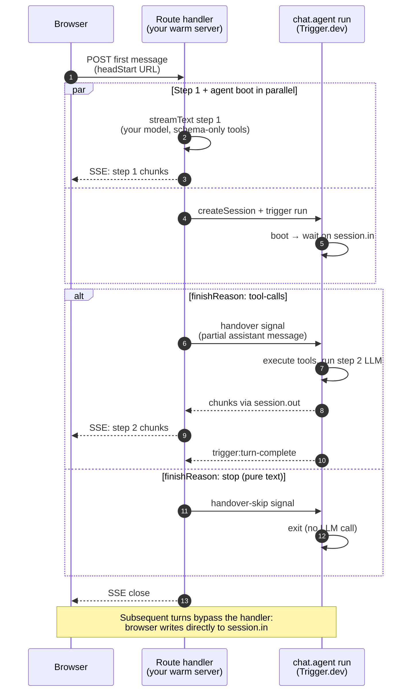

The first turn of a brand-new conversation pays for the chat.agent run's cold start: dequeue, process boot, `onPreload` / `onChatStart` hooks, and only then the LLM call. **Head Start** lets your warm server process — wherever you already handle HTTP requests — run that first LLM call directly while the agent run boots in parallel. The user sees one continuous turn: text first from your server, then a clean handover to the agent for tool execution and any further steps.

`chat.headStart` returns a standard [Web Fetch API](https://developer.mozilla.org/en-US/docs/Web/API/Fetch_API) handler — `(req: Request) => Promise<Response>` — so it slots into any runtime that speaks Web Fetch.

**Verified runtimes:** Node 18+, Bun, Deno, Cloudflare Workers, Vercel (Node and Edge), Netlify (Functions and Edge). The handler uses only `fetch` and Web `ReadableStream` / `TransformStream` — no `node:*` imports — and the S2 streaming dependency picks the right transport for each runtime automatically (HTTP/2 on Node/Deno, HTTP/1.1 on Bun/Workers/browsers).

**Compatible frameworks (native Web Fetch):** Next.js App Router, Hono, SvelteKit, Remix, React Router v7, TanStack Start, Astro, Nitro/Nuxt, Elysia. Mount the handler directly.

**Node-only frameworks (Express, Fastify, Koa):** the handler still works, but the framework gives you a Node `IncomingMessage` instead of a Web `Request`. Use a small adapter — examples in [Mounting in your framework](#mounting-in-your-framework) below.

When the first turn is pure text (no tool calls), the agent run boots and exits without ever calling an LLM. You only pay for what the conversation actually needed.

## When to use it

- **Use Head Start** when first-turn TTFC matters and your chat surface lives behind a warm process. Most production chat UIs fit.
- **Skip it** for browser-only chat surfaces (no warm server) or for chats where every turn is heavy and the cold start is amortized across many subsequent turns anyway.
- **Pair with [Preload](/ai-chat/features#preload)?** They solve different problems. Preload eagerly triggers the run on page load (good when you're confident the user *will* send a message). Head Start gates the run on a real first message arriving, with no idle compute. Pick one — running both for the same chat is wasted work.

## Measured TTFC

3 runs each, prompt `"say hi in five words"`, same model both sides (`claude-sonnet-4-6`):

| | Without Head Start | With Head Start | Δ |
| --- | --- | --- | --- |
| TTFT (avg) | 2801 ms | **1218 ms** | **−57%** |
| TTFT (range) | 2351–3101 ms | 1201–1252 ms | |
| Total turn | 4180 ms | 2345 ms | −44% |

With Head Start, time-to-first-text is essentially the LLM TTFB floor (50ms spread). Without it, agent boot + hooks stack before the LLM call, adding 750ms of variance.

## How it works



<Steps>
  <Step title="Browser POSTs the first message to your route handler">
    The transport sees `headStart: "/api/chat"` is set and there's no session yet for this chat. It POSTs the wire payload (messages, chatId, metadata) to your route handler.
  </Step>
  <Step title="Your handler creates the session and triggers the agent run">
    A single `apiClient.createSession` round-trip both creates the chat session and triggers an agent run with `trigger: "handover-prepare"`. The agent run boots into a wait state on `session.in`.
  </Step>
  <Step title="Your handler runs streamText step 1">
    `streamText` runs in your warm process with `stopWhen: stepCountIs(1)`. The output is streamed to the browser as SSE while the agent run boots in parallel. Boot time (~488ms) overlaps with LLM TTFB (~389ms) — fully hidden.
  </Step>
  <Step title="Mid-turn handover">
    On step 1's `tool-calls` finish, your handler signals the agent and the SDK splices the agent's step-2+ stream into the same SSE response. On pure-text finish, your handler signals `handover-skip` and the agent run exits clean — no LLM call from the trigger side.
  </Step>
  <Step title="Subsequent turns bypass the route handler">
    After turn 1, the transport hydrates the session PAT from response headers and writes turn 2 onward directly to `session.in`. Same direct-trigger path as a regular `chat.agent` setup.
  </Step>
</Steps>

## Setup

<Warning>
**Bundle isolation is the load-bearing constraint.** Head Start only saves time because your route-handler bundle stays lightweight. Anything you import in that handler — and anything those modules import transitively — lands in the bundle. If your tool catalog with heavy `execute` fns (E2B, Puppeteer, native bindings, the trigger SDK runtime, Turndown, image processing, `node:child_process`) ends up in the bundle, you've put cold-start back into a different process.

This is an **import-chain** problem, not a runtime one. A "we'll strip the executes at runtime" helper would not fix it — bundlers resolve imports at build time. The only correct shape is to keep schemas in their own module that imports `ai` and `zod` only.
</Warning>

<Steps>
  <Step title="Split your tool definitions into schemas + executes">
    Schemas in one module (light deps), executes in another (heavy deps). The agent task pulls in both; the route handler pulls in schemas only.

    ```ts lib/chat-tools/schemas.ts
    // ⚠️ This file MUST NOT import anything heavier than `ai` and `zod`.
    // Any import here lands in the route-handler bundle.
    import { tool } from "ai";
    import { z } from "zod";

    export const fetchPage = tool({
      description: "Fetch a URL and return text",
      inputSchema: z.object({ url: z.string().url() }),
      // No execute — agent task adds it elsewhere.
    });

    export const headStartTools = { fetchPage };
    ```

    ```ts trigger/chat-tools.ts
    // Heavy deps live here. Only the trigger task imports this module.
    import { tool } from "ai";
    import TurndownService from "turndown";
    import { fetchPage as fetchPageSchema } from "@/lib/chat-tools/schemas";

    const turndown = new TurndownService();

    export const fetchPage = tool({
      ...fetchPageSchema,
      execute: async ({ url }) => {
        const res = await fetch(url);
        return { body: turndown.turndown(await res.text()) };
      },
    });

    export const chatTools = { fetchPage };
    ```
  </Step>
  <Step title="Define your chat.agent (heavy executes)">
    The agent uses the full tool set — these are the executes that run when step 2+ needs them.

    ```ts trigger/chat.ts
    import { chat } from "@trigger.dev/sdk/ai";
    import { streamText, stepCountIs } from "ai";
    import { anthropic } from "@ai-sdk/anthropic";
    import { chatTools } from "./chat-tools";

    export const myChat = chat.agent({
      id: "my-chat",
      run: async ({ messages, signal }) =>
        streamText({
          ...chat.toStreamTextOptions({ tools: chatTools }),
          model: anthropic("claude-sonnet-4-6"),
          messages,
          stopWhen: stepCountIs(10),
          abortSignal: signal,
        }),
    });
    ```
  </Step>
  <Step title="Build the head-start handler">
    Call `chat.headStart({ agentId, run })`. It returns a standard Web Fetch handler: `(req: Request) => Promise<Response>`. Inside the `run` callback you call `streamText` yourself and spread `chat.toStreamTextOptions({ tools })` to inherit the SDK-owned wiring (messages, schema-only tools, `stopWhen: stepCountIs(1)`, abort signal). Add your own `model` and `system` on top.

    ```ts lib/chat-handler.ts
    import { chat } from "@trigger.dev/sdk/chat-server";
    import { streamText } from "ai";
    import { anthropic } from "@ai-sdk/anthropic";
    import { headStartTools } from "@/lib/chat-tools/schemas";

    export const chatHandler = chat.headStart({
      agentId: "my-chat",
      run: async ({ chat: helper }) =>
        streamText({
          ...helper.toStreamTextOptions({ tools: headStartTools }),
          model: anthropic("claude-sonnet-4-6"),
          system: "You are a helpful assistant.",
        }),
    });
    ```

    <Tip>
      Use the **same model** on both sides (route handler and `chat.agent`) to avoid a tone or style shift between step 1 and step 2+. Your LLM provider keys stay server-side in your warm process — Trigger.dev never holds them in this design.
    </Tip>

    Mount the handler in whatever framework you use — see [Mounting in your framework](#mounting-in-your-framework) below.
  </Step>
  <Step title="Opt in on the transport">
    Add `headStart: "/api/chat"` to `useTriggerChatTransport`. Subsequent turns bypass this URL automatically — `accessToken` and (optionally) `startSession` still run for the direct-trigger path on turn 2 onward.

    ```tsx components/chat.tsx
    const transport = useTriggerChatTransport<typeof myChat>({
      task: "my-chat",
      accessToken: ({ chatId }) => mintChatAccessToken(chatId),
      startSession: ({ chatId, taskId, clientData }) =>
        startChatSession({ chatId, taskId, clientData }),
      headStart: "/api/chat",
    });
    ```
  </Step>
</Steps>

## Mounting in your framework

`chat.headStart` returns a Web Fetch handler — `(req: Request) => Promise<Response>`. Frameworks that natively pass Web `Request` objects mount it as-is. Node-only frameworks (Express, Fastify, Koa) need a small adapter.

### Web Fetch frameworks (recommended)

<CodeGroup>

```ts Next.js (App Router)
// app/api/chat/route.ts
import { chatHandler } from "@/lib/chat-handler";

export const POST = chatHandler;
// Default function timeout on Vercel is 10s. Bump if your turns
// run long (multi-step tool use, slow models):
// export const maxDuration = 60;
```

```ts Hono
// src/index.ts
import { Hono } from "hono";
import { chatHandler } from "./chat-handler";

const app = new Hono();

app.post("/api/chat", (c) => chatHandler(c.req.raw));

export default app;
```

```ts SvelteKit
// src/routes/api/chat/+server.ts
import type { RequestHandler } from "./$types";
import { chatHandler } from "$lib/chat-handler";

export const POST: RequestHandler = ({ request }) => chatHandler(request);
```

```ts Remix / React Router v7
// app/routes/api.chat.ts
import type { ActionFunctionArgs } from "@remix-run/node";
import { chatHandler } from "~/lib/chat-handler";

export async function action({ request }: ActionFunctionArgs) {
  return chatHandler(request);
}
```

```ts TanStack Start
// app/routes/api/chat.ts
import { createAPIFileRoute } from "@tanstack/start/api";
import { chatHandler } from "~/lib/chat-handler";

export const Route = createAPIFileRoute("/api/chat")({
  POST: ({ request }) => chatHandler(request),
});
```

```ts Astro
// src/pages/api/chat.ts
import type { APIRoute } from "astro";
import { chatHandler } from "../../lib/chat-handler";

export const POST: APIRoute = ({ request }) => chatHandler(request);
```

```ts Nitro / Nuxt
// server/api/chat.post.ts
import { chatHandler } from "~/lib/chat-handler";

export default defineEventHandler((event) => chatHandler(toWebRequest(event)));
```

```ts Elysia
// src/index.ts
import { Elysia } from "elysia";
import { chatHandler } from "./chat-handler";

new Elysia()
  .post("/api/chat", ({ request }) => chatHandler(request))
  .listen(3000);
```

</CodeGroup>

### Edge / standalone runtimes

<CodeGroup>

```ts Cloudflare Workers
// src/index.ts
import { chatHandler } from "./chat-handler";

export default {
  async fetch(req: Request): Promise<Response> {
    const url = new URL(req.url);
    if (req.method === "POST" && url.pathname === "/api/chat") {
      return chatHandler(req);
    }
    return new Response("Not found", { status: 404 });
  },
};
```

```ts Bun (native server)
// server.ts
import { chatHandler } from "./chat-handler";

Bun.serve({
  port: 3000,
  async fetch(req) {
    const url = new URL(req.url);
    if (req.method === "POST" && url.pathname === "/api/chat") {
      return chatHandler(req);
    }
    return new Response("Not found", { status: 404 });
  },
});
```

```ts Deno (Deno.serve)
// server.ts
import { chatHandler } from "./chat-handler.ts";

Deno.serve({ port: 3000 }, async (req) => {
  const url = new URL(req.url);
  if (req.method === "POST" && url.pathname === "/api/chat") {
    return chatHandler(req);
  }
  return new Response("Not found", { status: 404 });
});
```

</CodeGroup>

### Node-only frameworks

Express, Fastify, and Koa pass Node `IncomingMessage` / `ServerResponse` objects rather than Web `Request` / `Response`. The SDK ships `chat.toNodeListener` that wraps any Web Fetch handler as a Node `(req, res)` listener — body bytes are read upfront, headers translated, the response body streamed chunk-by-chunk, and client disconnect is propagated to the handler via `AbortSignal`.

<CodeGroup>

```ts Express
import express from "express";
import { chat } from "@trigger.dev/sdk/chat-server";
import { chatHandler } from "./chat-handler";

const app = express();
app.post("/api/chat", chat.toNodeListener(chatHandler));
app.listen(3000);
```

```ts Fastify
import Fastify from "fastify";
import { chat } from "@trigger.dev/sdk/chat-server";
import { chatHandler } from "./chat-handler";

const fastify = Fastify();
const listener = chat.toNodeListener(chatHandler);

fastify.post("/api/chat", (req, reply) => {
  // Hand the raw Node request/response to the adapter and tell
  // Fastify we'll handle the response ourselves (no auto-reply).
  reply.hijack();
  return listener(req.raw, reply.raw);
});

fastify.listen({ port: 3000 });
```

```ts Koa
import Koa from "koa";
import Router from "@koa/router";
import { chat } from "@trigger.dev/sdk/chat-server";
import { chatHandler } from "./chat-handler";

const app = new Koa();
const router = new Router();
const listener = chat.toNodeListener(chatHandler);

router.post("/api/chat", async (ctx) => {
  ctx.respond = false; // Tell Koa not to send the response itself.
  await listener(ctx.req, ctx.res);
});

app.use(router.routes()).listen(3000);
```

```ts Raw node:http
import http from "node:http";
import { chat } from "@trigger.dev/sdk/chat-server";
import { chatHandler } from "./chat-handler";

const listener = chat.toNodeListener(chatHandler);

http
  .createServer((req, res) => {
    if (req.method === "POST" && req.url === "/api/chat") {
      return listener(req, res);
    }
    res.statusCode = 404;
    res.end();
  })
  .listen(3000);
```

</CodeGroup>

<Warning>
  Don't run `express.json()` (or any body-parsing middleware) before the head-start route — it consumes the request body before `chat.toNodeListener` can read the raw bytes. Either skip the parser for this route, or scope it to other routes.
</Warning>

### Streaming response timeouts

The handler keeps the SSE response open until the agent run signals turn-complete (or skip, on a pure-text turn). Make sure your framework / serverless function timeout accommodates that:

- **Pure-text first turns**: ~LLM TTFB (1–3 s typically).
- **Tool-calling first turns**: LLM step 1 + agent boot + tool execution + step 2 LLM call. Usually 5–15 s; longer for multi-step tool use.
- **Vercel**: default function timeout is 10 s on Hobby, 60 s on Pro. Set `export const maxDuration = N;` on the route segment.
- **Cloudflare Workers**: default 30 s CPU time (paid plans up to 5 min). Streaming wall time is generally not the bottleneck.
- **AWS Lambda behind API Gateway**: 29 s API Gateway hard limit; Lambda Function URL allows up to 15 min.

## What gets routed where

| | First turn (handover) | Subsequent turns |
| --- | --- | --- |
| Browser sends message via | POST to `headStart` URL | Direct write to `session.in` |
| Step 1 LLM call runs in | Your warm process | Trigger.dev agent run |
| Tool execution runs in | Trigger.dev agent run | Trigger.dev agent run |
| Step 2+ LLM call runs in | Trigger.dev agent run | Trigger.dev agent run |
| `onChatStart` / `onTurnStart` fire | After handover signal arrives | Normally |
| `onTurnComplete` fires | After turn finishes (handover) or skipped (handover-skip) | Normally |

## The `chat.headStart` API

```ts
chat.headStart<TTools>({
  agentId: string,                       // The chat.agent({ id }) you're handing off to
  run: (args: HeadStartRunArgs<TTools>) => Promise<StreamTextResult<any, any>>,
  idleTimeoutInSeconds?: number,         // How long the agent waits for the handover signal. Default: 60
}): (req: Request) => Promise<Response>
```

The `run` callback receives:

- `messages: UIMessage[]` — user messages parsed from the request body.
- `signal: AbortSignal` — fires when the request closes or the SDK times out the handover.
- `chat: HeadStartChatHelper<TTools>` — exposes `chat.toStreamTextOptions({ tools })` and a `chat.session` escape hatch for power users.

`chat.toStreamTextOptions({ tools })` returns options to spread into `streamText`. The SDK owns these keys — overriding them will break the protocol:

| Key | What the SDK sets | Why |
| --- | --- | --- |
| `messages` | `convertToModelMessages(uiMessages)` | First-turn user history |
| `tools` | What you pass | Schema-only tools for step 1 |
| `stopWhen` | `stepCountIs(1)` | Step 1 only — agent picks up step 2+ |
| `abortSignal` | Combined request + idle timeout | Safe cleanup on disconnect |

You bring `model`, `system`, `providerOptions`, `prepareStep`, anything else `streamText` accepts.

### The transport option

```ts
useTriggerChatTransport({
  // ... task, accessToken, startSession, ...
  headStart?: string,  // URL of your chat.headStart route handler
});
```

Optional. When set, the FIRST message of a brand-new chat (no existing session state) routes through this URL. Subsequent turns bypass it and use the direct-trigger path.

This is **not** a stock `useChat` `endpoint` — it's not the canonical request URL for every turn, just the first-turn shortcut.

## Limitations

- **First turn only.** Step 2+ and turn 2+ run on the trigger side. There's no per-turn "head start every turn" mode — the win comes from amortizing agent boot across the LLM call once.
- **Single step on the warm-server side.** The handler runs `stopWhen: stepCountIs(1)`. Multi-step handover (handler does step 1 + step 2 + ...) is out of scope.
- **Your server needs an LLM provider key.** The first-turn LLM call runs in your warm process, so that environment needs whatever keys the model requires. The agent's executes still run on the Trigger.dev side with whatever environment variables they need there.
- **Browser-only chat surfaces don't apply.** Without a warm server process, there's nowhere to run step 1 ahead of the agent run. Use Preload or eat the cold-start tax.
- **Streaming-capable runtime required.** Your framework / runtime has to support streaming HTTP responses (Web Fetch `Response` body or equivalent). Most modern hosts do — Next.js, Hono, SvelteKit, Workers, Bun, Deno, Vercel, etc. Some legacy platforms that buffer full responses won't deliver chunks until the turn is over, which negates the TTFC benefit (correctness still holds).
- **Non-`useChat` chat surfaces** (Slack bots, Discord bots, custom protocols) don't fit the `chat.headStart` shape — the API expects the AI SDK transport's wire payload on input. For those, trigger the chat.agent directly from your bot handler.

## Reference

- [`chat.headStart` factory and types](/ai-chat/reference) — full signatures for `HeadStartRunArgs`, `HeadStartChatHelper`, `HeadStartSession`, `HeadStartHandlerOptions`.
- [`headStart` transport option](/ai-chat/reference#triggerchattransport-options) — alongside `accessToken`, `startSession`, etc.
- [Preload](/ai-chat/features#preload) — eagerly triggering a run before the first message; the alternative cold-start mitigation.
