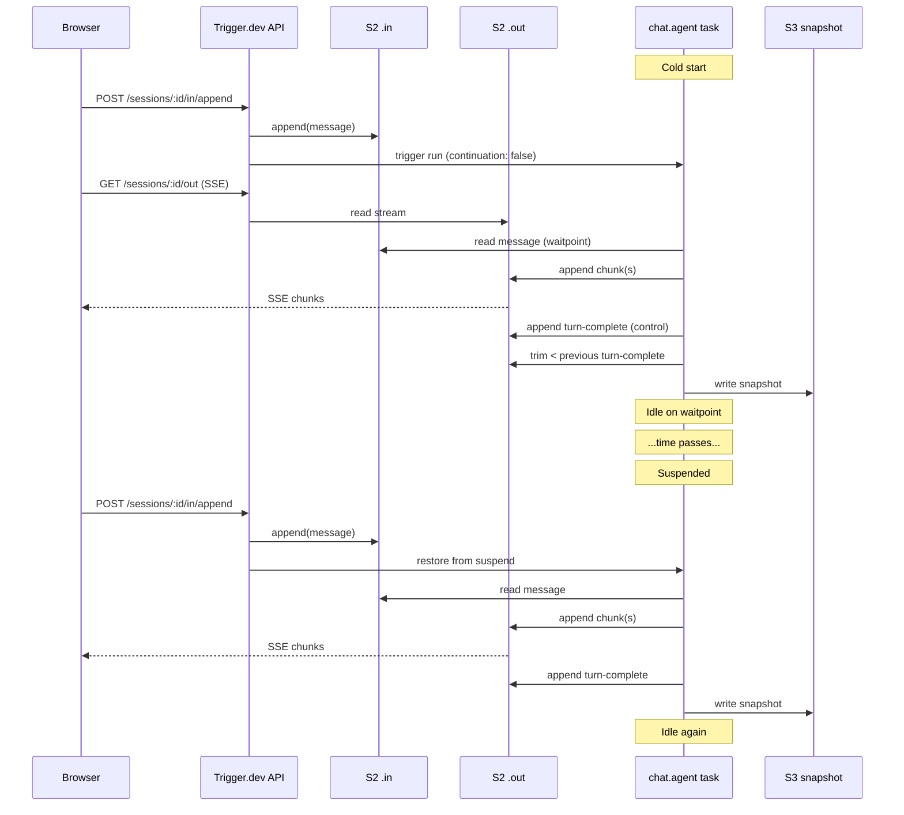

This page explains how `chat.agent` is put together, what each piece does on a single turn, and how a chat survives across turns. It is not an API tour — for that, see [Backend](/ai-chat/backend), [Frontend](/ai-chat/frontend), and the [Reference](/ai-chat/reference). For the byte-level wire format, see [Client Protocol](/ai-chat/client-protocol).

<Note>
**What you don't have to think about**: SSE reconnects, WebSocket backpressure, container cold starts, whether a worker is currently running, or how to re-deliver chunks the client missed during a reload. The platform handles those. **What you do have to think about**: idempotency in your `run()` function, and how much state you keep in memory between turns versus persist in your own database.
</Note>

## The primary noun: a chat session is a pair of streams and a task

A **chat session** is the unit chat.agent owns. It is three things bound together:

- An **inbox** channel called `.in` — every user message lands here as a record.
- An **outbox** channel called `.out` — every assistant chunk leaves through here.
- A long-lived **agent task** that reads from `.in` and writes to `.out`.

Both channels are S2 ([s2.dev](https://s2.dev)) durable append-only streams, keyed by the session. Think of them as a pair of per-session topics on a tiny Kafka: records have monotonically increasing sequence numbers, readers resume from a cursor, writers append to the tail. We chose S2 because reads are resumable from an offset — so a browser reload can replay the response stream without re-running the LLM, and a crashed run can rejoin mid-conversation by reading from where it left off.

A chat ID identifies the session for the lifetime of the conversation. The same session can be served by **many runs**: one run handles a turn (or several), goes idle, eventually exits, and the next user message triggers a fresh continuation run on the same session. Sessions are the durable identity; runs are the ephemeral compute.

## The lifecycle states

A run moves through a small state machine over its lifetime. Each state is named below, with the trigger that moves it to the next.

### Cold start

There is no run yet for this session. The frontend's first `sendMessage` posts to the session's `.in` channel; the server sees no live `currentRunId` and triggers a fresh `chat.agent` run with `continuation: false`. Moves to **Streaming** as soon as the task wakes and begins consuming `.in`.

### Streaming

The agent task is running. It reads the new message off `.in`, fires `onTurnStart`, runs your `run()` function, and pipes `streamText()` chunks onto `.out`. The browser is SSE-subscribed to `.out` and renders chunks as they land. When `streamText()` ends, the task writes a `trigger:turn-complete` control record (an S2 record with an empty body and a special header) and immediately trims `.out` back to the *previous* turn's completion marker — keeping the outbox bounded to roughly one turn of chunks at steady state. Moves to **Idle** after `onTurnComplete` runs and the post-turn snapshot is written.

### Idle (awaiting next message)

The turn is over. The task is alive but not doing work — it is parked in a waitpoint on `.in`, waiting for the next user message. If one arrives, it goes back to **Streaming** for the next turn. If `idleTimeoutInSeconds` (defaulting to a few minutes) passes with no new message, it moves to **Suspended**.

### Suspended

The task fires `onChatSuspend`, then the engine **checkpoints** the run's whole process state and frees the compute. The session is still live (the row exists, the `.out` stream is still readable, the chat ID still works), but no machine is dedicated to it. This is the same Checkpoint-Resume System that powers every Trigger.dev task — covered in detail at [How it works → Checkpoint-Resume](/how-it-works#the-checkpoint-resume-system). Moves to **Resuming** when the next message lands in `.in`.

### Resuming

The engine restores the suspended run from its checkpoint. The same JS process picks up exactly where it parked — `chat.local` values, the accumulator, in-flight promises, in-memory caches all preserved as they were. `onChatResume` fires immediately after the restore, then the task transitions to **Streaming**. No boot work, no snapshot read, no SDK reinitialization. This is the cheap path.

### Continuation (after exit)

If the run has fully exited (because it hit `maxTurns`, the customer called `chat.endRun()` or `chat.requestUpgrade()`, or it was cancelled or crashed), the next user message can't resume it — there is nothing to resume. Instead, the server triggers a brand-new run with `continuation: true`. The new run does a cold boot but reads the prior conversation's S3 snapshot and replays any `.out` chunks after the snapshot cursor, so the new run starts with the full message history already accumulated. Then it enters **Streaming** with `turn === 0` of the new run but `messageCount > 0`.

### Closed

`POST /api/v1/sessions/:id/close` flips `closedAt` on the session row. Future appends are rejected. Reads still work for transcript viewing. The session is terminal.

## One turn, end to end

Here is a typical cold turn — user opens the page, types "What's the weather?", reads the response — traced through every component.

<Steps>
  <Step title="Browser: useChat calls transport.sendMessages">
    The Vercel AI SDK's `useChat` hook serializes the user's message into the slim wire format: `{ chatId, trigger: "submit-message", message, metadata }`. Only the new message goes on the wire, not the full history.
  </Step>
  <Step title="Browser: transport posts to /append">
    The transport calls `POST /realtime/v1/sessions/:chatId/in/append`, authenticated with the session's public access token. The body is one S2 record.
  </Step>
  <Step title="Server: route ensures a run exists">
    The append route resolves the session, then calls `ensureRunForSession()`. The session's `currentRunId` is null (cold start), so it triggers a new `chat.agent` run on the project's dev/prod environment and atomically claims the slot via an optimistic version counter.
  </Step>
  <Step title="Server: route appends the record to S2 .in">
    The route writes the message to `s2://sessions/:chatId/in` as a single record. S2 assigns a sequence number. Any waitpoints registered on this channel fire, which would wake an existing run — but there is no run waiting yet, so this is a no-op for now.
  </Step>
  <Step title="Browser: transport opens an SSE subscription to .out">
    In parallel with the send, the transport opens `GET /realtime/v1/sessions/:chatId/out` (server-sent events). It passes its `lastEventId` if it has one cached; on a brand-new chat it does not. Any chunks the agent writes from now on will be delivered to this stream.
  </Step>
  <Step title="Task: agent run boots">
    The newly-triggered run starts. `onBoot` fires once per worker process. Because this is a fresh chat, no snapshot is read.
  </Step>
  <Step title="Task: enters the turn loop, reads the message from .in">
    The agent reads the pending record off `.in` via a waitpoint. `onChatStart` fires (once per chat lifetime). `onTurnStart` fires (every turn).
  </Step>
  <Step title="Task: runs your run() function, streams chunks to .out">
    Your code calls `streamText({ model, messages })`. Each `UIMessageChunk` it produces is appended to `s2://sessions/:chatId/out` as a record. The browser sees them arrive on the SSE stream and the AI SDK renders them.
  </Step>
  <Step title="Task: writes the turn-complete control record">
    When `streamText()` finishes, the agent writes a record with header `trigger:turn-complete` and an empty body. The browser transport sees this header and closes the per-turn readable stream.
  </Step>
  <Step title="Task: trims .out back to the previous turn-complete">
    Immediately after writing the new turn-complete marker, the agent issues an S2 trim command targeting the *previous* turn-complete's sequence number. This bounds the stream's storage to roughly one turn of chunks plus the latest control record.
  </Step>
  <Step title="Task: fires onTurnComplete, writes snapshot to S3">
    `onTurnComplete` runs (your hook for persistence). Then the agent writes `ChatSnapshotV1` — `{ version: 1, messages, lastOutEventId, lastOutTimestamp }` — to S3 at `sessions/:chatId/snapshot.json`. This write is awaited, not fire-and-forget, so the next run is guaranteed to find it.
  </Step>
  <Step title="Task: goes idle, then suspends">
    The agent re-enters the waitpoint on `.in`. After `idleTimeoutInSeconds` of nothing arriving, `onChatSuspend` fires and the engine snapshots the run. Compute is freed.
  </Step>
</Steps>

## Three layers of persistence

chat.agent survives idle gaps, deploys, refreshes, and crashes because three separate persistence mechanisms work at three different layers of the stack. They're orthogonal — each protects against a different failure mode, and conflating them is a common source of bugs.

### Layer 1: the engine checkpoint (compute)

When a run enters the Suspended state, the engine **checkpoints** the running process — its memory, CPU registers, and open file descriptors — and frees the compute. Today this is done via [CRIU](https://criu.org/) (Checkpoint/Restore in Userspace), the same mechanism that powers every Trigger.dev task's suspend/resume. On the new microVM compute runtime (currently in [private beta](/compute-private-beta)), it becomes a full Firecracker VM snapshot: every byte of memory plus filesystem state plus every kernel object inside the VM.

When the next message arrives, the engine **restores** the checkpoint. The same JS process picks up at the exact instruction it parked on. From your code's perspective, the line right after the `messagesInput.wait()` waitpoint just continues executing. Anything in process memory survives: `chat.local`, the message accumulator, in-flight Promises, in-memory caches, open DB connections. The runId is unchanged.

This is what lets you write `run()` as a single long-lived function with stateful closures, even though the underlying compute actually goes through checkpoint/restore cycles between turns. `onChatSuspend` fires immediately before the checkpoint; `onChatResume` fires immediately after the restore.

### Layer 2: the chat snapshot (S3)

After every turn the agent writes a `ChatSnapshotV1` blob to S3 — full accumulated `UIMessage[]` plus the current `lastOutEventId` cursor. This is chat-specific and lives one layer above the engine. It has nothing to do with CRIU or Firecracker.

The chat snapshot bridges run *boundaries*. If a run exits cleanly — because it hit `maxTurns`, called `chat.endRun()` or `chat.requestUpgrade()`, was cancelled, crashed, or got bumped to a new version after a deploy — the engine checkpoint is gone with it. When the next user message arrives, the server triggers a fresh run with `continuation: true`. That new run reads the S3 snapshot, replays any post-snapshot chunks from `.out`, merges by message ID, and starts its first turn with the full conversation history already in memory.

The chat snapshot carries only message history — not process memory. `chat.local`, in-memory caches, open connections all need to be reinitialized on a continuation. This is why `onBoot` (every fresh worker) is the right place to initialize `chat.local`, not `onChatStart` (only the very first turn of the chat). See [Persistence and replay](/ai-chat/patterns/persistence-and-replay) for the full snapshot model.

If your task registers a `hydrateMessages` hook, the chat snapshot is skipped entirely — your hook is the single source of truth for history.

### Layer 3: the `lastEventId` cursor (browser)

The transport stores `lastEventId` — the S2 sequence number of the most recent chunk it processed — in its session state. On page reload, it reopens the SSE stream with `Last-Event-ID: <cursor>` as a header. S2 resumes from that cursor; chunks the browser already saw are not redelivered. If the agent was mid-turn when the browser reloaded, the rest of the turn streams in. If the turn had already completed, the stream closes immediately via an `X-Session-Settled` header so the client doesn't long-poll for nothing.

Unlike the other two layers, this one is client-side. The server doesn't even need to know the browser refreshed — the agent run keeps running (or stays suspended) regardless.

### Which layer covers which failure mode

| What happened | Recovery layer | Same run? | In-memory state preserved? |
| --- | --- | --- | --- |
| Idle gap mid-conversation (suspend → resume) | Engine checkpoint | Yes | Yes |
| Run exited cleanly (`endRun`, `requestUpgrade`, `maxTurns`) | Chat snapshot | No (fresh continuation run) | No |
| Run crashed mid-turn (OOM, exception) | Chat snapshot + `.out` tail replay | (retried as a new attempt) | No |
| Browser tab reloaded mid-stream | `lastEventId` cursor on `.out` | (run unaffected) | (n/a) |
| Deploy rolled out a new version mid-chat | Chat snapshot, via `requestUpgrade` flow | No | No |

No single layer covers every case. The engine checkpoint alone can't survive a run exit (there's nothing to restore). The chat snapshot alone can't survive a tab refresh mid-turn (chunks already streamed would be lost). The `lastEventId` cursor alone can't bridge run boundaries (the new run wouldn't know the history). Together they cover every realistic failure.

## Warm vs cold: same chat, three different timings

Take the same conversation — "What's the weather?" then "What about tomorrow?" — and look at how each second turn lands.

**Warm second turn (within a few seconds).** The first turn finished, the agent is parked on the `.in` waitpoint, status is **Idle**. The new message hits `/append`, the waitpoint fires, the agent wakes inside the same run with all memory intact, runs `onTurnStart` for turn 2, streams the response. No checkpoint involved — the process never went to sleep. Latency to first chunk: dominated by the LLM, not the platform.

**Resumed second turn (a few minutes later).** The first turn finished and the agent suspended — the engine checkpoint is stored, compute is freed. The new message hits `/append`. The engine restores the checkpoint, fires `onChatResume`, and the task picks up exactly where it parked — all in-memory state preserved (`chat.local`, the accumulator, the lot). Latency to first chunk: the engine's restore overhead, then the LLM.

**Continuation second turn (an hour later, or after a deploy).** The first turn finished and the run eventually exited. The new message hits `/append`, the server triggers a fresh run with `continuation: true`. The new run boots cold, `onBoot` fires, the agent reads the S3 chat snapshot, replays the `.out` tail, then enters the turn loop with the full conversation already accumulated. The previous run's in-memory state is gone — anything in `chat.local` has to be re-initialized in `onBoot`. Latency to first chunk: cold start plus snapshot read, then the LLM.

All three look identical to the browser. Only the agent task knows which path it took, via `payload.continuation` and `ctx.attempt.number`.

## Lifecycle hooks: where you plug in

| Hook | When it fires | Typical use |
| --- | --- | --- |
| `onBoot` | Once per worker process, before any chat work | Initialize `chat.local` resources |
| `onPreload` | Once per chat lifetime, if the chat was preloaded before the first message | Warm caches, fetch the user's profile |
| `onChatStart` | Once per chat lifetime, on the first turn of a fresh chat (not on continuation) | First-message persistence, system-prompt setup |
| `onValidateMessages` | Every turn, before merging the incoming message | Reject or transform user input |
| `hydrateMessages` | Every turn, instead of snapshot+replay | Use your DB as the source of truth |
| `onTurnStart` | Every turn, before `run()` | Compact history, persist the user message |
| `onBeforeTurnComplete` | Every turn, after streaming, before the turn-complete record | Emit a final custom chunk |
| `onTurnComplete` | Every turn, after the turn-complete record is written | Persist the assistant message and `lastEventId` |
| `onChatSuspend` / `onChatResume` | At the idle → suspend / suspend → wake transitions | Release/reacquire expensive resources |

See [Lifecycle hooks](/ai-chat/lifecycle-hooks) for the full signatures and firing order.

## When chat.agent is the right primitive

**Good fit**:
- Multi-turn conversational agents where the user is expected to come back later.
- Long-running agent loops with tool calls, where a single turn can take a minute or more.
- Cases where you want page reloads to resume the in-flight response without re-running the model.
- Cases where you can't predict idle gaps — humans go to lunch.

**Not a good fit**:
- Single-shot completions where you don't need durability or resume. Call your model directly.
- Workflows where you control both ends and want a custom protocol. Use [`chat.task` and primitives](/ai-chat/backend#raw-task-with-primitives) directly without the `chat.agent` wrapper.
- High-fanout broadcasting (one source, many subscribers). Use Trigger.dev realtime streams against a regular task instead.

## Putting it together

## Where to go next

- [Quick start](/ai-chat/quick-start) — get a chat running in a few minutes.
- [Backend](/ai-chat/backend) — the `chat.agent()` API in detail.
- [Lifecycle hooks](/ai-chat/lifecycle-hooks) — every hook, what fires when.
- [Persistence and replay](/ai-chat/patterns/persistence-and-replay) — deeper on the snapshot model.
- [Client protocol](/ai-chat/client-protocol) — wire format if you're writing a custom transport.
