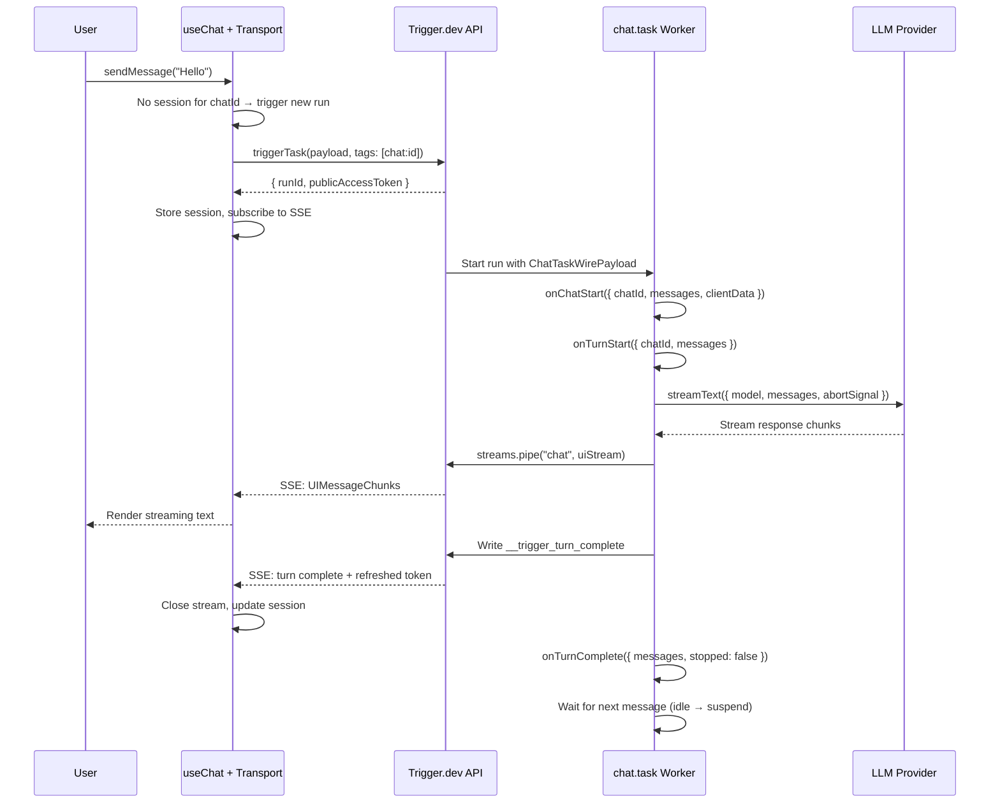
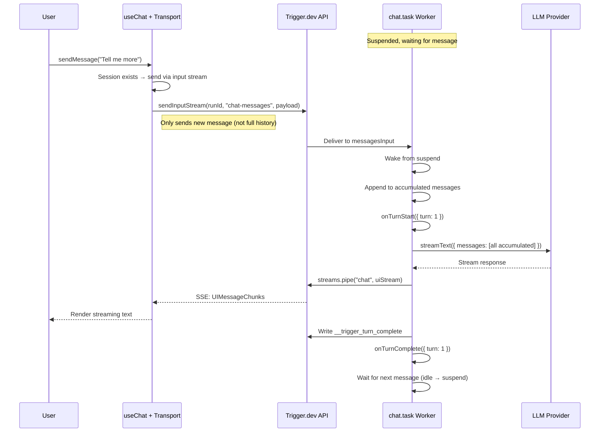

## Overview

The `@trigger.dev/sdk` provides a custom [ChatTransport](https://sdk.vercel.ai/docs/ai-sdk-ui/transport) for the Vercel AI SDK's `useChat` hook. This lets you run chat completions as **durable Trigger.dev tasks** instead of fragile API routes — with automatic retries, observability, and realtime streaming built in.

**How it works:**
1. The frontend sends messages via `useChat` through `TriggerChatTransport`
2. The first message triggers a Trigger.dev task; subsequent messages resume the **same run** via input streams
3. The task streams `UIMessageChunk` events back via Trigger.dev's realtime streams
4. The AI SDK's `useChat` processes the stream natively — text, tool calls, reasoning, etc.
5. Between turns, the run stays idle briefly then suspends (freeing compute) until the next message

No custom API routes needed. Your chat backend is a Trigger.dev task.

<Accordion title="How it works (sequence diagrams)">

### First message flow

### Multi-turn flow

### Stop signal flow

</Accordion>

<Note>
  Requires `@trigger.dev/sdk` version **4.4.0 or later** and the `ai` package **v5.0.0 or later**.
</Note>

## How multi-turn works

### One run, many turns

The entire conversation lives in a **single Trigger.dev run**. After each AI response, the run waits for the next message via input streams. The frontend transport handles this automatically — it triggers a new run for the first message, and sends subsequent messages to the existing run.

This means your conversation has full observability in the Trigger.dev dashboard: every turn is a span inside the same run.

### Warm and suspended states

After each turn, the run goes through two phases of waiting:

1. **Warm phase** (default 30s) — The run stays active and responds instantly to the next message. Uses compute.
2. **Suspended phase** (default up to 1h) — The run suspends, freeing compute. It wakes when the next message arrives. There's a brief delay as the run resumes.

If no message arrives within the turn timeout, the run ends gracefully. The next message from the frontend will automatically start a fresh run.

<Info>
  You are not charged for compute during the suspended phase. Only the idle phase uses compute resources.
</Info>

### What the backend accumulates

The backend automatically accumulates the full conversation history across turns. After the first turn, the frontend transport only sends the new user message — not the entire history. This is handled transparently by the transport and task.

The accumulated messages are available in:
- `run()` as `messages` (`ModelMessage[]`) — for passing to `streamText`
- `onTurnStart()` as `uiMessages` (`UIMessage[]`) — for persisting before streaming
- `onTurnComplete()` as `uiMessages` (`UIMessage[]`) — for persisting after the response

## Three approaches

There are three ways to build the backend, from most opinionated to most flexible:

| Approach | Use when | What you get |
|----------|----------|--------------|
| [chat.task()](/ai-chat/backend#chattask) | Most apps | Auto-piping, lifecycle hooks, message accumulation, stop handling |
| [chat.createSession()](/ai-chat/backend#chatcreatesession) | Need a loop but not hooks | Async iterator with per-turn helpers, message accumulation, stop handling |
| [Raw task + primitives](/ai-chat/backend#raw-task-with-primitives) | Full control | Manual control of every step — use `chat.messages`, `chat.createStopSignal()`, etc. |

## Related

- [Quick Start](/ai-chat/quick-start) — Get a working chat in 3 steps
- [Backend](/ai-chat/backend) — Backend approaches in detail
- [Frontend](/ai-chat/frontend) — Transport setup, sessions, client data
- [Features](/ai-chat/features) — Per-run data, deferred work, streaming, subtasks
- [API Reference](/ai-chat/reference) — Complete reference tables
