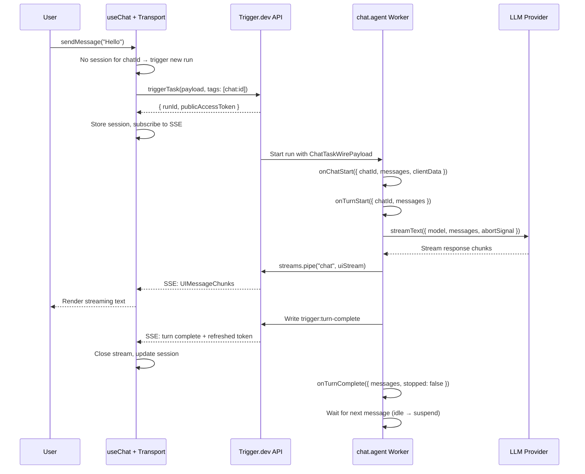
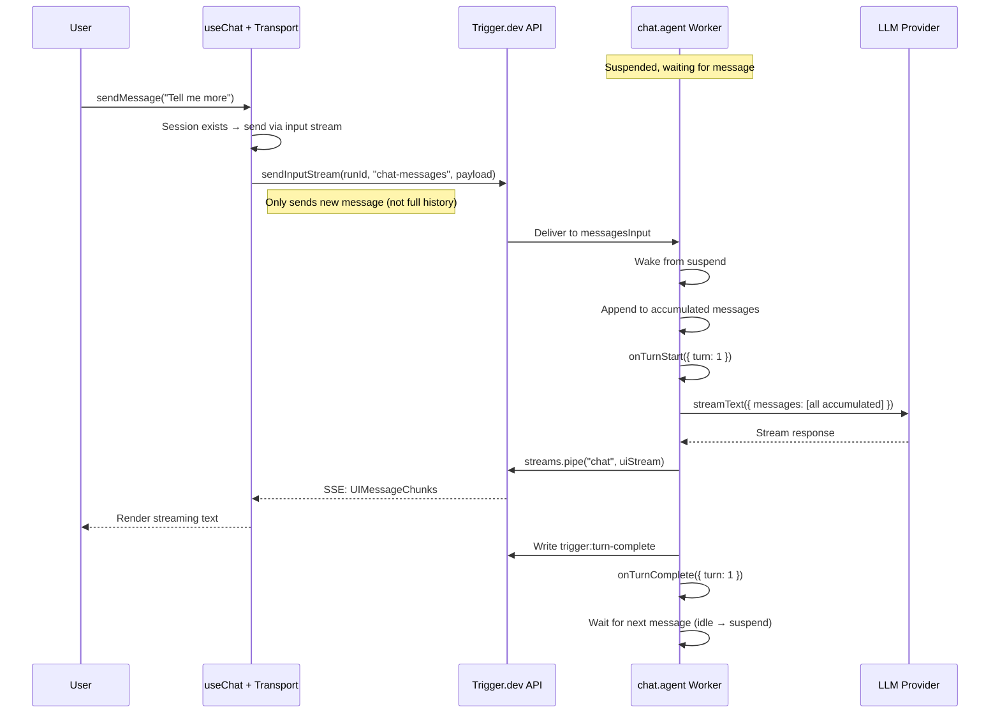
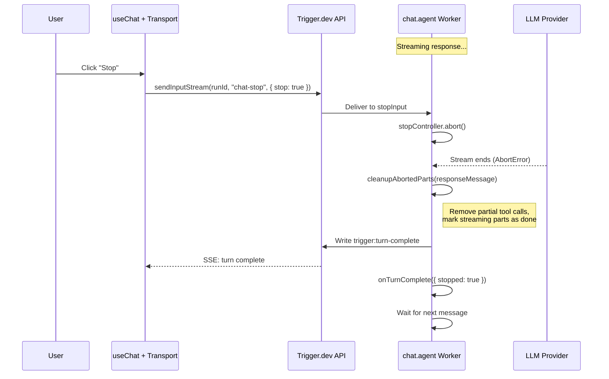

## Overview

The `@trigger.dev/sdk` provides a custom [ChatTransport](https://sdk.vercel.ai/docs/ai-sdk-ui/transport) for the Vercel AI SDK's `useChat` hook. This lets you run chat completions as **durable Trigger.dev agents** instead of fragile API routes — with automatic retries, observability, and realtime streaming built in.

**How it works:**
1. The frontend sends messages via `useChat` through `TriggerChatTransport`
2. The first message triggers a Trigger.dev agent; subsequent messages resume the **same run** via input streams
3. The agent streams `UIMessageChunk` events back via Trigger.dev's realtime streams
4. The AI SDK's `useChat` processes the stream natively — text, tool calls, reasoning, etc.
5. Between turns, the run stays idle briefly then suspends (freeing compute) until the next message

No custom API routes needed. Your chat backend is a Trigger.dev agent.

<Accordion title="How it works (sequence diagrams)">

### First message flow



### Multi-turn flow



### Stop signal flow



</Accordion>

<Note>
  Requires `@trigger.dev/sdk` version **4.4.0 or later** and the `ai` package **v5.0.0 or later**.
</Note>

## How multi-turn works

### One conversation, many runs

Each chat is backed by a durable Session row — the unit of state that owns the chat's runs across their full lifecycle. The conversation's identity stays keyed on `chatId` across run boundaries; messages flow through the session's `.in` channel; responses stream on `.out`.

Within a session, a single run handles many turns. After each AI response, the run waits for the next message via the session's `.in` channel. The frontend transport handles this automatically — triggers a new run on the session for the first message, and sends subsequent messages into the existing run.

Every turn is a span inside the same run in the Trigger.dev dashboard. The Agents dashboard view also lets you inspect the session directly — all runs that have ever touched it, filterable and resumable.

### Warm and suspended states

After each turn, the run goes through two phases of waiting:

1. **Warm phase** (default 30s) — The run stays active and responds instantly to the next message. Uses compute.
2. **Suspended phase** (default up to 1h) — The run suspends, freeing compute. It wakes when the next message arrives. There's a brief delay as the run resumes.

If no message arrives within the turn timeout, the run ends gracefully. The session stays open. The next message from the frontend automatically starts a fresh run **on the same session** — chat history and identity persist across the run boundary.

<Info>
  You are not charged for compute during the suspended phase. Only the idle phase uses compute resources.
</Info>

### Resume and inbox

Because the session outlives the run, a chat you were in yesterday resumes against the same session today — even after the original run has idle-timed out or crashed. Pass `resume: true` to `useChat` on page load and the transport reconnects via `sessionId` + `lastEventId`, kicking off a new run only if the user sends a message.

You can also enumerate every chat in your environment with `sessions.list`:

```ts
import { sessions } from "@trigger.dev/sdk";

for await (const s of sessions.list({ type: "chat.agent", tag: "user:user-456" })) {
  console.log(s.id, s.externalId, s.createdAt, s.closedAt);
}
```

This powers inbox-style UIs (your own chat list page) without maintaining a separate index.

### What the backend accumulates

The backend automatically accumulates the full conversation history across turns. After the first turn, the frontend transport only sends the new user message — not the entire history. This is handled transparently by the transport and agent.

The accumulated messages are available in:
- `run()` as `messages` (`ModelMessage[]`) — for passing to `streamText`
- `onTurnStart()` as `uiMessages` (`UIMessage[]`) — for persisting before streaming
- `onTurnComplete()` as `uiMessages` (`UIMessage[]`) — for persisting after the response

Agents appear in the **Agents** section of the dashboard (not Tasks) and can be tested via the **Playground**.

## Three approaches

There are three ways to build the backend, from most opinionated to most flexible:

| Approach | Use when | What you get |
|----------|----------|--------------|
| [chat.agent()](/ai-chat/backend#chatagent) | Most apps | Auto-piping, lifecycle hooks, message accumulation, stop handling |
| [chat.createSession()](/ai-chat/backend#chatcreatesession) | Need a loop but not hooks | Async iterator with per-turn helpers, message accumulation, stop handling |
| [Raw task + primitives](/ai-chat/backend#raw-task-with-primitives) | Full control | Manual control of every step — use `chat.messages`, `chat.createStopSignal()`, etc. |

## Related

- [Quick Start](/ai-chat/quick-start) — Get a working chat in 3 steps
- [Database persistence](/ai-chat/patterns/database-persistence) — Conversation + session state across hooks (ORM-agnostic)
- [Code execution sandbox](/ai-chat/patterns/code-sandbox) — Warm/teardown pattern for E2B (or similar) with `onWait` / `chat.local`
- [Backend](/ai-chat/backend) — Backend approaches in detail
- [Frontend](/ai-chat/frontend) — Transport setup, sessions, client data
- [Types](/ai-chat/types) — TypeScript patterns, including custom `UIMessage` with `chat.withUIMessage`
- [Features](/ai-chat/features) — Per-run data, deferred work, streaming, subtasks
- [API Reference](/ai-chat/reference) — Complete reference tables
