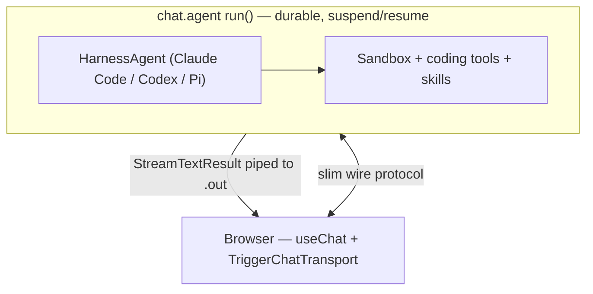

import RcBanner from "/snippets/ai-chat-rc-banner.mdx";

<RcBanner />

The Vercel AI SDK's [harness abstraction](https://ai-sdk.dev/v7/docs/ai-sdk-harnesses/overview) wraps a complete agent *runtime* — Claude Code, Codex, or Pi — behind one AI SDK surface. A `HarnessAgent` owns the things that live *above* a model call: workspace access, built-in coding tools, the runtime's native session state, compaction, and permission flows.

`chat.agent` owns something different: durability. One long-lived task per conversation, [three layers of persistence](/ai-chat/how-it-works#three-layers-of-persistence), suspend/resume across idle gaps, and a `useChat` transport with no API routes.

These compose. `HarnessAgent.stream()` returns a standard AI SDK [`StreamTextResult`](https://ai-sdk.dev/docs/reference/ai-sdk-core/stream-text), which is exactly what [`chat.agent`'s `run()`](/ai-chat/backend#simple-return-a-streamtextresult) already knows how to pipe. So you return the harness stream from `run()` and get both: the harness as the brain, `chat.agent` as the durable substrate around it.

<Note>
  **The two abstractions answer different questions.** The AI SDK harness answers *"which agent runtime runs the loop?"* — swap Claude Code for Codex without touching your UI. `chat.agent` answers *"where does the conversation live and how does it survive a refresh, deploy, or crash?"* Neither replaces the other.
</Note>

## Where each layer sits



- **`chat.agent`** keeps the conversation alive across turns, checkpoints the run between messages, and streams chunks to the browser over the durable `.out` channel.
- **`HarnessAgent`** runs *inside* one turn — it does the agentic loop, drives its sandbox, and emits an AI SDK stream.

<Warning>
  The AI SDK harness packages (`@ai-sdk/harness`, `@ai-sdk/harness-claude-code`) are **experimental** and ship in AI SDK 7. Treat the adapter configuration below as illustrative — check the [AI SDK harness docs](https://ai-sdk.dev/v7/docs/ai-sdk-harnesses/overview) for the current option names before copying verbatim. The integration *shape* — return `harness.stream(...)` from `run()` — is the stable part.
</Warning>

## Minimal example

A `chat.agent` whose `run()` delegates the turn to a Claude Code `HarnessAgent`. Because `.stream()` returns a `StreamTextResult`, returning it from `run()` is all the wiring you need.

```ts trigger/coding-agent.ts
import { chat } from "@trigger.dev/sdk/ai";
import { stepCountIs } from "ai";
import { HarnessAgent } from "@ai-sdk/harness/agent";
import { claudeCode } from "@ai-sdk/harness-claude-code";

const agent = new HarnessAgent({
  harness: claudeCode(),
  instructions: "You are a senior engineer. Make focused, well-tested changes.",
});

export const codingAgent = chat.agent({
  id: "coding-agent",
  run: async ({ messages, signal }) => {
    // HarnessAgent.stream() returns an AI SDK StreamTextResult,
    // so chat.agent pipes it to the frontend automatically.
    return agent.stream({
      ...chat.toStreamTextOptions(), // compaction, steering, telemetry, stored prompt
      messages,
      abortSignal: signal,
      stopWhen: stepCountIs(50), // coding loops run long — give the harness room
    });
  },
});
```

The frontend is unchanged from any other `chat.agent` — `useChat` over a `TriggerChatTransport`. See the [Quick Start](/ai-chat/quick-start) for the matching server actions and frontend component.

<Tip>
  Spread `chat.toStreamTextOptions()` first (see the [warning in Backend](/ai-chat/backend#simple-return-a-streamtextresult)). It wires up `prepareStep` for [compaction](/ai-chat/compaction), [steering](/ai-chat/pending-messages), and [background injection](/ai-chat/background-injection), and injects the system prompt from [`chat.prompt()`](/ai/prompts). Your explicit options (like `messages` and `stopWhen`) win on conflict.
</Tip>

## Swapping the harness

The whole point of the AI SDK harness abstraction is portability. Switch runtimes by changing one import and one factory call — `run()`, the transport, and the UI stay identical:

```ts
// Codex instead of Claude Code
import { codex } from "@ai-sdk/harness-codex";

const agent = new HarnessAgent({ harness: codex() });
```

## Why run a harness on chat.agent instead of standalone

A `HarnessAgent` on its own is ephemeral — it runs where you invoke it and stops when the call returns. It has no answer for the conversation outliving the process. That's the gap `chat.agent` fills:

| Concern | HarnessAgent alone | HarnessAgent inside `chat.agent` |
| --- | --- | --- |
| Multi-turn conversation memory | Runtime's native session, scoped to the process | Durable [Session](/ai-chat/sessions) keyed by `chatId`, survives run boundaries |
| User goes idle mid-task | Process must stay up | Run [suspends](/ai-chat/how-it-works#suspended); compute freed, in-memory state checkpointed |
| Page refresh mid-stream | Stream is lost | [`lastEventId` cursor](/ai-chat/how-it-works#layer-3-the-lasteventid-cursor-browser) replays `.out` — no re-run of the model |
| Deploy mid-conversation | Connection drops | [Version upgrade](/ai-chat/patterns/version-upgrades) flow migrates to the new code on the next turn |
| OOM / crash | Work lost | [Recovery boot](/ai-chat/patterns/recovery-boot) from the S3 snapshot + `.out` tail |
| Long-running coding loop (minutes) | Ties up a request | First-class — a turn can take as long as it needs |

A coding harness is *exactly* the workload that benefits: turns are long, sandboxes are expensive to warm, and humans wander off mid-task. `chat.agent` lets the harness's session persist while the compute parks between messages.

## Managing the sandbox across turns

If your harness warms an expensive sandbox, treat it like any other per-run resource — warm it in `onTurnStart`, dispose it in `onChatSuspend`. This is the same lifecycle the [code execution sandbox](/ai-chat/patterns/code-sandbox) pattern uses; the only difference is the harness owns the sandbox rather than a standalone `executeCode` tool.

```ts
export const codingAgent = chat.agent({
  id: "coding-agent",
  onChatSuspend: async ({ ctx }) => {
    // Tear down the harness's sandbox right before the run suspends,
    // so you're not paying for idle compute between messages.
    await disposeHarnessSandbox(ctx.run.id);
  },
  run: async ({ messages, signal }) => {
    return agent.stream({
      ...chat.toStreamTextOptions(),
      messages,
      abortSignal: signal,
      stopWhen: stepCountIs(50),
    });
  },
});
```

See [Code execution sandbox](/ai-chat/patterns/code-sandbox) for why `onChatSuspend` (not `onTurnComplete`) is the right teardown point.

## Harness vs. native chat.agent capabilities

A harness brings its *own* compaction, permission flows, and sub-agents. `chat.agent` also has [compaction](/ai-chat/compaction), [HITL tool approvals](/ai-chat/patterns/human-in-the-loop), and [sub-agents](/ai-chat/patterns/sub-agents). When you nest one inside the other, decide which layer owns each concern:

- **Let the harness own** what's intrinsic to its runtime: its built-in coding tools, its workspace/sandbox, its internal step loop.
- **Let `chat.agent` own** what's intrinsic to the conversation: durability, the `useChat` transport, persistence to your database via [`onTurnComplete`](/ai-chat/lifecycle-hooks), and dashboard observability.

Avoid double-compacting — if the harness compacts its own context, don't also enable `chat.agent` compaction over the same history. Pick the layer closest to the source of truth.

## When this is the right combination

**Good fit:**
- You want a Claude Code / Codex / Pi coding agent as a *persistent, multi-turn chat* your users return to.
- You want runtime portability (swap harnesses) without rebuilding durability each time.
- Turns are long and idle gaps are unpredictable.

**Reach for something simpler when:**
- It's a single-shot, fire-and-forget harness invocation with no conversation — call the `HarnessAgent` directly, no `chat.agent` needed.
- You don't need a harness at all — a plain `streamText` (or the AI SDK [`Agent`](https://ai-sdk.dev/docs/agents/overview) class) inside `run()` is lighter. See [Backend](/ai-chat/backend).

## See also

- [How it works](/ai-chat/how-it-works) — the durability model the harness runs on top of.
- [Code execution sandbox](/ai-chat/patterns/code-sandbox) — sandbox lifecycle with `chat.agent` hooks.
- [Sub-agents](/ai-chat/patterns/sub-agents) — delegate to other durable agents from a tool call.
- [Running Claude Code on Trigger.dev](/guides/ai-agents/claude-code-trigger) — the coding-harness-on-Trigger guide.
</content>
</invoke>
