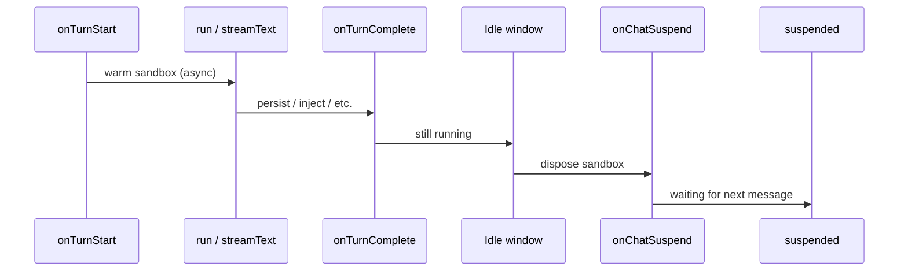

Use a **hosted code sandbox** (for example [E2B](https://e2b.dev)) when the model should run short scripts to analyze tool output (PostHog queries, CSV-like data, math) without executing arbitrary code on the Trigger worker host.

This page describes a **durable chat** pattern that fits `chat.agent()`:

- **Warm** the sandbox at the start of each turn (**non-blocking**).
- **Reuse** it for every `executeCode` tool call during that turn (and across turns in the same run if you keep the handle).
- **Dispose** it **right before the run suspends** waiting for the next user message — using the **`onChatSuspend`** hook, not `onTurnComplete`.


## Why not tear down in `onTurnComplete`?

After a turn finishes, the chat runtime still goes through an **idle** window and only then suspends. During that window the run is still executing — useful for `chat.defer()` work — and the run hasn't suspended yet.

The boundary you want for “turn done, about to sleep” is **`onChatSuspend`**, which fires right before the run transitions from idle to suspended. It provides the `phase` (`”preload”` or `”turn”`) and full chat context. See [onChatSuspend / onChatResume](/ai-chat/backend#onchatsuspend--onchatresume).



## Recommended provider: E2B

- **API key** auth — works from any Trigger.dev worker; no Vercel-only OIDC.
- **Code Interpreter** SDK (`@e2b/code-interpreter`): long-lived sandbox, `runCode()`, `kill()`.

Alternatives (Modal, Daytona, raw Docker) are fine but more DIY. Vercel’s sandbox + AI SDK helpers are a better fit when execution stays **on Vercel**, not on the Trigger worker.

## Implementation sketch

### 1. Run-scoped sandbox map

Keep a `Map<runId, Promise<Sandbox>>` (or similar) in a **task-only module** so your Next.js app never imports it.

### 2. `onTurnStart` — warm without blocking

```ts
onTurnStart: async ({ runId, ctx, ...rest }) => {
  warmCodeSandbox(runId); // fire-and-forget Sandbox.create()
  // ...persist messages, writer, etc.
},
```

### 3. `chat.local` — run id for tools

Tool `execute` functions do not receive hook payloads. Use [`chat.local()`](/ai-chat/features#per-run-data-with-chatlocal) to store the current run id for the sandbox key, **initialized from `onTurnStart`** (same `runId` as the map):

```ts
// In the same task module as your tools
import { chat } from "@trigger.dev/sdk/ai";

export const codeSandboxRun = chat.local<{ runId: string }>({ id: "codeSandboxRun" });

export function warmCodeSandbox(runId: string) {
  codeSandboxRun.init({ runId });
  // ...start Sandbox.create(), store promise in Map by runId
}
```

The **`executeCode`** tool reads `codeSandboxRun.runId` and awaits the sandbox promise before `runCode`.

### 4. `onChatSuspend` / `onComplete` — teardown

Use **`onChatSuspend`** to dispose the sandbox right before the run suspends, and **`onComplete`** as a safety net when the run ends entirely.

```ts
export const aiChat = chat.agent({
  id: "ai-chat",
  // ...
  onChatSuspend: async ({ phase, ctx }) => {
    await disposeCodeSandboxForRun(ctx.run.id);
  },
  onComplete: async ({ ctx }) => {
    await disposeCodeSandboxForRun(ctx.run.id);
  },
});
```

Unlike `onWait` (which fires for all wait types), `onChatSuspend` only fires at chat suspension points — no need to filter on `wait.type`. The `phase` discriminator tells you if this is a preload or post-turn suspension.

Optional **`onChatResume`**: log or reset flags; a fresh sandbox can be warmed again on the next **`onTurnStart`**.

### 5. AI SDK tool

Wrap the provider in a normal AI SDK `tool({ inputSchema, execute })` (same pattern as `webFetch`). Keep tool definitions in **task code**, not in the Next.js server bundle.

### 6. Environment

Set **`E2B_API_KEY`** (or your provider’s secret) on the **Trigger environment** for the worker — not in public client env.

## Typing `ctx`

Every `chat.agent` lifecycle event and the `run` payload include **`ctx`**: the same **[`TaskRunContext`](/ai-chat/reference#task-context-ctx)** shape as `task({ run: (payload, { ctx }) => ... })`.

```ts
import type { TaskRunContext } from "@trigger.dev/sdk";
```

The alias **`Context`** is also exported from `@trigger.dev/sdk` and is the same type.

## See also

- [Database persistence for chat](/ai-chat/patterns/database-persistence) — conversation + session rows, hooks, token renewal
- [Backend — Lifecycle hooks](/ai-chat/backend#lifecycle-hooks)
- [API Reference — `ctx` on events](/ai-chat/reference#task-context-ctx)
- [Per-run data with `chat.local`](/ai-chat/features#per-run-data-with-chatlocal)
