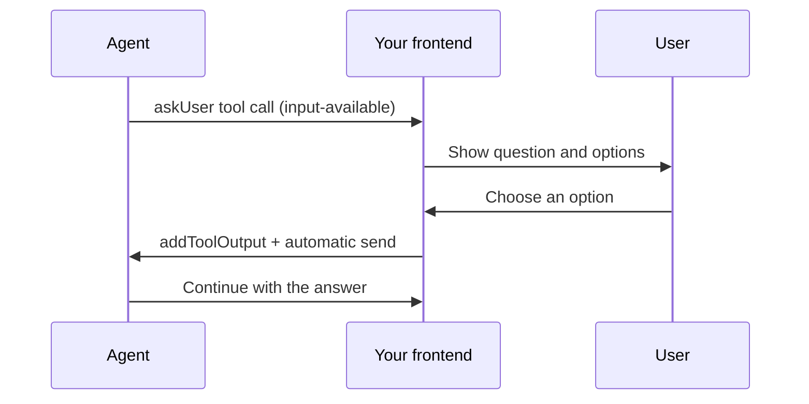

**A chat agent can wait for a user to supply a tool result or approve a tool before it runs.** Choose the pattern based on what the user needs to provide:

| User interaction | Tool definition | Frontend response |
| --- | --- | --- |
| Answer a question or choose a candidate | Omit `execute` | `addToolOutput` supplies the result |
| Approve or deny an action with known inputs | Set `needsApproval: true` and keep `execute` | `addToolApprovalResponse` authorizes or denies execution |

The examples below use AI SDK 6 or later and build on the [Quick start](/ai-chat/quick-start), including its session and token server actions. For approve/deny buttons, see [Approve a tool before execution](#approve-a-tool-before-execution).

## How it works

When the model calls a tool without `execute`, `streamText` finishes with a pending tool call. Your frontend renders the question. Calling `addToolOutput` supplies the answer, and `sendAutomaticallyWhen` starts the next turn.



The assistant message keeps its ID across the pause. After resuming, `onTurnComplete` receives the full merged `responseMessage`, including the question, tool result, and follow-up text.

## Duration and cost while paused

After the turn finishes, the run stays active for `idleTimeoutInSeconds` (30 seconds by default), then suspends and releases compute. Set it to `0` to suspend immediately. The active idle window counts toward compute usage and [`maxDuration`](/runs/max-duration); suspended time doesn't.

[`turnTimeout`](/ai-chat/reference#chatagent) controls how long a run waits for the next message (default `"1h"`). When it expires, the run ends. A later answer starts a continuation run that restores the conversation from [transcript storage](/ai-chat/transcript-storage). Raising `maxDuration` isn't necessary for time spent suspended.

## Backend: define the tool

Define an `inputSchema` for the question and omit `execute` so the frontend can supply the answer. When the model calls `askUser`, `streamText` returns control to your agent.

```ts trigger/my-chat.ts
import { chat, type InferChatUIMessageFromTools } from "@trigger.dev/sdk/ai";
import { tool, stepCountIs } from "ai";
import { anthropic } from "@ai-sdk/anthropic";
import { z } from "zod";

const askUser = tool({
  description:
    "Ask the user a clarifying question when you need their input. " +
    "Present 2-4 options for them to pick from.",
  inputSchema: z.object({
    question: z.string(),
    options: z
      .array(
        z.object({
          id: z.string(),
          label: z.string(),
          description: z.string().optional(),
        })
      )
      .min(2)
      .max(4),
  }),
  outputSchema: z.object({ optionId: z.string(), label: z.string() }),
  // The frontend supplies the result with addToolOutput.
});

const tools = { askUser };
export type ChatMessage = InferChatUIMessageFromTools<typeof tools>;

export const myChat = chat.withUIMessage<ChatMessage>().agent({
  id: "my-chat",
  tools,
  run: async ({ messages, tools, signal, streamText }) => {
    return streamText({
      model: anthropic("claude-sonnet-4-5"),
      messages,
      tools,
      abortSignal: signal,
      stopWhen: stepCountIs(15),
    });
  },
});
```

Declaring `tools` on the config (and reading them back from the payload) is the recommended shape for any agent with tools. See [Tools](/ai-chat/tools).

## Frontend: render the question and collect the answer

Render the question when its tool part reaches `input-available`. Use the AI SDK's [`lastAssistantMessageIsCompleteWithToolCalls`](https://ai-sdk.dev/docs/ai-sdk-ui/chatbot-tool-usage) helper to submit the answer automatically once every pending tool call has a result.

```tsx app/components/chat.tsx
"use client";

import { useChat } from "@ai-sdk/react";
import { lastAssistantMessageIsCompleteWithToolCalls } from "ai";
import { useTriggerChatTransport } from "@trigger.dev/sdk/chat/react";
import { mintChatAccessToken, startChatSession } from "@/app/actions";
import type { ChatMessage, myChat } from "@/trigger/my-chat";

export function ChatView({ chatId }: { chatId: string }) {
  const transport = useTriggerChatTransport<typeof myChat>({
    task: "my-chat",
    accessToken: ({ chatId }) => mintChatAccessToken(chatId),
    startSession: ({ chatId, clientData }) =>
      startChatSession({ chatId, clientData }),
  });
  const { messages, sendMessage, addToolOutput, status } = useChat<ChatMessage>({
    id: chatId,
    transport,
    sendAutomaticallyWhen: lastAssistantMessageIsCompleteWithToolCalls,
  });
  const busy = status === "submitted" || status === "streaming";

  return (
    <>
      {messages.map((message) => (
        <div key={message.id}>
          {message.parts.map((part, i) => {
            if (part.type === "tool-askUser" && part.state === "input-available") {
              return (
                <fieldset key={part.toolCallId} disabled={busy}>
                  <legend>{part.input.question}</legend>
                  {part.input.options.map((option) => (
                    <button
                      key={option.id}
                      type="button"
                      onClick={() =>
                        addToolOutput({
                          tool: "askUser",
                          toolCallId: part.toolCallId,
                          output: { optionId: option.id, label: option.label },
                        })
                      }
                    >
                      {option.label}
                      {option.description && <span> {option.description}</span>}
                    </button>
                  ))}
                </fieldset>
              );
            }
            if (part.type === "text") return <p key={i}>{part.text}</p>;
            return null;
          })}
        </div>
      ))}
      <button disabled={busy} onClick={() => sendMessage({ text: "Help me choose a database." })}>
        Start a conversation
      </button>
    </>
  );
}
```

`addToolOutput` patches the assistant message locally with `state: "output-available"` and fills in `output`. `lastAssistantMessageIsCompleteWithToolCalls` detects that every pending tool call now has a result, and `useChat` fires a new `sendMessage`. The backend picks it up as the next turn.

## Choose from tool results

When a tool returns several candidates, run the search first, then ask the user to choose one before taking action. For example, a search might find several matching contacts, files, or brands.

Keep the search, selection, and action as separate tool calls:

1. A search tool with `execute` returns candidates and saves them under a `searchId`.
2. A selection tool without `execute` asks the frontend to show those candidates.
3. An action tool with `execute` uses the selected ID after checking it on the server.

```ts trigger/tools/select-result.ts
import { tool } from "ai";
import { z } from "zod";

export const selectResult = tool({
  description:
    "Ask the user to choose from a completed search. " +
    "Copy searchId from the search result and wait for their answer.",
  inputSchema: z.object({ searchId: z.string() }),
  outputSchema: z.object({ selectedId: z.string().nullable() }),
});
```

Render this tool's `input-available` part using the same approach as `askUser` above. Load the candidates from the saved search, display their original labels, and call `addToolOutput` with the selected ID. Return `{ selectedId: null }` for a "None of these" option. If a search has no results, ask for a different query before requesting a selection.

Save search results durably and scope them to the authorized conversation so the picker still works after a reload or continuation. Use stable candidate IDs; names can be ambiguous.

Before executing the action, read the completed selection from `chat.history`, validate its output, and check that the requested ID matches the user's answer and belongs to that saved search. A null answer must prevent the action. Enforce these checks in server code; tool descriptions alone don't enforce the choice.

Use the selection's `toolCallId`, scoped to the chat, as the action's idempotency key. That keeps retries of the same choice from creating duplicate work, even if the model makes another action call. If the next step must be the action, use `prepareStep` to set `toolChoice` on the first model step after a valid selection.

You can also require approval on the action tool. The selection supplies an input; the approval confirms whether to execute with that input.

## Approve a tool before execution

With **AI SDK 6 or later**, set `needsApproval: true` on a tool that has an `execute` function. The SDK requests approval before calling `execute`. Approving the call runs it on the next turn; denying it skips execution.

```ts trigger/tools/send-email.ts
import { tool } from "ai";
import { z } from "zod";
import { sendEmail } from "@/lib/email";

export const sendEmailTool = tool({
  description: "Send an email after the user approves.",
  inputSchema: z.object({ to: z.string(), subject: z.string(), body: z.string() }),
  needsApproval: true,
  execute: async (input) => sendEmail(input),
});
```

`sendEmail` is your application's email function. Keep authorization and idempotency checks there. Declare the tool on the agent and pass it to the `streamText` supplied to `run`, as in the question example.

On the frontend, render approve/deny buttons for `approval-requested` parts. Call `addToolApprovalResponse` with `part.approval.id` and the `approved` boolean, and use `lastAssistantMessageIsCompleteWithApprovalResponses` for automatic submission. The [frontend approval example](/ai-chat/frontend#tool-approvals) shows the full wiring.

For conditional approval, [`needsApproval` also accepts a function](https://ai-sdk.dev/docs/ai-sdk-core/tools-and-tool-calling#dynamic-approval) that checks the tool input. Approval happens before `execute`, so a tool that searches inside `execute` can't use that approval prompt to display its search results. Run the search first, collect the selection, then call the action tool.

If your agent uses both questions and approvals, combine the helpers:

```ts app/components/chat.tsx
import {
  lastAssistantMessageIsCompleteWithApprovalResponses,
  lastAssistantMessageIsCompleteWithToolCalls,
  type UIMessage,
} from "ai";

export function sendAutomaticallyWhen({ messages }: { messages: UIMessage[] }) {
  return (
    lastAssistantMessageIsCompleteWithToolCalls({ messages }) ||
    lastAssistantMessageIsCompleteWithApprovalResponses({ messages })
  );
}
```

## Detecting a paused turn in `onTurnComplete`

Use `chat.history.getPendingToolCalls()` to find unanswered tool calls on the latest assistant message:

```ts trigger/my-chat.ts
onTurnComplete: async ({ stopped }) => {
  if (stopped) return;
  const pending = chat.history.getPendingToolCalls();
  if (pending.length > 0) {
    console.log("Waiting for user input", pending);
  }
},
```

Each entry contains `toolCallId`, `toolName`, and `messageId`. Approval requests use a separate state: inspect `responseMessage.parts` for `approval-requested` when tracking approvals.

`finishReason === "tool-calls"` describes why the model stopped. It can also occur when a step limit ends a loop of server-executed tools, so check the tool states before treating it as a human pause. Check `stopped` separately for interrupted turns.

### Acting once per net-new tool result

`chat.history.extractNewToolResults(message)` returns resolved tool parts whose `toolCallId` isn't already resolved in the current history. Call it before the incoming message is merged. By `onTurnComplete`, the result is already in history and the helper returns `[]`.

This filters results against the current transcript; durable side effects still need an idempotency key. Use `chatId` and `toolCallId` to deduplicate a sync or audit write across retries. See [Tool result auditing](/ai-chat/patterns/tool-result-auditing) for existing `hydrateMessages` integrations.

## Persistence: one message vs one record per pause

The default [transcript storage](/ai-chat/transcript-storage) saves the pending call and its resolved result. Use a storage adapter if you need the conversation in your own database.

The pause and continuation share the assistant message ID. Upsert by `message.id` so the resolved message replaces the pending version. For an audit trail, keep separate snapshots alongside that canonical message and record whether it has pending questions, approval requests, or a stopped response.

## Multi-pause turns

A conversation can ask another question after receiving an answer. Each pause and continuation fires `onTurnComplete`; inspect the message's tool states at each callback. The merged assistant message includes the answers collected so far.

## Verify the flow

Send a request that needs clarification. Confirm that the question appears, choose an option, and check that the agent continues without another click on Send. The question's tool part should change from `input-available` to `output-available`.

For a selection from search results, check that only the selected item is used. Choosing "None of these" must leave the action unexecuted. Reload a pending selection and confirm that the same candidates appear.

For an approval tool, deny the first request and confirm that `execute` doesn't run. Approve a fresh request and confirm that it runs with the displayed inputs.

## Common mistakes

- Give question tools no `execute` function. For tools that execute after approval, keep `execute` and set `needsApproval`.
- `addToolOutput` updates local state. Configure `sendAutomaticallyWhen` or explicitly send the updated message to start the next turn.
- Only show interactive controls for pending calls, and disable them while a request is streaming or submitted.
- To add custom response parts, use `chat.response.append()` in `onBeforeTurnComplete` while the stream is open. Treat `responseMessage` in `onTurnComplete` as a snapshot.
