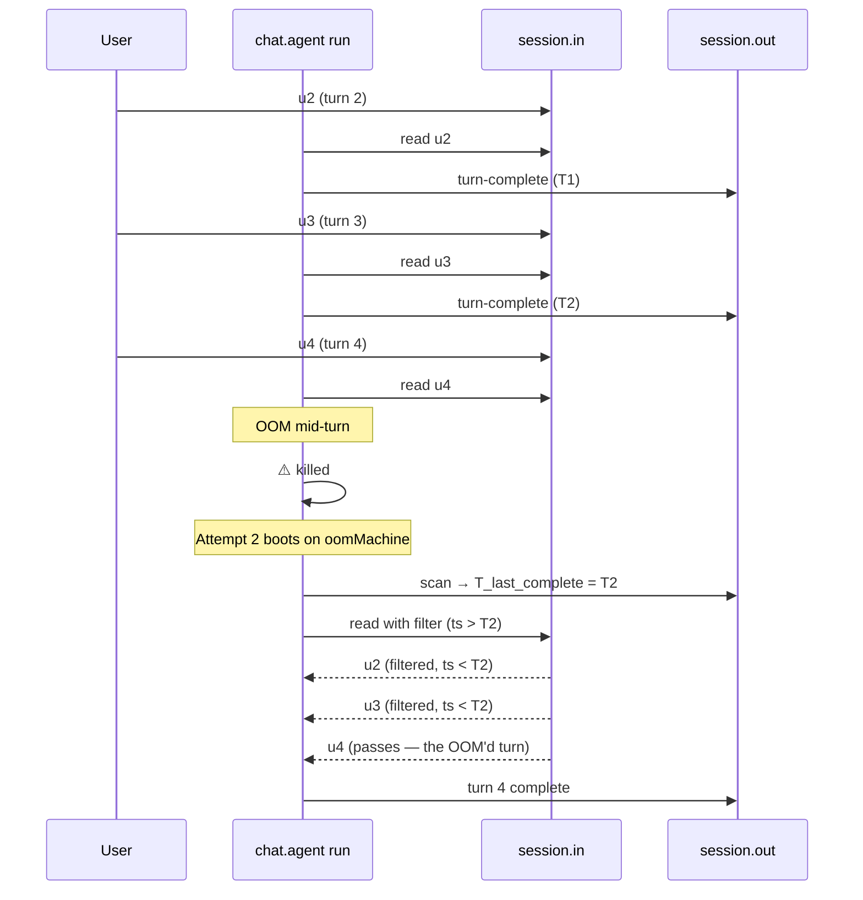

When a `chat.agent` turn runs out of memory, the worker process dies and everything in it is gone: the in-flight LLM call, the accumulator, any tool execution mid-flight. By default, Trigger.dev surfaces the OOM as a run failure.

Setting `oomMachine` opts the agent into automatic recovery: the failed turn re-runs on a larger machine, picks up the user message that triggered the OOM (without re-processing earlier completed turns), and produces a normal response.

## Setup

```ts
import { chat } from "@trigger.dev/sdk/ai";

export const myChat = chat.agent({
  id: "my-chat",
  machine: "small-1x",         // default machine
  oomMachine: "medium-2x",     // fallback on OOM
  run: async ({ messages, signal }) =>
    streamText({ model, messages, abortSignal: signal }),
});
```

That's the entire opt-in. With `oomMachine` set, the agent gets:

- **`retry.maxAttempts: 2`** internally — one retry for OOM only; non-OOM errors don't retry.
- **`retry.outOfMemory.machine: oomMachine`** — the fresh attempt boots on the larger machine.
- **`session.in` cursor recovery** — the new attempt skips records belonging to turns that already completed on the prior attempt and only re-runs the OOM'd turn.

`chat.agent` does not expose generic `retry` options. OOM recovery is the only retry path because retrying an LLM-driven loop on non-OOM errors tends to be expensive and side-effecting. Drop down to `chat.task` (the raw primitive) if you need richer retry semantics.

## How recovery works

The recovery doesn't need any customer-side persistence to avoid duplicate processing. It uses two pieces of durable state Trigger already maintains for every chat:

- **`session.out`** — the durable response stream. Every successful turn writes a `trigger:turn-complete` chunk here.
- **`session.in`** — the durable input stream. Every user message after the first turn lands here as a record with a server-assigned timestamp.

On retry boot, the SDK:

1. Scans `session.out` for the latest `trigger:turn-complete` chunk and reads its timestamp. Call this `T_last_complete`.
2. Sets a per-stream filter on `session.in` so any record with `timestamp <= T_last_complete` is dropped before it reaches the turn loop.
3. Begins normal processing. The first record that passes the filter is the message that triggered the OOM (or any newer message that arrived during the retry window).

Result: turns 1..N-1 are not re-processed, turn N runs on the larger machine, and the conversation continues.



The scan on `session.out` is streaming and bounded in memory: each chunk is inspected and discarded one at a time, so a long-running chat doesn't bloat the retry-boot worker. Bandwidth scales linearly with `session.out` size, but only on the OOM-retry path — a rare event.

## With `hydrateMessages`

If your agent uses [`hydrateMessages`](/ai-chat/lifecycle-hooks#hydratemessages) to load the durable conversation history per turn, the OOM'd turn re-runs against the full prior accumulator: the model sees `[u1, a1, u2, a2, ..., u_N]` and responds in context. This is the recommended pattern for production chats.

## Without `hydrateMessages`

The retry filter still prevents duplicate processing — turns 1..N-1 aren't re-run — but the OOM'd turn's accumulator is whatever the chat.agent's default flow can rebuild from `payload.messages` (typically just the first user message of the chat). The model context is **incomplete**: it doesn't see prior assistant responses. The conversation continues but a multi-turn OOM'd recovery may produce a less coherent reply.

If conversation continuity matters, use `hydrateMessages`.

## Tool execute idempotency

If an OOM hits mid-tool-execution, the new attempt re-runs the entire turn — including the tool call. Make tool `execute` functions idempotent or checkpoint their progress externally. Trigger doesn't roll back side effects automatically.

```ts
import { tool } from "ai";

export const sendEmail = tool({
  description: "Send an email",
  inputSchema: z.object({ to: z.string(), idempotencyKey: z.string() }),
  execute: async ({ to, idempotencyKey }) => {
    // Stripe-style: dedupe at the side-effect layer with a customer-supplied key.
    return await mailer.send({ to, idempotencyKey });
  },
});
```

## Limitations

- **One OOM retry per run.** `chat.agent` sets `maxAttempts: 2`. If attempt 2 also OOMs, the run fails. Use a sufficiently large `oomMachine` to avoid this.
- **Single fallback tier.** Only one `oomMachine`. There's no "tiered retry" (small → medium → large). If you need that, drop down to `chat.task` and configure `retry` directly.
- **Non-OOM errors don't retry.** Schema errors, model-call rejections, tool throws, etc. fail the run as before. Out-of-memory is the only retry trigger.
- **Tools mid-execution are not checkpointed.** A partially-run tool re-runs from scratch on the new attempt. Make them idempotent.

## See also

- [Lifecycle hooks](/ai-chat/lifecycle-hooks) — `onChatResume` fires on every retry attempt with `phase: "preload"` or `"turn"`
- [Database persistence](/ai-chat/patterns/database-persistence) — the `hydrateMessages` pattern this builds on for full continuity
