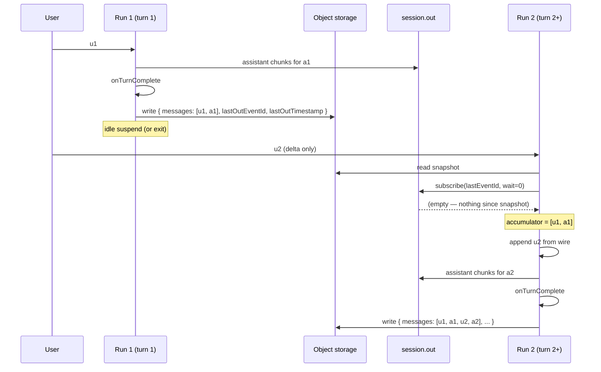

import RcBanner from "/snippets/ai-chat-rc-banner.mdx";

<RcBanner />

`chat.agent` runs are processes — they boot, stream a turn, and either suspend (waiting for the next message) or exit. When the next message arrives at a session whose previous run already exited, a **fresh** run boots with no in-memory state. Something has to rebuild the conversation history before that turn can produce a coherent response.

This page walks through the **snapshot + replay** model the runtime uses by default, and the [`hydrateMessages`](/ai-chat/lifecycle-hooks#hydratemessages) short-circuit that turns the whole thing off when the customer owns history.

## Why a snapshot at all

The wire is delta-only: each `.in/append` carries at most one new `UIMessage` (see [Client Protocol](/ai-chat/client-protocol#chattaskwirepayload)). A long conversation might be 50 turns deep with megabytes of tool results — the wire never carries that. So when run #2 boots to handle turn 51, the wire alone tells it almost nothing about turns 1–50.

Two existing pieces of durable state already capture everything that happened:

- **`session.in`** — every user message and tool-approval response ever sent.
- **`session.out`** — every assistant token, tool call, and tool result the agent emitted, ordered.

Replaying `session.out` from the beginning is correct but expensive — bandwidth scales with chat length, and parsing N megabytes of streamed chunks at every boot adds latency. So the runtime writes a **snapshot** after every turn and reads it on the next boot. Replay only covers the gap between the snapshot's cursor and now.

## The model end-to-end



### Run 1 — first turn

The accumulator starts empty. The wire delivers `u1`. After the model finishes, `onTurnComplete` fires, then the runtime serializes the full accumulator and writes:

```json
{
  "version": 1,
  "savedAt": 1715180400000,
  "messages": [u1, a1],
  "lastOutEventId": "42",
  "lastOutTimestamp": 1715180399000
}
```

The key is `packets/{projectRef}/{envSlug}/sessions/{sessionId}/snapshot.json` — overwritten every turn, never appended. The write is **awaited**, not fire-and-forget — if the run idle-suspends immediately after, in-flight promises don't reliably complete and the snapshot would be lost.

### Run 2 — boot

A new run boots when the user sends `u2`. Run 1 has long since exited. Run 2 has no in-memory state. The boot sequence:

<Steps>
  <Step title="Read the snapshot">
    GET the JSON blob. On 404 (no snapshot yet — first-ever turn) or read error or version mismatch, treat as empty and continue. Snapshot misses are non-fatal — replay alone may still be sufficient.
  </Step>
  <Step title="Replay session.out tail">
    Subscribe to `session.out` with `wait=0` starting from `snapshot.lastOutEventId`. Drain whatever's there and close. Returns:
    - **Settled messages** — closed assistant turns past the snapshot cursor (the chunks of a turn that completed after the snapshot was written but before the run exited cleanly).
    - **A partial assistant** — the trailing message if its stream never received a `finish` chunk. The dead run was mid-response when it died. `cleanupAbortedParts` has already stripped streaming-in-progress fragments.

    In the steady state this returns empty. In recovery, it returns whatever the dead run was in the middle of.
  </Step>
  <Step title="Replay session.in tail">
    GET `session.in` records past the last `turn-complete`'s `session-in-event-id` cursor. Returns the user messages the dead run hadn't acknowledged — typically the message that triggered the cancelled / crashed turn, plus anything the customer typed after.
  </Step>
  <Step title="Reconstruct the chain (smart default)">
    Snapshot messages merge with the settled replay (replay wins on `id` collision). Then:

    - If there's a partial assistant **and** at least one in-flight user message, splice `[firstInFlightUser, partialAssistant]` onto the end of the chain. The model sees the prior turn's incomplete attempt and can continue, abandon, or pivot based on the next user message.
    - Remaining in-flight users dispatch as fresh turns after the recovered first one.
    - If there's no partial OR no in-flight users, the chain is just the settled chain and any in-flight users dispatch normally.

    Customers can override this entirely via [`onRecoveryBoot`](/ai-chat/patterns/recovery-boot).
  </Step>
  <Step title="Append the new wire message">
    Append `u2` from the wire payload, exactly as on turn 1.
  </Step>
</Steps>

The model now sees `[u1, a1, u2]` and produces `a2`. After `onTurnComplete`, the runtime overwrites the snapshot with `[u1, a1, u2, a2]` and the cycle repeats.

### Crash mid-turn — replay carries the load

Suppose Run 1's turn 1 streams partial assistant chunks to `session.out` and then crashes (OOM, exception, server-side cancel) before `onTurnComplete` fires. No snapshot was written. The next run boots and:

1. Snapshot read returns 404 → empty.
2. `session.out` tail replay picks up the partial assistant chunks emitted before the crash. `cleanupAbortedParts` strips streaming-in-progress fragments but keeps the cleaned trailing message as the `partialAssistant`.
3. `session.in` tail replay finds the user message the dead run was answering (no `turn-complete` was written, so the cursor never advanced past it).
4. Smart default splices `[firstInFlightUser, partialAssistant]` onto the chain. Any later user messages (including the customer's follow-up) dispatch as fresh turns.
5. The model sees full prior context and responds in kind — continuing a cut-off essay on "keep going", answering a fresh question on "actually, what's 7+8?", abandoning the prior work on "scrap that, do X instead".

Replay carries the conversation across the crash boundary with zero customer code. For policies different from "preserve context" — drop the partial entirely, synthesize tool results for an interrupted tool call, write a recovery banner to the UI — register [`onRecoveryBoot`](/ai-chat/patterns/recovery-boot).

## OOM-retry interaction

The runtime already had an OOM-retry path that scans `session.out` for the latest `trigger:turn-complete` timestamp to use as a cutoff for `session.in` (so the retry doesn't re-process completed turns — see [OOM resilience](/ai-chat/patterns/oom-resilience)). The snapshot includes a `lastOutTimestamp` field that is exactly that high-water mark.

When a snapshot exists, the OOM-retry path reads `lastOutTimestamp` directly instead of scanning `session.out`. One fewer stream subscription per retry. Free win.

If no snapshot exists (first turn, or `hydrateMessages` registered), the path falls back to the scan.

## Action turns — no snapshot write

[Action turns](/ai-chat/actions) (`trigger: "action"`) don't fire `onTurnComplete` — they fire `onAction` only. The snapshot write site is gated on `onTurnComplete`, so action turns don't snapshot.

If `onAction` mutates `chat.history.*` and then the run crashes before the next regular turn, the mutation is lost. The user re-fires the action. This matches `chat.history` semantics in general — mutations are persisted at turn boundaries, not action boundaries.

## The `hydrateMessages` short-circuit

When the customer registers a [`hydrateMessages`](/ai-chat/lifecycle-hooks#hydratemessages) hook, the runtime trusts the hook to be the source of truth for history. Snapshot read and replay are **skipped entirely** at boot. The hook fires per turn, returns the canonical chain from the customer's database, and the accumulator is set to whatever the hook returned.

```ts
import { chat, upsertIncomingMessage } from "@trigger.dev/sdk/ai";
import { db } from "@/lib/db";

export const myChat = chat.agent({
  id: "my-chat",
  hydrateMessages: async ({ chatId, trigger, incomingMessages }) => {
    const stored = (await db.chat.findUnique({ where: { id: chatId } }))?.messages ?? [];

    // See lifecycle-hooks for the full upsert pattern + rationale:
    // /ai-chat/lifecycle-hooks#hydratemessages
    if (upsertIncomingMessage(stored, { trigger, incomingMessages })) {
      // Upsert, not update: head-start first turns run without a preload
      // to create the row.
      await db.chat.upsert({
        where: { id: chatId },
        create: { id: chatId, messages: stored },
        update: { messages: stored },
      });
    }

    return stored;
  },
  onTurnComplete: async ({ chatId, uiMessages }) => {
    await db.chat.update({ where: { id: chatId }, data: { messages: uiMessages } });
  },
  run: async ({ messages, signal }) => {
    return streamText({ model: anthropic("claude-sonnet-4-5"), messages, abortSignal: signal });
  },
});
```

What you gain:

- **Zero object-store traffic per turn.** No snapshot read, no snapshot write, no replay subscription. `OBJECT_STORE_*` env vars don't have to be set.
- **Branching, undo, edit, abuse prevention** — patterns that need a backend-side single source of truth work naturally because the customer mediates every read.

What you give up:

- **You own persistence end-to-end.** A bug in `hydrateMessages` that returns the wrong chain corrupts the conversation visible to the model.
- **OOM-retry needs a `session.out` scan again** because there's no snapshot to short-circuit it. (Same as the pre-snapshot baseline — not a regression, just a missed optimization.)

The runtime's snapshot+replay is the safer default. `hydrateMessages` is the right choice when you already have authoritative storage for messages and want one consistent persistence path.

## When neither is configured

If `hydrateMessages` is not registered **and** no object store is configured, conversations don't survive run boundaries. A continuation boots empty. The runtime logs a warning at agent registration time so you see this at deploy time, not at user-traffic time.

For local development this is sometimes fine — you're not testing continuations. For production it isn't. Configure one of:

- **Object store** (`OBJECT_STORE_*` env vars on your webapp) — easiest, default behavior.
- **`hydrateMessages` + your own database** — stronger control, suits multi-tenant apps with audit needs.

## Snapshot key & lifecycle

| Field | Value |
|---|---|
| Bucket | Whatever `OBJECT_STORE_BASE_URL` points to |
| Key prefix | `packets/{projectRef}/{envSlug}/` (server-prefixed) |
| Key suffix | `sessions/{sessionId}/snapshot.json` |
| Final key | `packets/{projectRef}/{envSlug}/sessions/{sessionId}/snapshot.json` |
| Size | Tens of KB typical, capped only by object-store limits |
| Cadence | Overwritten after every successful `onTurnComplete` |

Snapshots accumulate per-session forever unless you set a lifecycle policy on the bucket. A 90-day expiry on `packets/*/sessions/*/snapshot.json` is a reasonable default if your chats don't typically resume after that window. Closed sessions are not auto-cleaned today.

### MinIO and S3-compatible stores

Snapshot read/write reuses the same object-store layer as Trigger.dev's existing large-payload routes. Anything that already works for large payloads — AWS S3, MinIO (self-host or local development), Cloudflare R2, Tigris, Backblaze B2 — works for snapshots too. `OBJECT_STORE_DEFAULT_PROTOCOL` controls the routing (`s3`, `minio`, etc.) and the SDK picks the right driver automatically. No snapshot-specific config.

For local development against `pnpm run docker`, the bundled MinIO container is enough — set `OBJECT_STORE_DEFAULT_PROTOCOL=minio` and the standard MinIO env vars on the webapp, and continuations work end-to-end against a local stack.

## See also

- [Client Protocol](/ai-chat/client-protocol#how-history-is-rebuilt) — the wire-level view of the same model
- [`hydrateMessages`](/ai-chat/lifecycle-hooks#hydratemessages) — the short-circuit hook
- [OOM resilience](/ai-chat/patterns/oom-resilience) — how `session.in` cutoffs interact with snapshots
- [Database persistence](/ai-chat/patterns/database-persistence) — the canonical persistence pattern using `onTurnComplete`
- [v4.5 upgrade guide](/ai-chat/upgrade-guide#v45-wire-format-change) — when this model landed and what changed
