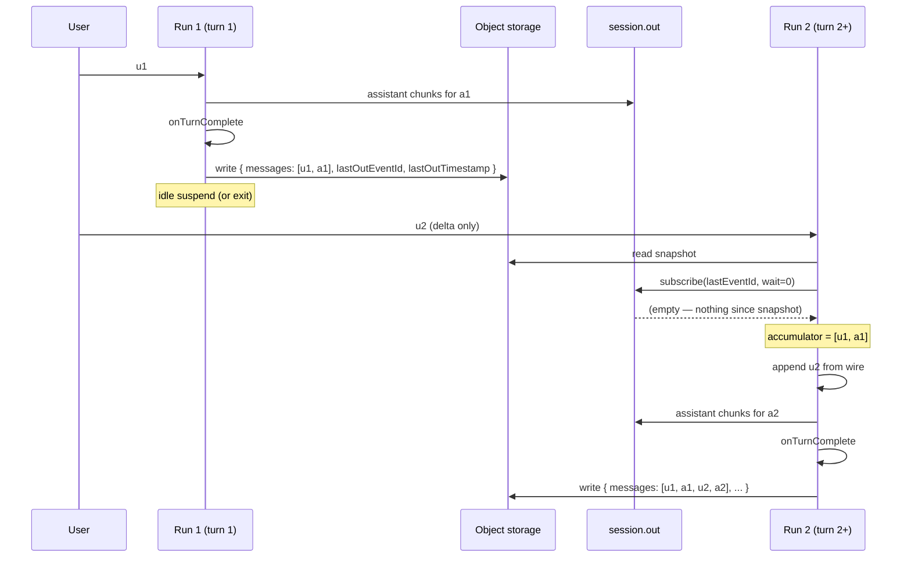

`chat.agent` runs are processes — they boot, stream a turn, and either suspend (waiting for the next message) or exit. When the next message arrives at a session whose previous run already exited, a **fresh** run boots with no in-memory state. Something has to rebuild the conversation history before that turn can produce a coherent response.

This page walks through the **storage + replay** model. The persisted conversation comes from the agent's [transcript storage](/ai-chat/transcript-storage); the default storage is the snapshot in object storage described below, and a storage you bring is read the same way. Replay of the session streams covers what happened after the last save, and it runs for every agent, including one that owns the model's context.

## Why a snapshot at all

The wire is delta-only: each `.in/append` carries at most one new `UIMessage` (see [Client Protocol](/ai-chat/client-protocol#chattaskwirepayload)). A long conversation might be 50 turns deep with megabytes of tool results — the wire never carries that. So when run #2 boots to handle turn 51, the wire alone tells it almost nothing about turns 1–50.

Two existing pieces of durable state already capture everything that happened:

- **`session.in`** — every user message and tool-approval response ever sent.
- **`session.out`** — every assistant token, tool call, and tool result the agent emitted, ordered.

Replaying `session.out` from the beginning is correct but expensive — bandwidth scales with chat length, and parsing N megabytes of streamed chunks at every boot adds latency. So the runtime writes a **snapshot** after every turn and reads it on the next boot. Replay only covers the gap between the snapshot's cursor and now.

## The model end-to-end


```mermaid
sequenceDiagram
  participant User
  participant Run1 as Run 1 (turn 1)
  participant Snapshot as Object storage
  participant SessionOut as session.out
  participant Run2 as Run 2 (turn 2+)

  User->>Run1: u1
  Run1->>SessionOut: assistant chunks for a1
  Run1->>Run1: onTurnComplete
  Run1->>Snapshot: write { messages: [u1, a1], lastOutEventId, lastOutTimestamp }
  Note over Run1: idle suspend (or exit)

  User->>Run2: u2 (delta only)
  Run2->>Snapshot: read snapshot
  Run2->>SessionOut: subscribe(lastEventId, wait=0)
  SessionOut-->>Run2: (empty — nothing since snapshot)
  Note over Run2: accumulator = [u1, a1]
  Run2->>Run2: append u2 from wire
  Run2->>SessionOut: assistant chunks for a2
  Run2->>Run2: onTurnComplete
  Run2->>Snapshot: write { messages: [u1, a1, u2, a2], ... }
```

### Run 1 — first turn

The accumulator starts empty. The wire delivers `u1`. After the model finishes, `onTurnComplete` fires, then the runtime serializes the full accumulator and writes:

```json
{
  "version": 2,
  "savedAt": 1715180400000,
  "messages": [
    { "id": "u1", "final": true, "message": u1 },
    { "id": "a1", "final": true, "message": a1 }
  ],
  "state": null,
  "lastOutEventId": "42",
  "lastInEventId": "7"
}
```

`state` holds what the runtime cannot rebuild from the messages, such as a [compaction](/ai-chat/compaction) summary; `final` is false for a partial answer captured from a failed turn. Snapshots written by older SDK versions have `version: 1` and are read as if every message were final with no state.

The key is `packets/{projectRef}/{envSlug}/sessions/{sessionId}/snapshot.json` — overwritten every turn, never appended. With your own storage, the equivalent is whatever `save` writes: the runtime hands it the two new messages as `put` changes and the same cursors, and a row-per-message store writes two rows instead of the whole conversation. The write is **awaited**, not fire-and-forget — if the run idle-suspends immediately after, in-flight promises don't reliably complete and the snapshot would be lost.

### Run 2 — boot

A new run boots when the user sends `u2`. Run 1 has long since exited. Run 2 has no in-memory state. The boot sequence:

<Steps>
  <Step title="Read the snapshot">
    GET the JSON blob. On 404 (no snapshot yet — first-ever turn) or read error or version mismatch, treat as empty and continue. Snapshot misses are non-fatal — replay alone may still be sufficient.
  </Step>
  <Step title="Replay session.out tail">
    Subscribe to `session.out` with `wait=0` starting from `snapshot.lastOutEventId`. Drain whatever's there and close. Returns:
    - **Settled messages** — closed assistant turns past the snapshot cursor (the chunks of a turn that completed after the snapshot was written but before the run exited cleanly).
    - **A partial assistant** — the trailing message if its stream never received a `finish` chunk. The dead run was mid-response when it died. `cleanupAbortedParts` has already stripped streaming-in-progress fragments.

    In the steady state this returns empty. In recovery, it returns whatever the dead run was in the middle of.
  </Step>
  <Step title="Replay session.in tail">
    GET `session.in` records past the last `turn-complete`'s `session-in-event-id` cursor. Returns the user messages the dead run hadn't acknowledged — typically the message that triggered the cancelled / crashed turn, plus anything the customer typed after.
  </Step>
  <Step title="Reconstruct the chain (smart default)">
    Snapshot messages merge with the settled replay (replay wins on `id` collision). Then:

    - If there's a partial assistant **and** at least one in-flight user message, splice `[firstInFlightUser, partialAssistant]` onto the end of the chain. The model sees the prior turn's incomplete attempt and can continue, abandon, or pivot based on the next user message.
    - Remaining in-flight users dispatch as fresh turns after the recovered first one.
    - If there's no partial OR no in-flight users, the chain is just the settled chain and any in-flight users dispatch normally.

    Customers can override this entirely via [`onRecoveryBoot`](/ai-chat/patterns/recovery-boot).
  </Step>
  <Step title="Append the new wire message">
    Append `u2` from the wire payload, exactly as on turn 1.
  </Step>
</Steps>

The model now sees `[u1, a1, u2]` and produces `a2`. After `onTurnComplete`, the runtime overwrites the snapshot with `[u1, a1, u2, a2]` and the cycle repeats.

### Crash mid-turn — replay carries the load

Suppose Run 1's turn 1 streams partial assistant chunks to `session.out` and then crashes (OOM, exception, server-side cancel) before `onTurnComplete` fires. No snapshot was written. The next run boots and:

1. Snapshot read returns 404 → empty.
2. `session.out` tail replay picks up the partial assistant chunks emitted before the crash. `cleanupAbortedParts` strips streaming-in-progress fragments but keeps the cleaned trailing message as the `partialAssistant`.
3. `session.in` tail replay finds the user message the dead run was answering (no `turn-complete` was written, so the cursor never advanced past it).
4. Smart default splices `[firstInFlightUser, partialAssistant]` onto the chain. Any later user messages (including the customer's follow-up) dispatch as fresh turns.
5. The model sees full prior context and responds in kind — continuing a cut-off essay on "keep going", answering a fresh question on "actually, what's 7+8?", abandoning the prior work on "scrap that, do X instead".

Replay carries the conversation across the crash boundary with zero customer code. For policies different from "preserve context" — drop the partial entirely, synthesize tool results for an interrupted tool call, write a recovery banner to the UI — register [`onRecoveryBoot`](/ai-chat/patterns/recovery-boot).

## OOM-retry interaction

The runtime already had an OOM-retry path that scans `session.out` for the latest `trigger:turn-complete` timestamp to use as a cutoff for `session.in` (so the retry doesn't re-process completed turns — see [OOM resilience](/ai-chat/patterns/oom-resilience)). The snapshot includes a `lastOutTimestamp` field that is exactly that high-water mark.

When a snapshot exists, the OOM-retry path reads `lastOutTimestamp` directly instead of scanning `session.out`. One fewer stream subscription per retry. Free win.

If no snapshot exists (first turn, or `hydrateMessages` registered), the path falls back to the scan.

## Action turns

[Actions](/ai-chat/actions) (`trigger: "action"`) don't fire `onTurnComplete` — they fire `onAction` only. An action that changed the conversation is saved on its own, with `reason: "action"` and the same resume cursors as the last turn, so an undo survives the run ending. See [Actions and persistence](/ai-chat/actions#actions-and-persistence).

## When your app owns the model's context

A storage with [`loadContext`](/ai-chat/transcript-storage#owning-the-models-context), or the deprecated [`hydrateMessages`](/ai-chat/lifecycle-hooks#hydratemessages) hook, decides what the model sees on every turn instead of the runtime's accumulated transcript. That changes the boot sequence in one place: with `hydrateMessages` the storage read is skipped, because the hook is the source of truth. Everything else still runs. The `session.out` and `session.in` tails are replayed, a partial answer and unacknowledged messages are recovered, and `onRecoveryBoot` fires. The hook then receives the recovered tail in `previousMessages`, so an unfinished answer is not lost to a crash the way it used to be.

With `loadContext` on a storage, the storage is still read and written: `load` restores the cursors and the runtime's `state` (a compaction summary survives), `save` still receives every change, and only the model's context comes from `loadContext`.

### The `hydrateMessages` hook

When the customer registers a [`hydrateMessages`](/ai-chat/lifecycle-hooks#hydratemessages) hook, the runtime trusts the hook to be the source of truth for history. The snapshot is neither read nor written. The hook fires per turn, returns the canonical chain from the customer's database, and the accumulator is set to whatever the hook returned.

```ts
import { chat, upsertIncomingMessage } from "@trigger.dev/sdk/ai";
import { db } from "@/lib/db";

export const myChat = chat.agent({
  id: "my-chat",
  hydrateMessages: async ({ chatId, trigger, incomingMessages }) => {
    const stored = (await db.chat.findUnique({ where: { id: chatId } }))?.messages ?? [];

    // See lifecycle-hooks for the full upsert pattern + rationale:
    // /ai-chat/lifecycle-hooks#hydratemessages
    if (upsertIncomingMessage(stored, { trigger, incomingMessages })) {
      // Upsert, not update: head-start first turns run without a preload
      // to create the row.
      await db.chat.upsert({
        where: { id: chatId },
        create: { id: chatId, messages: stored },
        update: { messages: stored },
      });
    }

    return stored;
  },
  onTurnComplete: async ({ chatId, uiMessages }) => {
    await db.chat.update({ where: { id: chatId }, data: { messages: uiMessages } });
  },
  run: async ({ messages, signal }) => {
    return streamText({ model: anthropic("claude-sonnet-4-5"), messages, abortSignal: signal });
  },
});
```

What you gain:

- **Zero object-store traffic per turn.** No snapshot read, no snapshot write. `OBJECT_STORE_*` env vars don't have to be set.
- **Branching, undo, edit, abuse prevention** — patterns that need a backend-side single source of truth work naturally because the customer mediates every read.

What you give up:

- **You own persistence end-to-end.** A bug in `hydrateMessages` that returns the wrong chain corrupts the conversation visible to the model, and a compaction summary has nowhere durable to live.
- **OOM-retry needs a `session.out` scan again** because there's no snapshot to short-circuit it.

A [transcript storage](/ai-chat/transcript-storage) with `loadContext` gives you the same ownership of the model's context while the runtime keeps writing every change and its own state to your store. It is the recommended path; `hydrateMessages` is deprecated.

## When no storage is configured

If no object store is configured and the agent has no `storage` of its own, conversations don't survive run boundaries. A continuation boots empty. The runtime logs a warning at agent registration time so you see this at deploy time, not at user-traffic time.

For local development this is sometimes fine — you're not testing continuations. For production it isn't. Configure one of:

- **Object store** (`OBJECT_STORE_*` env vars on your webapp) — easiest, default behavior.
- **A transcript storage over your own database** — stronger control, suits multi-tenant apps with audit needs.

## Snapshot key & lifecycle

| Field | Value |
|---|---|
| Bucket | Whatever `OBJECT_STORE_BASE_URL` points to |
| Key prefix | `packets/{projectRef}/{envSlug}/` (server-prefixed) |
| Key suffix | `sessions/{sessionId}/snapshot.json` |
| Final key | `packets/{projectRef}/{envSlug}/sessions/{sessionId}/snapshot.json` |
| Size | Tens of KB typical, capped only by object-store limits |
| Cadence | Overwritten after every successful `onTurnComplete` |

Snapshots accumulate per-session forever unless you set a lifecycle policy on the bucket. A 90-day expiry on `packets/*/sessions/*/snapshot.json` is a reasonable default if your chats don't typically resume after that window. Closed sessions are not auto-cleaned today.

### MinIO and S3-compatible stores

Snapshot read/write reuses the same object-store layer as Trigger.dev's existing large-payload routes. Anything that already works for large payloads — AWS S3, MinIO (self-host or local development), Cloudflare R2, Tigris, Backblaze B2 — works for snapshots too. `OBJECT_STORE_DEFAULT_PROTOCOL` controls the routing (`s3`, `minio`, etc.) and the SDK picks the right driver automatically. No snapshot-specific config.

For local development against `pnpm run docker`, the bundled MinIO container is enough — set `OBJECT_STORE_DEFAULT_PROTOCOL=minio` and the standard MinIO env vars on the webapp, and continuations work end-to-end against a local stack.

## See also

- [Client Protocol](/ai-chat/client-protocol#how-history-is-rebuilt) — the wire-level view of the same model
- [Transcript storage](/ai-chat/transcript-storage) — the adapter the runtime persists through, and how to bring your own
- [`hydrateMessages`](/ai-chat/lifecycle-hooks#hydratemessages) — the deprecated context hook
- [OOM resilience](/ai-chat/patterns/oom-resilience) — how `session.in` cutoffs interact with snapshots
- [Database persistence](/ai-chat/patterns/database-persistence) — the canonical persistence pattern using `onTurnComplete`
- [v4.5 upgrade guide](/ai-chat/upgrade-guide#v45-wire-format-change) — when this model landed and what changed
