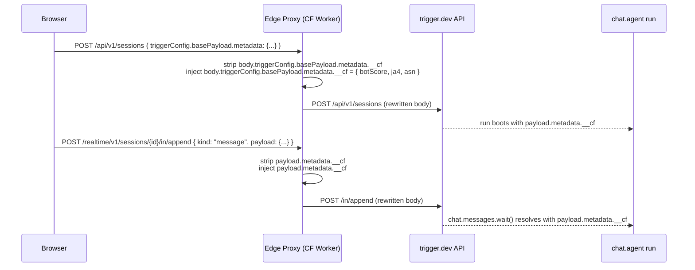

A common need for chat-style endpoints is to drive agent behavior from **server-trusted signals** that the browser cannot be allowed to declare itself — bot management scores, JA4 fingerprints, ASN, ReCAPTCHA verdicts, or any other anti-abuse data only the edge can see. The agent's [`clientData`](/ai-chat/reference#withclientdata) channel is the right delivery mechanism, but `clientData` set in the browser is by definition spoofable. The fix is to move the value population out of the browser and into a trusted edge proxy.

This page documents the pattern using Cloudflare Workers as the proxy. The same shape applies to any edge layer (custom reverse proxy, Vercel Edge Middleware, AWS Lambda@Edge) — the trust comes from the deployment topology, not from Trigger.dev validating the source.

## Why headers don't work

It's tempting to ask whether `POST /realtime/v1/sessions/{id}/in/append` could carry the signal as an HTTP header. It cannot. The realtime route reads only `Authorization` and `X-Part-Id`; the remaining headers are dropped at the route boundary and the body is persisted to the durable stream as opaque bytes. There is no `headers → run payload` channel.

The trigger.dev wire payload, on the other hand, has a typed per-turn metadata channel ([`ChatTaskWirePayload.metadata`](/ai-chat/client-protocol#chattaskwirepayload)). It already flows from the wire into [`clientData`](/ai-chat/reference#withclientdata) on every hook (`onBoot`, `onChatStart`, `onTurnStart`, `run`, `onTurnComplete`). That field is where signals must land.

## The trust boundary

The pattern has one architectural requirement and one wire-shape convention.

**Topology**: the browser must not be able to reach `trigger.dev` directly. All four chat-related requests (`POST /api/v1/sessions`, `GET /realtime/v1/sessions/{id}/out`, `POST /realtime/v1/sessions/{id}/in/append`, `POST /api/v1/auth/jwt/claims`) flow through your edge proxy. The proxy holds the trust; trigger.dev simply persists whatever the proxy writes.

**Namespace**: pick a key your edge proxy owns exclusively — e.g. `__cf`, `__edge`, `__trust`. The proxy **strips** anything in that key on the way in and **injects** its own value on every request. Nothing else in your system should write that key. This is the convention that converts deployment topology into a guarantee the agent can rely on.



## Wire payload — the two endpoints to rewrite

The signal needs to land in **two** places. Both bodies are JSON; the edge proxy parses, mutates the namespaced key, and re-serializes.

### `POST /api/v1/sessions` — session create

The browser's session-create call carries the first-turn metadata under `triggerConfig.basePayload.metadata`. The proxy mutates that:

```ts
// Before
{
  "type": "chat.agent",
  "externalId": "conv-123",
  "taskIdentifier": "my-agent",
  "triggerConfig": {
    "basePayload": {
      "chatId": "conv-123",
      "trigger": "preload",
      "metadata": { "userId": "user-456" }
    }
  }
}

// After
{
  "type": "chat.agent",
  "externalId": "conv-123",
  "taskIdentifier": "my-agent",
  "triggerConfig": {
    "basePayload": {
      "chatId": "conv-123",
      "trigger": "preload",
      "metadata": {
        "userId": "user-456",
        "__cf": { "botScore": 95, "ja4": "...", "asn": 13335, "country": "US" }
      }
    }
  }
}
```

### `POST /realtime/v1/sessions/{id}/in/append` — every follow-up turn

The body is a JSON-serialized `ChatInputChunk`. The proxy parses it, checks `kind === "message"`, and mutates `payload.metadata`:

```ts
// Before
{
  "kind": "message",
  "payload": {
    "message": { "id": "u-2", "role": "user", "parts": [{ "type": "text", "text": "..." }] },
    "chatId": "conv-123",
    "trigger": "submit-message",
    "metadata": { "userId": "user-456" }
  }
}

// After
{
  "kind": "message",
  "payload": {
    "message": { ... },
    "chatId": "conv-123",
    "trigger": "submit-message",
    "metadata": {
      "userId": "user-456",
      "__cf": { "botScore": 95, "ja4": "...", "asn": 13335, "country": "US" }
    }
  }
}
```

Both bodies stay well under the [per-record cap on `/in/append`](/ai-chat/client-protocol#step-3-send-messages-stops-and-actions) — a typical trust object is ~200 bytes.

Other paths — `.out` SSE, `/api/v1/auth/jwt/claims`, anything else — pass through the proxy untouched. The SSE stream in particular must not be buffered; preserve the response body as-is.

## Cloudflare Worker reference implementation

A complete worker that proxies all paths to `TRIGGER_API_UPSTREAM` and injects `__cf` on the two body-write endpoints:

```ts
export interface Env {
  TRIGGER_API_UPSTREAM: string; // e.g. "https://api.trigger.dev"
}

type CfTrustData = {
  botScore: number;
  ja4: string;
  asn: number;
  country: string;
};

function readCfTrustData(request: Request): CfTrustData {
  const cf = (request as Request & { cf?: Record<string, unknown> }).cf;
  const bm = cf?.botManagement as Record<string, unknown> | undefined;
  return {
    botScore: (bm?.score as number) ?? 0,
    ja4: (bm?.ja4 as string) ?? "",
    asn: (cf?.asn as number) ?? 0,
    country: (cf?.country as string) ?? "",
  };
}

function injectCf(metadata: Record<string, unknown> | undefined, cf: CfTrustData) {
  // Strip anything the client tried to send under our namespace,
  // then inject the edge-trusted value. Topology + convention =
  // trust.
  const stripped = { ...(metadata ?? {}) };
  delete stripped.__cf;
  return { ...stripped, __cf: cf };
}

function rewriteSessionsCreate(body: string, cf: CfTrustData) {
  const parsed = JSON.parse(body) as Record<string, unknown>;
  const tc = (parsed.triggerConfig as Record<string, unknown>) ?? {};
  const bp = (tc.basePayload as Record<string, unknown>) ?? {};
  parsed.triggerConfig = {
    ...tc,
    basePayload: { ...bp, metadata: injectCf(bp.metadata as Record<string, unknown>, cf) },
  };
  return JSON.stringify(parsed);
}

function rewriteAppend(body: string, cf: CfTrustData) {
  let parsed: Record<string, unknown>;
  try {
    parsed = JSON.parse(body);
  } catch {
    return body;
  }
  if (parsed.kind !== "message") return body;
  const payload = (parsed.payload as Record<string, unknown>) ?? {};
  parsed.payload = { ...payload, metadata: injectCf(payload.metadata as Record<string, unknown>, cf) };
  return JSON.stringify(parsed);
}

export default {
  async fetch(request: Request, env: Env): Promise<Response> {
    const incoming = new URL(request.url);
    const target = new URL(incoming.pathname + incoming.search, env.TRIGGER_API_UPSTREAM);
    const cf = readCfTrustData(request);

    const isSessionsCreate =
      request.method === "POST" && incoming.pathname === "/api/v1/sessions";
    const isAppend =
      request.method === "POST" &&
      /^\/realtime\/v1\/sessions\/[^/]+\/in\/append$/.test(incoming.pathname);

    let body: BodyInit | null = null;
    if (request.method !== "GET" && request.method !== "HEAD") {
      const raw = await request.text();
      if (isSessionsCreate && raw) body = rewriteSessionsCreate(raw, cf);
      else if (isAppend && raw) body = rewriteAppend(raw, cf);
      else body = raw;
    }

    const headers = new Headers(request.headers);
    headers.delete("host");
    headers.delete("content-length");

    return fetch(target.toString(), {
      method: request.method,
      headers,
      body,
      redirect: "manual",
    });
  },
};
```

Browser-only deployments also need CORS on the worker — echo `Access-Control-Request-Headers` on preflight and set `Access-Control-Allow-Origin` to your frontend origin. The trigger.dev route itself allows all origins, but the worker becomes the visible cross-origin endpoint to the browser.

### Streaming and latency

The SDK's `baseURL` accepts a function (see [Browser transport configuration](#browser-transport-configuration)), so the recommended setup routes `.in/append` and session-create through the worker but lets `.out` SSE go direct to `api.trigger.dev`. Body-mutation only happens on the POST paths; the SSE stream is read-only, doesn't need rewriting, and routing it direct saves an edge hop on every reconnect.

If you do route `.out` through the proxy (e.g. you want a single origin in front of `api.trigger.dev` and don't care about the extra hop), the template above handles it correctly because the worker returns `response.body` as a `ReadableStream`. **Do not replace that with `await response.text()`** anywhere in your fork; doing so converts the streaming SSE response into a buffered read and breaks per-chunk delivery.

[Cloudflare Workers HTTP requests](https://developers.cloudflare.com/workers/platform/limits/) have no wall-clock duration limit while the client stays connected — the 60-second long-poll runs to completion on every plan, including Free. CPU-time limits (10 ms on Free, 30 s default on Paid) only apply to active computation; relaying bytes through `fetch` doesn't burn CPU. The two body-rewrite paths use sub-millisecond CPU for typical message sizes, well under either ceiling.

Network-wise the proxy adds one edge hop: roughly 10–50 ms per request round trip versus talking to `api.trigger.dev` directly. Routing SSE direct via the function-form `baseURL` eliminates that hop on the long-lived path.

## Agent side — declare the namespace in `clientDataSchema`

Mirror the namespace in the agent so every turn lands typed:

```ts
import { chat } from "@trigger.dev/sdk/ai";
import { z } from "zod";

export const myAgent = chat
  .withClientData({
    schema: z.object({
      userId: z.string(),
      __cf: z.object({
        botScore: z.number(),
        ja4: z.string(),
        asn: z.number(),
        country: z.string(),
      }),
    }),
  })
  .agent({
    id: "my-agent",
    run: async ({ messages, clientData, signal }) => {
      // Score-based routing. The values arrive from the edge proxy.
      if (clientData.__cf.botScore < 30) {
        return streamText({
          model: anthropic("claude-haiku-4-5"),
          messages: [{ role: "system", content: "Reject politely; do not engage." }],
          abortSignal: signal,
          stopWhen: stepCountIs(15),
        });
      }

      return streamText({
        model: anthropic("claude-sonnet-4-5"),
        messages,
        abortSignal: signal,
        // ...
        stopWhen: stepCountIs(15),
      });
    },
  });
```

Because the schema requires `__cf` on every turn, any request that *doesn't* go through the proxy fails at the agent boundary — the turn produces a `[ERROR]` span on the trace and an empty `turn-complete` on the wire (see [the client protocol error-detection note](/ai-chat/client-protocol#step-3-send-messages-stops-and-actions)). That gives you a server-side enforcement check for "did this request actually come through the trusted path?"

## Browser transport configuration

Point the `TriggerChatTransport` at the worker, not at `api.trigger.dev`:

`baseURL` accepts a function so you can route `.in/append` through the worker while keeping `.out` SSE direct to `api.trigger.dev`. The append path is where the body-mutation matters; the SSE stream is a read-only one-way channel that doesn't need to be proxied. Routing it direct saves an edge hop on every long-poll.

```tsx
import { useTriggerChatTransport } from "@trigger.dev/sdk/chat/react";

const WORKER = "https://worker.your-domain.com";
const DIRECT = "https://api.trigger.dev";

const transport = useTriggerChatTransport({
  task: "my-agent",
  baseURL: ({ endpoint }) => (endpoint === "out" ? DIRECT : WORKER),
  // ... accessToken, startSession, etc.
  // NOTE: do not set __cf in clientData here. The browser cannot be
  // trusted to populate it — the worker is the source of truth.
  clientData: { userId: currentUserId },
});
```

If you'd rather route everything through the worker, pass a single string:

```tsx
baseURL: "https://worker.your-domain.com",
```

`baseURL` accepts the same string-or-function shape on `chat.createStartSessionAction`, so the Next.js server action that creates the session also flows through the worker — that's how the very first run's `basePayload.metadata.__cf` gets injected before reaching `api.trigger.dev`:

```ts
// actions.ts — server-only
import { chat } from "@trigger.dev/sdk/ai";

export const startSession = chat.createStartSessionAction("my-agent", {
  tokenTTL: "1h",
  baseURL: ({ endpoint }) =>
    endpoint === "sessions" ? WORKER : DIRECT,
});
```

The session-create endpoint discriminator is `"sessions"` (POST `/api/v1/sessions`) or `"auth"` (POST `/api/v1/auth/jwt/claims`) — distinct from the chat transport's `"in"` / `"out"`. If you want everything proxied, pass a string.

## Threat model

Two important invariants follow from this design:

1. **Direct browser-to-trigger.dev requests cannot succeed**. As long as your agent's `clientDataSchema` requires the namespaced field, any request that doesn't go through the proxy fails schema validation and produces an empty turn. This is your gate.
2. **Anything inside the namespaced key is trusted only as far as the proxy is the sole writer**. If a client could obtain the public access token and bypass the proxy, they could send arbitrary values under `__cf`. The schema would still validate (it only checks shape, not provenance). The mitigation is operational: the public access token must only be served to clients that reach trigger.dev through the proxy. In practice this means your Next.js server actions and your browser are both behind the same edge layer, and the worker is the only fetch destination for `trigger.dev` baked into either of them.

You can harden further with a shared-secret header the worker injects (e.g. `X-Edge-Signature`) and an agent-side check, but in most CDN deployments the deployment topology is already sufficient.

## Recipe summary

1. Pick a namespaced key the edge proxy owns (`__cf`, `__edge`, `__trust`).
2. Deploy a proxy in front of `trigger.dev` that rewrites POST `/api/v1/sessions` and POST `/realtime/v1/sessions/{id}/in/append` to inject your trusted values under that key.
3. Declare the namespace in the agent's `clientDataSchema` so missing or malformed signals fail at the agent boundary.
4. Point your transport's `baseURL` at the proxy. Never expose `api.trigger.dev` directly to the browser.

## See also

- [Client Protocol](/ai-chat/client-protocol) — the full wire shape the proxy is rewriting.
- [`withClientData`](/ai-chat/reference#withclientdata) — agent-side typed metadata channel.
- [Large payloads](/ai-chat/patterns/large-payloads) — for when injected signals or hooks need to ship more than the 1 MiB stream cap allows.
