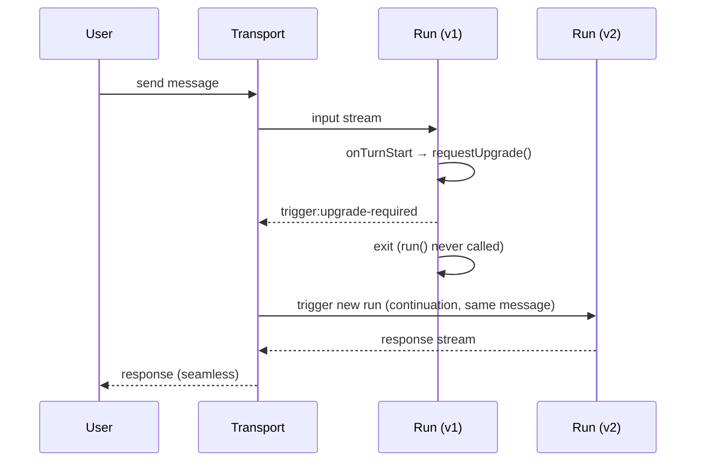

Chat agent runs are pinned to the worker version they started on. When you deploy a new version, suspended runs resume on the **old** code. If your deploy includes breaking changes (new tools, changed schemas, updated API contracts), this can cause issues.

`chat.requestUpgrade()` lets the agent opt out of the current run so the transport triggers a new one on the latest version.

## How it works

When `chat.requestUpgrade()` is called in `onTurnStart` or `onValidateMessages`:

1. `run()` is **skipped** — no response is generated on old code
2. The agent writes a `trigger:upgrade-required` control chunk to the stream
3. The transport receives the chunk and immediately triggers a **new run** on the currently promoted deployment with the same message (as a continuation)
4. The new run's response is piped through transparently — the user sees a single seamless response from the upgraded agent

The new run lives on the **same [Session](/sessions/overview)** as the old run — `sessionId` persists across the upgrade. Only `runId` and `publicAccessToken` refresh. The transport's SSE subscription to `session.out` doesn't even need to re-establish; it just continues receiving chunks from whichever run is currently writing.

When called from inside `run()` or `chat.defer()`, the current turn completes normally first and the run exits afterward. The next message triggers the continuation on the same session.



## Contract versioning

Define an explicit version for the contract between your frontend and agent. The frontend sends a `protocolVersion` via `clientData`, and the agent declares which versions it supports. When a breaking change ships (new tools, changed data parts, updated response format), bump the version.

This gives you full control — the frontend can be backwards-compatible across multiple agent versions, and the agent only upgrades when it sees a version it doesn't support.

```tsx title="app/components/Chat.tsx"
import { useTriggerChatTransport } from "@trigger.dev/sdk/chat/react";
import { useChat } from "@ai-sdk/react";

export function Chat() {
  const transport = useTriggerChatTransport({
    task: "my-chat",
    accessToken: getChatToken,
    // Bump this when you ship a breaking change to the chat UI or tools
    clientData: { userId: user.id, protocolVersion: "v2" },
  });

  const { messages, sendMessage } = useChat({ transport });
  // ...
}
```

On the agent side, declare which versions the current code supports:

```ts
import { chat } from "@trigger.dev/sdk/ai";
import { streamText } from "ai";
import { openai } from "@ai-sdk/openai";

// The set of frontend protocol versions this agent code supports.
// When you deploy a breaking change, remove old versions from this set.
const SUPPORTED_VERSIONS = new Set(["v2", "v3"]);

export const myChat = chat
  .withClientData({
    schema: z.object({
      userId: z.string(),
      protocolVersion: z.string(),
    }),
  })
  .agent({
    id: "my-chat",
    onTurnStart: async ({ clientData }) => {
      if (clientData?.protocolVersion && !SUPPORTED_VERSIONS.has(clientData.protocolVersion)) {
        chat.requestUpgrade();
      }
    },
    run: async ({ messages, signal }) => {
      return streamText({ model: openai("gpt-4o"), messages, abortSignal: signal });
    },
  });
```

The transport includes `clientData` in every payload — both the initial trigger and subsequent records on the session's `.in` channel — so the agent always has the current value.

This pattern is useful when:
- Your frontend is backwards-compatible across several agent versions, but occasionally ships breaking changes
- You want explicit control over when upgrades happen rather than upgrading on every deploy
- Multiple frontend versions may be active at the same time (e.g., users with cached tabs)

## Auto-detect from build ID (Next.js / Vercel)

For automatic upgrade on every deploy, pass your platform's build ID via `clientData` instead of a manual version. The agent stores the ID from the first message and upgrades when it changes:

```tsx title="app/components/Chat.tsx"
// Vercel sets this at build time, or use your own build ID
const APP_VERSION = process.env.NEXT_PUBLIC_VERCEL_DEPLOYMENT_ID
  ?? process.env.NEXT_PUBLIC_BUILD_ID
  ?? "dev";

export function Chat() {
  const transport = useTriggerChatTransport({
    task: "my-chat",
    accessToken: getChatToken,
    clientData: { userId: user.id, appVersion: APP_VERSION },
  });
  // ...
}
```

```ts title="trigger/chat.ts"
const initialAppVersion = chat.local<string>({ id: "appVersion" });

export const myChat = chat
  .withClientData({
    schema: z.object({
      userId: z.string(),
      appVersion: z.string(),
    }),
  })
  .agent({
    id: "my-chat",
    onChatStart: async ({ clientData }) => {
      initialAppVersion.init(clientData.appVersion);
    },
    onTurnStart: async ({ clientData }) => {
      if (clientData?.appVersion && clientData.appVersion !== initialAppVersion.value) {
        chat.requestUpgrade();
      }
    },
    run: async ({ messages, signal }) => {
      return streamText({ model: openai("gpt-4o"), messages, abortSignal: signal });
    },
  });
```

This upgrades on **every** deploy, not just breaking changes. Good for fast-moving projects where you always want the latest code.

## Other agent types

- **`chat.agent()`** and **`chat.createSession()`** — use `chat.requestUpgrade()` as shown above
- **`chat.customAgent()`** — you control the turn loop, so just `return` from `run()` when you want to exit

## See also

- [Lifecycle hooks](/ai-chat/backend#lifecycle-hooks) — where `onTurnStart` and `onChatResume` fit in the turn cycle
- [Database persistence](/ai-chat/patterns/database-persistence) — how continuations interact with session state
- [Client Protocol](/ai-chat/client-protocol#step-4-handle-continuations) — how clients handle continuations at the wire level
