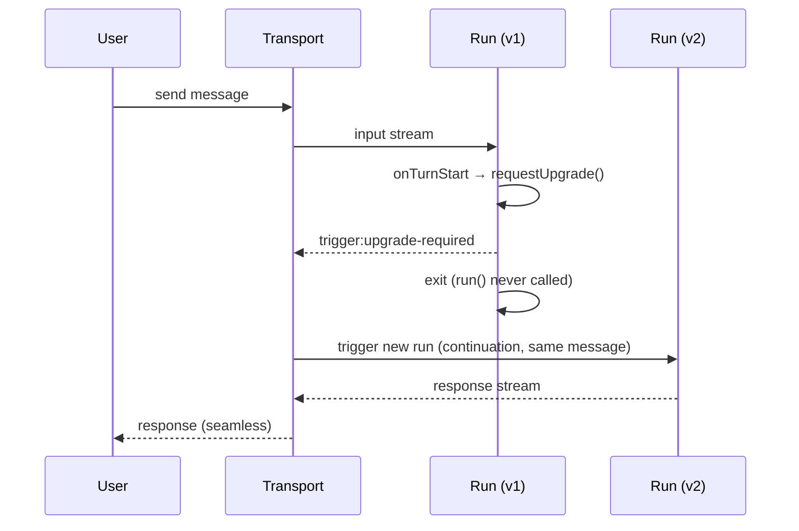

Chat agent runs are pinned to the worker version they started on. When you deploy a new version, suspended runs resume on the **old** code. If your deploy includes breaking changes (new tools, changed schemas, updated API contracts), this can cause issues.

`chat.requestUpgrade()` is the managed upgrade signal for `chat.agent()` and the `chat.createSession()` iterator. Fully hand-rolled custom agents use `chat.endAndContinue()` between turns to immediately hand the Session to a new run.

## How it works

When `chat.requestUpgrade()` is called in `onTurnStart` or `onValidateMessages`:

1. `run()` is **skipped** — no response is generated on old code
2. The agent calls the server-side `endAndContinueSession` endpoint, which atomically swaps the Session's `currentRunId` to a freshly-triggered run on the latest deployment (optimistic-claim against `currentRunVersion`)
3. The new run picks up the conversation and produces the response
4. The transport's existing SSE subscription to `session.out` keeps receiving chunks across the swap — no client-side reconnect

The new run lives on the **same Session** as the old one. `chatId` is the durable identity; only the underlying `currentRunId` rotates. The audit log records the new run with `reason: "upgrade"`.

When called from inside `run()` or `chat.defer()`, the current turn completes normally first and the run exits afterward. The next message triggers the continuation on the same session.


```mermaid
sequenceDiagram
  participant User
  participant Transport
  participant RunV1 as Run (v1)
  participant RunV2 as Run (v2)

  User->>Transport: send message
  Transport->>RunV1: input stream
  RunV1->>RunV1: onTurnStart → requestUpgrade()
  RunV1-->>Transport: trigger:upgrade-required
  RunV1->>RunV1: exit (run() never called)
  Transport->>RunV2: trigger new run (continuation, same message)
  RunV2-->>Transport: response stream
  Transport-->>User: response (seamless)
```

## Contract versioning

Define an explicit version for the contract between your frontend and agent. The frontend sends a `protocolVersion` via `clientData`, and the agent declares which versions it supports. When a breaking change ships (new tools, changed data parts, updated response format), bump the version.

This gives you full control — the frontend can be backwards-compatible across multiple agent versions, and the agent only upgrades when it sees a version it doesn't support.

```tsx title="app/components/Chat.tsx"
import { useTriggerChatTransport } from "@trigger.dev/sdk/chat/react";
import { useChat } from "@ai-sdk/react";

export function Chat() {
  const transport = useTriggerChatTransport({
    task: "my-chat",
    accessToken: ({ chatId }) => mintChatAccessToken(chatId),
    startSession: ({ chatId, clientData }) =>
      startChatSession({ chatId, clientData }),
    // Bump this when you ship a breaking change to the chat UI or tools
    clientData: { userId: user.id, protocolVersion: "v2" },
  });

  const { messages, sendMessage } = useChat({ transport });
  // ...
}
```

On the agent side, declare which versions the current code supports:

```ts
import { chat } from "@trigger.dev/sdk/ai";
import { streamText } from "ai";
import { anthropic } from "@ai-sdk/anthropic";

// The set of frontend protocol versions this agent code supports.
// When you deploy a breaking change, remove old versions from this set.
const SUPPORTED_VERSIONS = new Set(["v2", "v3"]);

export const myChat = chat
  .withClientData({
    schema: z.object({
      userId: z.string(),
      protocolVersion: z.string(),
    }),
  })
  .agent({
    id: "my-chat",
    onTurnStart: async ({ clientData }) => {
      if (clientData?.protocolVersion && !SUPPORTED_VERSIONS.has(clientData.protocolVersion)) {
        chat.requestUpgrade();
      }
    },
    run: async ({ messages, signal }) => {
      return streamText({ model: anthropic("claude-sonnet-4-5"), messages, abortSignal: signal });
    },
  });
```

The transport includes `clientData` in every payload — both the initial trigger and subsequent records on the session's `.in` channel — so the agent always has the current value.

This pattern is useful when:
- Your frontend is backwards-compatible across several agent versions, but occasionally ships breaking changes
- You want explicit control over when upgrades happen rather than upgrading on every deploy
- Multiple frontend versions may be active at the same time (e.g., users with cached tabs)

## Auto-detect from build ID (Next.js / Vercel)

For automatic upgrade on every deploy, pass your platform's build ID via `clientData` instead of a manual version. The agent stores the ID from the first message and upgrades when it changes:

```tsx title="app/components/Chat.tsx"
// Vercel sets this at build time, or use your own build ID
const APP_VERSION = process.env.NEXT_PUBLIC_VERCEL_DEPLOYMENT_ID
  ?? process.env.NEXT_PUBLIC_BUILD_ID
  ?? "dev";

export function Chat() {
  const transport = useTriggerChatTransport({
    task: "my-chat",
    accessToken: ({ chatId }) => mintChatAccessToken(chatId),
    startSession: ({ chatId, clientData }) =>
      startChatSession({ chatId, clientData }),
    clientData: { userId: user.id, appVersion: APP_VERSION },
  });
  // ...
}
```

```ts title="trigger/chat.ts"
const initialAppVersion = chat.local<{ version: string }>({ id: "appVersion" });

export const myChat = chat
  .withClientData({
    schema: z.object({
      userId: z.string(),
      appVersion: z.string(),
    }),
  })
  .agent({
    id: "my-chat",
    onBoot: async ({ clientData }) => {
      initialAppVersion.init({ version: clientData.appVersion });
    },
    onTurnStart: async ({ clientData }) => {
      if (clientData?.appVersion && clientData.appVersion !== initialAppVersion.version) {
        chat.requestUpgrade();
      }
    },
    run: async ({ messages, signal }) => {
      return streamText({ model: anthropic("claude-sonnet-4-5"), messages, abortSignal: signal });
    },
  });
```

This upgrades on **every** deploy, not just breaking changes. Good for fast-moving projects where you always want the latest code.

## Custom agents

Use `chat.requestUpgrade()` with `chat.agent()` and the `chat.createSession()` iterator. In a fully hand-rolled `chat.customAgent()` task, detach input listeners, persist the completed turn, write its boundary, then call `chat.endAndContinue()` and return immediately:

```ts
messageSubscription.off();
stop.cleanup();
await persistMessages(conversation.uiMessages);
await chat.writeTurnComplete();
await chat.endAndContinue();
return;
```

The continuation uses the same durable Session and receives `.in` records that the old run has not consumed. It starts on the latest deployed task version unless the Session's trigger configuration sets `lockToVersion`.

If input arrives that the continuation should process, detach the old listeners and skip the final `chat.writeTurnComplete()`. A turn-complete boundary acknowledges the latest input dispatched to the old run, so writing one after that input would cause the continuation to resume past it.

<Warning>
  `chat.endAndContinue()` starts the successor but does not stop the calling run. Perform no more Session reads or writes after calling it, and return from the task. If the handoff fails, the promise rejects.
</Warning>

## Interaction with recovery boot

`chat.requestUpgrade()` is a graceful exit — the old run returns cleanly, never writing a partial assistant. The new continuation run boots with an empty `session.out` tail and the upgrade-trigger message on `session.in`. The trigger message dispatches as turn 1 on the new version via the normal continuation-wait path. [`onRecoveryBoot`](/ai-chat/patterns/recovery-boot) does NOT fire on this path — the hook is reserved for mid-stream interruptions (cancel / crash / OOM) where a partial assistant exists on the tail.

## See also

- [Lifecycle hooks](/ai-chat/lifecycle-hooks) — where `onTurnStart` and `onChatResume` fit in the turn cycle
- [Recovery boot](/ai-chat/patterns/recovery-boot) — the sibling hook for mid-stream interruptions (does NOT fire on `requestUpgrade`)
- [Database persistence](/ai-chat/patterns/database-persistence) — how continuations interact with session state
- [Client Protocol](/ai-chat/client-protocol#step-4-handle-continuations) — how clients handle continuations at the wire level
