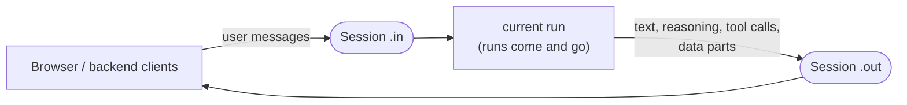

import RcBanner from "/snippets/ai-chat-rc-banner.mdx";

<RcBanner />

**A Session is a stateful execution of an agent.** It includes two-way streaming and durable compute, and a single Session can have multiple runs associated with it.

The **two-way streaming** is a pair of durable streams. The input stream (`.in`) carries incoming user messages to your task. The output stream (`.out`) carries everything the agent produces back to your clients: AI generation parts (text, reasoning, tool calls) and any custom data parts you write.

The **durable compute** is the runs that process those streams. A Session is keyed on your stable id (`externalId` — for chat, the `chatId`) and owns its current run: when a run suspends, idles out, or hands off to a new version, the Session starts or swaps to a fresh run and the streams carry on. Clients keep sending and reading against the same id; they never know a run changed underneath.



`chat.agent` is built on Sessions. You can also use them directly for any pattern that needs durable bi-directional streaming across runs: long-lived agent inboxes, multi-step approval flows, server-to-server pipelines that survive worker restarts.

## A minimal example

A task that echoes whatever lands on its input stream, and a backend that starts the session, sends a message, and reads the reply:

```ts trigger/inbox.ts
import { task, sessions } from "@trigger.dev/sdk";

export const inboxAgent = task({
  id: "inbox-agent",
  run: async (payload: { sessionId: string }) => {
    const session = sessions.open(payload.sessionId);

    while (true) {
      // Suspends the run (no compute billed) until a record arrives.
      const next = await session.in.wait<{ text: string }>({ timeout: "1h" });
      if (!next.ok) return;
      await session.out.append({ type: "reply", text: `echo: ${next.output.text}` });
    }
  },
});
```

```ts Your backend
import { sessions } from "@trigger.dev/sdk";

// Atomically create the session AND trigger its first run.
await sessions.start({
  type: "inbox",
  externalId: userId,
  taskIdentifier: "inbox-agent",
  triggerConfig: { basePayload: { sessionId: userId } },
});

const session = sessions.open(userId);
await session.in.send({ text: "hello" });

const stream = await session.out.read({ signal: AbortSignal.timeout(30_000) });
for await (const chunk of stream) {
  console.log(chunk); // { type: "reply", text: "echo: hello" }
}
```

The run can suspend, crash, or be replaced between the `send` and the `read` — the streams are durable, so nothing is lost and the client code doesn't change.

## Sessions and runs

One Session spans many runs over its lifetime. The Session row tracks `currentRunId`; the runs do the work:

- **First run**: created atomically by `sessions.start` (no gap where the session exists but nothing is listening).
- **Idle suspend**: a run blocked on `in.wait` suspends and frees compute. A new record on `.in` wakes it.
- **Continuation**: when a run ends (idle timeout, `chat.endRun`, a crash, a version upgrade), the next incoming record triggers a fresh run against the same Session. The new run picks up the streams where the old one left off.

This is what makes a Session the durable identity for a conversation: runs are an execution detail, the Session (and its `externalId`) is what your clients address. See [How it works](/ai-chat/how-it-works) for how `chat.agent` drives this loop.

## When to reach for Sessions directly

`chat.agent` handles 90% of chat-shaped workloads — message accumulation, the turn loop, stop signals, lifecycle hooks. Use the raw `sessions` API when you need any of:

- **Non-chat conversational state**: an agent inbox where each "turn" is a webhook event rather than a UI message.
- **Server-to-server bi-directional streaming** where an external service produces records the task consumes (and vice-versa) over the same durable channel.
- **A custom turn loop** where the agent abstraction doesn't fit but you still want session-survival across runs.

For chat use cases, prefer [`chat.agent`](/ai-chat/backend#chat-agent) or [`chat.createSession`](/ai-chat/backend#chat-createsession).

## `sessions` namespace

```ts
import { sessions } from "@trigger.dev/sdk";
```

### `sessions.start(body, requestOptions?)`

Atomically create a Session row and trigger its first run. Idempotent on `(env, externalId)` — two concurrent calls with the same `externalId` converge to one session.

```ts
const { id, runId, publicAccessToken, isCached } = await sessions.start({
  type: "chat.agent",
  externalId: chatId,
  taskIdentifier: "my-chat",
  triggerConfig: {
    tags: [`chat:${chatId}`],
    basePayload: { /* whatever your task's payload shape is */ },
  },
});
```

| Field | Type | Notes |
|---|---|---|
| `type` | `string` | Free-form discriminator. `chat.agent` uses `"chat.agent"`. |
| `externalId` | `string?` | Your stable identity. Cannot start with `session_` (reserved). |
| `taskIdentifier` | `string` | Task this session triggers runs against. |
| `triggerConfig` | `SessionTriggerConfig` | Trigger options applied to every run: `tags`, `queue`, `machine`, `maxAttempts`, `idleTimeoutInSeconds`, `basePayload`. |
| `tags` | `string[]?` | Up to 10 tags on the Session row (separate from `triggerConfig.tags`). |
| `metadata` | `Record<string, unknown>?` | Arbitrary JSON. |
| `expiresAt` | `Date?` | Hard retention deadline. |

Returns `CreatedSessionResponseBody`:

| Field | Type | Notes |
|---|---|---|
| `id` | `string` | Server-assigned `session_*` friendlyId. |
| `runId` | `string` | The first run created alongside the session. |
| `publicAccessToken` | `string` | Session-scoped PAT (`read:sessions:{id} + write:sessions:{id}`). |
| `isCached` | `boolean` | `true` if the session already existed (idempotent upsert). |

### `sessions.retrieve(idOrExternalId, requestOptions?)`

Retrieve a Session by either its server-assigned `session_*` id or your user-supplied `externalId`. The server disambiguates via the `session_` prefix.

```ts
const session = await sessions.retrieve(chatId);
console.log(session.currentRunId, session.tags, session.closedAt);
```

### `sessions.update(idOrExternalId, body, requestOptions?)`

Mutate `tags` or `metadata` on an existing Session. `externalId` is read-only after create: it cannot be changed or cleared (it keys the session's durable streams and token scope), so sending a different value returns `422`.

### `sessions.close(idOrExternalId, body?, requestOptions?)`

Mark a Session as closed. Terminal and idempotent. The optional `reason` is stored on the row.

```ts
await sessions.close(chatId, { reason: "user signed out" });
```

### `sessions.list(options?, requestOptions?)`

Cursor-paginated list of Sessions in the current environment. Returns a `CursorPagePromise` you can iterate with `for await`.

```ts
for await (const s of sessions.list({
  type: "chat.agent",
  tag: `user:${userId}`,
  status: "ACTIVE",
  limit: 50,
})) {
  console.log(s.id, s.externalId, s.createdAt);
}
```

| Filter | Type | Notes |
|---|---|---|
| `type` | `string \| string[]` | e.g. `"chat.agent"` |
| `tag` | `string \| string[]` | Matches `triggerConfig.tags` |
| `taskIdentifier` | `string \| string[]` | Filter by task |
| `externalId` | `string` | Exact match |
| `status` | `"ACTIVE" \| "CLOSED" \| "EXPIRED"` | Lifecycle state |
| `period` / `from` / `to` | window | Time-range filter |
| `limit` / `after` / `before` | cursor | Pagination (1–100 per page; default 20) |

### `sessions.open(idOrExternalId)`

Open a lightweight `SessionHandle` to the realtime channels. Does **not** hit the network — each handle method calls the corresponding endpoint lazily.

```ts
const session = sessions.open(chatId);
await session.out.append({ kind: "message", text: "hello" });
const next = await session.in.once<MyEvent>({ timeoutMs: 30_000 });
```

## `SessionHandle`

```ts
class SessionHandle {
  readonly id: string;
  readonly in: SessionInputChannel;
  readonly out: SessionOutputChannel;
}
```

The two channels mirror the producer/consumer pair in `streams.define` (out) and `streams.input` (in), but are **session-scoped** rather than run-scoped — they survive across run boundaries.

## `session.out` — task → clients

The output channel. The task writes; external clients (browser, server action, another task) read via SSE. The underlying HTTP endpoints are documented in [Session channels](/management/sessions/channels) for non-SDK callers.

### `out.append(value, options?)`

Append a single record. Routes through `writer` internally so SSE consumers see the same parsed-object shape on every event.

### `out.pipe(stream, options?)`

Pipe an `AsyncIterable` or `ReadableStream` directly to S2 (the durable backing store). Returns `{ stream, waitUntilComplete }`.

### `out.writer({ execute, ... })`

Imperative writer. `execute({ write, merge })` runs against an in-memory queue whose records are piped to S2.

```ts
session.out.writer<MyChunk>({
  execute: ({ write }) => {
    write({ type: "text", text: "hi" });
    write({ type: "text", text: " there" });
  },
});
```

### `out.read(options?)`

Subscribe to SSE records on `.out`. Returns an async-iterable stream with auto-retry and `Last-Event-ID` resume.

```ts
const stream = await session.out.read<MyChunk>({
  signal: AbortSignal.timeout(30_000),
  lastEventId: lastSeenSeqNum,
});
for await (const chunk of stream) {
  // ...
}
```

### `out.writeControl(subtype, extraHeaders?)`

Write a Trigger control record. Carries a `trigger-control` header valued with `subtype` (e.g. `turn-complete`, `upgrade-required`); the body is empty. The SDK transport filters control records out of the consumer-facing chunk stream — readers route them via `onControl` instead.

Returns `{ lastEventId }` — useful for trim chains.

### `out.trimTo(earliestSeqNum)`

Append an S2 `trim` command. Records with `seq_num < earliestSeqNum` are eventually deleted. Idempotent and monotonic. `chat.agent` uses this to keep `session.out` bounded to roughly one turn at steady state.

## `session.in` — clients → task

The input channel. External clients call `send`; the task consumes via `on` / `once` / `peek` / `wait` / `waitWithIdleTimeout`. The underlying HTTP endpoints are documented in [Session channels](/management/sessions/channels) for non-SDK callers.

### `in.send(value, requestOptions?)`

Append a single record. Called from outside the task (browser, server action, another task).

```ts
const session = sessions.open(chatId);
await session.in.send({ kind: "user-event", payload: { ... } });
```

### `in.on(handler)`

Register a handler that fires for every record landing on `.in`. Buffered records flush on attach. Returns `{ off }`.

### `in.once(options?)`

Wait for the next record without suspending the run. `{ ok: true, output }` or `{ ok: false, error }` on timeout. Chain `.unwrap()` to get the data directly.

```ts
const result = await session.in.once<MyEvent>({ timeoutMs: 5_000 });
if (result.ok) handle(result.output);
```

### `in.peek()`

Non-blocking peek at the head of the `.in` buffer.

### `in.wait(options?)`

Suspend the current run until the next record arrives — frees compute while blocked. Only callable from inside `task.run()`.

```ts
const next = await session.in.wait<MyEvent>({ timeout: "1h" });
```

### `in.waitWithIdleTimeout({ idleTimeoutInSeconds, timeout, ... })`

Hybrid: stay warm for `idleTimeoutInSeconds`, then suspend via `wait` if nothing arrives. `chat.agent`'s turn loop uses this to balance responsiveness and cost.

```ts
const next = await session.in.waitWithIdleTimeout<MyEvent>({
  idleTimeoutInSeconds: 30,
  timeout: "1h",
  onSuspend: () => { /* persist before suspending */ },
  onResume: () => { /* re-hydrate after resume */ },
});
```

### `in.lastDispatchedSeqNum()`

The highest S2 `seq_num` this channel has delivered to a consumer. Used by `chat.agent` to persist a resume cursor on each `turn-complete` so the next worker boot subscribes past already-processed records.

## Authorization

Browser and server-side clients use a session-scoped Public Access Token:

```ts
import { auth } from "@trigger.dev/sdk";

const pat = await auth.createPublicToken({
  scopes: {
    read: { sessions: chatId },
    write: { sessions: chatId },
  },
  expirationTime: "1h",
});
```

Tokens authorize **both** URL forms: `/sessions/{externalId}/...` and `/sessions/session_*/...`.

For the `chat.agent` transport, `auth.createPublicToken` is wrapped by `accessToken` in `useTriggerChatTransport`; for direct session access from your server, mint a token per request just like any other realtime resource.

See [Session scopes](/management/authentication#session-scopes) for exactly what `read:sessions` and `write:sessions` grant, and why updating, closing, and appending to `.out` require a secret key.

## See also

- [Sessions HTTP API](/management/sessions/create) — The REST endpoints for creating, listing, retrieving, updating, and closing sessions, plus the [channel endpoints](/management/sessions/channels) for non-SDK callers.
- [Session scopes](/management/authentication#session-scopes) — The public-token scopes that authorize session and channel access.
- [How it works](/ai-chat/how-it-works) — How `chat.agent` builds on Sessions.
- [Backend](/ai-chat/backend) — `chat.agent` / `chat.createSession` / raw `task()` with chat primitives.
- [Client Protocol](/ai-chat/client-protocol) — The wire-level view of `.in/append` and `.out` SSE.
- [Persistence and replay](/ai-chat/patterns/persistence-and-replay) — How tails are read at boot.
