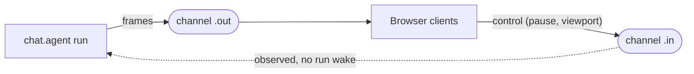

**A side channel is a named `.in`/`.out` stream pair on a [Session](/ai-chat/sessions), separate from the reserved chat transcript.** Like the transcript it is durable and cross-run, but it is addressed by a name, and writing its `.in` does not wake or trigger a run.

Use one when an agent needs to stream out-of-band data alongside the conversation: a feed of browser screenshots, progress telemetry, or a control channel the client writes to. The transcript stays clean, and many clients can read the side channel live while the agent produces it.



## Define the channel once

Declare the channel's record types in one shared module with `sessions.defineChannel`, then import it on both the producer and the consumer so the types line up.

```ts /trigger/channels.ts
import { sessions } from "@trigger.dev/sdk";

export type ScreenshotFrame = { url: string; step: number };
export type ViewportControl = { paused: boolean };

export const screenshots = sessions.defineChannel<{
  out: ScreenshotFrame;
  in: ViewportControl;
}>("screenshots");
```

## Produce on `.out` from a chat.agent

Inside a `chat.agent` run, `chat.channel(...)` opens a channel on the current run's Session. Writing `.out` is durable and cross-run, and wakes nothing. The client control arrives on `.in.on(...)` without waking a run:

```ts /trigger/browser-agent.ts
import { chat } from "@trigger.dev/sdk/ai";
import { streamText } from "ai";
import { screenshots } from "./channels";

export const browserAgent = chat.agent({
  id: "browser-agent",
  run: async ({ messages, signal }) => {
    const frames = chat.channel(screenshots);

    frames.in.on((control) => setPaused(control.paused)); // control: ViewportControl

    driveBrowser({
      signal,
      onFrame: (frame) => frames.out.append(frame), // frame: ScreenshotFrame
    });

    return streamText({ model, messages, abortSignal: signal }); // transcript, as usual
  },
});
```

Outside a `chat.agent` run, open the channel from a session handle instead: `sessions.open(sessionId).channel(screenshots)`. The handle exposes the same `.out` (`append` / `pipe` / `writer`) and `.in` (`send` / `on` / `once` / `peek`) surface as the reserved pair.

<Note>
  A side channel's `.in` is subscribe-only from the run's side (`.on` / `.once` / `.peek`). `.wait()`
  is not supported on a named channel, because a side channel never suspends or wakes a run.
</Note>

## Read `.out` in React

`useSessionStreamChannel` reads one side of a channel and updates a `records` array. Pass the channel definition as the type argument so `records` is typed from it. `from: "latest"` with `maxRecords: 1` gives a live "latest frame" view with bounded memory:

```tsx app/components/Screencast.tsx
"use client";

import { useSessionStreamChannel } from "@trigger.dev/react-hooks";
import type { screenshots } from "../trigger/channels";

export function Screencast({ sessionId, accessToken }: { sessionId: string; accessToken: string }) {
  const { records } = useSessionStreamChannel<typeof screenshots>("screenshots", {
    sessionId,
    accessToken,
    io: "out",
    from: "latest",
    maxRecords: 1,
  });

  const latest = records[0]; // ScreenshotFrame | undefined
  return latest ?  : <p>Waiting…</p>;
}
```

`useSessionStreamChannel` has the same options and return shape as [`useSessionStream`](/realtime/react-hooks/session-stream) (`io`, `from`, `maxRecords`, `lastEventId`, `onRecords`, `onControl`, `throttleInMs`, `timeoutInSeconds`), plus the typed channel generic. A bare name string works without the generic, with `records` typed `unknown`.

The client writes the `.in` control with a session handle: `sessions.open(sessionId).channel(screenshots).in.send({ paused: true })`. This appends to the channel and does not wake a run.

## Retention

A side channel has no chat turn loop trimming it, so each channel gets a default native retention (bounded age plus delete-when-empty) applied on first use. Override it per channel:

```ts
chat.channel(screenshots, {
  retention: { maxAgeSeconds: 60 * 60, deleteOnEmptyMinAgeSeconds: 5 * 60 },
});
```

<Warning>
  Records are capped at ~1 MiB each. Stream a pointer, not bytes: write large payloads (a screenshot
  PNG) to object storage and put the URL on the channel. A base64 image inflates ~33% and will exceed
  the cap. Pointers also keep the channel small and cheap to keep-last.
</Warning>

## Auth

A side channel is covered by the session's public access token: a token scoped to `read:sessions:{id}` / `write:sessions:{id}` grants every channel of that session. Mint a narrower token scoped to a single channel with `read:sessions:{id}:channels:{name}`. Writing a channel's `.out` requires secret-key auth (only the agent run), so a browser cannot forge frames; `.in` is writable with the session token. See [Realtime auth](/realtime/auth).

## Next steps

<CardGroup cols={2}>
  <Card title="Sessions" icon="layer-group" href="/ai-chat/sessions">
    The durable, cross-run primitive side channels are built on.
  </Card>
  <Card title="Read a session channel in React" icon="react" href="/realtime/react-hooks/session-stream">
    The `useSessionStream` hook `useSessionStreamChannel` mirrors.
  </Card>
</CardGroup>
