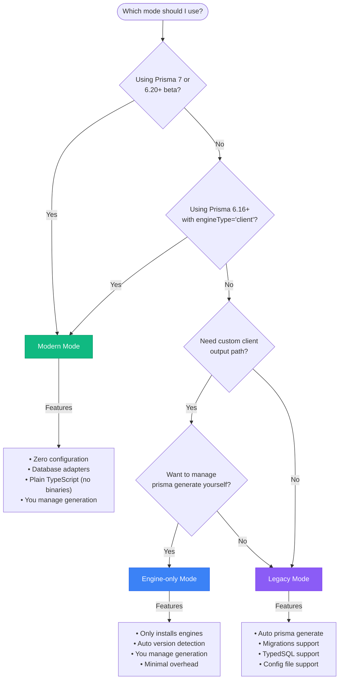

The `prismaExtension` supports multiple Prisma versions and deployment strategies through **three distinct modes** that handle the evolving Prisma ecosystem, from legacy setups to Prisma 7.

<Note>
  The `prismaExtension` requires an explicit `mode` parameter. All configurations must specify a
  mode.
</Note>

## Migration from previous versions

### Before (pre 4.1.1)

```ts
import { prismaExtension } from "@trigger.dev/build/extensions/prisma";

extensions: [
  prismaExtension({
    schema: "prisma/schema.prisma",
    migrate: true,
    typedSql: true,
    directUrlEnvVarName: "DATABASE_URL_UNPOOLED",
  }),
];
```

### After (4.1.1+)

```ts
import { prismaExtension } from "@trigger.dev/build/extensions/prisma";

extensions: [
  prismaExtension({
    mode: "legacy", // MODE IS REQUIRED
    schema: "prisma/schema.prisma",
    migrate: true,
    typedSql: true,
    directUrlEnvVarName: "DATABASE_URL_UNPOOLED",
  }),
];
```

## Choosing the right mode

Use this decision tree to determine which mode is right for your project:



## Extension modes

### Legacy mode

**Use when:** You're using Prisma 6.x or earlier with the `prisma-client-js` provider.

**Features:**

- Automatic `prisma generate` during deployment
- Supports single-file schemas (`prisma/schema.prisma`)
- Supports multi-file schemas (Prisma 6.7+, directory-based schemas)
- Supports Prisma config files (`prisma.config.ts`) via `@prisma/config` package
- Migration support with `migrate: true`
- TypedSQL support with `typedSql: true`
- Custom generator selection
- Handles Prisma client versioning automatically (with filesystem fallback detection)
- Automatic extraction of schema and migrations paths from config files

**Schema configuration:**

```prisma
generator client {
  provider        = "prisma-client-js"
  previewFeatures = ["typedSql"]
}

datasource db {
  provider  = "postgresql"
  url       = env("DATABASE_URL")
  directUrl = env("DATABASE_URL_UNPOOLED")
}
```

**Extension configuration:**

```ts
// Single-file schema
prismaExtension({
  mode: "legacy",
  schema: "prisma/schema.prisma",
  migrate: true,
  typedSql: true,
  directUrlEnvVarName: "DATABASE_URL_UNPOOLED",
});

// Multi-file schema (Prisma 6.7+)
prismaExtension({
  mode: "legacy",
  schema: "./prisma", // Point to directory
  migrate: true,
  typedSql: true,
  directUrlEnvVarName: "DATABASE_URL_UNPOOLED",
});
```

**Tested versions:**

- Prisma 6.14.0
- Prisma 6.7.0+ (multi-file schema support)
- Prisma 5.x

---

### Engine-only mode

**Use when:** You have a custom Prisma client output path and want to manage `prisma generate` yourself.

**Features:**

- Only installs Prisma engine binaries (no client generation)
- Automatic version detection from `@prisma/client`
- Manual override of version and binary target
- Minimal overhead - just ensures engines are available
- You control when and how `prisma generate` runs

**Schema configuration:**

```prisma
generator client {
  provider      = "prisma-client-js"
  output        = "../src/generated/prisma"
  // Ensure the "debian-openssl-3.0.x" binary target is included for deployment to the trigger.dev cloud
  binaryTargets = ["native", "debian-openssl-3.0.x"]
}

datasource db {
  provider  = "postgresql"
  url       = env("DATABASE_URL")
  directUrl = env("DATABASE_URL_UNPOOLED")
}
```

**Extension configuration:**

```ts
// Auto-detect version
prismaExtension({
  mode: "engine-only",
});

// Explicit version (recommended for reproducible builds)
prismaExtension({
  mode: "engine-only",
  version: "6.19.0",
});
```

**Important notes:**

- You **must** run `prisma generate` yourself (typically in a prebuild script)
- Your schema **must** include the correct `binaryTargets` for deployment to the trigger.dev cloud. The binary target is `debian-openssl-3.0.x`.
- The extension sets `PRISMA_QUERY_ENGINE_LIBRARY` and `PRISMA_QUERY_ENGINE_SCHEMA_ENGINE` environment variables to the correct paths for the binary targets.

**package.json example:**

```json
{
  "scripts": {
    "prebuild": "prisma generate",
    "dev": "trigger dev",
    "deploy": "trigger deploy"
  }
}
```

**Tested versions:**

- Prisma 6.19.0
- Prisma 6.16.0+

---

### Modern mode

**Use when:** You're using Prisma 6.16+ with the new `prisma-client` provider (with `engineType = "client"`) or preparing for Prisma 7.

**Features:**

- Designed for the new Prisma architecture
- Zero configuration required
- Automatically marks `@prisma/client` as external
- Works with Prisma 7 beta releases & Prisma 7 when released
- You manage client generation (like engine-only mode)

**Schema configuration (Prisma 6.16+ with engineType):**

```prisma
generator client {
  provider        = "prisma-client"
  output          = "../src/generated/prisma"
  engineType      = "client"
  previewFeatures = ["views"]
}

datasource db {
  provider  = "postgresql"
  url       = env("DATABASE_URL")
  directUrl = env("DATABASE_URL_UNPOOLED")
}
```

**Schema configuration (Prisma 7):**

```prisma
generator client {
  provider = "prisma-client"
  output   = "../src/generated/prisma"
}

datasource db {
  provider = "postgresql"
}
```

**Extension configuration:**

```ts
prismaExtension({
  mode: "modern",
});
```

**Prisma config (Prisma 7):**

```ts
// prisma.config.ts
import { defineConfig, env } from "prisma/config";
import "dotenv/config";

export default defineConfig({
  schema: "prisma/schema.prisma",
  migrations: {
    path: "prisma/migrations",
  },
  datasource: {
    url: env("DATABASE_URL"),
  },
});
```

**Important notes:**

- You **must** run `prisma generate` yourself
- Requires Prisma 6.16.0+ or Prisma 7 beta
- The new `prisma-client` provider generates plain TypeScript (no Rust binaries)
- Requires database adapters (e.g., `@prisma/adapter-pg` for PostgreSQL)

**Tested versions:**

- Prisma 6.16.0 with `engineType = "client"`
- Prisma 6.20.0-integration-next.8 (Prisma 7 beta)

---

## Migration guide

### From old prismaExtension to legacy mode

If you were using the previous `prismaExtension`, migrate to legacy mode:

```ts
// Old
prismaExtension({
  schema: "prisma/schema.prisma",
  migrate: true,
});

// New - add mode
prismaExtension({
  mode: "legacy",
  schema: "prisma/schema.prisma",
  migrate: true,
});
```

### From managing your own Prisma setup

If you previously handled Prisma generation yourself and just needed engine binaries, use engine-only mode:

```ts
prismaExtension({
  mode: "engine-only",
  version: "6.19.0", // Match your @prisma/client version
});
```

### Preparing for Prisma 7

If you want to adopt the new Prisma architecture, use modern mode:

1. Update your schema to use `prisma-client` provider
2. Add database adapters to your dependencies
3. Configure the extension:

```ts
prismaExtension({
  mode: "modern",
});
```

---

## Version compatibility matrix

| Prisma version   | Recommended mode      | Notes                                        |
| ---------------- | --------------------- | -------------------------------------------- |
| < 5.0            | Legacy                | Older Prisma versions                        |
| 5.0 - 6.15       | Legacy                | Standard Prisma setup                        |
| 6.7+             | Legacy                | Multi-file schema support                    |
| 6.16+            | Engine-only or Modern | Modern mode requires `engineType = "client"` |
| 6.20+ (7.0 beta) | Modern                | Prisma 7 with new architecture               |

---

## Prisma config file support

Legacy mode supports loading configuration from a `prisma.config.ts` file using the official `@prisma/config` package.

**Use when:** You want to use Prisma's new config file format (Prisma 6+) to centralize your Prisma configuration.

**Benefits:**

- Single source of truth for Prisma configuration
- Automatic extraction of schema location and migrations path
- Type-safe configuration with TypeScript
- Works seamlessly with Prisma 7's config-first approach

**prisma.config.ts:**

```ts
import { defineConfig, env } from "prisma/config";
import "dotenv/config";

export default defineConfig({
  schema: "prisma/schema.prisma",
  migrations: {
    path: "prisma/migrations",
  },
  datasource: {
    url: env("DATABASE_URL"),
    directUrl: env("DATABASE_URL_UNPOOLED"),
  },
});
```

**trigger.config.ts:**

```ts
import { prismaExtension } from "@trigger.dev/build/extensions/prisma";

prismaExtension({
  mode: "legacy",
  configFile: "./prisma.config.ts", // Use config file instead of schema
  migrate: true,
  directUrlEnvVarName: "DATABASE_URL_UNPOOLED", // For migrations
});
```

**What gets extracted:**

- `schema` - The schema file or directory path
- `migrations.path` - The migrations directory path (if specified)

**Note:** Either `schema` or `configFile` must be specified, but not both.

**When to use which:**

| Use `schema` option          | Use `configFile` option           |
| ---------------------------- | --------------------------------- |
| Standard Prisma setup        | Using Prisma 6+ with config files |
| Single or multi-file schemas | Preparing for Prisma 7            |
| No `prisma.config.ts` file   | Centralized configuration needed  |
| Simple setup                 | Want migrations path in config    |

---

## Multi-file schema support

Prisma 6.7 introduced support for splitting your schema across multiple files in a directory structure.

**Example structure:**

```
prisma/
├── schema.prisma (main file with generator/datasource)
├── models/
│   ├── users.prisma
│   └── posts.prisma
└── sql/
    └── getUserByEmail.sql
```

**Configuration:**

```ts
prismaExtension({
  mode: "legacy",
  schema: "./prisma", // Point to directory instead of file
  migrate: true,
  typedSql: true,
});
```

**package.json:**

```json
{
  "prisma": {
    "schema": "./prisma"
  }
}
```

---

## TypedSQL support

TypedSQL is available in legacy mode for Prisma 5.19.0+ with the `typedSql` preview feature.

**Schema configuration:**

```prisma
generator client {
  provider        = "prisma-client-js"
  previewFeatures = ["typedSql"]
}
```

**Extension configuration:**

```ts
prismaExtension({
  mode: "legacy",
  schema: "prisma/schema.prisma",
  typedSql: true, // Enable TypedSQL
});
```

**Usage in tasks:**

```ts
import { db, sql } from "./db";

const users = await db.$queryRawTyped(sql.getUserByEmail("user@example.com"));
```

---

## Database migration support

Migrations are supported in legacy mode only.

**Extension configuration:**

```ts
// Using schema option
prismaExtension({
  mode: "legacy",
  schema: "prisma/schema.prisma",
  migrate: true, // Run migrations on deployment
  directUrlEnvVarName: "DATABASE_URL_UNPOOLED", // For connection pooling
});

// Using configFile option
prismaExtension({
  mode: "legacy",
  configFile: "./prisma.config.ts", // Migrations path extracted from config
  migrate: true,
});
```

**What this does:**

1. Copies `prisma/migrations/` to the build output
2. Runs `prisma migrate deploy` before generating the client
3. Uses the `directUrlEnvVarName` for unpooled connections (required for migrations)

When using `configFile`, the migrations path is automatically extracted from your `prisma.config.ts`:

```ts
// prisma.config.ts
export default defineConfig({
  schema: "prisma/schema.prisma",
  migrations: {
    path: "prisma/migrations", // Automatically used by the extension
  },
});
```

---

## Binary targets and deployment

### Trigger.dev Cloud

The default binary target is `debian-openssl-3.0.x` for Trigger.dev Cloud deployments.

**Legacy mode:** Handled automatically

**Engine-only mode:** Specify in schema like so:

```prisma
generator client {
  provider      = "prisma-client-js"
  binaryTargets = ["native", "debian-openssl-3.0.x"]
}
```

**Modern mode:** Handled by database adapters

### Self-hosted / local deployment

For local deployments (e.g., Docker on macOS), you may need a different binary target like so:

```ts
prismaExtension({
  mode: "engine-only",
  version: "6.19.0",
  binaryTarget: "linux-arm64-openssl-3.0.x", // For macOS ARM64
});
```

---

## Environment variables

### Required variables

All modes:

- `DATABASE_URL`: Your database connection string

Legacy mode with migrations:

- `DATABASE_URL_UNPOOLED` (or your custom `directUrlEnvVarName`): Direct database connection for migrations

### Auto-set variables

Engine-only mode sets:

- `PRISMA_QUERY_ENGINE_LIBRARY`: Path to the query engine
- `PRISMA_QUERY_ENGINE_SCHEMA_ENGINE`: Path to the schema engine

---

## Troubleshooting

### "Could not find Prisma schema"

**Legacy mode:** Ensure the `schema` path is correct relative to your working directory.

```ts
// If your project structure is:
// project/
//   trigger.config.ts
//   prisma/
//     schema.prisma

prismaExtension({
  mode: "legacy",
  schema: "./prisma/schema.prisma", // Correct
  // schema: "prisma/schema.prisma", // Also works
});
```

### "Could not determine @prisma/client version"

The extension includes improved version detection that tries multiple strategies:

1. Check if `@prisma/client` is imported in your code (externals)
2. Use the `version` option if specified
3. Detect from filesystem by looking for `@prisma/client` or `prisma` in `node_modules`

**Legacy mode:** The extension will automatically detect the version from your installed packages. If it still fails, specify the version explicitly:

```ts
prismaExtension({
  mode: "legacy",
  schema: "prisma/schema.prisma",
  version: "6.19.0", // Add explicit version
});
```

**Engine-only mode:** Specify the version explicitly:

```ts
prismaExtension({
  mode: "engine-only",
  version: "6.19.0", // Add explicit version
});
```

### "Binary target not found"

**Engine-only mode:** Make sure your schema includes the deployment binary target:

```prisma
generator client {
  provider      = "prisma-client-js"
  binaryTargets = ["native", "linux-arm64-openssl-3.0.x"]
}
```

### "Module not found: @prisma/client/sql"

**Legacy mode:** Make sure `typedSql: true` is set and you have Prisma 5.19.0+:

```ts
prismaExtension({
  mode: "legacy",
  schema: "prisma/schema.prisma",
  typedSql: true, // Required for TypedSQL
});
```

### "Config file not found" or config loading errors

**Legacy mode with configFile:** Ensure the config file path is correct:

```ts
prismaExtension({
  mode: "legacy",
  configFile: "./prisma.config.ts", // Path relative to project root
  migrate: true,
});
```

**Requirements:**

- The config file must exist at the specified path
- Your project must have the `prisma` package installed (Prisma 6+)
- The config file must have a default export
- The config must specify a `schema` path

**Debugging:**

Use `--log-level debug` in your `trigger deploy` command to see detailed logs:

```ts
npx trigger.dev@latest deploy --log-level debug
```

Then grep for `[PrismaExtension]` in your build logs to see detailed information about config loading, schema resolution, and migrations setup.

---

## Complete examples

### Example 1: Standard Prisma 6 setup (legacy mode)

**prisma/schema.prisma:**

```prisma
generator client {
  provider        = "prisma-client-js"
  previewFeatures = ["typedSql"]
}

datasource db {
  provider  = "postgresql"
  url       = env("DATABASE_URL")
  directUrl = env("DATABASE_URL_UNPOOLED")
}
```

**trigger.config.ts:**

```ts
import { defineConfig } from "@trigger.dev/sdk";
import { prismaExtension } from "@trigger.dev/build/extensions/prisma";

export default defineConfig({
  project: process.env.TRIGGER_PROJECT_REF!,
  build: {
    extensions: [
      prismaExtension({
        mode: "legacy",
        schema: "prisma/schema.prisma",
        migrate: true,
        typedSql: true,
        directUrlEnvVarName: "DATABASE_URL_UNPOOLED",
      }),
    ],
  },
});
```

---

### Example 2: Multi-file schema (legacy mode)

**prisma/schema.prisma:**

```prisma
generator client {
  provider        = "prisma-client-js"
  previewFeatures = ["typedSql"]
}

datasource db {
  provider  = "postgresql"
  url       = env("DATABASE_URL")
  directUrl = env("DATABASE_URL_UNPOOLED")
}
```

**prisma/models/users.prisma:**

```prisma
model User {
  id        String  @id @default(cuid())
  email     String  @unique
  name      String?
  posts     Post[]
}
```

**prisma/models/posts.prisma:**

```prisma
model Post {
  id        String   @id @default(cuid())
  title     String
  content   String
  authorId  String
  author    User     @relation(fields: [authorId], references: [id])
}
```

**package.json:**

```json
{
  "prisma": {
    "schema": "./prisma"
  }
}
```

**trigger.config.ts:**

```ts
prismaExtension({
  mode: "legacy",
  schema: "./prisma", // Directory, not file
  migrate: true,
  typedSql: true,
  directUrlEnvVarName: "DATABASE_URL_UNPOOLED",
});
```

---

### Example 3: Using Prisma config file (legacy mode)

Use a `prisma.config.ts` file to centralize your Prisma configuration.

**prisma.config.ts:**

```ts
import { defineConfig, env } from "prisma/config";
import "dotenv/config";

export default defineConfig({
  schema: "prisma/schema.prisma",
  migrations: {
    path: "prisma/migrations",
  },
  datasource: {
    url: env("DATABASE_URL"),
    directUrl: env("DATABASE_URL_UNPOOLED"),
  },
});
```

**prisma/schema.prisma:**

```prisma
generator client {
  provider        = "prisma-client-js"
  previewFeatures = ["typedSql"]
}

datasource db {
  provider  = "postgresql"
  url       = env("DATABASE_URL")
  directUrl = env("DATABASE_URL_UNPOOLED")
}

model User {
  id        String  @id @default(cuid())
  email     String  @unique
  name      String?
}
```

**trigger.config.ts:**

```ts
import { defineConfig } from "@trigger.dev/sdk";
import { prismaExtension } from "@trigger.dev/build/extensions/prisma";

export default defineConfig({
  project: process.env.TRIGGER_PROJECT_REF!,
  build: {
    extensions: [
      prismaExtension({
        mode: "legacy",
        configFile: "./prisma.config.ts", // Load from config file
        migrate: true,
        typedSql: true,
        // schema and migrations path are extracted from prisma.config.ts
      }),
    ],
  },
});
```

**src/db.ts:**

```ts
import { PrismaClient } from "@prisma/client";
export * as sql from "@prisma/client/sql";

export const db = new PrismaClient({
  datasources: {
    db: {
      url: process.env.DATABASE_URL,
    },
  },
});
```

---

### Example 4: Custom output path (engine-only mode)

**prisma/schema.prisma:**

```prisma
generator client {
  provider      = "prisma-client-js"
  output        = "../src/generated/prisma"
  binaryTargets = ["native", "linux-arm64-openssl-3.0.x"]
}

datasource db {
  provider  = "postgresql"
  url       = env("DATABASE_URL")
  directUrl = env("DATABASE_URL_UNPOOLED")
}
```

**package.json:**

```json
{
  "scripts": {
    "generate": "prisma generate",
    "dev": "pnpm generate && trigger dev",
    "deploy": "trigger deploy"
  }
}
```

**trigger.config.ts:**

```ts
prismaExtension({
  mode: "engine-only",
  version: "6.19.0",
  binaryTarget: "linux-arm64-openssl-3.0.x",
});
```

**src/db.ts:**

```ts
import { PrismaClient } from "./generated/prisma/client.js";

export const db = new PrismaClient({
  datasources: {
    db: {
      url: process.env.DATABASE_URL,
    },
  },
});
```

---

### Example 5: Prisma 7 beta (modern mode)

**prisma/schema.prisma:**

```prisma
generator client {
  provider = "prisma-client"
  output   = "../src/generated/prisma"
}

datasource db {
  provider = "postgresql"
}
```

**prisma.config.ts:**

```ts
import { defineConfig, env } from "prisma/config";
import "dotenv/config";

export default defineConfig({
  schema: "prisma/schema.prisma",
  migrations: {
    path: "prisma/migrations",
  },
  datasource: {
    url: env("DATABASE_URL"),
  },
});
```

**package.json:**

```json
{
  "dependencies": {
    "@prisma/client": "6.20.0-integration-next.8",
    "@prisma/adapter-pg": "6.20.0-integration-next.8"
  },
  "scripts": {
    "generate": "prisma generate",
    "dev": "pnpm generate && trigger dev",
    "deploy": "trigger deploy"
  }
}
```

**trigger.config.ts:**

```ts
prismaExtension({
  mode: "modern",
});
```

**src/db.ts:**

```ts
import { PrismaClient } from "./generated/prisma/client.js";
import { PrismaPg } from "@prisma/adapter-pg";

const adapter = new PrismaPg({
  connectionString: process.env.DATABASE_URL!,
});

export const db = new PrismaClient({ adapter });
```

---

## Resources

- [Prisma Documentation](https://www.prisma.io/docs)
- [Multi-File Schema (Prisma 6.7+)](https://www.prisma.io/docs/orm/prisma-schema/overview/location#multi-file-prisma-schema)
- [TypedSQL (Prisma 5.19+)](https://www.prisma.io/docs/orm/prisma-client/using-raw-sql/typedsql)
- [Prisma 7 Beta Documentation](https://www.prisma.io/docs)

---
