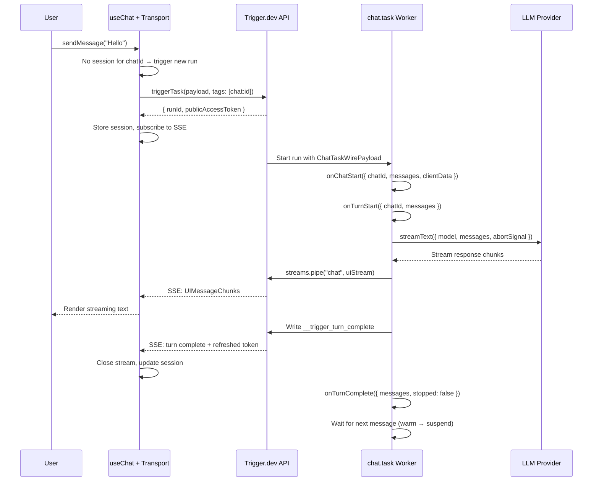
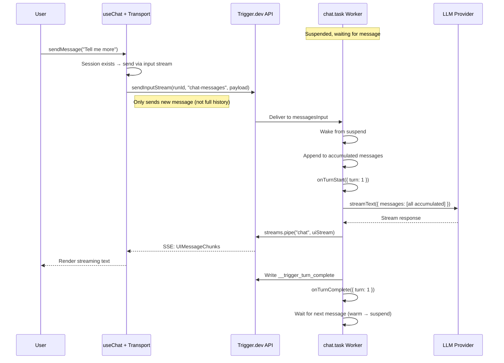
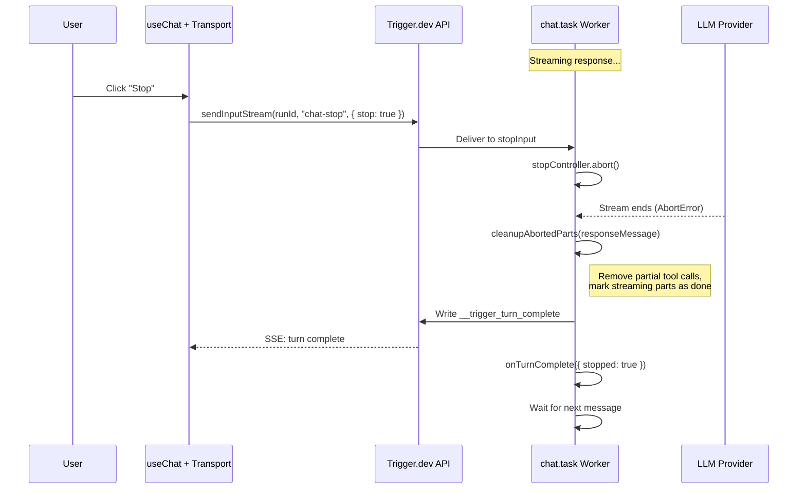

## Overview

The `@trigger.dev/sdk` provides a custom [ChatTransport](https://sdk.vercel.ai/docs/ai-sdk-ui/transport) for the Vercel AI SDK's `useChat` hook. This lets you run chat completions as **durable Trigger.dev tasks** instead of fragile API routes — with automatic retries, observability, and realtime streaming built in.

**How it works:**
1. The frontend sends messages via `useChat` through `TriggerChatTransport`
2. The first message triggers a Trigger.dev task; subsequent messages resume the **same run** via input streams
3. The task streams `UIMessageChunk` events back via Trigger.dev's realtime streams
4. The AI SDK's `useChat` processes the stream natively — text, tool calls, reasoning, etc.
5. Between turns, the run stays warm briefly then suspends (freeing compute) until the next message

No custom API routes needed. Your chat backend is a Trigger.dev task.

<Accordion title="How it works (sequence diagrams)">

### First message flow



### Multi-turn flow



### Stop signal flow



</Accordion>

<Note>
  Requires `@trigger.dev/sdk` version **4.4.0 or later** and the `ai` package **v5.0.0 or later**.
</Note>

## Quick start

<Steps>
  <Step title="Define a chat task">
    Use `chat.task` from `@trigger.dev/sdk/ai` to define a task that handles chat messages. The `run` function receives `ModelMessage[]` (already converted from the frontend's `UIMessage[]`) — pass them directly to `streamText`.

    If you return a `StreamTextResult`, it's **automatically piped** to the frontend.

    ```ts trigger/chat.ts
    import { chat } from "@trigger.dev/sdk/ai";
    import { streamText } from "ai";
    import { openai } from "@ai-sdk/openai";

    export const myChat = chat.task({
      id: "my-chat",
      run: async ({ messages, signal }) => {
        // messages is ModelMessage[] — pass directly to streamText
        // signal fires on stop or run cancel
        return streamText({
          model: openai("gpt-4o"),
          messages,
          abortSignal: signal,
        });
      },
    });
    ```
  </Step>

  <Step title="Generate an access token">
    On your server (e.g. a Next.js server action), create a trigger public token scoped to your chat task:

    ```ts app/actions.ts
    "use server";

    import { chat } from "@trigger.dev/sdk/ai";
    import type { myChat } from "@/trigger/chat";

    export const getChatToken = () =>
      chat.createAccessToken<typeof myChat>("my-chat");
    ```
  </Step>

  <Step title="Use in the frontend">
    Use the `useTriggerChatTransport` hook from `@trigger.dev/sdk/chat/react` to create a memoized transport instance, then pass it to `useChat`:

    ```tsx app/components/chat.tsx
    "use client";

    import { useChat } from "@ai-sdk/react";
    import { useTriggerChatTransport } from "@trigger.dev/sdk/chat/react";
    import type { myChat } from "@/trigger/chat";
    import { getChatToken } from "@/app/actions";

    export function Chat() {
      const transport = useTriggerChatTransport<typeof myChat>({
        task: "my-chat",
        accessToken: getChatToken,
      });

      const { messages, sendMessage, stop, status } = useChat({ transport });

      return (
        <div>
          {messages.map((m) => (
            <div key={m.id}>
              <strong>{m.role}:</strong>
              {m.parts.map((part, i) =>
                part.type === "text" ? <span key={i}>{part.text}</span> : null
              )}
            </div>
          ))}

          <form
            onSubmit={(e) => {
              e.preventDefault();
              const input = e.currentTarget.querySelector("input");
              if (input?.value) {
                sendMessage({ text: input.value });
                input.value = "";
              }
            }}
          >
            <input placeholder="Type a message..." />
            <button type="submit" disabled={status === "streaming"}>
              Send
            </button>
            {status === "streaming" && (
              <button type="button" onClick={stop}>
                Stop
              </button>
            )}
          </form>
        </div>
      );
    }
    ```
  </Step>
</Steps>

## How multi-turn works

### One run, many turns

The entire conversation lives in a **single Trigger.dev run**. After each AI response, the run waits for the next message via input streams. The frontend transport handles this automatically — it triggers a new run for the first message, and sends subsequent messages to the existing run.

This means your conversation has full observability in the Trigger.dev dashboard: every turn is a span inside the same run.

### Warm and suspended states

After each turn, the run goes through two phases of waiting:

1. **Warm phase** (default 30s) — The run stays active and responds instantly to the next message. Uses compute.
2. **Suspended phase** (default up to 1h) — The run suspends, freeing compute. It wakes when the next message arrives. There's a brief delay as the run resumes.

If no message arrives within the turn timeout, the run ends gracefully. The next message from the frontend will automatically start a fresh run.

<Info>
  You are not charged for compute during the suspended phase. Only the warm phase uses compute resources.
</Info>

### What the backend accumulates

The backend automatically accumulates the full conversation history across turns. After the first turn, the frontend transport only sends the new user message — not the entire history. This is handled transparently by the transport and task.

The accumulated messages are available in:
- `run()` as `messages` (`ModelMessage[]`) — for passing to `streamText`
- `onTurnStart()` as `uiMessages` (`UIMessage[]`) — for persisting before streaming
- `onTurnComplete()` as `uiMessages` (`UIMessage[]`) — for persisting after the response

## Backend patterns

### Simple: return a StreamTextResult

The easiest approach — return the `streamText` result from `run` and it's automatically piped to the frontend:

```ts
import { chat } from "@trigger.dev/sdk/ai";
import { streamText } from "ai";
import { openai } from "@ai-sdk/openai";

export const simpleChat = chat.task({
  id: "simple-chat",
  run: async ({ messages, signal }) => {
    return streamText({
      model: openai("gpt-4o"),
      system: "You are a helpful assistant.",
      messages,
      abortSignal: signal,
    });
  },
});
```

### Using chat.pipe() for complex flows

For complex agent flows where `streamText` is called deep inside your code, use `chat.pipe()`. It works from **anywhere inside a task** — even nested function calls.

```ts trigger/agent-chat.ts
import { chat } from "@trigger.dev/sdk/ai";
import { streamText } from "ai";
import { openai } from "@ai-sdk/openai";
import type { ModelMessage } from "ai";

export const agentChat = chat.task({
  id: "agent-chat",
  run: async ({ messages }) => {
    // Don't return anything — chat.pipe is called inside
    await runAgentLoop(messages);
  },
});

async function runAgentLoop(messages: ModelMessage[]) {
  // ... agent logic, tool calls, etc.

  const result = streamText({
    model: openai("gpt-4o"),
    messages,
  });

  // Pipe from anywhere — no need to return it
  await chat.pipe(result);
}
```

### Manual mode with task()

If you need full control over task options, use the standard `task()` with `ChatTaskPayload` and `chat.pipe()`:

```ts
import { task } from "@trigger.dev/sdk";
import { chat, type ChatTaskPayload } from "@trigger.dev/sdk/ai";
import { streamText } from "ai";
import { openai } from "@ai-sdk/openai";

export const manualChat = task({
  id: "manual-chat",
  retry: { maxAttempts: 3 },
  queue: { concurrencyLimit: 10 },
  run: async (payload: ChatTaskPayload) => {
    const result = streamText({
      model: openai("gpt-4o"),
      messages: payload.messages,
    });

    await chat.pipe(result);
  },
});
```

<Warning>
  Manual mode does not get automatic message accumulation or the `onTurnComplete`/`onChatStart` lifecycle hooks. The `responseMessage` field in `onTurnComplete` will be `undefined` when using `chat.pipe()` directly. Use `chat.task()` for the full multi-turn experience.
</Warning>

## Lifecycle hooks

### onChatStart

Fires once on the first turn (turn 0) before `run()` executes. Use it to create a chat record in your database.

The `continuation` field tells you whether this is a brand new chat or a continuation of an existing one (where the previous run timed out or was cancelled):

```ts
export const myChat = chat.task({
  id: "my-chat",
  onChatStart: async ({ chatId, clientData, continuation }) => {
    if (continuation) {
      // Previous run ended — chat record already exists, just update session
      return;
    }
    // Brand new chat — create the record
    const { userId } = clientData as { userId: string };
    await db.chat.create({
      data: { id: chatId, userId, title: "New chat" },
    });
  },
  run: async ({ messages, signal }) => {
    return streamText({ model: openai("gpt-4o"), messages, abortSignal: signal });
  },
});
```

<Tip>
  `clientData` contains custom data from the frontend — either the `clientData` option on the transport constructor (sent with every message) or the `metadata` option on `sendMessage()` (per-message). See [Client data and metadata](#client-data-and-metadata).
</Tip>

### onTurnStart

Fires at the start of every turn, after message accumulation and `onChatStart` (turn 0), but **before** `run()` executes. Use it to persist messages before streaming begins — so a mid-stream page refresh still shows the user's message.

| Field | Type | Description |
|-------|------|-------------|
| `chatId` | `string` | Chat session ID |
| `messages` | `ModelMessage[]` | Full accumulated conversation (model format) |
| `uiMessages` | `UIMessage[]` | Full accumulated conversation (UI format) |
| `turn` | `number` | Turn number (0-indexed) |
| `runId` | `string` | The Trigger.dev run ID |
| `chatAccessToken` | `string` | Scoped access token for this run |
| `continuation` | `boolean` | Whether this run is continuing an existing chat |

```ts
export const myChat = chat.task({
  id: "my-chat",
  onTurnStart: async ({ chatId, uiMessages, runId, chatAccessToken }) => {
    await db.chat.update({
      where: { id: chatId },
      data: { messages: uiMessages },
    });
    await db.chatSession.upsert({
      where: { id: chatId },
      create: { id: chatId, runId, publicAccessToken: chatAccessToken },
      update: { runId, publicAccessToken: chatAccessToken },
    });
  },
  run: async ({ messages, signal }) => {
    return streamText({ model: openai("gpt-4o"), messages, abortSignal: signal });
  },
});
```

<Tip>
  By persisting in `onTurnStart`, the user's message is saved to your database before the AI starts streaming. If the user refreshes mid-stream, the message is already there.
</Tip>

### onTurnComplete

Fires after each turn completes — after the response is captured, before waiting for the next message. This is the primary hook for persisting the assistant's response.

| Field | Type | Description |
|-------|------|-------------|
| `chatId` | `string` | Chat session ID |
| `messages` | `ModelMessage[]` | Full accumulated conversation (model format) |
| `uiMessages` | `UIMessage[]` | Full accumulated conversation (UI format) |
| `newMessages` | `ModelMessage[]` | Only this turn's messages (model format) |
| `newUIMessages` | `UIMessage[]` | Only this turn's messages (UI format) |
| `responseMessage` | `UIMessage \| undefined` | The assistant's response for this turn |
| `turn` | `number` | Turn number (0-indexed) |
| `runId` | `string` | The Trigger.dev run ID |
| `chatAccessToken` | `string` | Scoped access token for this run |
| `lastEventId` | `string \| undefined` | Stream position for resumption. Persist this with the session. |
| `stopped` | `boolean` | Whether the user stopped generation during this turn |
| `continuation` | `boolean` | Whether this run is continuing an existing chat |
| `rawResponseMessage` | `UIMessage \| undefined` | The raw assistant response before abort cleanup (same as `responseMessage` when not stopped) |

```ts
export const myChat = chat.task({
  id: "my-chat",
  onTurnComplete: async ({ chatId, uiMessages, runId, chatAccessToken, lastEventId }) => {
    await db.chat.update({
      where: { id: chatId },
      data: { messages: uiMessages },
    });
    await db.chatSession.upsert({
      where: { id: chatId },
      create: { id: chatId, runId, publicAccessToken: chatAccessToken, lastEventId },
      update: { runId, publicAccessToken: chatAccessToken, lastEventId },
    });
  },
  run: async ({ messages, signal }) => {
    return streamText({ model: openai("gpt-4o"), messages, abortSignal: signal });
  },
});
```

<Tip>
  Use `uiMessages` to overwrite the full conversation each turn (simplest). Use `newUIMessages` if you prefer to store messages individually — for example, one database row per message.
</Tip>

<Tip>
  Persist `lastEventId` alongside the session. When the transport reconnects after a page refresh, it uses this to skip past already-seen events — preventing duplicate messages.
</Tip>

## Persistence

### What needs to be persisted

To build a chat app that survives page refreshes, you need to persist two things:

1. **Messages** — The conversation history. Persisted **server-side** in the task via `onTurnStart` and `onTurnComplete`.
2. **Sessions** — The transport's connection state (`runId`, `publicAccessToken`, `lastEventId`). Persisted **server-side** via `onTurnStart` and `onTurnComplete`.

<Note>
  Sessions let the transport reconnect to an existing run after a page refresh. Without them, every page load would start a new run — losing the conversation context that was accumulated in the previous run.
</Note>

### Persisting messages and sessions (server-side)

Both messages and sessions are persisted server-side in the lifecycle hooks. `onTurnStart` saves the user's message before streaming begins, while `onTurnComplete` saves the assistant's response and the `lastEventId` for stream resumption.

```ts trigger/chat.ts
import { chat } from "@trigger.dev/sdk/ai";
import { streamText } from "ai";
import { openai } from "@ai-sdk/openai";
import { db } from "@/lib/db";

export const myChat = chat.task({
  id: "my-chat",
  onChatStart: async ({ chatId }) => {
    await db.chat.create({
      data: { id: chatId, title: "New chat", messages: [] },
    });
  },
  onTurnStart: async ({ chatId, uiMessages, runId, chatAccessToken }) => {
    // Save user message + session before streaming starts
    await db.chat.update({
      where: { id: chatId },
      data: { messages: uiMessages },
    });
    await db.chatSession.upsert({
      where: { id: chatId },
      create: { id: chatId, runId, publicAccessToken: chatAccessToken },
      update: { runId, publicAccessToken: chatAccessToken },
    });
  },
  onTurnComplete: async ({ chatId, uiMessages, runId, chatAccessToken, lastEventId }) => {
    // Save assistant response + stream position after turn completes
    await db.chat.update({
      where: { id: chatId },
      data: { messages: uiMessages },
    });
    await db.chatSession.upsert({
      where: { id: chatId },
      create: { id: chatId, runId, publicAccessToken: chatAccessToken, lastEventId },
      update: { runId, publicAccessToken: chatAccessToken, lastEventId },
    });
  },
  run: async ({ messages, signal }) => {
    return streamText({
      model: openai("gpt-4o"),
      messages,
      abortSignal: signal,
    });
  },
});
```

### Session cleanup (frontend)

Since session creation and updates are handled server-side, the frontend only needs to handle session deletion when a run ends:

```tsx
const transport = useTriggerChatTransport<typeof myChat>({
  task: "my-chat",
  accessToken: getChatToken,
  sessions: loadedSessions, // Restored from DB on page load
  onSessionChange: (chatId, session) => {
    if (!session) {
      deleteSession(chatId); // Server action — run ended
    }
  },
});
```

### Restoring on page load

On page load, fetch both the messages and the session from your database, then pass them to `useChat` and the transport. Pass `resume: true` to `useChat` when there's an existing conversation — this tells the AI SDK to reconnect to the stream via the transport.

```tsx app/page.tsx
"use client";

import { useEffect, useState } from "react";
import { useTriggerChatTransport } from "@trigger.dev/sdk/chat/react";
import { useChat } from "@ai-sdk/react";
import { getChatToken, getChatMessages, getSession, deleteSession } from "@/app/actions";

export default function ChatPage({ chatId }: { chatId: string }) {
  const [initialMessages, setInitialMessages] = useState([]);
  const [initialSession, setInitialSession] = useState(undefined);
  const [loaded, setLoaded] = useState(false);

  useEffect(() => {
    async function load() {
      const [messages, session] = await Promise.all([
        getChatMessages(chatId),
        getSession(chatId),
      ]);
      setInitialMessages(messages);
      setInitialSession(session ? { [chatId]: session } : undefined);
      setLoaded(true);
    }
    load();
  }, [chatId]);

  if (!loaded) return null;

  return (
    <ChatClient
      chatId={chatId}
      initialMessages={initialMessages}
      initialSessions={initialSession}
    />
  );
}

function ChatClient({ chatId, initialMessages, initialSessions }) {
  const transport = useTriggerChatTransport({
    task: "my-chat",
    accessToken: getChatToken,
    sessions: initialSessions,
    onSessionChange: (id, session) => {
      if (!session) deleteSession(id);
    },
  });

  const { messages, sendMessage, stop, status } = useChat({
    id: chatId,
    messages: initialMessages,
    transport,
    resume: initialMessages.length > 0, // Resume if there's an existing conversation
  });

  // ... render UI
}
```

<Info>
  `resume: true` causes `useChat` to call `reconnectToStream` on the transport when the component mounts. The transport uses the session's `lastEventId` to skip past already-seen stream events, so the frontend only receives new data. Only enable `resume` when there are existing messages — for brand new chats, there's nothing to reconnect to.
</Info>

<Warning>
  In React strict mode (enabled by default in Next.js dev), you may see a `TypeError: Cannot read properties of undefined (reading 'state')` in the console when using `resume`. This is a [known bug in the AI SDK](https://github.com/vercel/ai/issues/8477) caused by React strict mode double-firing the resume effect. The error is caught internally and **does not affect functionality** — streaming and message display work correctly. It only appears in development and will not occur in production builds.
</Warning>

### Full example

Putting it all together — a complete chat app with server-side persistence, session reconnection, and stream resumption:

<CodeGroup>
```ts trigger/chat.ts
import { chat } from "@trigger.dev/sdk/ai";
import { streamText } from "ai";
import { openai } from "@ai-sdk/openai";
import { z } from "zod";
import { db } from "@/lib/db";

export const myChat = chat.task({
  id: "my-chat",
  clientDataSchema: z.object({
    userId: z.string(),
  }),
  onChatStart: async ({ chatId, clientData }) => {
    await db.chat.create({
      data: { id: chatId, userId: clientData.userId, title: "New chat", messages: [] },
    });
  },
  onTurnStart: async ({ chatId, uiMessages, runId, chatAccessToken }) => {
    // Persist messages + session before streaming
    await db.chat.update({
      where: { id: chatId },
      data: { messages: uiMessages },
    });
    await db.chatSession.upsert({
      where: { id: chatId },
      create: { id: chatId, runId, publicAccessToken: chatAccessToken },
      update: { runId, publicAccessToken: chatAccessToken },
    });
  },
  onTurnComplete: async ({ chatId, uiMessages, runId, chatAccessToken, lastEventId }) => {
    // Persist assistant response + stream position
    await db.chat.update({
      where: { id: chatId },
      data: { messages: uiMessages },
    });
    await db.chatSession.upsert({
      where: { id: chatId },
      create: { id: chatId, runId, publicAccessToken: chatAccessToken, lastEventId },
      update: { runId, publicAccessToken: chatAccessToken, lastEventId },
    });
  },
  run: async ({ messages, signal }) => {
    return streamText({
      model: openai("gpt-4o"),
      messages,
      abortSignal: signal,
    });
  },
});
```

```ts app/actions.ts
"use server";

import { chat } from "@trigger.dev/sdk/ai";
import type { myChat } from "@/trigger/chat";
import { db } from "@/lib/db";

export const getChatToken = () =>
  chat.createAccessToken<typeof myChat>("my-chat");

export async function getChatMessages(chatId: string) {
  const found = await db.chat.findUnique({ where: { id: chatId } });
  return found?.messages ?? [];
}

export async function getAllSessions() {
  const sessions = await db.chatSession.findMany();
  const result: Record<string, {
    runId: string;
    publicAccessToken: string;
    lastEventId?: string;
  }> = {};
  for (const s of sessions) {
    result[s.id] = {
      runId: s.runId,
      publicAccessToken: s.publicAccessToken,
      lastEventId: s.lastEventId ?? undefined,
    };
  }
  return result;
}

export async function deleteSession(chatId: string) {
  await db.chatSession.delete({ where: { id: chatId } }).catch(() => {});
}
```

```tsx app/components/chat.tsx
"use client";

import { useChat } from "@ai-sdk/react";
import { useTriggerChatTransport } from "@trigger.dev/sdk/chat/react";
import type { myChat } from "@/trigger/chat";
import { getChatToken, deleteSession } from "@/app/actions";

export function Chat({ chatId, initialMessages, initialSessions }) {
  const transport = useTriggerChatTransport<typeof myChat>({
    task: "my-chat",
    accessToken: getChatToken,
    clientData: { userId: currentUser.id }, // Type-checked against clientDataSchema
    sessions: initialSessions,
    onSessionChange: (id, session) => {
      if (!session) deleteSession(id);
    },
  });

  const { messages, sendMessage, stop, status } = useChat({
    id: chatId,
    messages: initialMessages,
    transport,
    resume: initialMessages.length > 0,
  });

  return (
    <div>
      {messages.map((m) => (
        <div key={m.id}>
          <strong>{m.role}:</strong>
          {m.parts.map((part, i) =>
            part.type === "text" ? <span key={i}>{part.text}</span> : null
          )}
        </div>
      ))}

      <form
        onSubmit={(e) => {
          e.preventDefault();
          const input = e.currentTarget.querySelector("input");
          if (input?.value) {
            sendMessage({ text: input.value });
            input.value = "";
          }
        }}
      >
        <input placeholder="Type a message..." />
        <button type="submit" disabled={status === "streaming"}>
          Send
        </button>
        {status === "streaming" && (
          <button type="button" onClick={stop}>Stop</button>
        )}
      </form>
    </div>
  );
}
```
</CodeGroup>

## Stop generation

### How stop works

Calling `stop()` from `useChat` sends a stop signal to the running task via input streams. The task's `streamText` call aborts (if you passed `signal` or `stopSignal`), but the **run stays alive** and waits for the next message. The partial response is captured and accumulated normally.

### Abort signals

The `run` function receives three abort signals:

| Signal | Fires when | Use for |
|--------|-----------|---------|
| `signal` | Stop **or** cancel | Pass to `streamText` — handles both cases. **Use this in most cases.** |
| `stopSignal` | Stop only (per-turn, reset each turn) | Custom logic that should only run on user stop, not cancellation |
| `cancelSignal` | Run cancel, expire, or maxDuration exceeded | Cleanup that should only happen on full cancellation |

```ts
export const myChat = chat.task({
  id: "my-chat",
  run: async ({ messages, signal, stopSignal, cancelSignal }) => {
    return streamText({
      model: openai("gpt-4o"),
      messages,
      abortSignal: signal, // Handles both stop and cancel
    });
  },
});
```

<Tip>
  Use `signal` (the combined signal) in most cases. The separate `stopSignal` and `cancelSignal` are only needed if you want different behavior for stop vs cancel.
</Tip>

### Detecting stop in callbacks

The `onTurnComplete` event includes a `stopped` boolean that indicates whether the user stopped generation during that turn:

```ts
export const myChat = chat.task({
  id: "my-chat",
  onTurnComplete: async ({ chatId, uiMessages, stopped }) => {
    await db.chat.update({
      where: { id: chatId },
      data: { messages: uiMessages, lastStoppedAt: stopped ? new Date() : undefined },
    });
  },
  run: async ({ messages, signal }) => {
    return streamText({ model: openai("gpt-4o"), messages, abortSignal: signal });
  },
});
```

You can also check stop status from **anywhere** during a turn using `chat.isStopped()`. This is useful inside `streamText`'s `onFinish` callback where the AI SDK's `isAborted` flag can be unreliable (e.g. when using `createUIMessageStream` + `writer.merge()`):

```ts
import { chat } from "@trigger.dev/sdk/ai";
import { streamText } from "ai";

export const myChat = chat.task({
  id: "my-chat",
  run: async ({ messages, signal }) => {
    return streamText({
      model: openai("gpt-4o"),
      messages,
      abortSignal: signal,
      onFinish: ({ isAborted }) => {
        // isAborted may be false even after stop when using createUIMessageStream
        const wasStopped = isAborted || chat.isStopped();
        if (wasStopped) {
          // handle stop — e.g. log analytics
        }
      },
    });
  },
});
```

### Cleaning up aborted messages

When stop happens mid-stream, the captured response message can contain parts in an incomplete state — tool calls stuck in `partial-call`, reasoning blocks still marked as `streaming`, etc. These can cause UI issues like permanent spinners.

`chat.task` automatically cleans up the `responseMessage` when stop is detected before passing it to `onTurnComplete`. If you use `chat.pipe()` manually and capture response messages yourself, use `chat.cleanupAbortedParts()`:

```ts
const cleaned = chat.cleanupAbortedParts(rawResponseMessage);
```

This removes tool invocation parts stuck in `partial-call` state and marks any `streaming` text or reasoning parts as `done`.

<Note>
  Stop signal delivery is best-effort. There is a small race window where the model may finish before the stop signal arrives, in which case the turn completes normally with `stopped: false`. This is expected and does not require special handling.
</Note>

## Writing to the chat stream

### Custom chunks with `chat.stream`

`chat.stream` is a typed stream bound to the chat output. Use it to write custom `UIMessageChunk` data alongside the AI-generated response — for example, status updates or progress indicators.

```ts
import { chat } from "@trigger.dev/sdk/ai";

export const myChat = chat.task({
  id: "my-chat",
  run: async ({ messages, signal }) => {
    // Write a custom data part to the chat stream.
    // The AI SDK's data-* chunk protocol adds this to message.parts
    // on the frontend, where you can render it however you like.
    const { waitUntilComplete } = chat.stream.writer({
      execute: ({ write }) => {
        write({
          type: "data-status",
          id: "search-progress",
          data: { message: "Searching the web...", progress: 0.5 },
        });
      },
    });
    await waitUntilComplete();

    // Then stream the AI response
    return streamText({ model: openai("gpt-4o"), messages, abortSignal: signal });
  },
});
```

<Tip>
  Use `data-*` chunk types (e.g. `data-status`, `data-progress`) for custom data. The AI SDK processes these into `DataUIPart` objects in `message.parts` on the frontend. Writing the same `type` + `id` again updates the existing part instead of creating a new one — useful for live progress.
</Tip>

`chat.stream` exposes the full stream API:

| Method | Description |
|--------|-------------|
| `chat.stream.writer(options)` | Write individual chunks via a callback |
| `chat.stream.pipe(stream, options?)` | Pipe a `ReadableStream` or `AsyncIterable` |
| `chat.stream.append(value, options?)` | Append raw data |
| `chat.stream.read(runId, options?)` | Read the stream by run ID |

### Streaming from subtasks

When a tool invokes a subtask via `triggerAndWait`, the subtask can stream directly to the parent chat using `target: "root"`:

```ts
import { chat, ai } from "@trigger.dev/sdk/ai";
import { schemaTask } from "@trigger.dev/sdk";
import { streamText, generateId } from "ai";
import { z } from "zod";

// A subtask that streams progress back to the parent chat
export const researchTask = schemaTask({
  id: "research",
  schema: z.object({ query: z.string() }),
  run: async ({ query }) => {
    const partId = generateId();

    // Write a data-* chunk to the root run's chat stream.
    // The frontend receives this as a DataUIPart in message.parts.
    const { waitUntilComplete } = chat.stream.writer({
      target: "root",
      execute: ({ write }) => {
        write({
          type: "data-research-status",
          id: partId,
          data: { query, status: "in-progress" },
        });
      },
    });
    await waitUntilComplete();

    // Do the work...
    const result = await doResearch(query);

    // Update the same part with the final status
    const { waitUntilComplete: waitDone } = chat.stream.writer({
      target: "root",
      execute: ({ write }) => {
        write({
          type: "data-research-status",
          id: partId,
          data: { query, status: "done", resultCount: result.length },
        });
      },
    });
    await waitDone();

    return result;
  },
});

// The chat task uses it as a tool via ai.tool()
export const myChat = chat.task({
  id: "my-chat",
  run: async ({ messages, signal }) => {
    return streamText({
      model: openai("gpt-4o"),
      messages,
      abortSignal: signal,
      tools: {
        research: ai.tool(researchTask),
      },
    });
  },
});
```

On the frontend, render the custom data part:

```tsx
{message.parts.map((part, i) => {
  if (part.type === "data-research-status") {
    const { query, status, resultCount } = part.data;
    return (
      <div key={i}>
        {status === "done" ? `Found ${resultCount} results` : `Researching "${query}"...`}
      </div>
    );
  }
  // ...other part types
})}
```

The `target` option accepts:
- `"self"` — current run (default)
- `"parent"` — parent task's run
- `"root"` — root task's run (the chat task)
- A specific run ID string

### Accessing tool context in subtasks

When a subtask runs via `ai.tool()`, it can access the tool call context and chat context from the parent:

```ts
import { ai, chat } from "@trigger.dev/sdk/ai";
import type { myChat } from "./chat";

export const mySubtask = schemaTask({
  id: "my-subtask",
  schema: z.object({ query: z.string() }),
  run: async ({ query }) => {
    // Get the AI SDK's tool call ID (useful for data-* chunk IDs)
    const toolCallId = ai.toolCallId();

    // Get typed chat context — pass typeof yourChatTask for typed clientData
    const { chatId, clientData } = ai.chatContextOrThrow<typeof myChat>();
    // clientData is typed based on myChat's clientDataSchema

    // Write a data chunk using the tool call ID
    const { waitUntilComplete } = chat.stream.writer({
      target: "root",
      execute: ({ write }) => {
        write({
          type: "data-progress",
          id: toolCallId,
          data: { status: "working", query, userId: clientData?.userId },
        });
      },
    });
    await waitUntilComplete();

    return { result: "done" };
  },
});
```

| Helper | Returns | Description |
|--------|---------|-------------|
| `ai.toolCallId()` | `string \| undefined` | The AI SDK tool call ID |
| `ai.chatContext<typeof myChat>()` | `{ chatId, turn, continuation, clientData } \| undefined` | Chat context with typed `clientData`. Returns `undefined` if not in a chat context. |
| `ai.chatContextOrThrow<typeof myChat>()` | `{ chatId, turn, continuation, clientData }` | Same as above but throws if not in a chat context |
| `ai.currentToolOptions()` | `ToolCallExecutionOptions \| undefined` | Full tool execution options |

## Client data and metadata

### Transport-level client data

Set default client data on the transport that's included in every request. When the task uses `clientDataSchema`, this is type-checked to match:

```ts
const transport = useTriggerChatTransport<typeof myChat>({
  task: "my-chat",
  accessToken: getChatToken,
  clientData: { userId: currentUser.id },
});
```

### Per-message metadata

Pass metadata with individual messages via `sendMessage`. Per-message values are merged with transport-level client data (per-message wins on conflicts):

```ts
sendMessage(
  { text: "Hello" },
  { metadata: { model: "gpt-4o", priority: "high" } }
);
```

### Typed client data with `clientDataSchema`

Instead of manually parsing `clientData` with Zod in every hook, pass a `clientDataSchema` to `chat.task`. The schema validates the data once per turn, and `clientData` is typed in all hooks and `run`:

```ts
import { chat } from "@trigger.dev/sdk/ai";
import { streamText } from "ai";
import { openai } from "@ai-sdk/openai";
import { z } from "zod";

export const myChat = chat.task({
  id: "my-chat",
  clientDataSchema: z.object({
    model: z.string().optional(),
    userId: z.string(),
  }),
  onChatStart: async ({ chatId, clientData }) => {
    // clientData is typed as { model?: string; userId: string }
    await db.chat.create({
      data: { id: chatId, userId: clientData.userId },
    });
  },
  run: async ({ messages, clientData, signal }) => {
    // Same typed clientData — no manual parsing needed
    return streamText({
      model: openai(clientData?.model ?? "gpt-4o"),
      messages,
      abortSignal: signal,
    });
  },
});
```

The schema also types the `clientData` option on the frontend transport:

```ts
// TypeScript enforces that clientData matches the schema
const transport = useTriggerChatTransport<typeof myChat>({
  task: "my-chat",
  accessToken: getChatToken,
  clientData: { userId: currentUser.id },
});
```

Supports Zod, ArkType, Valibot, and other schema libraries supported by the SDK.

## Runtime configuration

### chat.setTurnTimeout()

Override how long the run stays suspended waiting for the next message. Call from inside `run()`:

```ts
run: async ({ messages, signal }) => {
  chat.setTurnTimeout("2h"); // Wait longer for this conversation
  return streamText({ model: openai("gpt-4o"), messages, abortSignal: signal });
},
```

### chat.setWarmTimeoutInSeconds()

Override how long the run stays warm (active, using compute) after each turn:

```ts
run: async ({ messages, signal }) => {
  chat.setWarmTimeoutInSeconds(60); // Stay warm for 1 minute
  return streamText({ model: openai("gpt-4o"), messages, abortSignal: signal });
},
```

<Info>
  Longer warm timeout means faster responses but more compute usage. Set to `0` to suspend immediately after each turn (minimum latency cost, slight delay on next message).
</Info>

## Per-run data with `chat.local`

Use `chat.local` to create typed, run-scoped data that persists across turns and is accessible from anywhere — the run function, tools, nested helpers. Each run gets its own isolated copy, and locals are automatically cleared between runs.

When a subtask is invoked via `ai.tool()`, initialized locals are automatically serialized into the subtask's metadata and hydrated on first access — no extra code needed. Subtask changes to hydrated locals are local to the subtask and don't propagate back to the parent.

### Declaring and initializing

Declare locals at module level with a unique `id`, then initialize them inside a lifecycle hook where you have context (chatId, clientData, etc.):

```ts
import { chat } from "@trigger.dev/sdk/ai";
import { streamText, tool } from "ai";
import { openai } from "@ai-sdk/openai";
import { z } from "zod";
import { db } from "@/lib/db";

// Declare at module level — each local needs a unique id
const userContext = chat.local<{
  name: string;
  plan: "free" | "pro";
  messageCount: number;
}>({ id: "userContext" });

export const myChat = chat.task({
  id: "my-chat",
  clientDataSchema: z.object({ userId: z.string() }),
  onChatStart: async ({ clientData }) => {
    // Initialize with real data from your database
    const user = await db.user.findUnique({
      where: { id: clientData.userId },
    });
    userContext.init({
      name: user.name,
      plan: user.plan,
      messageCount: user.messageCount,
    });
  },
  run: async ({ messages, signal }) => {
    userContext.messageCount++;

    return streamText({
      model: openai("gpt-4o"),
      system: `Helping ${userContext.name} (${userContext.plan} plan).`,
      messages,
      abortSignal: signal,
    });
  },
});
```

### Accessing from tools

Locals are accessible from anywhere during task execution — including AI SDK tools:

```ts
const userContext = chat.local<{ plan: "free" | "pro" }>({ id: "userContext" });

const premiumTool = tool({
  description: "Access premium features",
  inputSchema: z.object({ feature: z.string() }),
  execute: async ({ feature }) => {
    if (userContext.plan !== "pro") {
      return { error: "This feature requires a Pro plan." };
    }
    // ... premium logic
  },
});
```

### Accessing from subtasks

When you use `ai.tool()` to expose a subtask, chat locals are automatically available read-only:

```ts
import { chat, ai } from "@trigger.dev/sdk/ai";
import { schemaTask } from "@trigger.dev/sdk";
import { streamText } from "ai";
import { openai } from "@ai-sdk/openai";
import { z } from "zod";

const userContext = chat.local<{ name: string; plan: "free" | "pro" }>({ id: "userContext" });

export const analyzeData = schemaTask({
  id: "analyze-data",
  schema: z.object({ query: z.string() }),
  run: async ({ query }) => {
    // userContext.name just works — auto-hydrated from parent metadata
    console.log(`Analyzing for ${userContext.name}`);
    // Changes here are local to this subtask and don't propagate back
  },
});

export const myChat = chat.task({
  id: "my-chat",
  onChatStart: async ({ clientData }) => {
    userContext.init({ name: "Alice", plan: "pro" });
  },
  run: async ({ messages, signal }) => {
    return streamText({
      model: openai("gpt-4o"),
      messages,
      tools: { analyzeData: ai.tool(analyzeData) },
      abortSignal: signal,
    });
  },
});
```

<Note>
  Values must be JSON-serializable for subtask access. Non-serializable values (functions, class instances, etc.) will be lost during transfer.
</Note>

### Dirty tracking and persistence

The `hasChanged()` method returns `true` if any property was set since the last check, then resets the flag. Use it in lifecycle hooks to only persist when data actually changed:

```ts
onTurnComplete: async ({ chatId }) => {
  if (userContext.hasChanged()) {
    await db.user.update({
      where: { id: userContext.get().userId },
      data: {
        messageCount: userContext.messageCount,
      },
    });
  }
},
```

### API reference

| Method | Description |
|--------|-------------|
| `chat.local<T>({ id })` | Create a typed local with a unique id (declare at module level) |
| `local.init(value)` | Initialize with a value (call in hooks or `run`) |
| `local.hasChanged()` | Returns `true` if modified since last check, resets flag |
| `local.get()` | Returns a plain object copy (for serialization) |
| `local.property` | Direct property access (read/write via Proxy) |

<Note>
  Locals use shallow proxying. Nested object mutations like `local.prefs.theme = "dark"` won't trigger the dirty flag. Instead, replace the whole property: `local.prefs = { ...local.prefs, theme: "dark" }`.
</Note>

## Frontend reference

### TriggerChatTransport options

| Option | Type | Default | Description |
|--------|------|---------|-------------|
| `task` | `string` | required | Task ID to trigger |
| `accessToken` | `string \| () => string \| Promise<string>` | required | Auth token or function that returns one |
| `baseURL` | `string` | `"https://api.trigger.dev"` | API base URL (for self-hosted) |
| `streamKey` | `string` | `"chat"` | Stream key (only change if using custom key) |
| `headers` | `Record<string, string>` | — | Extra headers for API requests |
| `streamTimeoutSeconds` | `number` | `120` | How long to wait for stream data |
| `clientData` | Typed by `clientDataSchema` | — | Default client data for every request |
| `sessions` | `Record<string, {...}>` | — | Restore sessions from storage |
| `onSessionChange` | `(chatId, session \| null) => void` | — | Fires when session state changes |
| `triggerOptions` | `{...}` | — | Options for the initial task trigger (see below) |

#### triggerOptions

Options forwarded to the Trigger.dev API when starting a new run. Only applies to the first message — subsequent messages reuse the same run.

A `chat:{chatId}` tag is automatically added to every run.

| Option | Type | Description |
|--------|------|-------------|
| `tags` | `string[]` | Additional tags for the run (merged with auto-tags, max 5 total) |
| `queue` | `string` | Queue name for the run |
| `maxAttempts` | `number` | Maximum retry attempts |
| `machine` | `"micro" \| "small-1x" \| ...` | Machine preset for the run |
| `priority` | `number` | Priority (lower = higher priority) |

```ts
const transport = useTriggerChatTransport({
  task: "my-chat",
  accessToken: getChatToken,
  triggerOptions: {
    tags: ["user:123"],
    queue: "chat-queue",
  },
});
```

### useTriggerChatTransport

React hook that creates and memoizes a `TriggerChatTransport` instance. Import from `@trigger.dev/sdk/chat/react`.

```tsx
import { useTriggerChatTransport } from "@trigger.dev/sdk/chat/react";
import type { myChat } from "@/trigger/chat";

const transport = useTriggerChatTransport<typeof myChat>({
  task: "my-chat",
  accessToken: () => getChatToken(),
  sessions: savedSessions,
  onSessionChange: handleSessionChange,
});
```

The transport is created once on first render and reused across re-renders. Pass a type parameter for compile-time validation of the task ID.

<Tip>
  The hook keeps `onSessionChange` up to date via a ref internally, so you don't need to memoize the callback or worry about stale closures.
</Tip>

### Dynamic access tokens

For token refresh, pass a function instead of a string. It's called on each `sendMessage`:

```ts
const transport = useTriggerChatTransport({
  task: "my-chat",
  accessToken: async () => {
    const res = await fetch("/api/chat-token");
    return res.text();
  },
});
```

## Backend reference

### ChatTaskOptions

| Option | Type | Default | Description |
|--------|------|---------|-------------|
| `id` | `string` | required | Task identifier |
| `run` | `(payload: ChatTaskRunPayload) => Promise<unknown>` | required | Handler for each turn |
| `clientDataSchema` | `TaskSchema` | — | Schema for validating and typing `clientData` |
| `onChatStart` | `(event: ChatStartEvent) => Promise<void> \| void` | — | Fires on turn 0 before `run()` |
| `onTurnStart` | `(event: TurnStartEvent) => Promise<void> \| void` | — | Fires every turn before `run()` |
| `onTurnComplete` | `(event: TurnCompleteEvent) => Promise<void> \| void` | — | Fires after each turn completes |
| `maxTurns` | `number` | `100` | Max conversational turns per run |
| `turnTimeout` | `string` | `"1h"` | How long to wait for next message |
| `warmTimeoutInSeconds` | `number` | `30` | Seconds to stay warm before suspending |

Plus all standard [TaskOptions](/tasks/overview) — `retry`, `queue`, `machine`, `maxDuration`, etc.

### ChatTaskRunPayload

| Field | Type | Description |
|-------|------|-------------|
| `messages` | `ModelMessage[]` | Model-ready messages — pass directly to `streamText` |
| `chatId` | `string` | Unique chat session ID |
| `trigger` | `"submit-message" \| "regenerate-message"` | What triggered the request |
| `messageId` | `string \| undefined` | Message ID (for regenerate) |
| `clientData` | Typed by `clientDataSchema` | Custom data from the frontend (typed when schema is provided) |
| `continuation` | `boolean` | Whether this run is continuing an existing chat (previous run ended) |
| `signal` | `AbortSignal` | Combined stop + cancel signal |
| `cancelSignal` | `AbortSignal` | Cancel-only signal |
| `stopSignal` | `AbortSignal` | Stop-only signal (per-turn) |

### TurnCompleteEvent

See [onTurnComplete](#onturncomplete) for the full field reference.

### chat namespace

| Method | Description |
|--------|-------------|
| `chat.task(options)` | Create a chat task |
| `chat.pipe(source, options?)` | Pipe a stream to the frontend (from anywhere inside a task) |
| `chat.local<T>({ id })` | Create a per-run typed local (see [Per-run data](#per-run-data-with-chatlocal)) |
| `chat.createAccessToken(taskId)` | Create a public access token for a chat task |
| `chat.setTurnTimeout(duration)` | Override turn timeout at runtime (e.g. `"2h"`) |
| `chat.setTurnTimeoutInSeconds(seconds)` | Override turn timeout at runtime (in seconds) |
| `chat.setWarmTimeoutInSeconds(seconds)` | Override warm timeout at runtime |
| `chat.isStopped()` | Check if the current turn was stopped by the user (works anywhere during a turn) |
| `chat.cleanupAbortedParts(message)` | Remove incomplete parts from a stopped response message |
| `chat.stream` | Typed chat output stream — use `.writer()`, `.pipe()`, `.append()`, `.read()` |

## Self-hosting

If you're self-hosting Trigger.dev, pass the `baseURL` option:

```ts
const transport = useTriggerChatTransport({
  task: "my-chat",
  accessToken,
  baseURL: "https://your-trigger-instance.com",
});
```

## Related

- [Realtime Streams](/tasks/streams) — How streams work under the hood
- [Using the Vercel AI SDK](/guides/examples/vercel-ai-sdk) — Basic AI SDK usage with Trigger.dev
- [Realtime React Hooks](/realtime/react-hooks/overview) — Lower-level realtime hooks
- [Authentication](/realtime/auth) — Public access tokens and trigger tokens
