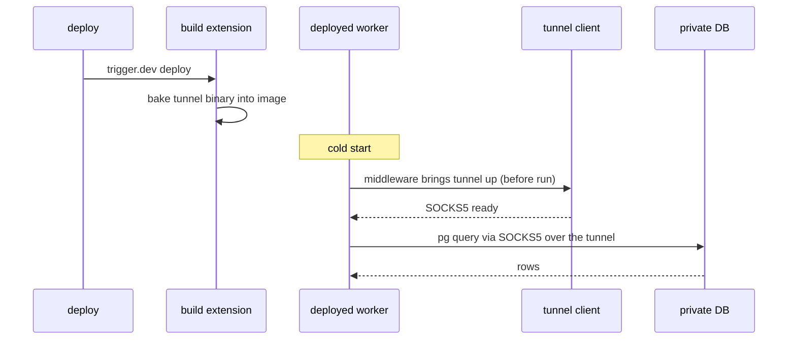
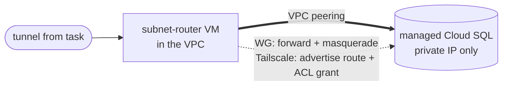

Connect a deployed task to a resource that lives only inside a private GCP VPC: a Cloud SQL Postgres, a private ClickHouse, or anything with no public IP. A deployed task runs on a managed worker that sits outside your VPC, so by default it has no route in. You give it one by baking a userspace VPN client into the deployed image with a build extension, bringing the tunnel up before each run in task middleware, and routing your database client through a local SOCKS5 proxy.

The whole pattern is build-extension code, runtime code, and environment variables. There are no changes to Trigger.dev itself, so you can adopt it today.

<Card
  title="View the example repo on GitHub"
  icon="github"
  href="https://github.com/triggerdotdev/gcp-tailscale-example"
>
  The full source for both tunnels, local Docker proofs (no cloud account needed), and GCP provisioning scripts. This guide walks through the key pieces; clone the repo for the complete, copy-paste-ready files.
</Card>

## Prerequisites

- An existing project with [Trigger.dev initialized](/quick-start)
- A GCP project with the `gcloud` CLI authenticated
- A private resource to reach, or the repo's provisioning scripts to stand one up
- For Tailscale, a tailnet. For WireGuard, a VM with a public IP where you can open a UDP port

## How it works

The mechanism is the same for both tunnels covered below:

1. A **build extension** bakes the userspace VPN client into the deployed image through `image.instructions`. Only bytes are added to the image.
2. A global **task middleware** brings the tunnel up before every run. It is started eagerly at worker boot so the handshake overlaps cold-start init.
3. The client runs in **userspace** (no TUN device, no `NET_ADMIN` capability), so it works as the non-root task user, and it exposes a local **SOCKS5 proxy**.
4. The task routes its database connection through that proxy using the `pg` client's `stream` option. Traffic egresses through the tunnel to a node inside your VPC and on to the private resource.



The tunnel is brought up once per worker process and reused across runs, so you pay the setup cost only on a cold start. See [Cold start](#cold-start) below.

## Choose a tunnel

Two userspace clients fit this pattern. Pick one before you start.

| | Tailscale | WireGuard (`wireproxy`) |
|---|---|---|
| Reaches VM Postgres | yes | yes |
| Reaches managed Cloud SQL (private IP, via subnet router) | yes | yes |
| Cold tunnel bring-up | ~1.2s | ~0.1s |
| Warm run | ~0.17s | ~0.17s |
| Access control | tailnet ACLs (tags and grants) | none built in |
| NAT traversal / dynamic peers | yes | no (needs a reachable endpoint) |
| Key management | auth keys, rotation, admin UI | you manage static keys |
| Vendor cost | SaaS device or minute limits (or self-host Headscale) | none |

Use **WireGuard** when you control a stable endpoint in the VPC and want the fastest cold start with no vendor limits. Use **Tailscale** when you want ACLs, managed key rotation, NAT traversal, and a managed control plane, and can accept the roughly one-second cold-start handshake (or [self-host the control plane](#self-hosting-the-control-plane-with-headscale) to shrink it).

<Note>
  WireGuard has no coordination server, so at least one side needs a reachable endpoint. In this setup the GCP server VM has a public IP with UDP 51820 open, and the task dials outbound to it, which egress NAT allows. That port is low risk: WireGuard silently drops any packet not from an authenticated peer, so it is effectively invisible to scanners.
</Note>

## 1. Add the build extension

The build extension downloads the userspace client and copies it into `/usr/local/bin` in the deployed image. The auth key is never baked in; you provide it at runtime as an environment variable so it stays encrypted and out of the image.

<Tabs>
  <Tab title="Tailscale">
    ```ts extension/tailscaleTunnel.ts
    import type { BuildExtension } from "@trigger.dev/build";

    export type TailscaleTunnelOptions = {
      /** Tailscale static build version. See https://pkgs.tailscale.com/stable/#static */
      version?: string;
      /** Trigger.dev cloud builds linux/amd64. */
      arch?: "amd64" | "arm64";
    };

    export function tailscaleTunnel(options: TailscaleTunnelOptions = {}): BuildExtension {
      const version = options.version ?? "1.102.3";
      const arch = options.arch ?? "amd64";
      const dir = `tailscale_${version}_${arch}`;
      const url = `https://pkgs.tailscale.com/stable/${dir}.tgz`;

      return {
        name: "tailscaleTunnel",
        onBuildComplete(context) {
          if (context.target === "dev") return;

          context.addLayer({
            id: "tailscale-tunnel",
            image: {
              instructions: [
                `RUN apt-get update \\`,
                `  && apt-get install -y --no-install-recommends curl \\`,
                `  && curl -fsSL "${url}" -o /tmp/ts.tgz \\`,
                `  && tar -xzf /tmp/ts.tgz -C /tmp \\`,
                `  && cp /tmp/${dir}/tailscale /tmp/${dir}/tailscaled /usr/local/bin/ \\`,
                `  && chmod 755 /usr/local/bin/tailscale /usr/local/bin/tailscaled \\`,
                `  && mkdir -p /home/node/.ts-state \\`,
                `  && chown -R node:node /home/node/.ts-state \\`,
                `  && rm -rf /tmp/ts.tgz /tmp/${dir} \\`,
                `  && apt-get clean && rm -rf /var/lib/apt/lists/*`,
              ],
            },
          });
        },
      };
    }
    ```
  </Tab>
  <Tab title="WireGuard">
    ```ts wireguard/extension/wireguardTunnel.ts
    import type { BuildExtension } from "@trigger.dev/build";

    export type WireguardTunnelOptions = {
      /** wireproxy release version. */
      version?: string;
      arch?: "amd64" | "arm64";
    };

    export function wireguardTunnel(options: WireguardTunnelOptions = {}): BuildExtension {
      const version = options.version ?? "v1.1.3";
      const arch = options.arch ?? "amd64";
      const url = `https://github.com/windtf/wireproxy/releases/download/${version}/wireproxy_linux_${arch}.tar.gz`;

      return {
        name: "wireguardTunnel",
        onBuildComplete(context) {
          if (context.target === "dev") return;
          context.addLayer({
            id: "wireguard-tunnel",
            image: {
              instructions: [
                `RUN apt-get update \\`,
                `  && apt-get install -y --no-install-recommends curl ca-certificates \\`,
                `  && curl -fsSL "${url}" -o /tmp/wp.tgz \\`,
                `  && tar -xzf /tmp/wp.tgz -C /usr/local/bin wireproxy \\`,
                `  && chmod 755 /usr/local/bin/wireproxy \\`,
                `  && mkdir -p /home/node/.wg-state && chown -R node:node /home/node/.wg-state \\`,
                `  && rm -f /tmp/wp.tgz \\`,
                `  && apt-get clean && rm -rf /var/lib/apt/lists/*`,
              ],
            },
          });
        },
      };
    }
    ```
  </Tab>
</Tabs>

This is a [custom build extension](/config/extensions/custom). The `onBuildComplete` hook returns early for the `dev` target because the tunnel is only needed in the deployed image.

## 2. Bring the tunnel up before each run

The runtime bootstrap starts the client in userspace networking mode, authenticates it, and resolves once the tailnet is up and the SOCKS5 proxy is listening. It is idempotent: a warm worker starts the client once and reuses it across runs. The snippet below is complete and runnable; the repo's `runtime/tunnel.ts` adds timing measurement and a checkpoint/restore health check, and `wireguard/runtime/wgTunnel.ts` is the WireGuard equivalent.

```ts runtime/tunnel.ts
import { spawn } from "node:child_process";
import net from "node:net";
import { setTimeout as sleep } from "node:timers/promises";
import { SocksClient } from "socks";

const STATE_DIR = process.env.TS_STATE_DIR ?? "/home/node/.ts-state";
const SOCKS_HOST = "127.0.0.1";
const SOCKS_PORT = Number(process.env.TS_SOCKS_PORT ?? 1055);
const SOCKET = `${STATE_DIR}/tailscaled.sock`;

let readyPromise: Promise<void> | undefined;

/** Idempotently start userspace tailscaled and resolve once the tailnet is up. */
export function ensureTunnel(): Promise<void> {
  if (readyPromise) return readyPromise;
  readyPromise = start().catch((err) => {
    readyPromise = undefined;
    throw err;
  });
  return readyPromise;
}

async function start(): Promise<void> {
  const authKey = process.env.TS_AUTHKEY;
  if (!authKey) throw new Error("TS_AUTHKEY is not set");

  // Userspace networking means no TUN device and no NET_ADMIN, so it runs as the task user.
  const daemon = spawn(
    "tailscaled",
    [
      "--tun=userspace-networking",
      `--socks5-server=${SOCKS_HOST}:${SOCKS_PORT}`,
      `--state=${STATE_DIR}/tailscaled.state`,
      `--socket=${SOCKET}`,
    ],
    { stdio: "inherit" }
  );
  daemon.on("exit", (code) => console.error(`[tunnel] tailscaled exited: ${code}`));

  // Wait for the daemon to be listening before authenticating, or `tailscale up`
  // races the cold daemon, exits, and the backend wait below times out.
  await waitForPort(SOCKS_HOST, SOCKS_PORT, 15_000);

  await run("tailscale", [
    `--socket=${SOCKET}`,
    "up",
    "--timeout=30s", // bound the handshake so a failed auth fails fast instead of hanging the run
    `--authkey=${authKey}`,
    `--hostname=${process.env.TS_HOSTNAME ?? "trigger-task"}`,
    "--accept-routes",
    // Point at a self-hosted Headscale by setting TS_LOGIN_SERVER (see below).
    ...(process.env.TS_LOGIN_SERVER ? [`--login-server=${process.env.TS_LOGIN_SERVER}`] : []),
  ]);

  await waitForBackendRunning(30_000);
}

/** Open a TCP socket to a private host:port through the SOCKS5 proxy. */
export async function tunnelSocket(host: string, port: number): Promise<net.Socket> {
  const info = await SocksClient.createConnection({
    proxy: { host: SOCKS_HOST, port: SOCKS_PORT, type: 5 },
    command: "connect",
    destination: { host, port },
    timeout: 10_000,
  });
  return info.socket;
}

async function backendState(): Promise<string | null> {
  const out = await run("tailscale", [`--socket=${SOCKET}`, "status", "--json"], true).catch(
    () => ""
  );
  return /"BackendState"\s*:\s*"([^"]*)"/.exec(out)?.[1] ?? null;
}

async function waitForBackendRunning(timeoutMs: number): Promise<void> {
  const deadline = Date.now() + timeoutMs;
  while (Date.now() < deadline) {
    if ((await backendState()) === "Running") return;
    await sleep(500);
  }
  throw new Error("[tunnel] tailnet did not reach Running");
}

function waitForPort(host: string, port: number, timeoutMs: number): Promise<void> {
  const deadline = Date.now() + timeoutMs;
  return (async () => {
    while (Date.now() < deadline) {
      const open = await new Promise<boolean>((resolve) => {
        const s = net.connect(port, host, () => {
          s.destroy();
          resolve(true);
        });
        s.on("error", () => resolve(false));
      });
      if (open) return;
      await sleep(300);
    }
    throw new Error(`[tunnel] proxy port ${host}:${port} never opened`);
  })();
}

/** Run a child process, capturing stdout when `capture` is set. */
function run(cmd: string, args: string[], capture = false): Promise<string> {
  return new Promise((resolve, reject) => {
    const p = spawn(cmd, args, { stdio: capture ? ["ignore", "pipe", "pipe"] : "inherit" });
    let out = "";
    if (capture) p.stdout?.on("data", (d) => (out += d));
    p.on("exit", (code) =>
      code === 0 || capture ? resolve(out) : reject(new Error(`${cmd} exited ${code}`))
    );
    p.on("error", reject);
  });
}
```

Wire the extension and the middleware into your config. The middleware runs before every run, and the eager `ensureTunnel()` call at boot overlaps the handshake with the rest of cold-start init.

```ts trigger.config.ts
import { defineConfig, tasks } from "@trigger.dev/sdk";
import { tailscaleTunnel } from "./extension/tailscaleTunnel.js";
import { ensureTunnel } from "./runtime/tunnel.js";

// Start eagerly at worker boot, but never during the build step.
const isBuild = !!process.env.TRIGGER_BUILD_MANIFEST_PATH;
if (process.env.TS_AUTHKEY && !isBuild) void ensureTunnel().catch(() => {});

tasks.middleware("tunnel", async ({ next }) => {
  await ensureTunnel();
  await next();
});

export default defineConfig({
  project: "<your-project-ref>",
  maxDuration: 300,
  dirs: ["./src"],
  processKeepAlive: true, // reuse the worker process, and therefore the tunnel, across runs
  build: {
    extensions: [tailscaleTunnel({ arch: "amd64" })],
    external: ["tailscale", "tailscaled"],
  },
});
```

For more on middleware, see [middleware and locals functions](/tasks/overview#middleware-and-locals-functions).

## 3. Route your database client through the tunnel

The `pg` client accepts a pre-opened socket through its `stream` option. Hand it the socket from `tunnelSocket()` and every query travels over the tunnel.

```ts runtime/db.ts
import pg from "pg";
import { tunnelSocket } from "./tunnel.js";

/** Run a single query against the private Postgres through the tunnel. */
export async function pgSelect(sql: string): Promise<Record<string, unknown>[]> {
  const client = new pg.Client({
    user: process.env.PGUSER,
    password: process.env.PGPASSWORD,
    database: process.env.PGDATABASE,
    // The socket is already connected through the SOCKS5 proxy.
    stream: await tunnelSocket(process.env.PGHOST!, Number(process.env.PGPORT ?? 5432)),
  });
  await client.connect();
  try {
    const { rows } = await client.query(sql);
    return rows;
  } finally {
    await client.end();
  }
}
```

## 4. Write the task

The task calls the query helper like any other function. The tunnel is already up by the time `run()` executes, because the middleware awaited it.

```ts /trigger/queryPrivateGcp.ts
import { task } from "@trigger.dev/sdk";
import { pgSelect } from "../runtime/db.js";

export const queryPrivateGcp = task({
  id: "query-private-gcp",
  run: async () => {
    // inet_server_addr() returns the private server IP, proving the query traversed the tunnel.
    const rows = await pgSelect("select now() as ts, inet_server_addr() as ip, version()");
    return { postgres: rows[0] };
  },
});
```

## 5. Set the environment variables

Set these on your Trigger.dev project through the dashboard or the API. Never commit them. See [environment variables](/deploy-environment-variables).

<Tabs>
  <Tab title="Tailscale">
    | Variable | Value |
    |---|---|
    | `TS_AUTHKEY` | An ephemeral, reusable, tagged (`tag:trigger`) auth key |
    | `PGHOST` | The resource's tailnet IP or MagicDNS name (or a subnet-routed private IP) |
    | `PGPORT` | `5432` |
    | `PGUSER` / `PGPASSWORD` / `PGDATABASE` | Your Postgres credentials |
    | `TS_LOGIN_SERVER` | Optional. A self-hosted Headscale URL |
  </Tab>
  <Tab title="WireGuard">
    | Variable | Value |
    |---|---|
    | `WG_PRIVATE_KEY` | The client (task) WireGuard private key |
    | `WG_SERVER_PUBLIC_KEY` | The server's WireGuard public key |
    | `WG_ENDPOINT` | `<server public ip>:51820` |
    | `WG_ALLOWED_IPS` | The server's WG address, plus any subnet-routed IPs to reach |
    | `PGHOST` | The WireGuard server's own address (for example `10.9.0.1`) |
    | `PGPORT` / `PGUSER` / `PGPASSWORD` / `PGDATABASE` | Your Postgres connection details |
  </Tab>
</Tabs>

## 6. Provision the private resource

The example repo includes scripts that stand up a GCP VM running Postgres, joined to the tunnel and with default-deny ingress so the database is never reachable from the public internet.

<Tabs>
  <Tab title="Tailscale">
    ```bash
    # A VM running Postgres that joins your tailnet. The task reaches it by tailnet IP.
    TS_AUTHKEY=tskey-auth-xxxx GCP_PROJECT=my-proj ./gcp/provision.sh
    ```

    In your tailnet policy, add `tagOwners` for `tag:trigger` and the resource's tag, plus a grant from `tag:trigger` to the resource on `tcp:5432` (and `8123` for ClickHouse). Mint one auth key for the resource and one tagged `tag:trigger` for the tasks.
  </Tab>
  <Tab title="WireGuard">
    ```bash
    # Generate a client keypair first.
    wg genkey | tee priv | wg pubkey

    # Stand up the server VM (opens UDP 51820), passing the task's public key.
    GCP_PROJECT=my-proj WG_CLIENT_PUB=<task pubkey> ./gcp/provision-wireguard.sh

    # Read back the server public key for WG_SERVER_PUBLIC_KEY.
    gcloud compute ssh <vm> --command 'sudo wg show wg0 public-key'
    ```
  </Tab>
</Tabs>

## 7. Deploy and trigger

Deploy the task and trigger it from the dashboard or the API.

<CodeGroup>

```bash npm
npx trigger.dev@latest deploy
```

```bash pnpm
pnpm dlx trigger.dev@latest deploy
```

```bash bun
bunx trigger.dev@latest deploy
```

</CodeGroup>

A successful run returns the private server details, including the private IP from `inet_server_addr()`, confirming the query reached the database over the tunnel rather than any public path:

```json
{
  "postgres": {
    "ts": "2026-01-15T12:00:00.000Z",
    "ip": "10.9.0.1",
    "version": "PostgreSQL 15.4 on x86_64-pc-linux-gnu"
  }
}
```

## Reaching managed Cloud SQL via a subnet router

A managed service like Cloud SQL, Memorystore, or a private ClickHouse has only a private IP inside your VPC and cannot join the tunnel directly. Put a **subnet router** on the tunnel instead: a node that is both on the tunnel and inside the VPC, and forwards tunnel traffic to the resource's private IP. The task dials that private IP through the tunnel.



Create the Cloud SQL instance with a private IP (Private Service Access), note its private IP, then configure the subnet router:

<Tabs>
  <Tab title="Tailscale">
    On the router VM (enable IP forwarding with `sudo sysctl -w net.ipv4.ip_forward=1`):

    ```bash
    sudo tailscale set --advertise-routes=CLOUDSQL_IP/32
    ```

    Then in the Tailscale admin, **approve the route** for that machine, and **add an ACL grant for the subnet destination**. This grant is the step people forget: a grant to the router's own tag does not cover the IPs behind it, so the destination IP must be allowed explicitly.

    ```jsonc
    { "src": ["tag:trigger"], "dst": ["CLOUDSQL_IP/32"], "ip": ["tcp:5432"] }
    ```

    Set `PGHOST=CLOUDSQL_IP` on the project.
  </Tab>
  <Tab title="WireGuard">
    WireGuard has no ACL layer, so there is no grant step. On the server (IP forwarding on):

    ```bash
    PRIMARY_IF=$(ip -o route get 8.8.8.8 | grep -oE 'dev [^ ]+' | awk '{print $2}')
    sudo iptables -t nat -A POSTROUTING -s 10.9.0.0/24 -d CLOUDSQL_IP/32 -o "$PRIMARY_IF" -j MASQUERADE
    sudo iptables -A FORWARD -i wg0 -o "$PRIMARY_IF" -j ACCEPT
    sudo iptables -A FORWARD -i "$PRIMARY_IF" -o wg0 -m state --state RELATED,ESTABLISHED -j ACCEPT
    ```

    Add the Cloud SQL IP to `WG_ALLOWED_IPS` so wireproxy routes it into the tunnel, and point `PGHOST` at it:

    ```bash .env
    WG_ALLOWED_IPS=10.9.0.1/32, CLOUDSQL_IP/32
    PGHOST=CLOUDSQL_IP
    ```

    <Note>
      The wireproxy config is written when the tunnel first starts, so a running worker keeps its old `WG_ALLOWED_IPS` until a fresh (cold) process picks up the new value.
    </Note>
  </Tab>
</Tabs>

## Cold start

The tunnel is brought up once per worker process and reused across runs, so you pay setup only on a cold start. `processKeepAlive: true` keeps the process, and therefore the tunnel, alive between runs. Numbers below are from a deployed managed-worker project with the GCP resource in us-east4 and workers in AWS us-east-1:

| | Tailscale | WireGuard |
|---|---|---|
| Cold tunnel bring-up | ~1.2s | ~0.1s |
| Warm run | ~0.17s | ~0.17s |
| Query latency (same metro) | ~0.12s | ~0.03 to 0.12s |

The gap is the handshake. Tailscale registers a fresh node with its coordination server and negotiates connectivity on every cold node, roughly one second of round trips. Static WireGuard does a single handshake to a known endpoint with no coordination server, so bring-up is about 100ms.

What moves the number:

- **Region proximity** cuts query latency (moving the resource into the workers' metro took it from ~500ms to ~120ms). It does not change the Tailscale handshake, which talks to the control plane, not the database.
- **Eager start** at worker boot overlaps the handshake with the rest of cold-start init, saving around 150ms.
- **Machine size** only speeds up the client spawn; the Tailscale handshake is network bound and flat across sizes. `medium-1x` captures essentially all of the gain.

Both tunnels survive Trigger.dev's [checkpoint and restore](/how-it-works). A task that queried, waited long enough to be checkpointed, then queried again after restore reconnected with no re-auth. The runtime also self-heals: if the proxy is not reachable after restore it rebuilds the tunnel before continuing.

## Self-hosting the control plane with Headscale

[Headscale](https://headscale.net) is an open-source, self-hostable implementation of the Tailscale coordination server. Running it yourself removes every Tailscale SaaS limit (device caps, ephemeral-minute metering, per-seat billing) and puts the control plane in your region.

Switching to it is pure environment config, with no code change, because the runtime already forwards a login server:

```bash .env
TS_LOGIN_SERVER=https://headscale.your-domain.example
TS_AUTHKEY=<a Headscale pre-auth key>
```

The build extension, the userspace daemon, the middleware, and the SOCKS routing are all unchanged. A Headscale VM plus an in-region DERP relay also shrinks the handshake round trips that dominate the Tailscale cold start.

## Pricing

Only the Tailscale path has a vendor cost; static WireGuard and Headscale do not. Each live worker process is one node (reused across runs via `processKeepAlive`), so node count is roughly your peak concurrent workers, not your total runs. Node lifetime then picks the cost bucket:

- **Steady load** (nodes live 4 hours or more) is billed as tagged devices. 50 tagged devices are included on all plans, then roughly $1 per device per month. `processKeepAlive` pushes you here.
- **Spiky load** (nodes die within 4 hours) is billed as ephemeral node-minutes, with a smaller included allowance that churn can exhaust quickly.

For large or spiky fleets, [self-hosting with Headscale](#self-hosting-the-control-plane-with-headscale) removes all per-device and per-minute licensing, leaving only a small coordinator VM regardless of node count. Treat these bands as a model, not a quote; check Tailscale's current pricing.

## What this proves

On a real Trigger.dev Cloud project (managed workers in AWS, GCP resource in us-east4):

- Both tunnels bake into the deployed image via the build extension and come up in the middleware before `run()`.
- The deployed task reaches both a VM Postgres and a private-IP-only managed Cloud SQL instance over both tunnels; the query returns the private server IP.
- WireGuard cold bring-up was about 100ms, Tailscale about 1.2s, warm runs about 170ms.
- Both survive checkpoint and restore (tested past five minutes) with no re-auth.

## Next steps

<CardGroup cols={2}>
  <Card title="Custom build extensions" icon="puzzle-piece" href="/config/extensions/custom">
    Learn how build extensions hook into the deploy build and modify the container image.
  </Card>
  <Card title="Middleware and locals" icon="layer-group" href="/tasks/overview#middleware-and-locals-functions">
    Run setup logic before and after every task run.
  </Card>
  <Card title="Environment variables" icon="key" href="/deploy-environment-variables">
    Set the encrypted secrets this pattern relies on.
  </Card>
  <Card title="The example repo" icon="github" href="https://github.com/triggerdotdev/gcp-tailscale-example">
    Complete source, local Docker proofs, and provisioning scripts.
  </Card>
</CardGroup>
