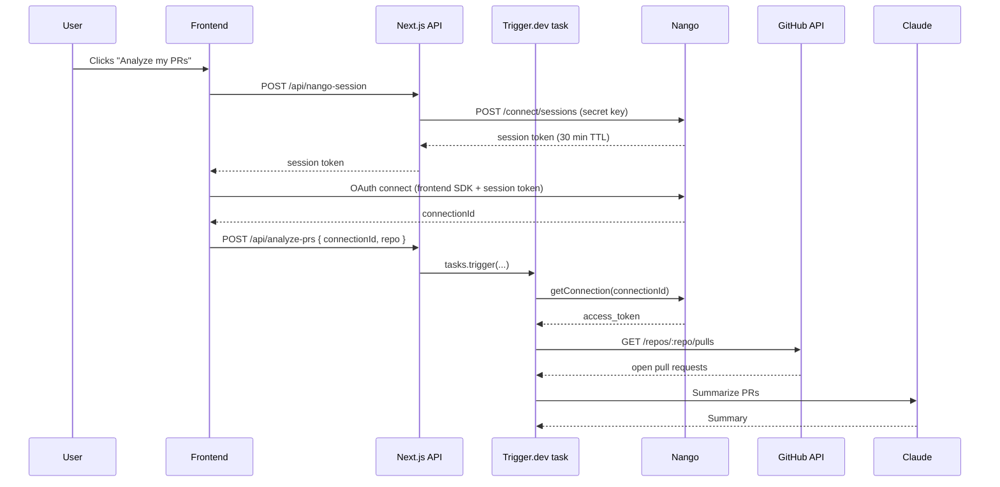

[Nango](https://www.nango.dev/) handles OAuth for 250+ APIs, storing and automatically refreshing access tokens on your behalf. This makes it a natural fit for Trigger.dev tasks that need to call third-party APIs on behalf of your users.

In this guide you'll build a task that:

1. Receives a Nango `connectionId` from your frontend
2. Fetches a fresh GitHub access token from Nango inside the task
3. Calls the GitHub API to retrieve the user's open pull requests
4. Uses Claude to summarize what's being worked on

This pattern works for any API Nango supports. Swap GitHub for HubSpot, Slack, Notion, or any other provider.

## Prerequisites

- A Next.js project with [Trigger.dev installed](/guides/frameworks/nextjs)
- A [Nango](https://app.nango.dev/) account
- An [Anthropic](https://console.anthropic.com/) API key

## How it works



## Step 1: Connect GitHub in Nango

<Steps titleSize="h3">
  <Step title="Create a GitHub integration in Nango">
    1. In your [Nango dashboard](https://app.nango.dev/), go to **Integrations** and click **Set up new integration**.
    2. Search for **GitHub** and select GitHub (User OAuth).
    3. Create and add a test connection
  </Step>
  <Step title="Add the Nango frontend SDK">
    Install the Nango frontend SDK in your Next.js project:

    ```bash
    npm install @nangohq/frontend
    ```

    The frontend SDK requires a short-lived **connect session token** issued by your backend. Add an API route that creates the session:

    ```ts app/api/nango-session/route.ts
    import { NextResponse } from "next/server";

    export async function POST(req: Request) {
      const { userId } = await req.json();

      const response = await fetch("https://api.nango.dev/connect/sessions", {
        method: "POST",
        headers: {
          Authorization: `Bearer ${process.env.NANGO_SECRET_KEY}`,
          "Content-Type": "application/json",
        },
        body: JSON.stringify({
          end_user: { id: userId },
        }),
      });

      if (!response.ok) {
        const text = await response.text();
        console.error("Nango error:", response.status, text);
        return NextResponse.json({ error: text }, { status: response.status });
      }

      const { data } = await response.json();
      return NextResponse.json({ token: data.token });
    }
    ```

    Then add a connect button to your UI that fetches the token and opens the Nango OAuth flow:

    ```tsx app/page.tsx
    "use client";

    import Nango from "@nangohq/frontend";

    export default function Page() {
      async function connectGitHub() {
        // Get a short-lived session token from your backend
        const sessionRes = await fetch("/api/nango-session", {
          method: "POST",
          headers: { "Content-Type": "application/json" },
          body: JSON.stringify({ userId: "user_123" }), // replace with your actual user ID
        });
        const { token } = await sessionRes.json();

        const nango = new Nango({ connectSessionToken: token });
        const result = await nango.auth("github");

        // result.connectionId is what you pass to your task
        await fetch("/api/analyze-prs", {
          method: "POST",
          headers: { "Content-Type": "application/json" },
          body: JSON.stringify({
            connectionId: result.connectionId,
            repo: "triggerdotdev/trigger.dev",
          }),
        });
      }

      return <button onClick={connectGitHub}>Analyze my PRs</button>;
    }
    ```

  </Step>
</Steps>

## Step 2: Create the Trigger.dev task

Install the required packages:

```bash
npm install @nangohq/node @anthropic-ai/sdk
```

Create the task:

<CodeGroup>

```ts trigger/analyze-prs.ts
import { task } from "@trigger.dev/sdk";
import { Nango } from "@nangohq/node";
import Anthropic from "@anthropic-ai/sdk";

const nango = new Nango({ secretKey: process.env.NANGO_SECRET_KEY! });
const anthropic = new Anthropic();

export const analyzePRs = task({
  id: "analyze-prs",
  run: async (payload: { connectionId: string; repo: string }) => {
    const { connectionId, repo } = payload;

    // Fetch a fresh access token from Nango. It handles refresh automatically.
    // Use the exact integration slug from your Nango dashboard, e.g. "github-getting-started"
    const connection = await nango.getConnection("<your-integration-slug>", connectionId);

    if (connection.credentials.type !== "OAUTH2") {
      throw new Error(`Unexpected credentials type: ${connection.credentials.type}`);
    }

    const accessToken = connection.credentials.access_token;
    // Call the GitHub API on behalf of the user
    const response = await fetch(
      `https://api.github.com/repos/${repo}/pulls?state=open&per_page=20`,
      {
        headers: {
          Authorization: `Bearer ${accessToken}`,
          Accept: "application/vnd.github.v3+json",
        },
      }
    );

    if (!response.ok) {
      throw new Error(`GitHub API error: ${response.status} ${response.statusText}`);
    }

    const prs = await response.json();

    if (prs.length === 0) {
      return { summary: "No open pull requests found.", prCount: 0 };
    }

    // Use Claude to summarize what's being worked on
    const prList = prs
      .map(
        (pr: { number: number; title: string; user: { login: string }; body: string | null }) =>
          `#${pr.number} by @${pr.user.login}: ${pr.title}\n${pr.body?.slice(0, 200) ?? ""}`
      )
      .join("\n\n");

    const message = await anthropic.messages.create({
      model: "claude-opus-4-6",
      max_tokens: 1024,
      messages: [
        {
          role: "user",
          content: `Here are the open pull requests for ${repo}. Give a concise summary of what's being worked on, grouped by theme where possible.\n\n${prList}`,
        },
      ],
    });

    const summary = message.content[0].type === "text" ? message.content[0].text : "";

    return { summary, prCount: prs.length };
  },
});
```

</CodeGroup>

## Step 3: Create the API route

Add a route handler that receives the `connectionId` from your frontend and triggers the task:

```ts app/api/analyze-prs/route.ts
import { tasks } from "@trigger.dev/sdk";
import { analyzePRs } from "@/trigger/analyze-prs";
import { NextResponse } from "next/server";

export async function POST(req: Request) {
  const { connectionId, repo } = await req.json();

  if (!connectionId || !repo) {
    return NextResponse.json({ error: "Missing connectionId or repo" }, { status: 400 });
  }

  const handle = await tasks.trigger<typeof analyzePRs>("analyze-prs", {
    connectionId,
    repo,
  });

  return NextResponse.json(handle);
}
```

## Step 4: Set environment variables

Add the following to your `.env.local` file:

```bash
NANGO_SECRET_KEY=      # From Nango dashboard → Environment → Secret key
TRIGGER_SECRET_KEY=    # From Trigger.dev dashboard → API keys
ANTHROPIC_API_KEY=     # From Anthropic console
```

Add `NANGO_SECRET_KEY` and `ANTHROPIC_API_KEY` as [environment variables](/deploy-environment-variables) in your Trigger.dev project too. These are used inside the task at runtime.

## Test it

<Steps titleSize="h3">
  <Step title="Start your dev servers">

    ```bash
    npm run dev
    npx trigger.dev@latest dev
    ```

  </Step>
  <Step title="Connect GitHub and trigger the task">
    Open your app, click **Analyze my PRs**, and complete the GitHub OAuth flow. The task will be triggered automatically.
  </Step>
  <Step title="Watch the run in Trigger.dev">
    Open your [Trigger.dev dashboard](https://cloud.trigger.dev/) and navigate to **Runs** to see the task execute. You'll see the PR count and Claude's summary in the output.
  </Step>
</Steps>

<Check>
  Your task is now fetching a fresh GitHub token from Nango, calling the GitHub API on behalf of the
  user, and using Claude to summarize their open PRs. No token storage or refresh logic required.
</Check>

## Next steps

- **Reuse the `connectionId`**: Once a user has connected, store their `connectionId` and pass it in future task payloads. No need to re-authenticate.
- **Add retries**: If the GitHub API returns a transient error, Trigger.dev [retries](/errors-retrying) will handle it automatically.
- **Switch providers**: The same pattern works for any Nango-supported API. Change `"github"` to `"hubspot"`, `"slack"`, `"notion"`, or any other provider.
- **Stream the analysis**: Use [Trigger.dev Realtime](/realtime/overview) to stream Claude's response back to your frontend as it's generated.
