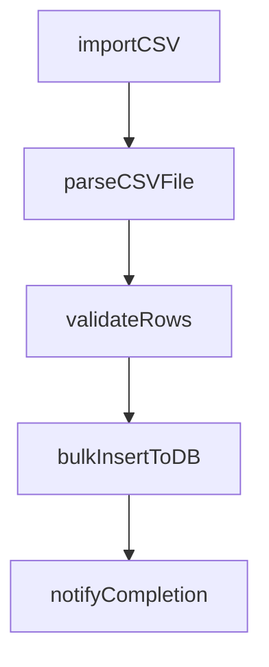
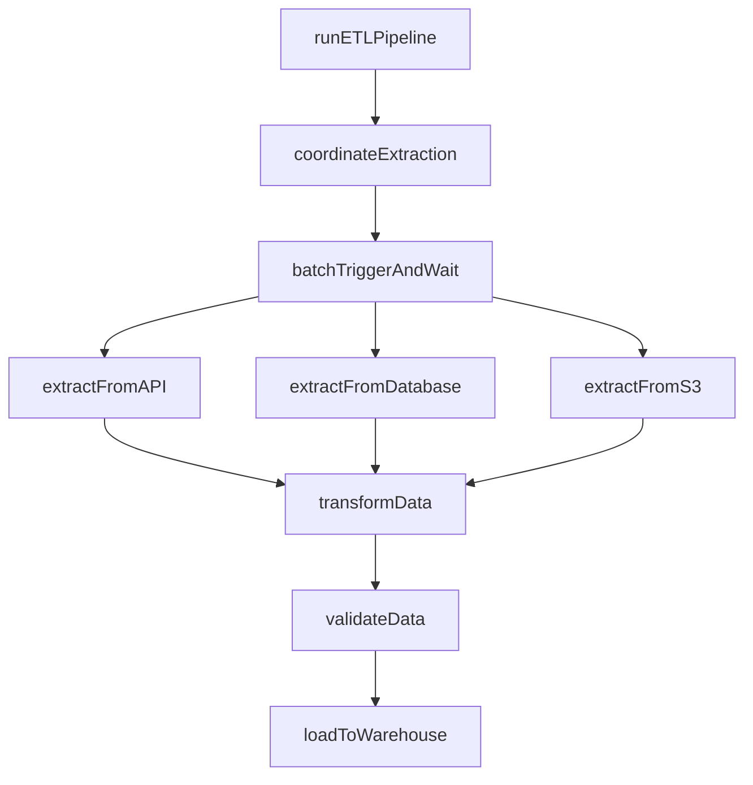
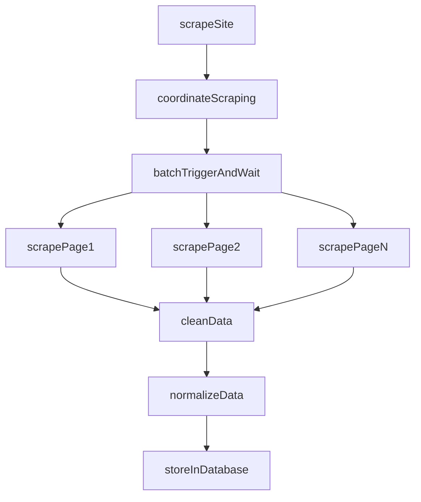
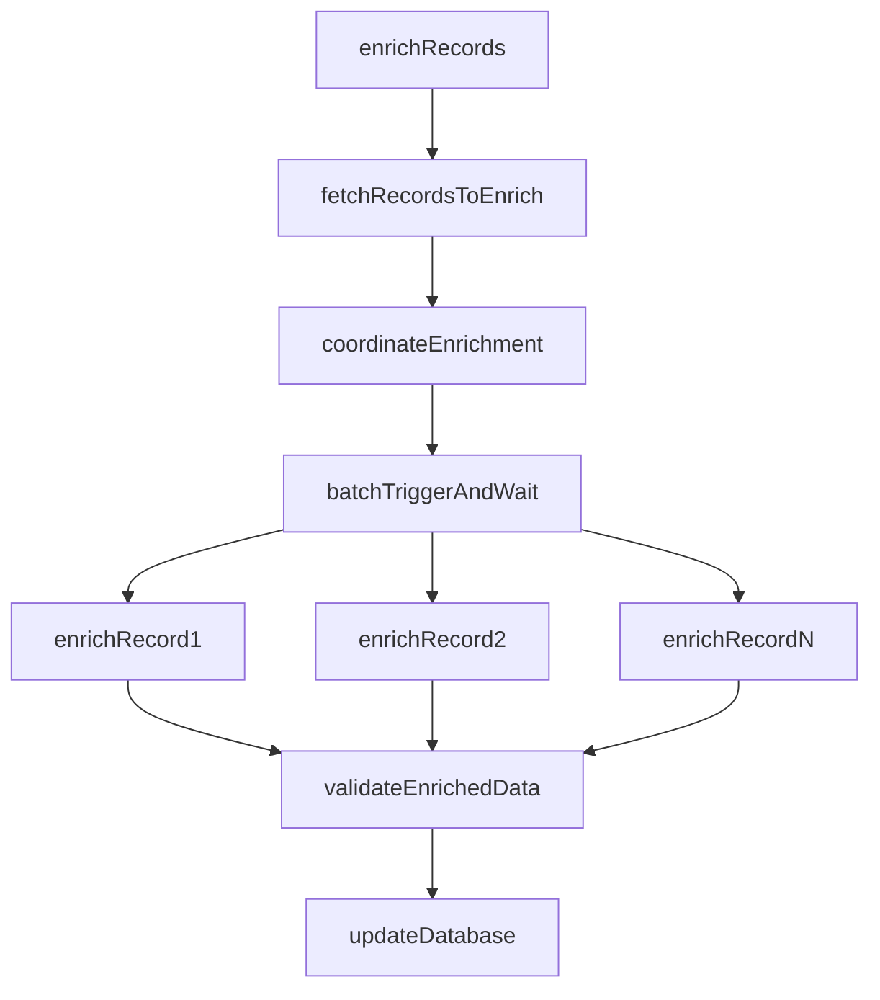

import UseCasesCards from "/snippets/use-cases-cards.mdx";

## Overview

Build complex data pipelines that process large datasets without timeouts. Handle streaming analytics, batch enrichment, web scraping, database sync, and file processing with automatic retries and progress tracking.

## Featured examples

<CardGroup cols={3}>
  <Card
    title="Realtime CSV importer"
    icon="book"
    href="/guides/example-projects/realtime-csv-importer"
  >
    Import CSV files with progress streamed live to frontend.
  </Card>
  <Card title="Web scraper with BrowserBase" icon="book" href="/guides/examples/scrape-hacker-news">
    Scrape websites using BrowserBase and Puppeteer.
  </Card>
  <Card
    title="Supabase database webhooks"
    icon="book"
    href="/guides/frameworks/supabase-edge-functions-database-webhooks"
  >
    Trigger tasks from Supabase database webhooks.
  </Card>
</CardGroup>

## Benefits of using Trigger.dev for data processing & ETL workflows

**Process datasets for hours without timeouts:** Handle multi-hour transformations, large file processing, or complete database exports. No execution time limits.

**Parallel processing with built-in rate limiting:** Process thousands of records simultaneously while respecting API rate limits. Scale efficiently without overwhelming downstream services.

**Stream progress to your users in real-time:** Show row-by-row processing status updating live in your dashboard. Users see exactly where processing is and how long remains.

## Production use cases

<CardGroup cols={1}>
  <Card title="MagicSchool AI customer story" href="https://trigger.dev/customers/magicschool-ai-customer-story">

Read how MagicSchool AI uses Trigger.dev to generate insights from millions of student interactions.

</Card>

<Card title="Comp AI customer story" href="https://trigger.dev/customers/comp-ai-customer-story">

Read how Comp AI uses Trigger.dev to automate evidence collection at scale, powering their open source, AI-driven compliance platform.

</Card>
<Card title="Midday customer story" href="https://trigger.dev/customers/midday-customer-story">

Read how Midday use Trigger.dev to sync large volumes of bank transactions in their financial management platform.

</Card>
</CardGroup>

## Example worfklow patterns

<Tabs>
  <Tab title="CSV import">
    Simple CSV import pipeline. Receives file upload, parses CSV rows, validates data, imports to database with progress tracking.

  </Tab>

  <Tab title="ETL pipeline">
    **Coordinator pattern with parallel extraction**. Batch triggers parallel extraction from multiple sources (APIs, databases, S3), transforms and validates data, loads to data warehouse with monitoring.

  </Tab>

  <Tab title="Web scraping">
    **Coordinator pattern with browser automation**. Launches headless browsers in parallel to scrape multiple pages, extracts structured data, cleans and normalizes content, stores in database.

  </Tab>

  <Tab title="Batch enrichment">
    **Coordinator pattern with rate limiting**. Fetches records needing enrichment, batch triggers parallel API calls with configurable concurrency to respect rate limits, validates enriched data, updates database.

  </Tab>
</Tabs>

<UseCasesCards />
