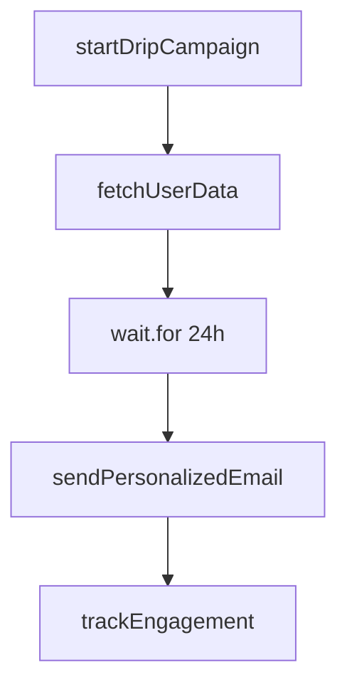
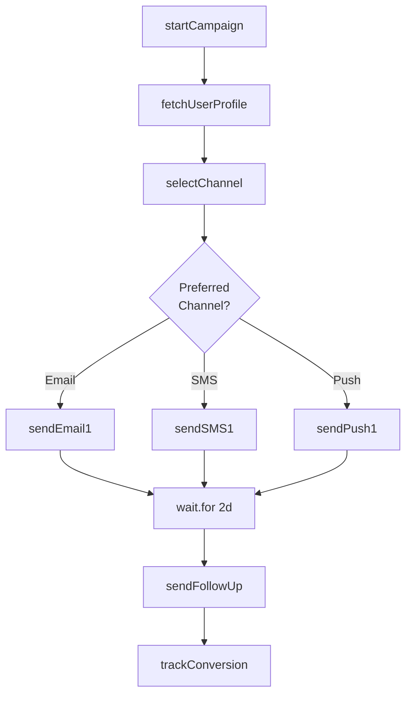
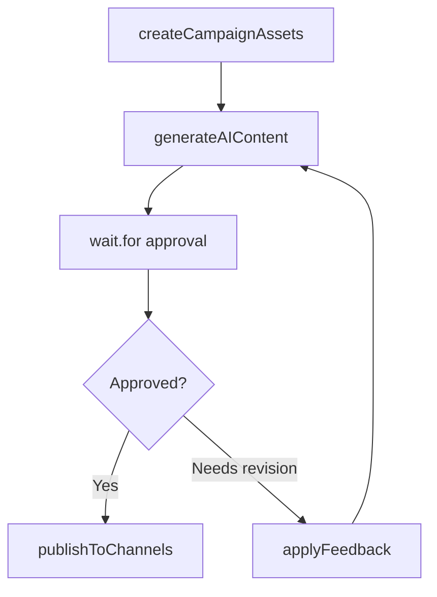
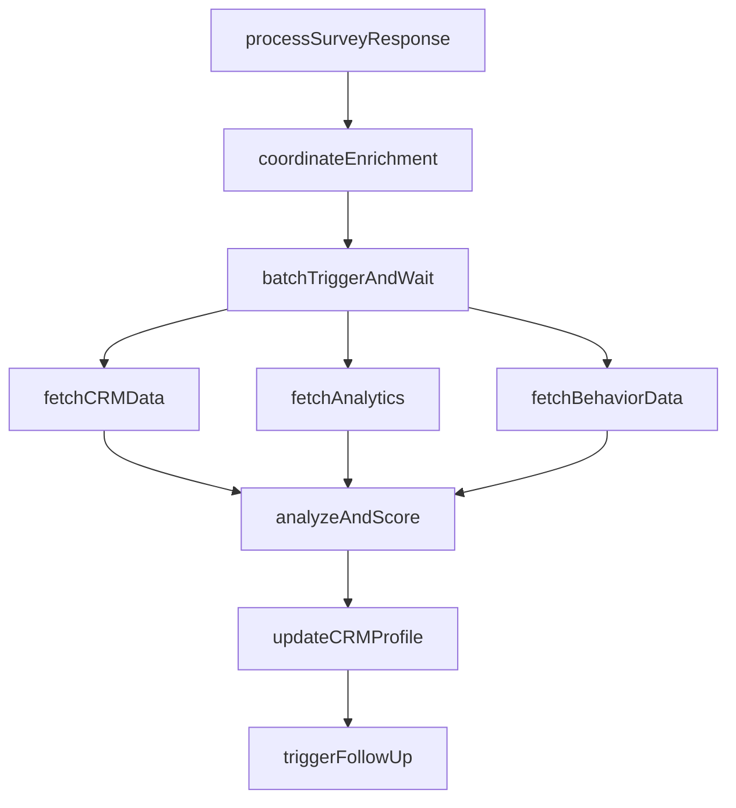

import UseCasesCards from "/snippets/use-cases-cards.mdx";

## Overview

Build marketing workflows from drip campaigns to orchestrating multi-channel campaigns. Handle multi-day sequences, behavioral triggers, dynamic content generation, and live analytics, all with automatic retries and progress tracking.

## Featured examples

<CardGroup cols={3}>
  <Card
    title="Email sequences with Resend"
    icon="book"
    href="/guides/examples/resend-email-sequence"
  >
    Send multi-day email sequences with wait delays between messages.
  </Card>
  <Card
    title="Product image generator"
    icon="book"
    href="/guides/example-projects/product-image-generator"
  >
    Transform product photos into professional marketing images using Replicate.
  </Card>
  <Card
    title="Human-in-the-loop workflow"
    icon="book"
    href="/guides/example-projects/human-in-the-loop-workflow"
  >
    Approve marketing content using a human-in-the-loop workflow.
  </Card>
</CardGroup>

## Benefits of using Trigger.dev for marketing workflows

**Delays without idle costs:** Wait hours or weeks between steps. Pay only for active compute, not wait time. Perfect for drip campaigns and scheduled follow-ups.

**Guaranteed delivery:** Messages send exactly once, even after retries. Personalized content isn't regenerated on failure.

**Scale without limits:** Process thousands in parallel while respecting rate limits. Send to entire segments without overwhelming APIs.

## Production use cases

  <Card title="Icon customer story" href="https://trigger.dev/customers/icon-customer-story">

Read how Icon uses Trigger.dev to process and generate thousands of videos per month for their AI-driven video creation platform.

</Card>

## Example worfklow patterns

<Tabs>
  <Tab title="Drip email campaign">
    Simple drip campaign. User signs up, waits specified delay, sends personalized email, tracks engagement.

  </Tab>

  <Tab title="Multi-channel">
    **Router pattern with delay orchestration**. User action triggers campaign, router selects channel based on preferences (email/SMS/push), coordinates multi-day sequence with delays between messages, tracks engagement across channels.

  </Tab>

  <Tab title="Content approval">
    **Supervisor pattern with approval gate**. Generates AI marketing content (images, copy, assets), pauses with wait.for for human review, applies revisions if needed, publishes to channels after approval.

  </Tab>

  <Tab title="Survey analysis">
    **Coordinator pattern with enrichment**. User completes survey, batch triggers parallel enrichment from CRM/analytics, analyzes and scores responses, updates customer profiles, triggers personalized follow-up campaigns.

  </Tab>
</Tabs>

<UseCasesCards />
