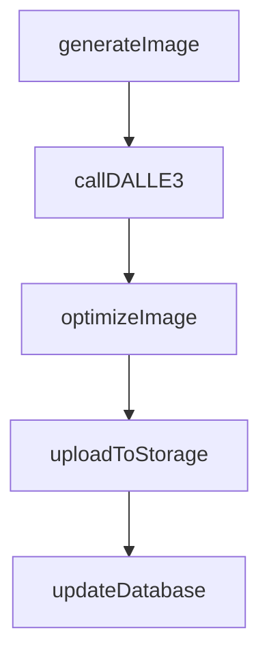
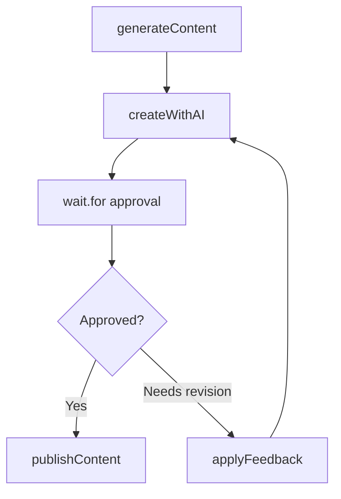

import UseCasesCards from "/snippets/use-cases-cards.mdx";

## Overview

Build AI media generation pipelines that handle unpredictable API latencies and long-running operations. Generate images, videos, audio, and multi-modal content with automatic retries, progress tracking, and no timeout limits.

## Featured examples

<CardGroup cols={3}>
  <Card title="DALL·E 3" icon="book" href="/guides/examples/dall-e3-generate-image">
    Generate images from text prompts using OpenAI's DALL·E 3.
  </Card>
  <Card
    title="Product image generator"
    icon="book"
    href="/guides/example-projects/product-image-generator"
  >
    Transform product photos into professional marketing images using Replicate.
  </Card>
  <Card
    title="Meme generator (human-in-the-loop)"
    icon="book"
    href="/guides/example-projects/meme-generator-human-in-the-loop"
  >
    Generate memes with DALL·E 3 and add human approval steps.
  </Card>
</CardGroup>

## Why Trigger.dev for AI media generation

**Pay only for active compute, not AI inference time**

Checkpoint-resume pauses during AI API calls. Generate content that takes minutes or hours without paying for idle inference time.

**No timeout limits for long generations**

Handle generations that take minutes or hours without execution limits. Perfect for high-quality video synthesis and complex multi-modal workflows.

**Human approval gates for brand safety**

Add review steps before publishing AI-generated content. Pause workflows for human approval using waitpoint tokens.

## Example workflows

<Tabs>
  <Tab title="Image generation">
    Simple AI image generation. Receives prompt and parameters, calls OpenAI DALL·E 3, post-processes result, uploads to storage.

  </Tab>

  <Tab title="Batch generation">
    **Coordinator pattern with rate limiting**. Receives batch of generation requests, coordinates parallel processing with configurable concurrency to respect API rate limits, validates outputs, stores results.

  </Tab>

  <Tab title="Multi-step pipeline">
    **Coordinator pattern with sequential processing**. Generates initial content with AI, applies style transfer or enhancement, upscales resolution, optimizes and compresses for delivery.

  </Tab>

  <Tab title="Human-in-the-loop">
    **Supervisor pattern with approval gate**. Generates AI content, pauses execution with wait.for to allow human review, applies feedback if needed, publishes approved content.

  </Tab>
</Tabs>

<UseCasesCards />
