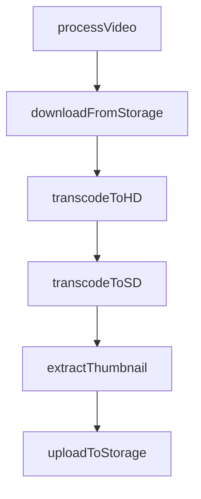
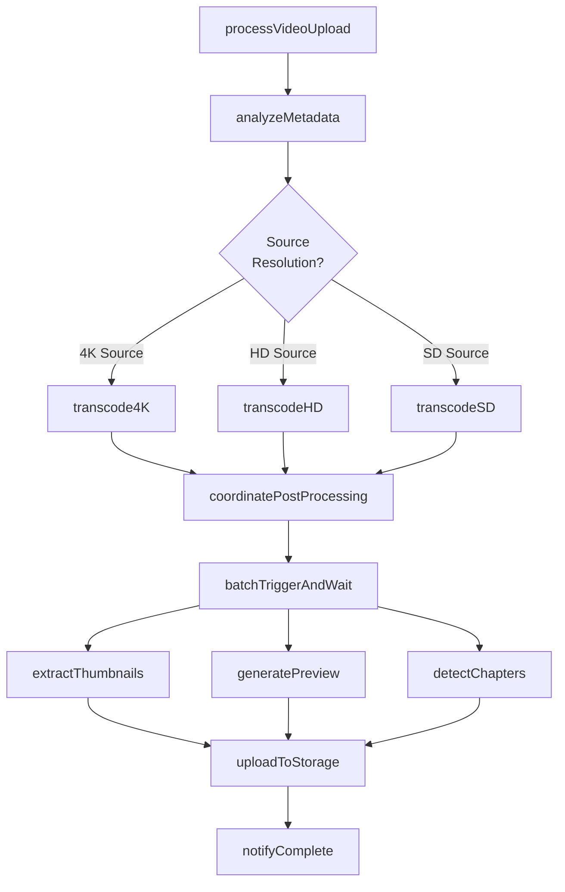
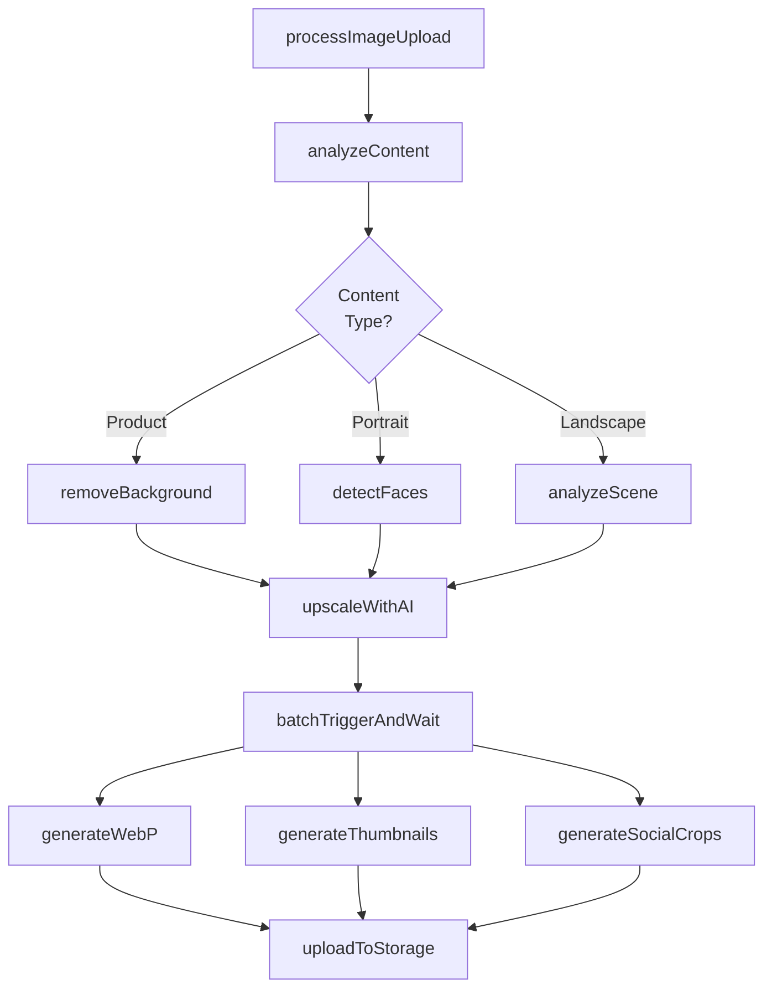
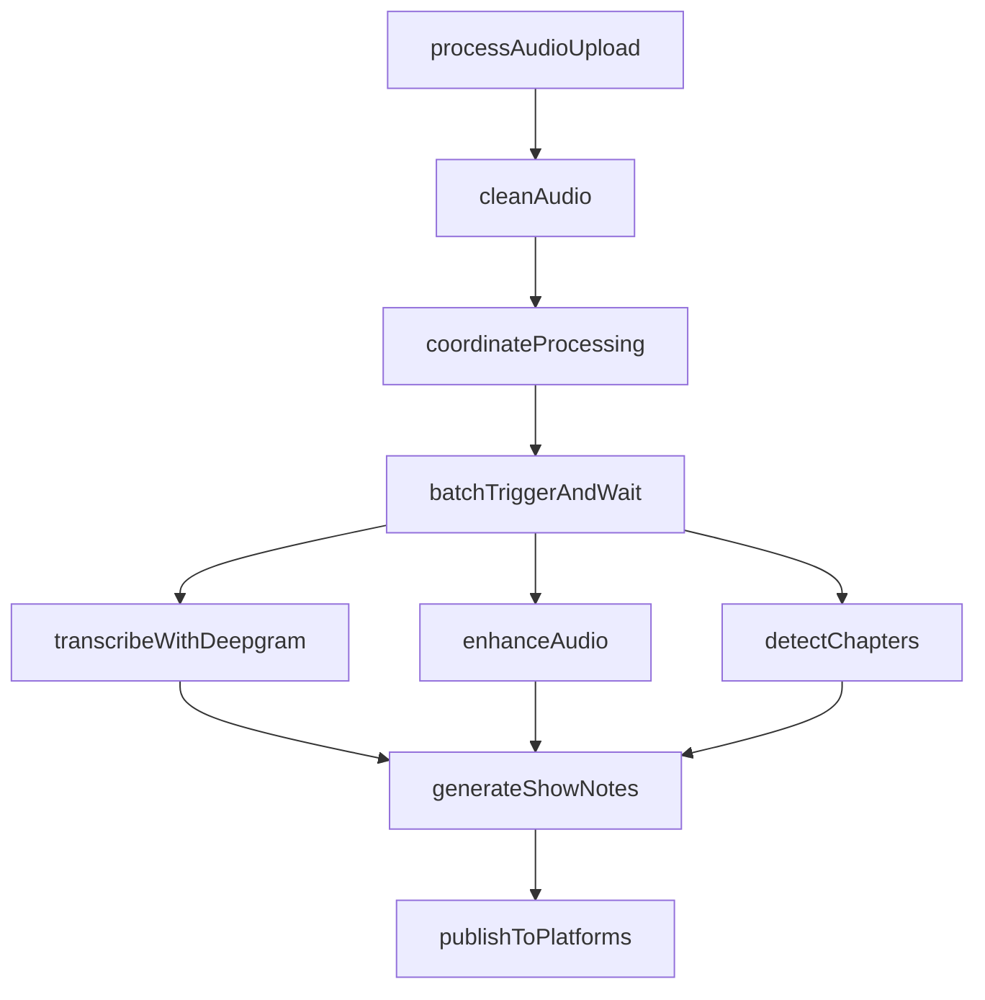
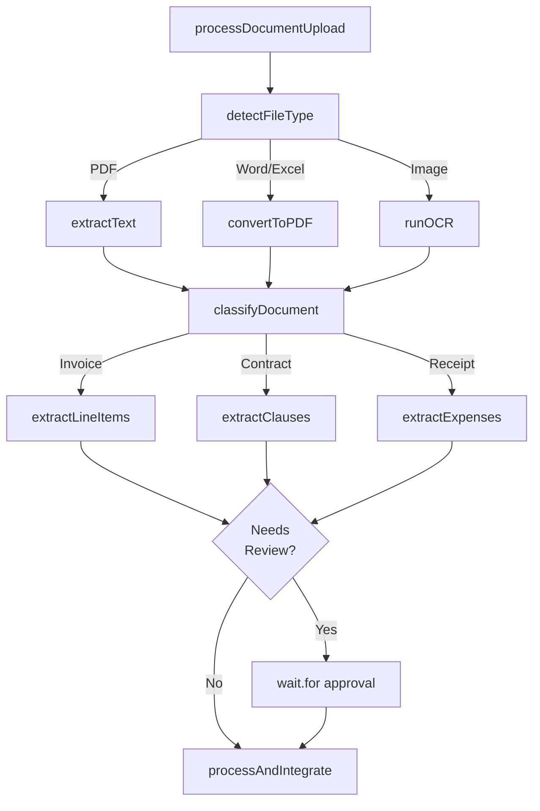

import UseCasesCards from "/snippets/use-cases-cards.mdx";

## Overview

Build media processing pipelines that handle large files and long-running operations. Process videos, images, audio, and documents with automatic retries, progress tracking, and no timeout limits.

## Featured examples

<CardGroup cols={3}>
  <Card title="FFmpeg video processing" icon="book" href="/guides/examples/ffmpeg-video-processing">
    Process videos and upload results to R2 storage using FFmpeg.
  </Card>
  <Card
    title="Product image generator"
    icon="book"
    href="/guides/example-projects/product-image-generator"
  >
    Transform product photos into professional marketing images using Replicate.
  </Card>
  <Card
    title="LibreOffice PDF conversion"
    icon="book"
    href="/guides/examples/libreoffice-pdf-conversion"
  >
    Convert documents to PDF using LibreOffice.
  </Card>
</CardGroup>

## Benefits of using Trigger.dev for media processing workflows

**Process multi-hour videos without timeouts:** Transcode videos, extract frames, or run CPU-intensive operations for hours. No execution time limits.

**Stream progress to users in real-time:** Show processing status updating live in your UI. Users see exactly where encoding is and how long remains.

**Parallel processing with resource control:** Process hundreds of files simultaneously with configurable concurrency limits. Control resource usage without overwhelming infrastructure.

## Example worfklow patterns

<Tabs>
  <Tab title="Video transcode">
    Simple video transcoding pipeline. Downloads video from storage, transcodes to multiple formats, extracts thumbnail, uploads results.

  </Tab>

  <Tab title="Adaptive video processing">
    **Router + Coordinator pattern**. Analyzes video metadata to determine source resolution, routes to appropriate transcoding preset, batch triggers parallel post-processing for thumbnails, preview clips, and chapter detection.

  </Tab>

  <Tab title="Smart image optimization">
    **Router + Coordinator pattern**. Analyzes image content to detect type, routes to specialized processing (background removal for products, face detection for portraits, scene analysis for landscapes), upscales with AI, batch triggers parallel variant generation.

  </Tab>

  <Tab title="Podcast production">
    **Coordinator pattern**. Pre-processes raw audio with noise reduction and speaker diarization, batch triggers parallel tasks for transcription (Deepgram), audio enhancement, and chapter detection, aggregates results to generate show notes and publish.

  </Tab>

  <Tab title="Document extraction with approval">
    **Router pattern with human-in-the-loop**. Detects file type and routes to appropriate processor, classifies document with AI to determine type (invoice/contract/receipt), extracts structured data fields, optionally pauses with wait.for for human approval.

  </Tab>
</Tabs>

<UseCasesCards />
