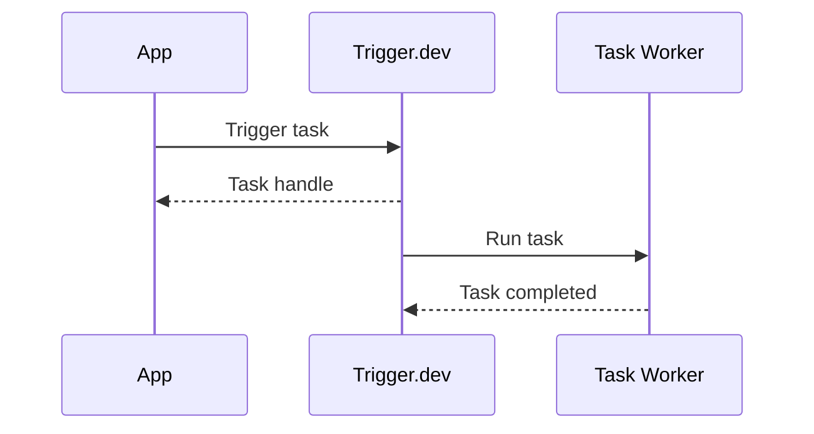
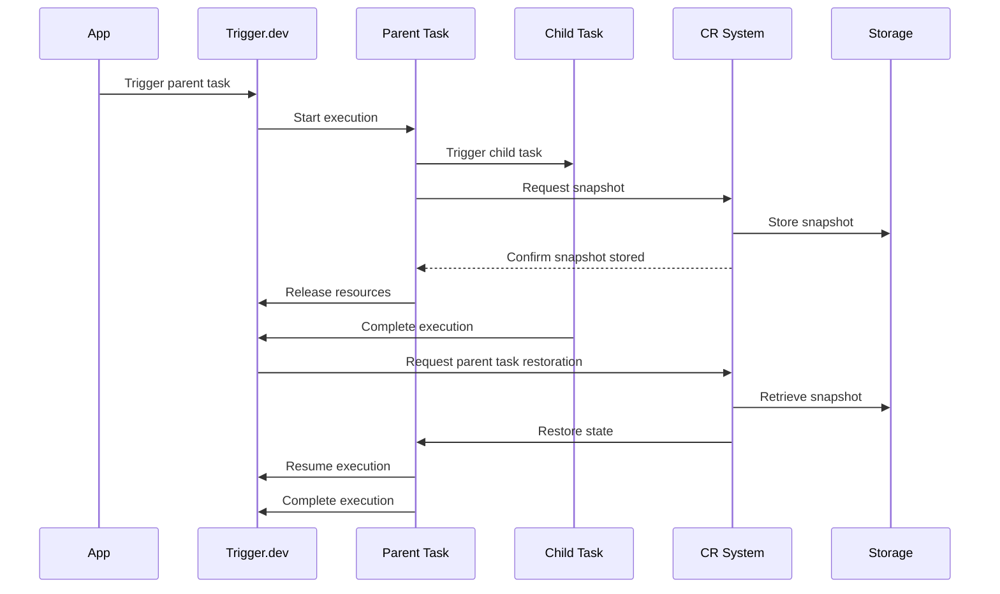
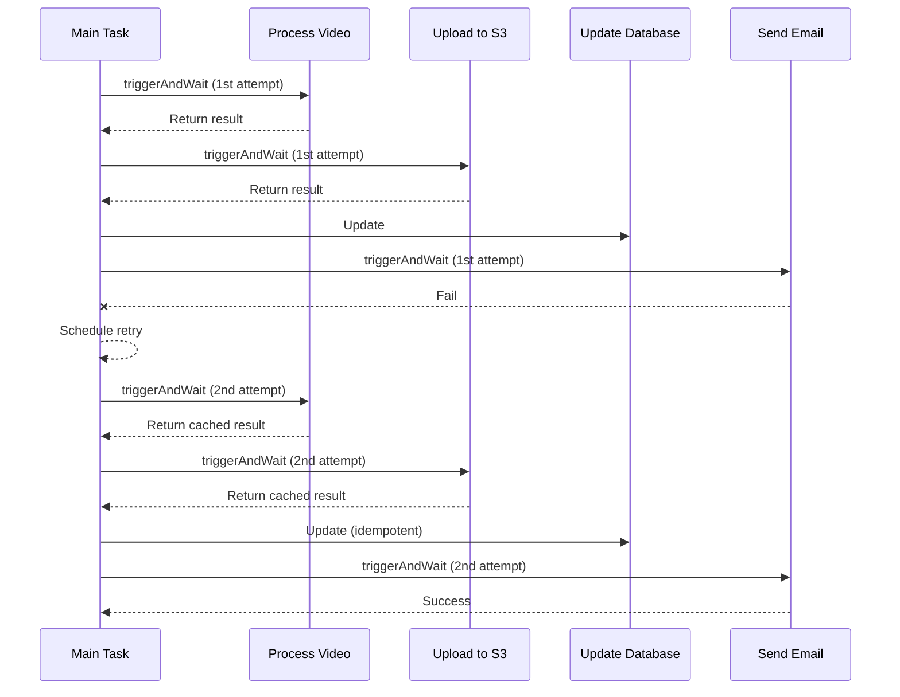

## Introduction

Trigger.dev v3 allows you to integrate long-running async tasks into your application and run them in the background. This allows you to offload tasks that take a long time to complete, such as sending multi-day email campaigns, processing videos, or running long chains of AI tasks.

For example, the below task processes a video with `ffmpeg` and sends the results to an s3 bucket, then updates a database with the results and sends an email to the user.

```ts /trigger/video.ts
import { logger, task } from "@trigger.dev/sdk";
import { updateVideoUrl } from "../db.js";
import ffmpeg from "fluent-ffmpeg";
import { Readable } from "node:stream";
import type { ReadableStream } from "node:stream/web";
import * as fs from "node:fs/promises";
import * as path from "node:path";
import { S3Client, PutObjectCommand } from "@aws-sdk/client-s3";
import { sendEmail } from "../email.js";
import { getVideo } from "../db.js";

// Initialize S3 client
const s3Client = new S3Client({
  region: process.env.AWS_REGION,
});

export const convertVideo = task({
  id: "convert-video",
  retry: {
    maxAttempts: 5,
    minTimeoutInMs: 1000,
    maxTimeoutInMs: 10000,
    factor: 2,
  },
  run: async ({ videoId }: { videoId: string }) => {
    const { url, userId } = await getVideo(videoId);

    const outputPath = path.join("/tmp", `output_${videoId}.mp4`);

    const response = await fetch(url);

    await new Promise((resolve, reject) => {
      ffmpeg(Readable.fromWeb(response.body as ReadableStream))
        .videoFilters("scale=iw/2:ih/2")
        .output(outputPath)
        .on("end", resolve)
        .on("error", reject)
        .run();
    });

    const processedContent = await fs.readFile(outputPath);

    // Upload to S3
    const s3Key = `processed-videos/output_${videoId}.mp4`;

    const uploadParams = {
      Bucket: process.env.S3_BUCKET,
      Key: s3Key,
      Body: processedContent,
    };

    await s3Client.send(new PutObjectCommand(uploadParams));
    const s3Url = `https://${process.env.S3_BUCKET}.s3.amazonaws.com/${s3Key}`;

    logger.info("Video converted", { videoId, s3Url });

    // Update database
    await updateVideoUrl(videoId, s3Url);

    await sendEmail(
      userId,
      "Video Processing Complete",
      `Your video has been processed and is available at: ${s3Url}`
    );

    return { success: true, s3Url };
  },
});
```

Now in your application, you can trigger this task by calling:

```ts
import { NextResponse } from "next/server";
import { tasks } from "@trigger.dev/sdk";
import type { convertVideo } from "./trigger/video";
//     👆 **type-only** import

export async function POST(request: Request) {
  const body = await request.json();

  // Trigger the task, this will return before the task is completed
  const handle = await tasks.trigger<typeof convertVideo>("convert-video", body);

  return NextResponse.json(handle);
}
```

This will schedule the task to run in the background and return a handle that you can use to check the status of the task. This allows your backend application to respond quickly to the user and offload the long-running task to Trigger.dev.

## The CLI

Trigger.dev comes with a CLI that allows you to initialize Trigger.dev into your project, deploy your tasks, and run your tasks locally. You can run it via `npx` like so:

```sh
npx trigger.dev@latest login # Log in to your Trigger.dev account
npx trigger.dev@latest init # Initialize Trigger.dev in your project
npx trigger.dev@latest dev # Run your tasks locally
npx trigger.dev@latest deploy # Deploy your tasks to the Trigger.dev instance
```

All these commands work with the Trigger.dev cloud and/or your self-hosted instance. It supports multiple profiles so you can easily switch between different accounts or instances.

```sh
npx trigger.dev@latest login --profile <profile> -a https://trigger.example.com # Log in to a specific profile into a self-hosted instance
npx trigger.dev@latest dev --profile <profile> # Initialize Trigger.dev in your project
npx trigger.dev@latest deploy --profile <profile> # Deploy your tasks to the Trigger.dev instance
```

## Trigger.dev architecture

Trigger.dev implements a serverless architecture (without timeouts!) that allows you to run your tasks in a scalable and reliable way. When you run `npx trigger.dev@latest deploy`, we build and deploy your task code to your Trigger.dev instance. Then, when you trigger a task from your application, it's run in a secure, isolated environment with the resources you need to complete the task. A simplified diagram for a task execution looks like this:



In reality there are many more components involved, such as the task queue, the task scheduler, and the task worker pool, logging (etc.), but this diagram gives you a high-level overview of how Trigger.dev works.

## The Checkpoint-Resume System

Trigger.dev implements a powerful Checkpoint-Resume System that enables efficient execution of long-running background tasks in a serverless-like environment. This system allows tasks to pause, checkpoint their state, and resume seamlessly, optimizing resource usage and enabling complex workflows.

Here's how the Checkpoint-Resume System works:

1. **Task Execution**: When a task is triggered, it runs in an isolated environment with all necessary resources.

2. **Subtask Handling**: If a task needs to trigger a subtask, it can do so and wait for its completion using `triggerAndWait`

3. **State Checkpointing**: While waiting for a subtask or during a programmed pause (e.g., `wait.for({ seconds: 30 })`), the system uses CRIU (Checkpoint/Restore In Userspace) to create a checkpoint of the task's entire state, including memory, CPU registers, and open file descriptors.

4. **Resource Release**: After checkpointing, the parent task's resources are released, freeing up the execution environment.

5. **Efficient Storage**: The checkpoint is efficiently compressed and stored on disk, ready to be restored when needed.

6. **Event-Driven Resumption**: When a subtask completes or a wait period ends, Trigger.dev's event system triggers the restoration process.

7. **State Restoration**: The checkpoint is loaded back into a new execution environment, restoring the task to its exact state before suspension.

8. **Seamless Continuation**: The task resumes execution from where it left off, with any subtask results or updated state seamlessly integrated.

This approach allows Trigger.dev to manage resources efficiently, handle complex task dependencies, and provide a virtually limitless execution time for your tasks, all while maintaining the simplicity and scalability of a serverless architecture.

Example of a parent and child task using the Checkpoint-Resume System:

```ts
import { task, wait } from "@trigger.dev/sdk";

export const parentTask = task({
  id: "parent-task",
  run: async () => {
    console.log("Starting parent task");

    // This will cause the parent task to be checkpointed and suspended
    const result = await childTask.triggerAndWait({ data: "some data" });

    console.log("Child task result:", result);

    // This will also cause the task to be checkpointed and suspended
    await wait.for({ seconds: 30 });

    console.log("Resumed after 30 seconds");

    return "Parent task completed";
  },
});

export const childTask = task({
  id: "child-task",
  run: async (payload: { data: string }) => {
    console.log("Starting child task with data:", payload.data);

    // Simulate some work
    await sleep(5);

    return "Child task result";
  },
});
```

The diagram below illustrates the flow of the parent and child tasks using the Checkpoint-Resume System:



<Note>
  This is why, in the Trigger.dev Cloud, we don't charge for the time waiting for subtasks or the
  time spent in a paused state.
</Note>

## Durable execution

Trigger.dev's Checkpoint-Resume System, combined with idempotency keys, enables durable execution of complex workflows. This approach allows for efficient retries and caching of results, ensuring that work is not unnecessarily repeated in case of failures.

### How it works

1. **Task breakdown**: Complex workflows are broken down into smaller, independent subtasks.
2. **Idempotency keys**: Each subtask is assigned a unique idempotency key.
3. **Result caching**: The output of each subtask is cached based on its idempotency key.
4. **Intelligent retries**: If a failure occurs, only the failed subtask and subsequent tasks are retried.

### Example: Video processing workflow

Let's rewrite the `convert-video` task above to be more durable:

<CodeGroup>

```ts /trigger/video.ts
import { idempotencyKeys, logger, task } from "@trigger.dev/sdk";
import { processVideo, sendUserEmail, uploadToS3 } from "./tasks.js";
import { updateVideoUrl } from "../db.js";

export const convertVideo = task({
  id: "convert-video",
  retry: {
    maxAttempts: 5,
    minTimeoutInMs: 1000,
    maxTimeoutInMs: 10000,
    factor: 2,
  },
  run: async ({ videoId }: { videoId: string }) => {
    // Automatically scope the idempotency key to this run, across retries
    const idempotencyKey = await idempotencyKeys.create(videoId);

    // Process video
    const { processedContent } = await processVideo
      .triggerAndWait({ videoId }, { idempotencyKey })
      .unwrap(); // Calling unwrap will return the output of the subtask, or throw an error if the subtask failed

    // Upload to S3
    const { s3Url } = await uploadToS3
      .triggerAndWait({ processedContent, videoId }, { idempotencyKey })
      .unwrap();

    // Update database
    await updateVideoUrl(videoId, s3Url);

    // Send email, we don't need to wait for this to finish
    await sendUserEmail.trigger({ videoId, s3Url }, { idempotencyKey });

    return { success: true, s3Url };
  },
});
```

```ts /trigger/tasks.ts
import { task, logger } from "@trigger.dev/sdk";
import ffmpeg from "fluent-ffmpeg";
import { Readable } from "node:stream";
import type { ReadableStream } from "node:stream/web";
import * as fs from "node:fs/promises";
import * as path from "node:path";
import { S3Client, PutObjectCommand } from "@aws-sdk/client-s3";
import { sendEmail } from "../email.js";
import { getVideo } from "../db.js";

// Initialize S3 client
const s3Client = new S3Client({
  region: process.env.AWS_REGION,
});

export const processVideo = task({
  id: "process-video",
  run: async ({ videoId }: { videoId: string }) => {
    const { url } = await getVideo(videoId);

    const outputPath = path.join("/tmp", `output_${videoId}.mp4`);
    const response = await fetch(url);

    await logger.trace("ffmpeg", async (span) => {
      await new Promise((resolve, reject) => {
        ffmpeg(Readable.fromWeb(response.body as ReadableStream))
          .videoFilters("scale=iw/2:ih/2")
          .output(outputPath)
          .on("end", resolve)
          .on("error", reject)
          .run();
      });
    });

    const processedContent = await fs.readFile(outputPath);

    await fs.unlink(outputPath);

    return { processedContent: processedContent.toString("base64") };
  },
});

export const uploadToS3 = task({
  id: "upload-to-s3",
  run: async (payload: { processedContent: string; videoId: string }) => {
    const { processedContent, videoId } = payload;

    const s3Key = `processed-videos/output_${videoId}.mp4`;

    const uploadParams = {
      Bucket: process.env.S3_BUCKET,
      Key: s3Key,
      Body: Buffer.from(processedContent, "base64"),
    };

    await s3Client.send(new PutObjectCommand(uploadParams));
    const s3Url = `https://${process.env.S3_BUCKET}.s3.amazonaws.com/${s3Key}`;

    return { s3Url };
  },
});

export const sendUserEmail = task({
  id: "send-user-email",
  run: async ({ videoId, s3Url }: { videoId: string; s3Url: string }) => {
    const { userId } = await getVideo(videoId);

    return await sendEmail(
      userId,
      "Video Processing Complete",
      `Your video has been processed and is available at: ${s3Url}`
    );
  },
});
```

</CodeGroup>

### How retries work

Let's say the email sending fails in our video processing workflow. Here's how the retry process works:

1. The main task throws an error and is scheduled for retry.
2. When retried, it starts from the beginning, but leverages cached results for completed subtasks.

Here's a sequence diagram illustrating this process:



## The build system

When you run `npx trigger.dev@latest deploy` or `npx trigger.dev@latest dev`, we build your task code using our build system, which is powered by [esbuild](https://esbuild.github.io/). When deploying, the code is packaged up into a Docker image and deployed to your Trigger.dev instance. When running in dev mode, the code is built and run locally on your machine. Some features of our build system include:

- **Bundled by default**: Code + dependencies are bundled and tree-shaked by default.
- **Build extensions**: Use and write custom build extensions to transform your code or the resulting docker image.
- **ESM ouput**: We output to ESM, which allows tree-shaking and better performance.

You can review the build output by running deploy with the `--dry-run` flag, which will output the Containerfile and the build output.

Learn more about working with our build system in the [configuration docs](/config/config-file).

## Dev mode

When you run `npx trigger.dev@latest dev`, we run your task code locally on your machine. All scheduling is still done in the Trigger.dev server instance, but the task code is run locally. This allows you to develop and test your tasks locally before deploying them to the cloud, and is especially useful for debugging and testing.

- The same build system is used in dev mode, so you can be sure that your code will run the same locally as it does in the cloud.
- Changes are automatically detected and a new version is spun up when you save your code.
- Add debuggers and breakpoints to your code and debug it locally.
- Each task is run in a separate process, so you can run multiple tasks in parallel.
- Auto-cancels tasks when you stop the dev server.

<Note>
  Trigger.dev currently does not support "offline" dev mode, where you can run tasks without an
  internet connection. [Please let us know](https://feedback.trigger.dev/) if this is a feature you
  want/need.
</Note>

## Staging and production environments

Trigger.dev supports deploying to multiple "deployed" environments, such as staging and production. This allows you to test your tasks in a staging environment before deploying them to production. You can deploy to a new environment by running `npx trigger.dev@latest deploy --env <env>`, where `<env>` is the name of the environment you want to deploy to. Each environment has its own API Key, which you can use to trigger tasks in that environment.

## OpenTelemetry

The Trigger.dev logging and task dashboard is powered by OpenTelemetry traces and logs, which allows you to trace your tasks and auto-instrument your code. We also auto-correlate logs from subtasks and parent tasks, making it easy view the entire trace of a task execution. A single run of the video processing task above looks like this in the dashboard:


Because we use standard OpenTelemetry, you can instrument your code and OpenTelemetry compatible libraries to get detailed traces and logs of your tasks. The above trace instruments both Prisma and the AWS SDK:

```ts trigger.config.ts
import { defineConfig } from "@trigger.dev/sdk";
import { PrismaInstrumentation } from "@prisma/instrumentation";
import { AwsInstrumentation } from "@opentelemetry/instrumentation-aws-sdk";

export default defineConfig({
  project: "<your-project-ref>",
  instrumentations: [new PrismaInstrumentation(), new AwsInstrumentation()],
});
```
