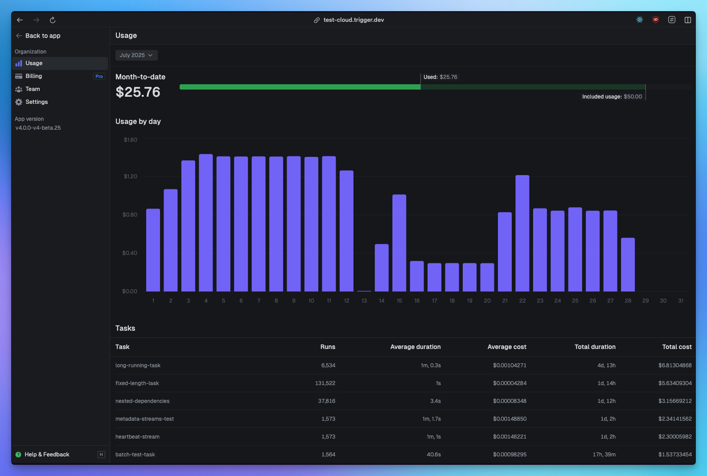
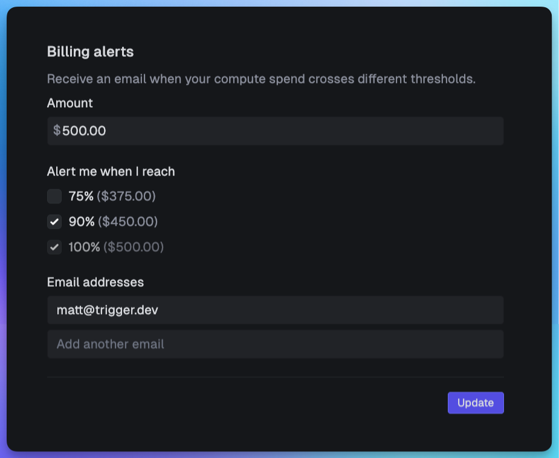

## Check out your usage page regularly

Monitor your usage dashboard to understand your spending patterns. You can see:
- Your most expensive tasks
- Your total duration by task
- Number of runs by task
- Spikes in your daily usage



You can view your usage page by clicking the "Organization" menu in the top left of the dashboard and then clicking "Usage".

## Create billing alerts

Configure billing alerts in your dashboard to get notified when you approach spending thresholds. This helps you:
- Catch unexpected cost increases early
- Identify runaway tasks before they become expensive



You can view your billing alerts page by clicking the "Organization" menu in the top left of the dashboard and then clicking "Settings".

## Reduce your machine sizes

The larger the machine, the more it costs per second. [View the machine pricing](https://trigger.dev/pricing#computePricing).

Start with the smallest machine that works, then scale up only if needed:

```ts
// Default: small-1x (0.5 vCPU, 0.5 GB RAM)
export const lightTask = task({
  id: "light-task",
  // No machine config needed - uses small-1x by default
  run: async (payload) => {
    // Simple operations
  },
});

// Only use larger machines when necessary
export const heavyTask = task({
  id: "heavy-task", 
  machine: "medium-1x", // 1 vCPU, 2 GB RAM
  run: async (payload) => {
    // CPU/memory intensive operations
  },
});
```

You can also override machine size when triggering if you know certain payloads need more resources. [Read more about machine sizes](/machines).

## Avoid duplicate work using idempotencyKey

Idempotency keys prevent expensive duplicate work by ensuring the same operation isn't performed multiple times. This is especially valuable during task retries or when the same trigger might fire multiple times.

When you use an idempotency key, Trigger.dev remembers the result and skips re-execution, saving you compute costs:

```ts
export const expensiveApiCall = task({
  id: "expensive-api-call",
  run: async (payload: { userId: string }) => {
    // This expensive operation will only run once per user
    await wait.for({ seconds: 30 }, { 
      idempotencyKey: `user-processing-${payload.userId}`,
      idempotencyKeyTTL: "1h" 
    });
    
    const result = await processUserData(payload.userId);
    return result;
  },
});
```

You can use idempotency keys with various wait functions:

```ts
// Skip waits during retries
const token = await wait.createToken({
  idempotencyKey: `daily-report-${new Date().toDateString()}`,
  idempotencyKeyTTL: "24h",
});

// Prevent duplicate child task execution
await childTask.triggerAndWait(
  { data: payload },
  {
    idempotencyKey: `process-${payload.id}`,
    idempotencyKeyTTL: "1h",
  }
);
```

The `idempotencyKeyTTL` controls how long the result is cached. Use shorter TTLs (like "1h") for time-sensitive operations, or longer ones (up to 30 days default) for expensive operations that rarely need re-execution. This prevents both unnecessary duplicate work and stale data issues.

## Do more work in parallel in a single task

Sometimes it's more efficient to do more work in a single task than split across many. This is particularly true when you're doing lots of async work such as API calls – most of the time is spent waiting, so it's an ideal candidate for doing calls in parallel inside the same task.

```ts
export const processItems = task({
  id: "process-items",
  run: async (payload: { items: string[] }) => {
    // Process all items in parallel
    const promises = payload.items.map(item => processItem(item));
    // This works very well for API calls
    await Promise.all(promises);
  },
});
```

## Don't needlessly retry

When an error is thrown in a task, your run will be automatically reattempted based on your [retry settings](/tasks/overview#retry-options).

Try setting lower `maxAttempts` for less critical tasks:

```ts
export const apiTask = task({
  id: "api-task",
  retry: {
    maxAttempts: 2, // Don't retry forever
  },
  run: async (payload) => {
    // API calls that might fail
  },
});
```

This is very useful for intermittent errors, but if there's a permanent error you don't want to retry because you will just keep failing and waste compute. Use [AbortTaskRunError](/errors-retrying#using-aborttaskrunerror) to prevent a retry:

```ts
import { task, AbortTaskRunError } from "@trigger.dev/sdk/v3";

export const someTask = task({
  id: "some-task",
  run: async (payload) => {
    const result = await doSomething(payload);

    if (!result.success) {
      // This is a known permanent error, so don't retry
      throw new AbortTaskRunError(result.error);
    }

    return result
  },
});
```


## Use appropriate maxDuration settings

Set realistic maxDurations to prevent runs from executing for too long:

```ts
export const boundedTask = task({
  id: "bounded-task",
  maxDuration: 300, // 5 minutes max
  run: async (payload) => {
    // Task will be terminated after 5 minutes
  },
});
```
