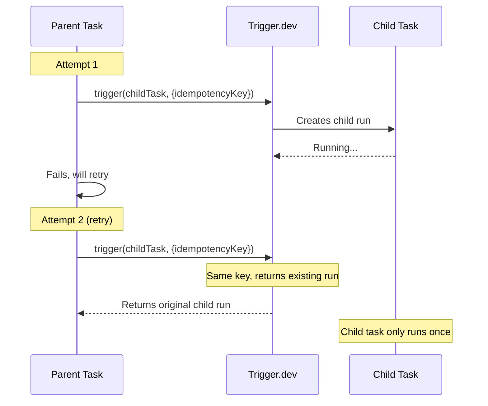

We currently support idempotency at the task level, meaning that if you trigger a task with the same `idempotencyKey` twice, the second request will not create a new task run. Instead, the original run's handle is returned, allowing you to track the existing run's progress.

## Why use idempotency keys?

The most common use case is **preventing duplicate child tasks when a parent task retries**. Without idempotency keys, each retry of the parent would trigger a new child task run:



Other common use cases include:

- **Preventing duplicate emails** - Ensure a confirmation email is only sent once, even if the parent task retries
- **Avoiding double-charging customers** - Prevent duplicate payment processing during retries
- **One-time setup tasks** - Ensure initialization or migration tasks only run once
- **Deduplicating webhook processing** - Handle the same webhook event only once, even if it's delivered multiple times

## `idempotencyKey` option

You can provide an `idempotencyKey` when triggering a task:

```ts
import { idempotencyKeys, task } from "@trigger.dev/sdk";

export const myTask = task({
  id: "my-task",
  retry: {
    maxAttempts: 4,
  },
  run: async (payload: any) => {
    // This idempotency key will be unique to this task run, meaning the childTask will only be triggered once across all retries
    const idempotencyKey = await idempotencyKeys.create("my-task-key");

    // childTask will only be triggered once with the same idempotency key
    await childTask.trigger({ foo: "bar" }, { idempotencyKey });

    // Do something else, that may throw an error and cause the task to be retried
    throw new Error("Something went wrong");
  },
});
```

You can use the `idempotencyKeys.create` SDK function to create an idempotency key before passing it to the `options` object.

We automatically inject the run ID when generating the idempotency key when running inside a task by default. You can turn it off by passing the `scope` option to `idempotencyKeys.create`:

```ts
import { idempotencyKeys, task } from "@trigger.dev/sdk";

export const myTask = task({
  id: "my-task",
  retry: {
    maxAttempts: 4,
  },
  run: async (payload: any) => {
    // This idempotency key will be globally unique, meaning only a single task run will be triggered with this key
    const idempotencyKey = await idempotencyKeys.create("my-task-key", { scope: "global" });

    // childTask will only be triggered once with the same idempotency key
    await childTask.trigger({ foo: "bar" }, { idempotencyKey });
  },
});
```

If you are triggering a task from your backend code, you can use the `idempotencyKeys.create` SDK function to create an idempotency key.

```ts
import { idempotencyKeys, tasks } from "@trigger.dev/sdk";

// You can also pass an array of strings to create a idempotency key
const idempotencyKey = await idempotencyKeys.create([myUser.id, "my-task"]);
await tasks.trigger("my-task", { some: "data" }, { idempotencyKey });
```

You can also pass a string to the `idempotencyKey` option, without first creating it with `idempotencyKeys.create`.

```ts
import { myTask } from "./trigger/myTasks";

// You can also pass an array of strings to create a idempotency key
await myTask.trigger({ some: "data" }, { idempotencyKey: myUser.id });
```

<Note>
When you pass a raw string, it defaults to `"run"` scope (scoped to the parent run). See [Default behavior](#default-behavior) for details on how scopes work and how to use global scope instead.
</Note>

<Note>Make sure you provide sufficiently unique keys to avoid collisions.</Note>

You can pass the `idempotencyKey` when calling `batchTrigger` as well:

```ts
import { tasks } from "@trigger.dev/sdk";

await tasks.batchTrigger("my-task", [
  {
    payload: { some: "data" },
    options: { idempotencyKey: await idempotencyKeys.create(myUser.id) },
  },
]);
```

## Understanding scopes

The `scope` option determines how your idempotency key is processed. When you provide a key, it gets hashed together with additional context based on the scope. This means the same key string can produce different idempotency behaviors depending on the scope you choose.

### Available scopes

| Scope | What gets hashed | Description | Use case |
| --- | --- | --- | --- |
| `"run"` | `key + parentRunId` | Key is combined with the parent run ID | Prevent duplicates within a single parent run (default) |
| `"attempt"` | `key + parentRunId + attemptNumber` | Key is combined with the parent run ID and attempt number | Allow child tasks to re-run on each retry of the parent |
| `"global"` | `key` | Key is used as-is, no context added | Ensure a task only runs once ever, regardless of parent |

### `run` scope (default)

The `run` scope makes the idempotency key unique to the current parent task run. This is the default behavior for both raw strings and `idempotencyKeys.create()`.

```ts
import { idempotencyKeys, task } from "@trigger.dev/sdk";

export const processOrder = task({
  id: "process-order",
  retry: { maxAttempts: 3 },
  run: async (payload: { orderId: string; email: string }) => {
    // This key is scoped to this specific run of processOrder
    // If processOrder retries, the same key still refers to the same child run
    const idempotencyKey = await idempotencyKeys.create(`send-confirmation-${payload.orderId}`);

    // sendEmail will only be triggered once, even if processOrder retries multiple times
    await sendEmail.trigger(
      { to: payload.email, subject: "Order confirmed" },
      { idempotencyKey }
    );

    // ... more processing that might fail and cause a retry
  },
});
```

With `run` scope, if you trigger `processOrder` twice with different run IDs, both will send emails because the idempotency keys are different (they include different parent run IDs).

### `attempt` scope

The `attempt` scope makes the idempotency key unique to each attempt of the parent task. Use this when you want child tasks to re-execute on each retry.

```ts
import { idempotencyKeys, task } from "@trigger.dev/sdk";

export const syncData = task({
  id: "sync-data",
  retry: { maxAttempts: 3 },
  run: async (payload: { userId: string }) => {
    // This key changes on each retry attempt
    const idempotencyKey = await idempotencyKeys.create(`fetch-${payload.userId}`, {
      scope: "attempt",
    });

    // fetchLatestData will run again on each retry, getting fresh data
    const result = await fetchLatestData.triggerAndWait(
      { userId: payload.userId },
      { idempotencyKey }
    );

    // Process the fresh data...
  },
});
```

### `global` scope

The `global` scope makes the idempotency key truly global across all runs. Use this when you want to ensure a task only runs once ever (until the TTL expires), regardless of which parent task triggered it.

```ts
import { idempotencyKeys, task } from "@trigger.dev/sdk";

export const onboardUser = task({
  id: "onboard-user",
  run: async (payload: { userId: string; email: string }) => {
    // This key is global - the welcome email will only be sent once per user,
    // even if onboardUser is triggered multiple times from different places
    const idempotencyKey = await idempotencyKeys.create(`welcome-email-${payload.userId}`, {
      scope: "global",
    });

    await sendWelcomeEmail.trigger(
      { to: payload.email },
      { idempotencyKey, idempotencyKeyTTL: "7d" }
    );
  },
});
```

<Note>
Even with `global` scope, idempotency keys are still isolated to the specific task and environment. Using the same key to trigger *different* tasks will not deduplicate - both tasks will run. See [Environment and task scoping](#environment-and-task-scoping) for more details.
</Note>

## Default behavior

Understanding the default behavior is important to avoid unexpected results:

### Passing a raw string

When you pass a raw string directly to the `idempotencyKey` option, it is automatically processed with `run` scope:

```ts
// These two are equivalent when called inside a task:
await childTask.trigger(payload, { idempotencyKey: "my-key" });
await childTask.trigger(payload, { idempotencyKey: await idempotencyKeys.create("my-key") });
```

<Warning>
**Breaking change in v4.3.1:** In v4.3.0 and earlier, raw strings defaulted to `global` scope. Starting in v4.3.1, raw strings now default to `run` scope. If you're upgrading and relied on the previous global behavior, you must now explicitly use `idempotencyKeys.create("key", { scope: "global" })`.
</Warning>

This means raw strings are scoped to the parent run by default. If you want global behavior, you must explicitly create the key with `scope: "global"`:

```ts
// For global idempotency, you must use idempotencyKeys.create with scope: "global"
const idempotencyKey = await idempotencyKeys.create("my-key", { scope: "global" });
await childTask.trigger(payload, { idempotencyKey });
```

### Triggering from backend code

When triggering tasks from your backend code (outside of a task), there is no parent run context. In this case, `run` and `attempt` scopes behave the same as `global` since there's no run ID or attempt number to inject:

```ts
// In your backend code (e.g., an API route)
import { idempotencyKeys, tasks } from "@trigger.dev/sdk";

// All three of these behave the same when called outside a task:
await tasks.trigger("my-task", payload, { idempotencyKey: "my-key" });
await tasks.trigger("my-task", payload, {
  idempotencyKey: await idempotencyKeys.create("my-key", { scope: "run" }),
});
await tasks.trigger("my-task", payload, {
  idempotencyKey: await idempotencyKeys.create("my-key", { scope: "global" }),
});
```

<Note>
When triggering from backend code, the scope doesn't matter since there's no task context. All scopes effectively behave as global.
</Note>

## `idempotencyKeyTTL` option

The `idempotencyKeyTTL` option defines a time window during which a task with the same idempotency key will only run once. Here's how it works:

1. When you trigger a task with an idempotency key and set `idempotencyKeyTTL: "5m"`, it creates a 5-minute window.
2. During this window, any subsequent triggers with the same idempotency key will return the original task run instead of creating a new one.
3. Once the TTL window expires, the next trigger with that idempotency key will create a new task run and start a new time window.


By default idempotency keys are stored for 30 days. You can change this by passing the `idempotencyKeyTTL` option when triggering a task:

```ts
import { idempotencyKeys, task, wait } from "@trigger.dev/sdk";

export const myTask = task({
  id: "my-task",
  retry: {
    maxAttempts: 4,
  },
  run: async (payload: any) => {
    const idempotencyKey = await idempotencyKeys.create("my-task-key");

    // The idempotency key will expire after 60 seconds
    await childTask.trigger({ foo: "bar" }, { idempotencyKey, idempotencyKeyTTL: "60s" });

    await wait.for({ seconds: 61 });

    // The idempotency key will have expired, so the childTask will be triggered again
    await childTask.trigger({ foo: "bar" }, { idempotencyKey });

    // Do something else, that may throw an error and cause the task to be retried
    throw new Error("Something went wrong");
  },
});
```

You can use the following units for the `idempotencyKeyTTL` option:

- `s` for seconds (e.g. `60s`)
- `m` for minutes (e.g. `5m`)
- `h` for hours (e.g. `2h`)
- `d` for days (e.g. `3d`)

## Failed runs and idempotency

When a run with an idempotency key **fails**, the key is automatically cleared. This means triggering the same task with the same idempotency key will create a new run. However, **successful** and **canceled** runs keep their idempotency key. If you need to re-trigger after a successful or canceled run, you can:

1. **Reset the idempotency key** using `idempotencyKeys.reset()`:

```ts
import { idempotencyKeys } from "@trigger.dev/sdk";

// Clear the idempotency key to allow re-triggering
await idempotencyKeys.reset("my-task", "my-idempotency-key");

// Now you can trigger the task again
await myTask.trigger(payload, { idempotencyKey: "my-idempotency-key" });
```

2. **Use a shorter TTL** so the key expires automatically:

```ts
// Key expires after 5 minutes
await myTask.trigger(payload, { 
  idempotencyKey: "my-key", 
  idempotencyKeyTTL: "5m" 
});
```

## Payload-based idempotency

We don't currently support payload-based idempotency, but you can implement it yourself by hashing the payload and using the hash as the idempotency key.

```ts
import { idempotencyKeys, task } from "@trigger.dev/sdk";
import { createHash } from "node:crypto";

// Somewhere in your code
const idempotencyKey = await idempotencyKeys.create(hash(childPayload));
// childTask will only be triggered once with the same idempotency key
await tasks.trigger("child-task", { some: "payload" }, { idempotencyKey });

// Create a hash of the payload using Node.js crypto
// Ideally, you'd do a stable serialization of the payload before hashing, to ensure the same payload always results in the same hash
function hash(payload: any): string {
  const hash = createHash("sha256");
  hash.update(JSON.stringify(payload));
  return hash.digest("hex");
}
```

## Resetting idempotency keys

You can reset an idempotency key to clear it from all associated runs. This is useful if you need to allow a task to be triggered again with the same idempotency key.

When you reset an idempotency key, it will be cleared for all runs that match both the task identifier and the idempotency key in the current environment. This allows you to trigger the task again with the same key.

### API signature

```ts
idempotencyKeys.reset(
  taskIdentifier: string,
  idempotencyKey: string,
  requestOptions?: ZodFetchOptions
): Promise<{ id: string }>
```

| Parameter | Description |
| --- | --- |
| `taskIdentifier` | The identifier of the task (e.g., `"my-task"`) |
| `idempotencyKey` | The idempotency key hash to reset (the 64-character hash string) |
| `requestOptions` | Optional fetch options for the API request |

### Resetting keys created with `idempotencyKeys.create()`

When you pass an `IdempotencyKey` created with `idempotencyKeys.create()`, the scope and original key are automatically extracted, making it easy to reset:

```ts
import { idempotencyKeys, task } from "@trigger.dev/sdk";

export const parentTask = task({
  id: "parent-task",
  run: async (payload) => {
    const key = await idempotencyKeys.create("my-key", { scope: "global" });
    await childTask.trigger(payload, { idempotencyKey: key });

    // Later in the same task, reset it - options extracted automatically
    await idempotencyKeys.reset("child-task", key);
  },
});
```

### Resetting global keys

Global keys are the simplest to reset since they don't require any run context:

```ts
import { idempotencyKeys } from "@trigger.dev/sdk";

// From anywhere - inside a task or from your backend code
await idempotencyKeys.reset("my-task", "my-key", { scope: "global" });
```

### Resetting run-scoped keys

Keys created with `"run"` scope (the default) include the parent run ID in the hash. When resetting from inside the same task, the run ID is automatically available:

```ts
import { idempotencyKeys, task } from "@trigger.dev/sdk";

export const parentTask = task({
  id: "parent-task",
  run: async (payload) => {
    // Create a run-scoped key (default)
    const key = await idempotencyKeys.create("my-key");
    await childTask.trigger(payload, { idempotencyKey: key });

    // Reset works automatically inside the task - run ID is available from context
    await idempotencyKeys.reset("child-task", key);
  },
});
```

When resetting from outside a task, you must provide the `parentRunId` if the key was created within a task context:

```ts
import { idempotencyKeys } from "@trigger.dev/sdk";

// If the key was created within a task, you need the parent run ID
await idempotencyKeys.reset("my-task", "my-key", {
  scope: "run",
  parentRunId: "run_abc123"
});
```

<Note>
If you triggered the task from backend code, all scopes behave as global (see [Triggering from backend code](#triggering-from-backend-code)). Use `scope: "global"` when resetting.
</Note>

### Resetting attempt-scoped keys

Keys created with `"attempt"` scope include both the parent run ID and attempt number. When resetting from outside a task, you must provide both:

```ts
import { idempotencyKeys } from "@trigger.dev/sdk";

// From your backend code
await idempotencyKeys.reset("my-task", "my-key", {
  scope: "attempt",
  parentRunId: "run_abc123",
  attemptNumber: 1
});
```

<Warning>
If you try to reset a `"run"` or `"attempt"` scoped key from outside a task without providing the required `parentRunId` (and `attemptNumber` for attempt scope), it will throw an error.
</Warning>

### Resetting from the dashboard

You can also reset idempotency keys directly from the Trigger.dev dashboard:

1. Navigate to the run that has the idempotency key you want to reset
2. In the run details panel, find the "Idempotency key" section
3. Click the "Reset" button

This is useful when you need to manually allow a task to be re-triggered without writing code.


<Note>
Resetting an idempotency key only affects runs in the current environment. The reset is scoped to the specific task identifier and idempotency key combination.
</Note>

## Important notes

### Environment and task scoping

Idempotency keys, even the ones scoped globally, are actually scoped to the task and the environment. This means that you cannot collide with keys from other environments (e.g. dev will never collide with prod), or to other projects and orgs.

If you use the same idempotency key for triggering different tasks, the tasks will not be idempotent, and both tasks will be triggered. There's currently no way to make multiple tasks idempotent with the same key.

### How scopes affect the key

The scope determines what gets hashed alongside your key:

- Same key + `"run"` scope in different parent runs = different hashes = both tasks run
- Same key + `"global"` scope in different parent runs = same hash = only first task runs
- Same key + different scopes = different hashes = both tasks run

This is why understanding scopes is crucial: the same string key can produce different idempotency behavior depending on the scope and context.


