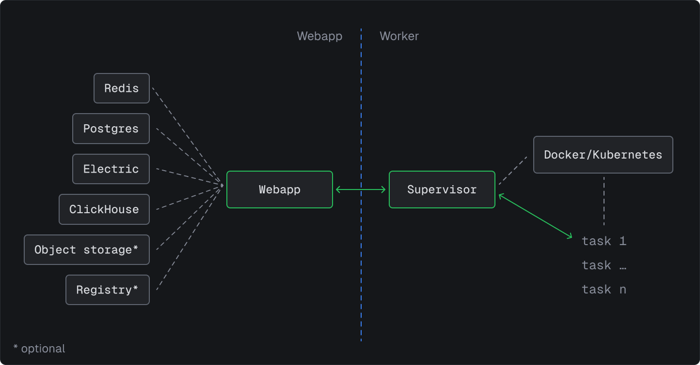

Self-hosting Trigger.dev means you run and manage the platform on your own infrastructure, giving you full control over your environment, deployment process, and the URLs you expose the service on.

You are responsible for provisioning resources, handling updates, and managing any security, scaling or reliability challenges that arise.

We provide version-tagged releases for self-hosted deployments. It's highly advised to use these tags exclusively and keep them locked with your CLI version.

## Should you self-host?

Trigger.dev Cloud is fully managed, scalable, and comes with dedicated support. For most users, it offers the best experience. However, if you have specific requirements around data residency, compliance, or infrastructure control, self-hosting may be the right choice for you.

The self-hosted version is functionally the same as Trigger.dev Cloud with [some exceptions](#feature-comparison), but our managed Cloud infrastructure is designed for high availability, security, and scale.

Because we don't manage self-hosted instances, we cannot guarantee how Trigger.dev will perform on your infrastructure. You assume all responsibility and risk for your deployment, including security, uptime, and data integrity.

For more details, carry on reading and follow our guides for instructions on setting up a self-hosted Trigger.dev instance. If you prefer a managed experience, you can [sign up](https://cloud.trigger.dev/login) for our Cloud offering instead - we have a generous [free tier](https://trigger.dev/pricing) for you to try it out.

## Architecture

The self-hosted version is a set of containers running on your own infrastructure. It's split into two parts that can be scaled independently:

- **Webapp**: includes the dashboard and other services like Redis and Postgres.
- **Worker**: includes the supervisor and the runners that execute your tasks.



## Feature comparison

While [limits](#limits) are generally configurable when self-hosting, some features are only available on Trigger.dev Cloud:

| Feature           | Cloud | Self-hosted | Description                             |
| :---------------- | :---- | :---------- | :-------------------------------------- |
| Warm starts       | ✅    | ❌          | Faster startups for consecutive runs    |
| Auto-scaling      | ✅    | ❌          | No need for manual worker node scaling  |
| Checkpoints       | ✅    | ❌          | Non-blocking waits, less resource usage |
| Dedicated support | ✅    | ❌          | Direct access to our support team       |
| Community support | ✅    | ✅          | Access to our Discord community         |
| ARM support       | ✅    | ✅          | ARM-based deployments                   |


## Limits

Most of the [limits](/limits) are configurable when self-hosting, with some hardcoded exceptions. You can configure them via environment variables on the [webapp](/self-hosting/env/webapp) container.

| Limit             | Configurable | Hardcoded value |
| :---------------- | :----------- | :-------------- |
| Concurrency       | ✅           | —               |
| Rate limits       | ✅           | —               |
| Queued tasks      | ✅           | —               |
| Task payloads     | ✅           | —               |
| Batch payloads    | ✅           | —               |
| Task outputs      | ✅           | —               |
| Batch size        | ✅           | —               |
| Log size          | ✅           | —               |
| Machines          | ✅           | —               |
| OTel limits       | ✅           | —               |
| Log retention     | —            | Never deleted   |
| I/O packet length | ❌           | 128KB           |
| Alerts            | ❌           | 100M            |
| Schedules         | ❌           | 100M            |
| Team members      | ❌           | 100M            |
| Preview branches  | ❌           | 100M            |

### Machine overrides

You can override the machine type for a task by setting the `MACHINE_PRESETS_OVERRIDE_PATH` environment variable to a JSON file with the following structure.

```json
{
  "defaultMachine": "small-1x",
  "machines": {
    "micro": { "cpu": 0.25, "memory": 0.25 },
    "small-1x": { "cpu": 0.5, "memory": 0.5 },
    "small-2x": { "cpu": 1, "memory": 1 }
    // ...etc
  }
}
```

All fields are optional. Partial overrides are supported:

```json
{
  "defaultMachine": "small-2x",
  "machines": {
    "small-1x": { "memory": 2 }
  }
}
```

## Community support

It's dangerous to go alone! Join the self-hosting channel on our [Discord server](https://discord.gg/NQTxt5NA7s).

## Next steps

<CardGroup>
  <Card title="Docker compose" color="#2496ED" icon="docker" href="/self-hosting/docker">
    Learn how to self-host Trigger.dev with Docker compose.
  </Card>
  <Card title="Kubernetes" color="#326CE5" icon="dharmachakra" href="/self-hosting/kubernetes">
    Learn how to self-host Trigger.dev with Kubernetes.
  </Card>
</CardGroup>
