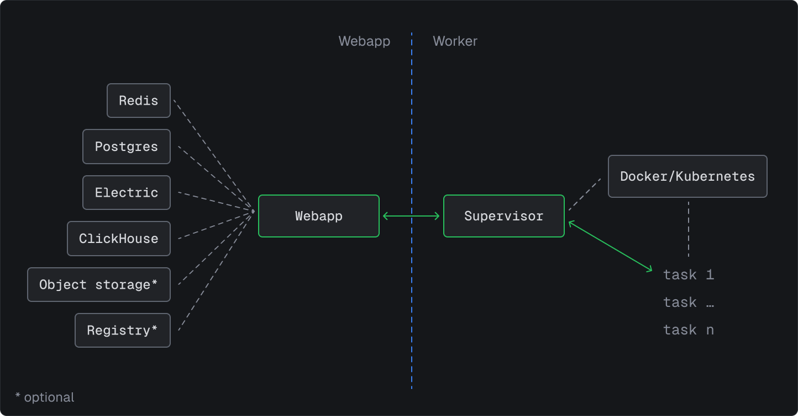

Self-hosting Trigger.dev means you run and manage the platform on your own infrastructure, giving you full control over your environment, deployment process, and the URLs you expose the service on.

You are responsible for provisioning resources, handling updates, and managing any security, scaling or reliability challenges that arise. See [Security & vulnerability reporting](/self-hosting/security) for how to report issues and stay informed about security releases.

We provide version-tagged releases for self-hosted deployments. It's highly advised to use these tags exclusively and keep them locked with your CLI version.

<Warning>
  **v3 is end of life.** Trigger.dev 4.5.0 is the last version we officially support for running
  v3 (SDK v3) tasks. If you still have v3 tasks, stay on 4.5.0 or [migrate to
  v4](/migrating-from-v3). 4.5.1 and later reject v3 triggers, batch triggers, and deploys with an
  upgrade message; v4 workloads are unaffected.
</Warning>

## Should you self-host?

Trigger.dev Cloud is fully managed, scalable, and comes with dedicated support. For most users, it offers the best experience. However, if you have specific requirements around data residency, compliance, or infrastructure control, self-hosting may be the right choice for you.

The self-hosted version is functionally the same as Trigger.dev Cloud with [some exceptions](#feature-comparison), but our managed Cloud infrastructure is designed for high availability, security, and scale.

Because we don't manage self-hosted instances, we cannot guarantee how Trigger.dev will perform on your infrastructure. You assume all responsibility and risk for your deployment, including security, uptime, and data integrity.

For more details, carry on reading and follow our guides for instructions on setting up a self-hosted Trigger.dev instance. If you prefer a managed experience, you can [sign up](https://cloud.trigger.dev/login) for our Cloud offering instead - we have a generous [free tier](https://trigger.dev/pricing) for you to try it out.

## Architecture

The self-hosted version is a set of containers running on your own infrastructure. It's split into two parts that can be scaled independently:

- **Webapp**: includes the dashboard and other services like Redis and Postgres.
- **Worker**: includes the supervisor and the runners that execute your tasks.



## Feature comparison

While [limits](#limits) are generally configurable when self-hosting, some features are only available on Trigger.dev Cloud:

| Feature           | Cloud | Self-hosted | Description                             |
| :---------------- | :---- | :---------- | :-------------------------------------- |
| Warm starts       | ✅    | ❌          | Faster startups for consecutive runs    |
| Auto-scaling      | ✅    | ❌          | No need for manual worker node scaling  |
| Checkpoints       | ✅    | ❌          | Non-blocking waits, less resource usage |
| Dedicated support | ✅    | ❌          | Direct access to our support team       |
| Community support | ✅    | ✅          | Access to our Discord community         |
| ARM support       | ✅    | ✅          | ARM-based deployments                   |


## Limits

Most of the [limits](/limits) are configurable when self-hosting, with some hardcoded exceptions. You can configure them via environment variables on the [webapp](/self-hosting/env/webapp) container.

| Limit             | Configurable | Hardcoded value |
| :---------------- | :----------- | :-------------- |
| Concurrency       | ✅           | —               |
| Rate limits       | ✅           | —               |
| Queued tasks      | ✅           | —               |
| Task payloads     | ✅           | —               |
| Batch payloads    | ✅           | —               |
| Task outputs      | ✅           | —               |
| Batch size        | ✅           | —               |
| Log size          | ✅           | —               |
| Machines          | ✅           | —               |
| OTel limits       | ✅           | —               |
| Log retention     | —            | Never deleted   |
| I/O packet length | ❌           | 128KB           |
| Alerts            | ❌           | 100M            |
| Schedules         | ❌           | 100M            |
| Team members      | ❌           | 100M            |
| Preview branches  | ❌           | 100M            |

### Machine overrides

You can override the machine type for a task by setting the `MACHINE_PRESETS_OVERRIDE_PATH` environment variable to a JSON file with the following structure.

```json
{
  "defaultMachine": "small-1x",
  "machines": {
    "micro": { "cpu": 0.25, "memory": 0.25 },
    "small-1x": { "cpu": 0.5, "memory": 0.5 },
    "small-2x": { "cpu": 1, "memory": 1 }
    // ...etc
  }
}
```

All fields are optional. Partial overrides are supported:

```json
{
  "defaultMachine": "small-2x",
  "machines": {
    "small-1x": { "memory": 2 }
  }
}
```

## Custom base images

Deploys build on the published `triggerdotdev/node` and `triggerdotdev/bun` Debian images. To require a different base for every deploy to your instance, such as a FIPS-validated or hardened Node image, set `DEPLOY_BASE_IMAGES` on the webapp (and optionally `DEPLOY_BUILD_BASE_IMAGES` for the build stage):

```bash
DEPLOY_BASE_IMAGES="node-26=registry.example.com/node-fips:26@sha256:<64-character-digest>"
```

Entries are comma-separated `runtime=image@sha256:<digest>`. The runtimes are `node-22`, `node-24`, `node-26` and `bun`, and every image must be pinned by digest. An invalid value prevents the webapp from starting. Projects with `runtime: "node"` in their config resolve to the current default Node runtime (`node-24` today), so set that key for them. With the Helm chart, set the variables through `webapp.extraEnvVars`.

Runtimes with an entry build on that image; the others keep the published images. Deploys from CLI versions that cannot apply the images are rejected with an error asking to upgrade, and so are `--native-build`, `--local-bundle` and `--from-bundle` deploys. This is a self-hosting setting and does not apply to Trigger.dev Cloud.

You own a custom base image. It must provide:

- `node` on `PATH` at the runtime's major version (for `bun`, both `bun` and `node`, because the final stage starts the app with `dumb-init node`)
- `busybox`, `ca-certificates`, `dumb-init`, `git` and `openssl`
- a `node` user (a `bun` user for the Bun runtime)
- glibc, so native modules built in the build stage load at runtime

A `DEPLOY_BUILD_BASE_IMAGES` image needs everything the base image provides, plus `python3`, `make` and `g++`. Build extensions that add image instructions are replayed on it. Without an entry, the build stage uses the published build image, except for projects whose build extensions add image instructions: those build from your base image and install the toolchain with `apt-get`, so that base must be Debian-based. To avoid the published images entirely, set both variables.

<Warning>
  `image.pkgs` and build extensions that run `apt-get` (such as `aptGet` and `playwright`) assume a
  Debian base. On other distributions, install those packages in your base image instead.
</Warning>

## Community support

It's dangerous to go alone! Join the self-hosting channel on our [Discord server](https://discord.gg/NQTxt5NA7s).

## Next steps

<CardGroup>
  <Card title="Docker compose" color="#2496ED" icon="docker" href="/self-hosting/docker">
    Learn how to self-host Trigger.dev with Docker compose.
  </Card>
  <Card title="Kubernetes" color="#326CE5" icon="dharmachakra" href="/self-hosting/kubernetes">
    Learn how to self-host Trigger.dev with Kubernetes.
  </Card>
  <Card title="Security" icon="shield-halved" href="/self-hosting/security">
    Report vulnerabilities and stay informed about security releases.
  </Card>
</CardGroup>
