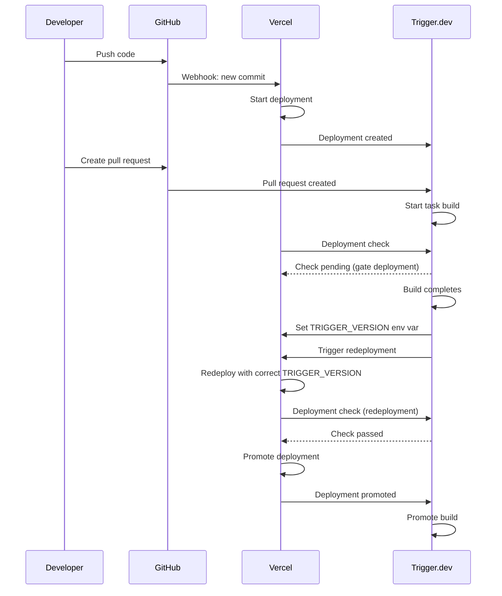

## How it works

The Vercel integration connects your Vercel project to your Trigger.dev project so that every Vercel deployment automatically triggers a Trigger.dev deployment. It also syncs environment variables from Vercel into Trigger.dev and supports atomic deployments to keep your app and tasks in sync.

This eliminates the need to manually run the `trigger.dev deploy` command or maintain custom CI/CD workflows for Vercel-based projects.

<Note>
  The Vercel integration requires the [GitHub integration](/github-integration) to be connected as
  well, since Trigger.dev builds your tasks from your GitHub repository.
</Note>

<Note>
  Make sure you've completed the [Quickstart](/quickstart) first, including creating your `trigger.config.ts` file.
</Note>

## Installation

You can connect Vercel from two entry points:

### From the Trigger.dev dashboard

<Steps>

<Step title="Connect Vercel">
  Go to your project's **Settings** page and click **Connect Vercel**. This will redirect you to
  Vercel to authorize the Trigger.dev app.
</Step>

<Step title="Select a Vercel project">
  Choose which Vercel project to connect to your Trigger.dev project.
</Step>

<Step title="Map environments">
  If your Vercel project has custom environments, choose which one maps to your Trigger.dev staging
  environment.
</Step>

<Step title="Sync environment variables">
  Review the environment variables that will be pulled from Vercel into Trigger.dev. You can
  deselect any variables you don't want to sync.
</Step>

<Step title="Configure build options">
  Optionally adjust [build options](#build-options) for atomic deployments, env var pulling, and new
  env var discovery.
</Step>

<Step title="Connect GitHub">
  If your GitHub repository isn't already connected, you'll be prompted to connect it.
</Step>

</Steps>

### From the Vercel Marketplace

<Steps>

<Step title="Install the integration">
  Install the [Trigger.dev integration from the Vercel
  Marketplace](https://vercel.com/marketplace/trigger). This will redirect you to Trigger.dev to
  complete setup.
</Step>

<Step title="Select your Trigger.dev organization and project">
  Choose which Trigger.dev organization and project to connect. If you're new to Trigger.dev, you'll
  be guided through creating an organization and project.
</Step>

<Step title="Connect GitHub">
  If your GitHub repository isn't already connected, you'll be prompted to connect it.
</Step>

</Steps>

<Note>
  When installing from the Vercel Marketplace, default Build options are applied automatically. You
  can adjust them later in your project settings.
</Note>

<Warning>
  **Vercel Root Directory:** If your Vercel project uses a **Root Directory** (e.g. you deploy a
  single subfolder such as `app` or `web`), you may see "The specified Root Directory does not
  exist" after connecting the integration. If you see this error, try using the **repository root**
  (leave Root Directory empty) in your Vercel project settings. If your Vercel frontend build
  requires a Root Directory (e.g. in a monorepo), keep that setting in Vercel and instead point
  Trigger.dev to the subfolder by setting the **Trigger config file** path (and other [Build
  options](#build-options)) in your Trigger.dev project configuration. Trigger.dev always builds
  from the repo root.
</Warning>

## Required Trigger Config

Make sure your project includes a `trigger.config.ts` file in the root of your repository.

Trigger.dev looks for this file by default to configure your triggers. If it's missing, you may see an error like:

```
Error: The trigger config file was not found. By default, we look for a trigger.config.ts file in the root of your repository.
```

If your config file is located in a different directory, you can specify its path in your project's build configuration settings.

## Environment variable sync

The integration syncs environment variables in both directions:

**Vercel → Trigger.dev**: Environment variables from your Vercel project are pulled into Trigger.dev. This happens during the initial setup and optionally before each build. Variables are synced per-environment (production, staging, preview).

**Trigger.dev → Vercel**: Trigger.dev syncs API keys (like `TRIGGER_SECRET_KEY`) to your Vercel project so your app can communicate with Trigger.dev.

The following variables are excluded from the Vercel → Trigger.dev sync:

- `TRIGGER_SECRET_KEY`, `TRIGGER_VERSION`, `TRIGGER_PREVIEW_BRANCH` (managed by Trigger.dev)
- Sensitive/secret-type variables (Vercel API limitation)

You can control sync behavior per-variable from your project's Vercel settings. Deselecting a variable prevents its value from being updated during future syncs.

<Note>
  Environment variables are pulled from Vercel before each build. To sync updated values into
  Trigger.dev, trigger a new Vercel deployment — either by pushing a commit to your connected branch
  or by redeploying from the Vercel dashboard.
</Note>

<Warning>
  If you are experiencing incorrectly populated environment variables, check that you are not using
  the `syncVercelEnvVars` build extension in your `trigger.config.ts`. This extension is deprecated
  and conflicts with the Vercel integration's built-in env var syncing. Remove it if present.
</Warning>

### Supabase and Neon database branching

If you use [Supabase Branching](https://supabase.com/docs/guides/deployment/branching) or [Neon Database Branching](https://neon.tech/docs/guides/branching-intro) for preview environments, disable syncing for database env vars on the Environment Variables page and use the [syncSupabaseEnvVars](/config/extensions/syncEnvVars#syncsupabaseenvvars) or [syncNeonEnvVars](/config/extensions/syncEnvVars#syncneonenvvars) build extensions instead. These extensions automatically resolve the correct branch-specific credentials at build time.

## Atomic deployments

Atomic deployments ensure your Vercel app and Trigger.dev tasks are deployed in sync. When enabled, Trigger.dev gates your Vercel deployment until the task build completes, then triggers a Vercel redeployment with the correct `TRIGGER_VERSION` set. This guarantees your app always uses the matching version of your tasks.



Atomic deployments are enabled for the production environment by default.

<Note>
  When atomic deployments are enabled, the integration automatically disables `Auto-assign Custom
  Production Domains` on your Vercel project. This is required so that Vercel doesn't promote a
  deployment before the Trigger.dev build is ready.
</Note>

Previously, setting up atomic deployments with Vercel required custom GitHub Actions workflows. The Vercel integration automates this entirely. For more details on how atomic deployments work, see [Atomic deploys](/deployment/atomic-deployment).

## Environment mapping

The integration maps Vercel environments to Trigger.dev environments:

| Vercel environment | Trigger.dev environment        |
| ------------------ | ------------------------------ |
| Production         | Production                     |
| Custom environment | Staging (you choose which one) |
| Preview            | Preview                        |
| Development        | Development                    |

If your Vercel project has a custom environment, you can select which one maps to your Trigger.dev staging environment during setup or in your project settings.

<Note>
  Preview deployments require the preview environment to be enabled on your project. Learn more
  about [preview branches](/deployment/preview-branches).
</Note>

## Build options

You can configure the following settings per-environment from your project's Vercel settings:

- **Atomic deployments**: Controls whether Trigger.dev and Vercel deployments are synchronized. Enabled for production by default.
- **Pull env vars before build**: When enabled, Trigger.dev pulls the latest environment variables from Vercel before each build. Enabled for production, staging, and preview by default.
- **Discover new env vars**: When enabled, new environment variables found in Vercel that don't yet exist in Trigger.dev are created automatically during builds. Only available for environments that also have env var pulling enabled. Enabled for production, staging, and preview by default.

To change build options that would normally go in `trigger.config.ts` (such as [extensions](/config/config-file#extensions) or other build configuration), use **Build options** on your project's configuration page in the Trigger.dev dashboard.

## Disconnecting

You can disconnect the Vercel integration from either side:

- **From Trigger.dev**: Go to your project **Settings** and disconnect Vercel.
- **From Vercel**: Uninstall the Trigger.dev integration from your Vercel dashboard. This is automatically detected and the connection is removed on the Trigger.dev side.

Disconnecting stops automatic deployments, environment variable syncing, and deployment checks. Your existing deployments and environment variables are not affected.

## Related

- [GitHub integration](/github-integration)
- [Atomic deploys](/deployment/atomic-deployment)
- [Environment variables](/deploy-environment-variables)
- [Preview branches](/deployment/preview-branches)
