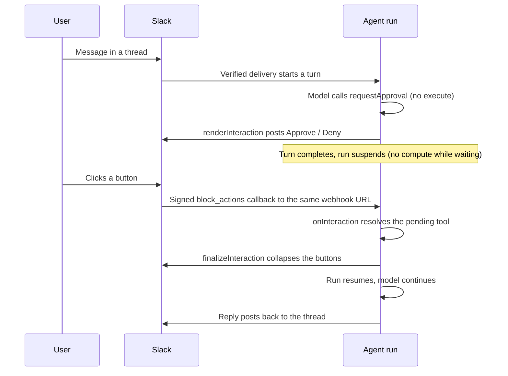

**An agent on a [channel](/webhooks/channels) can pause a turn to get a human decision, then resume once someone answers in the thread.** It posts controls into the conversation and picks up where it left off once someone clicks, with the decision merged into the turn. This is the channel counterpart of browser [human-in-the-loop](/ai-chat/patterns/human-in-the-loop): the same no-`execute` tool, but the controls live in Slack (or your own surface) instead of a React component. The [`slack()`](/webhooks/channels) connector ships Approve / Deny buttons out of the box.

## How it works

The building block is a tool with no `execute` function. When the model calls it, the turn completes with the tool call still pending instead of resolving it. Over a channel the framework then takes over the round-trip:



Because it is a no-`execute` pause, the run suspends while it waits rather than holding compute. A human can take minutes or days to decide without burning compute or hitting [`maxDuration`](/runs/max-duration). The mechanics are the same as the browser case, covered in [human-in-the-loop](/ai-chat/patterns/human-in-the-loop#duration-and-cost-while-paused).

## Slack approvals

Out of the box, `slack()` posts Approve / Deny buttons for any pending no-`execute` tool. A click resolves to `{ approved: boolean }` and the buttons collapse to the decision. You define the tool and list the channel on the agent:

```ts trigger/support-agent.ts
import { chat } from "@trigger.dev/sdk/ai";
import { slack } from "@trigger.dev/slack";
import { streamText, tool } from "ai";
import { anthropic } from "@ai-sdk/anthropic";
import { z } from "zod";

// No execute: calling this pauses the turn for a human decision.
const requestApproval = tool({
  description:
    "Request human approval before a sensitive or irreversible action. " +
    "Call this and stop; you will receive { approved: boolean }, then proceed or decline.",
  inputSchema: z.object({
    action: z.string().describe("A short description of the action needing approval"),
  }),
});

export const supportAgent = chat.agent({
  id: "support-agent",
  channels: [slack({ id: "support-slack", token: process.env.SLACK_BOT_TOKEN! })],
  tools: { requestApproval },
  run: async ({ messages, tools }) =>
    streamText({
      model: anthropic("claude-sonnet-4-5"),
      messages,
      tools,
      system:
        "Before any sensitive or irreversible action (refunds, cancellations, deletions), " +
        "call requestApproval and wait. If approved, confirm it is done; if denied, decline.",
    }),
});
```

Button clicks arrive on a different Slack API than messages, so there is one extra setup step beyond [connecting the channel](/webhooks/channels):

<Steps>
  <Step title="Turn on Interactivity">
    In the Slack app's **Interactivity & Shortcuts**, enable interactivity and set the Request URL to the **same** webhook URL you used for events. Slack posts button clicks there as a signed `block_actions` callback, which the endpoint verifies and routes to the paused run.
  </Step>
  <Step title="Confirm the bot scope">
    Posting and editing the controls uses the `chat:write` scope you already added for replies. No extra scope is needed to collapse the buttons after a decision.
  </Step>
</Steps>

When the model calls `requestApproval`, the bot posts "Approval needed" with the action and Approve / Deny buttons. Clicking **Approve** resolves the tool to `{ approved: true }`, the buttons collapse to "Approved by @you", and the agent continues and posts the outcome. **Deny** resolves `{ approved: false }`.

## Customizing the controls

For [`chat.channels.custom`](/webhooks/channels), or to override the Slack defaults, three hooks own the interaction round-trip:

<ParamField body="renderInteraction" type="(pending, ctx) => ChannelMessage | null">
  Map the pending tool call(s) to the controls you post. `pending` is a list of `{ toolCallId, toolName, input }`. Return `null` to skip posting controls.
</ParamField>

<ParamField body="onInteraction" type="(event) => { toolCallId, output } | null">
  Map a verified callback event to a resolution. The `output` is stitched onto the pending tool call matched by `toolCallId` and the run resumes. Return `null` to treat the event as a normal message instead (a new turn).
</ParamField>

<ParamField body="finalizeInteraction" type="(event, resolution) => void">
  Collapse the controls after a decision so they cannot be clicked again. Best effort: a failure here is logged and the run still resumes.
</ParamField>

Slack encodes the decision in each button's `value` as `${toolCallId}::approve|deny` so `onInteraction` can resolve the exact call, and `finalizeInteraction` posts to the interaction's `response_url` with `replace_original` to swap the buttons for the outcome. On a custom surface you choose the encoding and how you edit the controls away.

```ts
import { chat } from "@trigger.dev/sdk/ai";
import { webhooks } from "@trigger.dev/sdk";

chat.channels.custom({
  id: "my-surface",
  source: webhooks.custom<MyEvent>({ /* verifier config */ }),
  key: "{body.conversationId}",
  inbound: (e) => e.text,
  send: async (message, ctx) => ({ ref: await postToMySurface(ctx.event, message) }),
  renderInteraction: (pending) => ({
    text: `Approve: ${pending[0].input.action}?`,
    buttons: pending.map((c) => [`${c.toolCallId}:yes`, `${c.toolCallId}:no`]),
  }),
  onInteraction: (e) => {
    const [toolCallId, choice] = e.buttonValue.split(":");
    return { toolCallId, output: { approved: choice === "yes" } };
  },
  finalizeInteraction: async (e) => {
    await editMySurface(e.messageRef, "Decision recorded");
  },
});
```

The resolved `output` is whatever your tool expects to receive. The Slack default resolves `{ approved: boolean }`; if your tool needs a richer answer, supply your own `onInteraction` that returns the shape your tool reads.

## The reply after a decision

When the turn resumes, the channel reply shows the agent's answer, not the text it produced before pausing. The framework posts the assistant text generated after the tool call, so a preamble like "I'll need approval first" is not concatenated onto the final "done" message. The approval prompt itself already lives in the collapsed controls.

## Next steps

<CardGroup cols={2}>
  <Card title="Channels" icon="comments" href="/webhooks/channels">
    Point Slack or any surface at an agent so messages become turns.
  </Card>
  <Card title="Browser human-in-the-loop" icon="hand" href="/ai-chat/patterns/human-in-the-loop">
    The same no-execute pause, rendered in a React frontend.
  </Card>
  <Card title="Sessions" icon="layer-group" href="/ai-chat/sessions">
    The durable per-conversation state a channel turn runs on.
  </Card>
  <Card title="Filters" icon="filter" href="/webhooks/filters">
    Gate which verified deliveries reach the agent.
  </Card>
</CardGroup>
