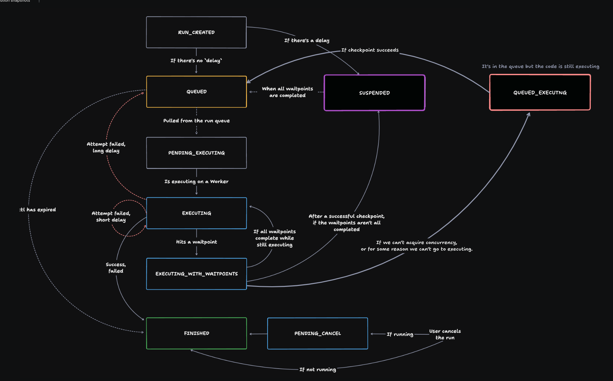

# Trigger.dev Run Engine

The Run Engine process runs from triggering, to executing, retrying, and completing them.

It is responsible for:

- Creating, updating, and completing runs as they progress.
- Operating the run queue, including handling concurrency.
- Heartbeats which detects stalled runs and attempts to automatically recover them.
- Registering checkpoints which enable pausing/resuming of runs.

## Glossary

- **Platform**: The main Trigger.dev API, dashboard, database. The Run Engine is part of the platform.
- **Worker group**: A group of workers that all pull from the same queue, e.g. "us-east-1", "my-self-hosted-workers".
  - **Worker**: A worker is a 'server' that connects to the platform and receives runs.
    - **Supervisor**: Pulls new runs from the queue, communicates with the platform, spins up new Deploy executors.
    - **Deploy container**: Container that comes from a specific deploy from a user's project.
      - **Run controller**: The code that manages running the task.
      - **Run executor**: The actual task running.

## Run locking

Many operations on the run are "atomic" in the sense that only a single operation can mutate them at a time. We use RedLock to create a distributed lock to ensure this. Postgres locking is not enough on its own because we have multiple API instances and Redis is used for the queue.

There are race conditions we need to deal with:

- When checkpointing the run continues to execute until the checkpoint has been stored. At the same time the run continues and the checkpoint can become irrelevant if the waitpoint is completed. Both can happen at the same time, so we must lock the run and protect against outdated checkpoints.

## Run execution

The execution state of a run is stored in the `TaskRunExecutionSnapshot` table in Postgres. This is separate from the `TaskRun` status which is exposed to users via the dashboard and API.



The `TaskRunExecutionSnapshot` `executionStatus` is used to determine the execution status and is internal to the run engine. It is a log of events that impact run execution – the data is used to execute the run.

A common pattern we use is to read the current state and check that the passed in `snapshotId` matches the current `snapshotId`. If it doesn't, we know that the state has moved on. In the case of a checkpoint coming in, we know we can just ignore it.

We can also store invalid states by setting an error. These invalid states are purely used for debugging and are ignored for execution purposes.

## Workers

A worker is a server that runs tasks. There are two types of workers:

- Hosted workers (serverless, managed and cloud-only)
- Self-hosted workers

In the dashboard under the "Workers" page, you can see all worker groups including the "main" group which is the default and not self-hosted. You can also see alternative worker groups that are available to you, such as "EU", "v3.2 (beta)", and any self-hosted worker groups you have created.

You add a new self-hosted worker group by clicking "Add" and choosing an `id` that is unique to your project.

Then when triggering runs, you can specify the `workerGroup` to use. It defaults to "main". The workerGroup is used internally to set the `masterQueue` that a run is placed in, this allows pulling runs only for that worker group.

On the "Workers" page, you can see the status of each worker group, including the number of workers in the group, the number of runs that are queued.

## Pulling from the queue

A worker will call the Trigger.dev API with it's `workerGroup`.

For warm starts, self-hosted workers we will also pass the `BackgroundWorker` id and `environment` id. This allow pulling relevant runs.

For dev environments, we will pass the `environment` id.

If there's only a `workerGroup`, we can just `dequeueFromMasterQueue()` to get runs. If there's a `BackgroundWorker` id, we need to determine if that `BackgroundWorker` is the latest. If it's the latest we call `dequeueFromEnvironmentMasterQueue()` to get any runs that aren't locked to a version. If it's not the latest, we call `dequeueFromBackgroundWorkerMasterQueue()` to get runs that are locked to that version.

## Run Queue

This is a fair multi-tenant queue. It is designed to fairly select runs, respect concurrency limits, and have high throughput. It provides visibility into the current concurrency for the env, org, etc.

It has built-in reliability features:

- When nacking we increment the `attempt` and if it continually fails we will move it to a Dead Letter Queue (DLQ).
- If a run is in the DLQ you can redrive it.

## Heartbeats

Heartbeats are used to determine if a run has become stalled. Depending on the current execution status, we do different things. For example, if the run has been dequeued but the attempt hasn't been started we requeue it.

## Checkpoints

Checkpoints allow pausing an executing run and then resuming it later. This is an optimization to avoid wasted compute and is especially useful with "Waitpoints".

## Waitpoints

A "Waitpoint" is something that can block a run from continuing:

A single Waitpoint can block many runs, the same waitpoint can only block a run once (there's a unique constraint). They block run execution from continuing until all of them are completed.

They can have output data associated with them, e.g. the finished run payload. That includes an error, e.g. a failed run.

There are currently three types:

- `RUN` which gets completed when the associated run completes. Every run has an `associatedWaitpoint` that matches the lifetime of the run.
- `DATETIME` which gets completed when the datetime is reached.
- `MANUAL` which gets completed when that event occurs.

Waitpoints can have an idempotencyKey which allows stops them from being created multiple times. This is especially useful for event waitpoints, where you don't want to create a new waitpoint for the same event twice.

### `wait.for()` or `wait.until()`

Wait for a future time, then continue. We should add the option to pass an `idempotencyKey` so a second attempt doesn't wait again. By default it would wait again.

```ts
//Note if the idempotency key is a string, it will get prefixed with the run id.
//you can explicitly pass in an idempotency key created with the the global scope.
await wait.until(new Date("2022-01-01T00:00:00Z"), { idempotencyKey: "first-wait" });
await wait.until(new Date("2022-01-01T00:00:00Z"), { idempotencyKey: "second-wait" });
```

### `triggerAndWait()` or `batchTriggerAndWait()`

Trigger and then wait for run(s) to finish. If the run fails it will still continue but with the errors so the developer can decide what to do.

### The `trigger` `delay` option

When triggering a run and passing the `delay` option, we use a `DATETIME` waitpoint to block the run from starting.

### `wait.forRequest()`

Wait until a request has been received at the URL that you are given. This is useful for pausing a run and then continuing it again when some external event occurs on another service. For example, Replicate have an API where they will callback when their work is complete.

### `wait.forWaitpoint(waitpointId)`

A more advanced SDK which would require uses to explicitly create a waitpoint. We would also need `createWaitpoint()`, `completeWaitpoint()`, and `failWaitpoint()`.

```ts
const waitpoint = await waitpoints.create({ idempotencyKey: `purchase-${payload.cart.id}` });
const waitpoint = await waitpoints.retrieve(waitpoint.id);
const waitpoint = await waitpoints.complete(waitpoint.id, result);
const waitpoint = await waitpoints.fail(waitpoint.id, error);

export const approvalFlow = task({
  id: "approvalFlow",
  run: async (payload) => {
    //...do stuff

    const result = await wait.forWaitpoint(waitpoint.id, { timeout: "1h" });
    if (!result.ok) {
      //...timeout
    }

    //...do more stuff
  },
});
```

### `wait.forRunToComplete(runId)`

You could wait for another run (or runs) using their run ids. This would allow you to wait for runs that you haven't triggered inside that run.

## Run flow control

There are several ways to control when a run will execute (or not). Each of these should be configurable on a task, a named queue that is shared between tasks, and at trigger time including the ability to pass a `key` so you can have per-tenant controls.

### Concurrency limits

When `trigger` is called the run is added to the queue. We only dequeue when the concurrency limit hasn't been exceeded for that task/queue.

### Rate limiting

When `trigger` is called, we check if the rate limit has been exceeded. If it has then we ignore the trigger. The run is thrown away and an appropriate error is returned.

This is useful:

- To prevent abuse.
- To control how many executions a user can do (using a `key` with rate limiting).

### Debouncing

When `trigger` is called, we prevent too many runs happening in a period by collapsing into a single run. This is done by discarding some runs in a period.

This is useful:

- To prevent too many runs happening in a short period.

We should mark the run as `"DELAYED"` with the correct `delayUntil` time. This will allow the user to see that the run is delayed and why.

### Throttling

When `trigger` is called the run is added to the queue. We only run them when they don't exceed the limit in that time period, by controlling the timing of when they are dequeued.

This is useful:

- To prevent too many runs happening in a short period.
- To control how many executions a user can do (using a `key` with throttling).
- When you need to execute every run but not too many in a short period, e.g. avoiding rate limits.

### Batching

When `trigger` is called, we batch the runs together. This means the payload of the run is an array of items, each being a single payload.

This is useful:

- For performance, as it reduces the number of runs in the system.
- It can be useful when using 3rd party APIs that support batching.

## Emitting events

The Run Engine emits events using its `eventBus`. This is used for runs completing, failing, or things that any workers should be aware of.

# RunEngine System Architecture

The RunEngine is composed of several specialized systems that handle different aspects of task execution and management. Below is a diagram showing the relationships between these systems.


## System Responsibilities

### DequeueSystem

- Handles dequeuing of tasks from master queues
- Manages resource allocation and constraints
- Handles task deployment verification

### RunAttemptSystem

- Manages run attempt lifecycle
- Handles success/failure scenarios
- Manages retries and cancellations
- Coordinates with other systems for run completion

### ExecutionSnapshotSystem

- Creates and manages execution snapshots
- Tracks run state and progress
- Manages heartbeats for active runs
- Maintains execution history

### WaitpointSystem

- Manages waitpoints for task synchronization
- Handles waitpoint completion
- Coordinates blocked runs
- Manages concurrency release

### BatchSystem

- Manages batch operations
- Handles batch completion
- Coordinates batch-related task runs

### EnqueueSystem

- Handles enqueueing of runs
- Manages run scheduling
- Coordinates with execution snapshots

## Shared Resources

- **Prisma**: Database access
- **Logger**: Logging functionality
- **Tracer**: Tracing and monitoring
- **RunQueue**: Task queue management
- **RunLocker**: Run locking mechanism
- **EventBus**: Event communication
- **Worker**: Background task execution
- **ReleaseConcurrencyQueue**: Manages concurrency token release

## Key Interactions

1. **RunEngine** orchestrates all systems and manages shared resources
2. **DequeueSystem** works with **RunAttemptSystem** for task execution
3. **RunAttemptSystem** coordinates with **WaitpointSystem** and **BatchSystem**
4. **WaitpointSystem** uses **EnqueueSystem** for run scheduling
5. **ExecutionSnapshotSystem** is used by all other systems to track state
6. All systems share common resources through the `SystemResources` interface
