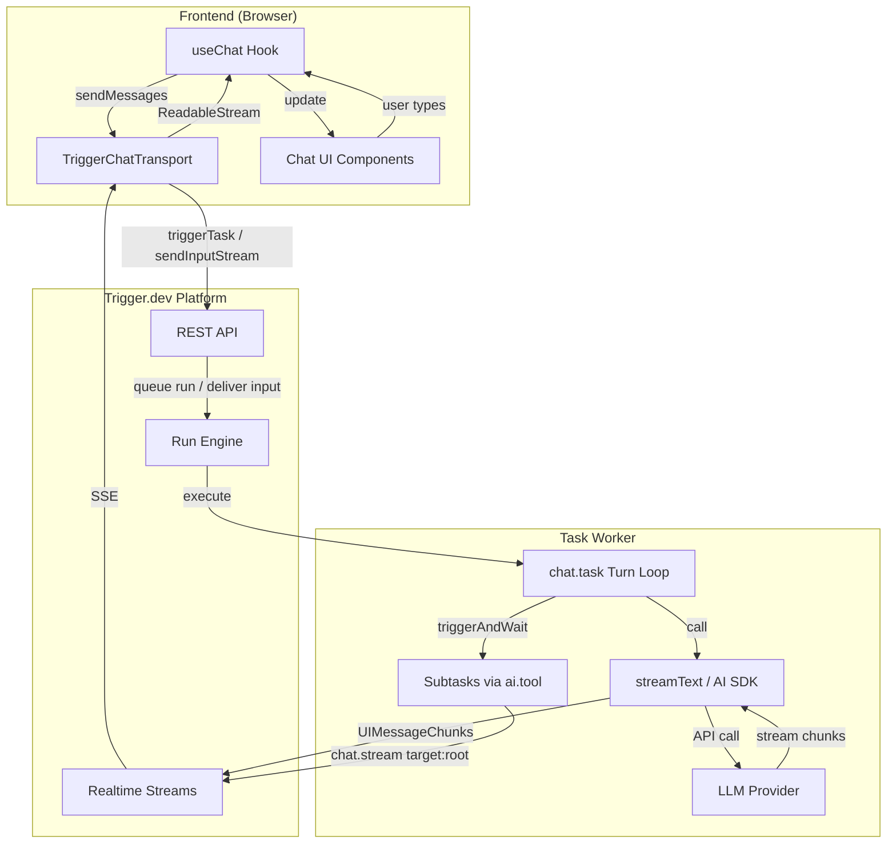
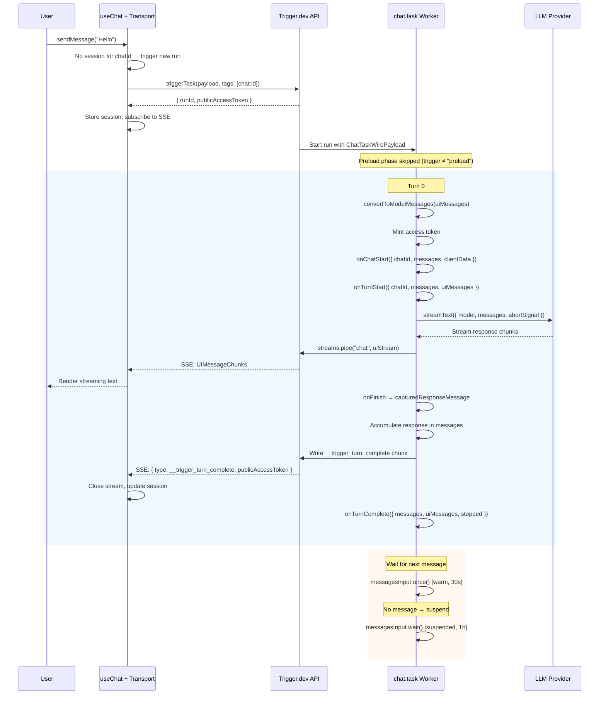
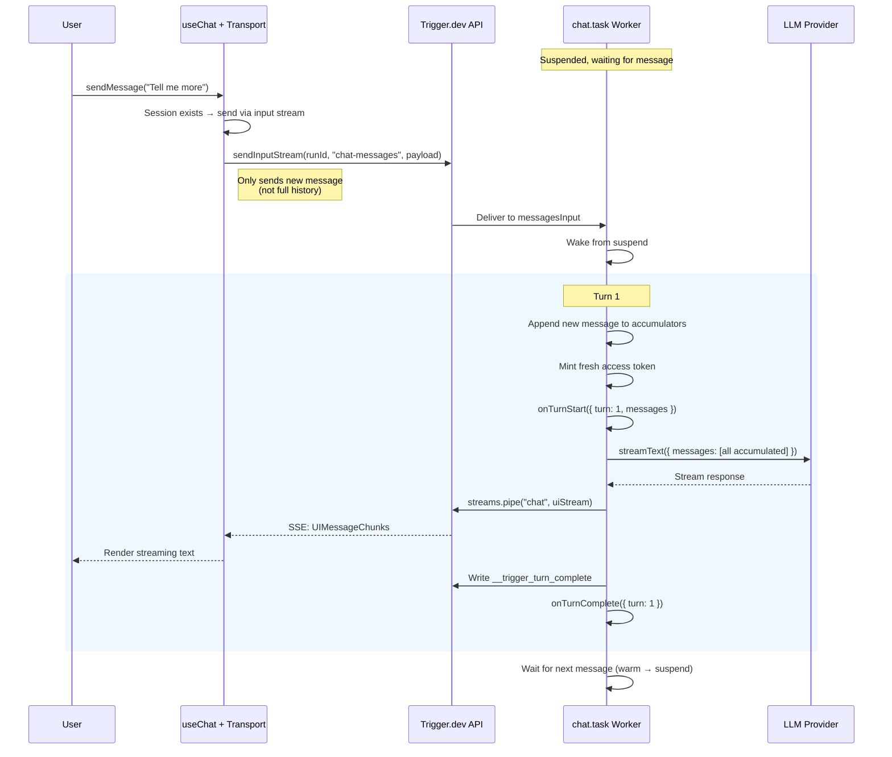
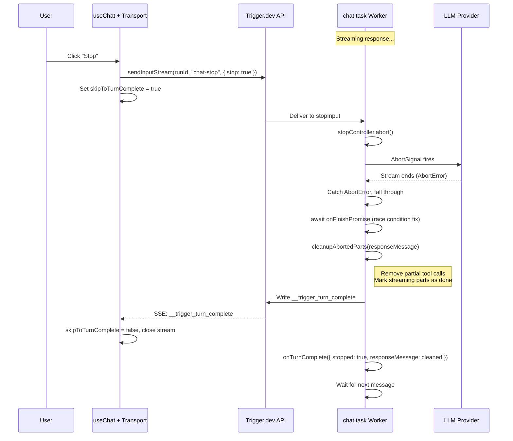
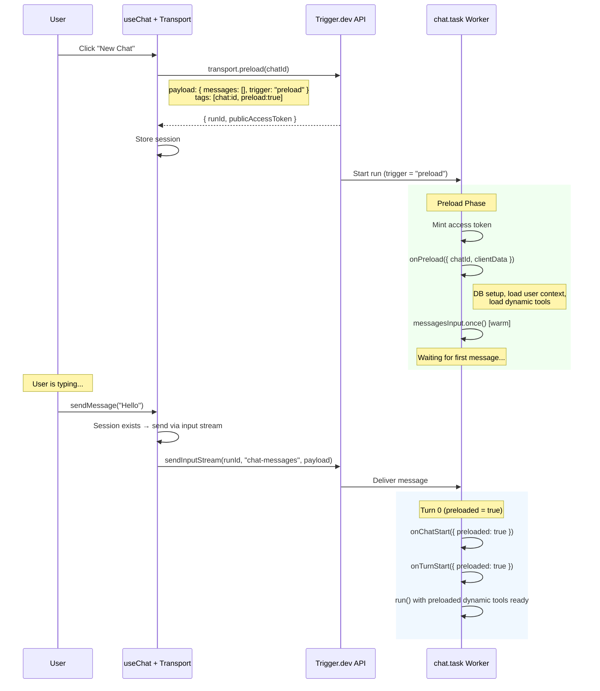
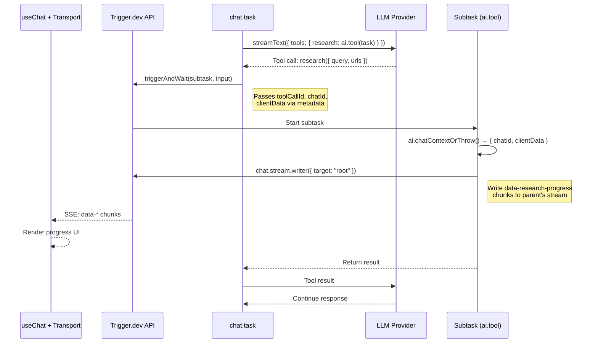
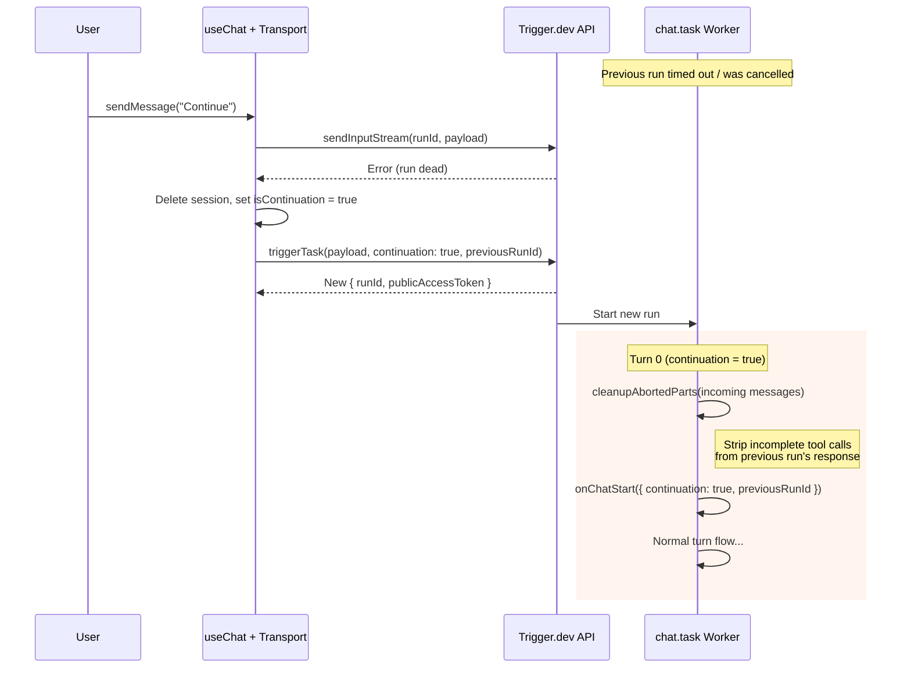
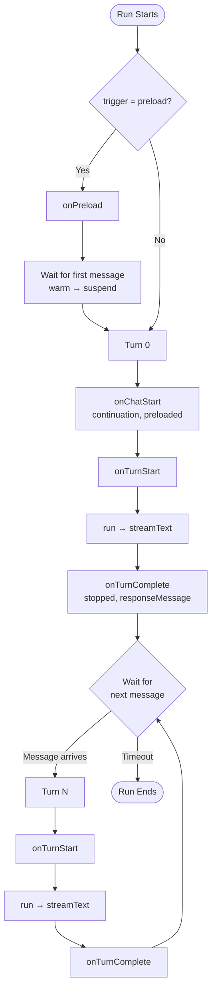
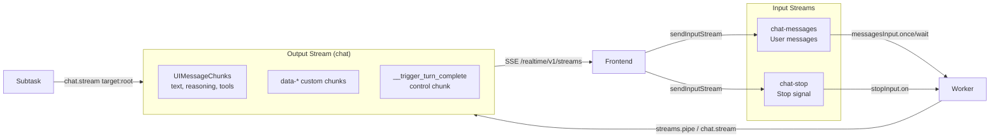

# AI Chat Architecture

## System Overview

## Detailed Flow: New Chat (First Message)

## Detailed Flow: Multi-Turn (Subsequent Messages)

## Stop Signal Flow

## Preload Flow

## Subtask Streaming (Tool as Task)

## Continuation Flow (Run Timeout / Cancel)

## Hook Lifecycle

## Stream Architecture

